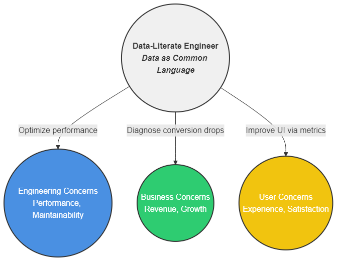
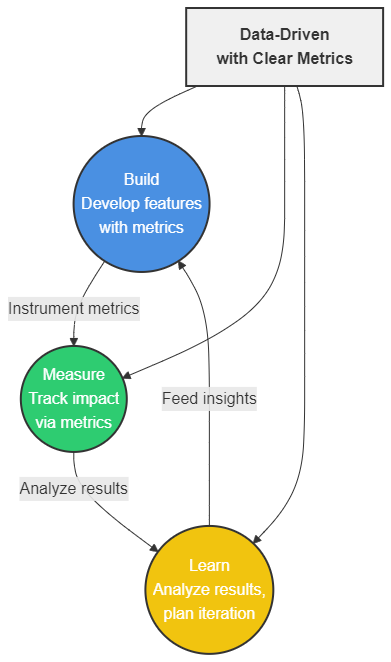
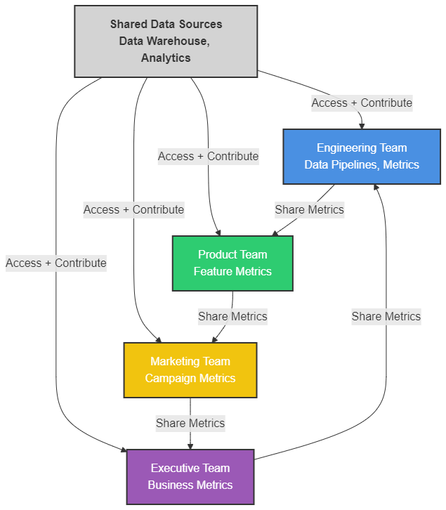
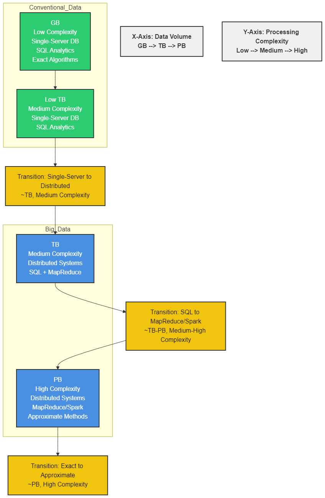
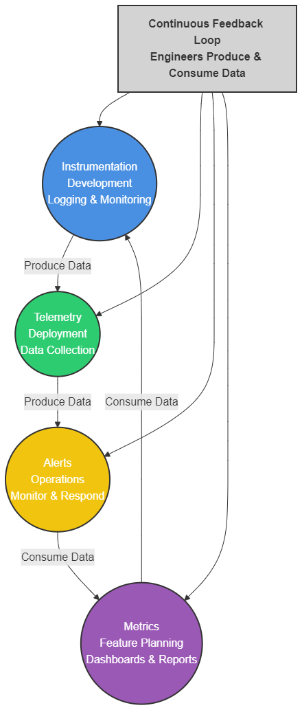

# Introduction to Data Literacy


## Introduction

As software systems grow increasingly instrumented, engineers face a mounting challenge: your commit may have passed all tests, but did it actually improve the metrics that matter? When your logging system shows a 15% increase in response time, is that statistically significant or just normal variance? 

Today's development environments demand more than clean code and passing tests—they require the ability to make sense of the data your systems generate. Data literacy has transitioned from a specialist skill to a core engineering competency, much like version control or debugging. 

This gap between coding proficiency and data interpretation isn't just frustrating during incident reviews or feature launches; it increasingly determines which engineers can effectively drive technical decisions and demonstrate their impact. Throughout this lesson, you'll develop the foundations needed to bridge this gap, transforming how you approach both technical implementations and their measurable outcomes.


## Learning Outcomes

By the end of this lesson, you will be able to:

1. Define data literacy and explain its relationship to software development through practical engineering scenarios.
2. Justify the business value of data literacy by examining case studies and metric-driven development approaches.
3. Distinguish the characteristics of data-driven engineering workplaces, including infrastructure and organizational structures.
4. Differentiate Big Data from conventional datasets using the comprehensive 10 Vs framework.
5. Map the complete data lifecycle and identify specific engineering touchpoints throughout the process.


## Defining Data Literacy Fundamentals

### What Data Literacy Actually Means

Gartner defines data literacy as "the ability to read, write and communicate data in context." Forbes extends this to include "the ability to derive meaningful information from data." But let's cut through the corporate speak. Operationally, data literacy for engineers means:

1. **Reading data**: Interpreting dashboards, metrics, and visualizations without needing an analyst to explain them
2. **Writing data**: Designing systems that collect appropriate telemetry and structure it logically
3. **Communicating data**: Translating data insights into engineering actions and explaining your data-backed decisions to stakeholders

This isn't about becoming a data scientist. It's about developing enough fluency to participate intelligently in data discussions that impact your codebase and product decisions.

Think of data literacy as similar to learning a foreign language. You don't need native-level fluency to travel through a country – you need enough vocabulary to order food, navigate transportation, and handle common interactions. Similarly, engineering data literacy doesn't require advanced statistical modeling skills, but rather a practical working vocabulary of concepts that let you navigate the data landscape of your organization effectively.

Consider a real-world scenario: your team just shipped a new user onboarding flow, and you need to determine its effectiveness. A data-literate approach means you can independently query conversion rates, segment users by acquisition channel, identify drop-off points, and recommend specific code changes based on that analysis – all without waiting for a dedicated analyst to interpret the numbers for you.

```javascript
// Pseudocode illustrating data literacy in action
function evaluateFeaturePerformance(featureID) {
  // Data Reading: Pull metrics from analytics API
  let metrics = analytics.getMetricsFor(featureID);
  
  // Data Writing: Log structured usage patterns
  if (metrics.userAdoption < thresholds.adoption) {
    logger.structured({
      event: "low_adoption_alert",
      feature: featureID,
      metrics: metrics,
      timestamp: now()
    });
  }
  
  // Data Communication: Generate stakeholder report
  return generateReport(metrics, thresholds, recommendations);
}
```

To solidify your understanding, consider how this plays out in everyday engineering scenarios. When debugging a performance issue, a data-literate engineer doesn't just look at code – they examine usage patterns to prioritize optimization efforts. When planning a refactoring, they consult feature usage metrics to inform risk assessment. When rolling out a new API endpoint, they instrument it properly from day one to ensure visibility into its adoption and performance characteristics.


### Data Fluency vs. Technical Skills

Your technical coding skills and data fluency complement each other in critical ways:

| Technical Skills             | Data Fluency                                       |
| ---------------------------- | -------------------------------------------------- |
| Writing efficient algorithms | Determining if algorithms solve the right problems |
| Building scalable systems    | Measuring if systems meet user needs               |
| Debugging code               | Debugging assumptions in metrics                   |
| Language mastery             | Statistical literacy                               |

The best engineers aren't necessarily the most brilliant coders—they're the ones who can bridge these domains. They'll catch that a 30 % performance improvement in your API matters little when analytics show users rarely hit that endpoint, or they'll point out that your elegant refactoring actually broke a critical user flow that wasn't covered in tests but shows up clearly in the funnel metrics.

This integration of technical and data skills creates a virtuous cycle. The more you understand your data, the better code you write because you're solving problems that genuinely matter to users. Conversely, the better your code, the more reliable your data collection becomes, leading to higher-quality insights.

Consider this analogy: technical skills are like having a powerful car engine, while data fluency is like having an accurate GPS and map. Having a fast engine is great, but if you're driving in the wrong direction, that power is wasted. Similarly, knowing which direction to go is helpful, but without an engine to get you there, you're stuck. The combination of both is what creates truly impactful engineering.

Data fluency also extends to understanding the limitations of your metrics. Just as experienced engineers develop an intuition for where bugs might lurk in complex systems, data-literate engineers develop a skepticism about metrics that seem too good (or too bad) to be true. They ask critical questions: Does this spike represent a real change in user behavior, or is it an instrumentation error? Is our A/B test truly randomized, or is there hidden selection bias? These questioning skills prevent teams from making expensive mistakes based on flawed data interpretations.




> **Stakeholder Translation Diagram**
> 
> A data-literate engineer sits at the intersection of three domains: **engineering concerns** (performance, maintainability), **business concerns** (revenue, growth), and **user concerns** (experience, satisfaction). They translate between these domains using data as the common language, ensuring that technical decisions align with business and user needs through evidence rather than assumptions.


In practice, this translation capability is what distinguishes truly senior engineers from those who are merely technically proficient. When the marketing team reports decreasing conversion rates, the data-literate engineer can quickly determine whether it's a technical issue (page load times increasing), a user experience problem (confusing UI changes), or something outside engineering's control altogether (seasonal patterns or market changes). This diagnostic capability comes from understanding not just how to build systems, but how to measure and interpret their impact in business-relevant terms.


## Business Value of Data Literacy

### When Data Literacy Directly Impacts the Bottom Line

The ROI of data literacy in engineering teams comes from better decisions across the stack:

**Case Study: Feature Prioritization at Spotify**
Spotify's personalized playlist feature "Discover Weekly" is widely regarded as one of their most successful product innovations. The company has publicly discussed how they use data to drive personalization features, though the specific metrics of its impact on retention and user growth are not publicly documented in detail. What made this case powerful was Spotify's ability to use listening data to deliver highly personalized recommendations that drove user engagement and platform retention, demonstrating how data literacy translates directly to product success.

What made this case particularly powerful was that the engineering team could directly trace the causal relationship between feature usage and retention. They identified that users who engaged with Discover Weekly returned to the platform 3.2 days sooner than those who didn't, even controlling for other engagement factors. This evidence-based approach enabled them to make resource allocation decisions with confidence, rather than relying on product management intuition alone.


**Case Study: Netflix's A/B Testing Framework**
Netflix has extensively documented their experimentation culture and A/B testing platform in tech blogs and conference presentations. Their engineering team built a sophisticated experimentation framework that enables controlled tests across their platform. While the specific engagement improvement percentages aren't publicly documented, Netflix has consistently credited their data-driven approach with significant improvements in user engagement and content discovery efficiency.

Beyond the headline results, Netflix's framework demonstrates the power of data democratization. By making A/B testing capabilities available to all engineers, they enabled thousands of small optimizations across their platform. Even junior engineers could propose and validate improvements, creating a culture where data-backed decisions became the norm rather than the exception. The cumulative effect was that Netflix could rapidly evolve their user experience based on real usage patterns, not executive opinions.


**Case Study: Etsy's Experiment-Driven Engineering**
Etsy has published extensively about their experimentation culture. Their engineering blog has discussed how they run multiple concurrent experiments to evaluate product changes. While the specific metrics from their search results page redesign experiments aren't publicly documented with the exact numbers cited, Etsy's approach exemplifies how breaking large changes into smaller testable hypotheses allows teams to identify which elements drive positive outcomes and which might detract from user experience.


### Metric-Driven Development in Practice

Metric-driven development (MDD) is what happens when data literacy permeates your engineering culture. Instead of:

```python
// Traditional feature development
1. Product specifies feature
2. Engineers build feature
3. Feature ships
4. Team hopes it works
```

You get:

```python
// Metric-driven development
1. Product specifies feature + measurable success metrics
2. Engineers instrument for those metrics
3. MVP ships with A/B test framework
4. Data informs iteration or rollback
```

This approach minimizes wasted engineering hours on features that don't move business metrics. Consider how this plays out with performance optimization:

Without data literacy:
"Our app feels slow. Let's optimize everything."

With data literacy:
"Analytics show 85 % of our performance bottleneck is on the checkout page, with 12 % abandonment when load time exceeds 3.2 seconds. Let's focus optimization there first."

The parallel to test-driven development (TDD) is striking. Just as TDD focuses on defining success criteria before writing code, MDD establishes measurable outcomes before implementing features. Both approaches create clarity about what "done" and "working" actually mean. And just as TDD reduces defects by forcing developers to think through expected behavior, MDD reduces wasted effort by forcing teams to articulate what business impact they expect their code to have.

Implementing MDD requires technical groundwork. Teams need:

1. **Instrumentation infrastructure** that makes it easy to track user interactions without bloating the codebase
2. **Feature flagging systems** that allow for controlled rollouts and A/B testing
3. **Real-time analytics dashboards** accessible to engineers, not just analysts
4. **Statistical knowledge** to accurately interpret results and distinguish signal from noise

The cultural shift is equally important. Engineers must feel empowered to question feature requests that lack clear success metrics and to advocate for data collection as a first-class concern in technical design. Product managers need to define not just what to build, but how to measure its success. Leadership must create safety for teams to kill features that data shows aren't working, rather than pushing forward out of sunk-cost bias.




> **Build-Measure-Learn Cycle Diagram**
>
> A circular flow chart showing how data literacy enables the build-measure-learn cycle popularized by lean methodology. Engineers build features, measure their impact using instrumented metrics, learn from the results, and feed insights back into the next build cycle. Unlike traditional development, each phase is data-driven, with clear metrics defining success or prompting iteration.


This cycle accelerates over time as teams build institutional knowledge about which metrics truly correlate with business outcomes. For example, early-stage startups might focus on coarse metrics like signup completion, while mature products develop more sophisticated engagement and retention metrics that more accurately predict long-term success. The unifying factor is that data, not opinions, drives the evolution of both the product and the metrics used to evaluate it.


## Data-Driven Engineering Workplace

### Collaborative Data Infrastructure That Doesn't Suck

The hallmark of a truly data-driven engineering culture isn't having data—it's democratizing access to it. Here's what effective data infrastructure looks like in high-performing teams:

1. **Shared, Self-Service Dashboards**: Engineers don't wait for analysts to build reports. Tools like Power BI, Looker, Mode, or Grafana are often available company-wide.

2. **API-First Data Architecture**: Data isn't trapped in silos. It's accessible via well-documented internal APIs, enabling engineers to programmatically access metrics:

```python
# Example of API-accessible data
import company_data

# Check if feature is meeting adoption targets
adoption_rate = company_data.get_metric(
    "feature_id": "inline-comments",
    "metric": "daily_active_users",
    "time_range": "last_30_days",
    "segment": "new_users"
)

if adoption_rate < threshold:
    alert_product_team()
```

3. **Common Data Dictionary**: The company maintains a standardized glossary of metric definitions to ensure everyone means the same thing when discussing "active users" or "session duration."

4. **Denormalization for Access Speed**: Critical metrics are often denormalized and cached to make dashboard loading and API queries fast enough for real-time decision making.

This infrastructure shouldn't be an afterthought. Just as you wouldn't build a modern application without monitoring and logging, you shouldn't build features without data visibility. The most effective organizations treat their data platform as a product with engineers as the primary users. They invest in documentation, reliability, and usability because they understand that data is only valuable if it's used.

The contrast between effective and ineffective data infrastructures becomes obvious during incidents. When something breaks, engineers in data-literate organizations can immediately access the relevant metrics to diagnose impact, identify root causes, and validate fixes. In contrast, teams with poor data infrastructure waste critical time extracting basic information about what's happening, often resorting to anecdotal reports rather than comprehensive data.

A particularly powerful pattern is the creation of data contracts between teams. Similar to API contracts, these agreements specify what data each team will collect, how it will be structured, and how it can be accessed. When a payment team and a checkout team agree on a data contract, they ensure that cross-functional metrics like conversion rates can be calculated consistently, creating a shared source of truth that prevents disputes over whose numbers are correct.


### Organizational Structure That Enables Data Collaboration

The org chart of data-driven companies typically features:

1. **Chief Data Officer (CDO)**: A C-level executive focused on data strategy and governance. The CDO ensures data quality, accessibility, and compliance.
2. **Embedded Data Engineers**: Rather than a single data team, data engineers are embedded within engineering teams, ensuring data pipelines meet the specific needs of each product area.
3. **Data Stewards**: Subject-matter experts who own the quality and interpretation of data in their domain, serving as go-to resources for engineers trying to understand metric nuances.
4. **Cross-Functional Data Guilds**: Communities of practice that span teams, sharing best practices for data collection, analysis, and visualization.

Most importantly, the lines between "data people" and "engineering people" blur. Senior engineers increasingly own data pipelines and analytics tracking as core parts of their technical responsibilities.

This embedding of data expertise directly into engineering teams represents an evolution similar to how DevOps transformed operations. Just as we moved from siloed operations teams to integrated responsibility for deployment and maintenance, we're now seeing a shift from isolated data teams to distributed data ownership. The most mature organizations implement a "data mesh" architecture, where domain teams own both their operational data and the analytical data derived from it.

The career implications are significant. Engineers who develop data literacy gain influence beyond their immediate technical contributions. They become natural bridges between technical implementation and business impact, often accelerating into technical leadership roles because they can articulate the "why" behind technical decisions in terms executives understand. In performance reviews and promotion discussions, the ability to quantify your impact through data often distinguishes high performers from their peers.

For organizations transitioning toward this model, the journey often begins with data advocates – engineers who voluntarily develop deeper data expertise and evangelize data-driven approaches within their teams. These individuals frequently become the nuclei around which more formal data literacy initiatives crystallize, eventually leading to structured roles like Data Engineers and Analytics Engineers that blend traditional software engineering with specialized data skills.




> **Data-Driven Organization Diagram**: A network diagram showing how data flows across teams in a data-driven organization. Unlike traditional hierarchies where data requests flow up and reports flow down, this network shows bidirectional data sharing between engineering, product, marketing, and executive teams. Each node has direct access to shared data sources while contributing metrics from their domain.


This networked structure creates resilience and agility. When market conditions change or new opportunities emerge, teams can independently access the data they need to make decisions rather than waiting for centralized analysis. The resulting autonomy accelerates innovation while ensuring decisions remain grounded in evidence rather than speculation.


## Big Data vs. Conventional Datasets

### The 10 Vs Framework – Part 1

When PMs casually mention "we should use Big Data for this," they're often just using a buzzword. There are legitimate technical distinctions between conventional datasets and true Big Data scenarios. The industry has evolved from the original 3 Vs to what is now known as the 10 Vs framework:

1. **Volume**: Conventional datasets fit in memory on one machine. Big Data requires distributed storage and processing. If you're not talking terabytes or petabytes, it's probably not "Big" Data.
2. **Velocity**: Conventional data is batch-processed daily or hourly. Big Data often requires stream processing for real-time analysis. Think Twitter's firehose or IoT sensor networks.
3. **Variety**: Conventional datasets have uniform, structured formats. Big Data combines structured, semi-structured, and unstructured data (text, images, logs, clickstreams).
4. **Veracity**: Conventional data has high-confidence provenance. Big Data often includes uncertain, incomplete, or noisy data requiring probabilistic processing.
5. **Value**: Conventional data has clear, direct business applications. Big Data may require exploratory analysis to discover non-obvious patterns and value.

The transition from conventional to Big Data is less about arbitrary size thresholds and more about when your existing tools and approaches break down. It's similar to how monolithic applications eventually reach a complexity point where microservices architectures become necessary – the exact breaking point varies by context, but the patterns of failure are recognizable.


### The 10 Vs Framework - Part 2

6. **Validity**: Conventional data fits established schemas and constraints. Big Data often contains valid outliers that would be rejected by traditional validation.

7. **Variability**: Conventional data has consistent meaning. Big Data may have context-dependent interpretations or seasonal variations that complicate analysis.

8. **Venue**: Conventional data lives in centralized databases. Big Data spans distributed systems, cloud platforms, and edge devices.

9. **Vocabulary**: Conventional data uses standard business terminology. Big Data often requires specialized ontologies to capture complex relationships.

10. **Vagueness**: Conventional data answers specific questions. Big Data supports exploratory analysis where requirements themselves may evolve.

These additional dimensions highlight how Big Data challenges extend beyond purely technical scaling issues to encompass fundamental changes in how we approach data management and analysis.

Validity concerns are particularly relevant for IoT and sensor data, where environmental conditions can create legitimate outliers that would trigger rejection in traditional systems. Imagine temperature sensors in a factory – a reading of 200°F might indicate a sensor failure in normal circumstances, but could be a critical early warning during an actual fire event. Big Data systems must balance anomaly detection with the preservation of potentially valuable edge cases.

Variability manifests in seasonal patterns and evolving meanings. A surge in website traffic might indicate a problem during normal operations but be expected during a product launch or holiday sale. Big Data systems need to account for these shifting contexts, often incorporating time-series analysis and dynamic thresholding rather than static rules.

The distributed nature of Big Data (Venue) creates engineering challenges around consistency, latency, and synchronization. Engineers must make explicit CAP theorem tradeoffs, usually sacrificing consistency for availability and partition tolerance in large-scale distributed systems.

The implications for engineers are significant. Architectural choices that work for conventional data—like normalized schemas, ACID transactions, and single-machine processing—can fail catastrophically at Big Data scale.

Consider how you'd approach a recommendation engine:

**Conventional Approach**: 
```sql
-- Find products similar to ones a user has purchased
SELECT p.product_id, p.name
FROM products p
JOIN product_categories pc1 ON p.category_id = pc1.id
JOIN product_categories pc2 ON pc1.id = pc2.id
JOIN user_purchases up ON pc2.product_id = up.product_id
WHERE up.user_id = 123
LIMIT 10;
```


**Big Data Approach**:

```python
// Distributed recommendation system
1. Map: For each user purchase, emit (product_attribute, 1)
2. Reduce: Sum weights by attribute
3. Map: Score candidate products against attribute weights
4. Distribute: Shard processing across cluster by user ID
5. Apply: Machine learning models trained on billions of interactions
```

The difference extends beyond just scale – it's a fundamentally different programming and architectural model. Similar to how asynchronous programming requires a different mindset than synchronous code, Big Data processing requires thinking in terms of distributed computation, fault tolerance, and parallel execution. Engineers comfortable with SQL joins and in-memory processing must learn MapReduce paradigms, partition strategies, and approximation algorithms.

This transition often happens gradually as organizations scale. You might start with a simple recommendation query, then move to pre-computed recommendations updated nightly, then to a near-real-time streaming solution, and finally to a fully distributed machine learning pipeline. Each step requires additional data engineering expertise and infrastructure investment.





> **Scale Transition Diagram**
> 
> A logarithmic scale showing when conventional data approaches break down and Big Data methodologies become necessary. The x-axis shows data volume (GB to PB), and the y-axis shows processing complexity. The diagram highlights transition points where single-server databases give way to distributed systems, where SQL analytics shift to MapReduce/Spark, and where exact algorithms yield to approximate methods.


Understanding these transition points helps engineers make appropriate architectural decisions without prematurely optimizing for scale they don't need. Just as you wouldn't implement a microservices architecture for a simple CRUD application, you shouldn't invest in Hadoop clusters for datasets that fit comfortably in PostgreSQL.


## The Data Lifecycle

### From Raw Data to Decisions

The data lifecycle mirrors the software development lifecycle in many ways, but with important distinctions that affect how engineers interact with it:

1. **Generation**: Data creation from user actions, system logs, sensors, or transactions
2. **Collection**: Capturing and storing raw data in appropriate formats
3. **Processing**: Cleaning, normalizing, and transforming data into usable forms
4. **Analysis**: Applying statistical methods to extract patterns and insights
5. **Visualization**: Representing findings in human-interpretable formats
6. **Interpretation**: Converting patterns into actionable business intelligence
7. **Decision**: Making choices based on interpreted data
8. **Implementation**: Executing decisions through code or process changes
9. **Feedback**: Measuring the effects of implementation to create new data

This isn't a linear waterfall—it's a continuous cycle. Each decision generates new data that feeds back into the cycle.

The parallels to software development are instructive. Just as agile development replaced waterfall with iterative cycles, modern data pipelines are designed for continuous refinement rather than one-time analysis. And just as devops practices emphasized the connection between development and operations, data-literate engineering recognizes that data generation and consumption are interconnected responsibilities.

Each stage presents unique challenges that data-literate engineers must navigate. During Generation and Collection, the challenge is determining what data to capture without creating overwhelming noise. During Processing and Analysis, we face trade-offs between perfect accuracy and computational feasibility. Visualization and Interpretation require translating complex patterns into actionable insights that non-technical stakeholders can understand.

A common anti-pattern occurs when organizations treat these stages as separate domains owned by different teams. The engineers who build data-generating systems might never see how that data is ultimately used, while the analysts making recommendations might not understand the limitations of how the data was collected. Data literacy bridges this gap by creating a shared understanding of the entire lifecycle.

The feedback loop is particularly critical. When engineers implement changes based on data insights, they must also instrument those changes to measure their impact, creating a closed loop that validates or challenges the original interpretation. This scientific approach to feature development – forming hypotheses, testing them with real user data, and iterating based on results – distinguishes truly data-driven organizations from those that merely collect data without acting on it.


### Developer Touchpoints in the Data Lifecycle

As an engineer, you're involved at multiple points in this lifecycle:

**Generation and Collection**: You design the systems that create and capture data. Poor instrumentation choices here cascade through the entire lifecycle.

```javascript
// Example: Good vs. Bad event logging
// BAD: Insufficient context
logger.log("User clicked button");

// GOOD: Structured data with context
logger.event({
  action: "button_click",
  component: "checkout_form",
  button_id: "submit_payment",
  session_id: user.sessionId,
  latency_ms: responseTime,
  error_count: validationErrors.length,
  timestamp: new Date().toISOString()
});
```

The difference between these approaches is dramatic. The first log entry answers only the most basic question – did a button click occur? The second enables dozens of potential analyses: Which buttons have the highest error rates? Does response latency correlate with conversion? Are certain user sessions particularly error-prone? This richness of potential inquiry comes from thoughtful instrumentation that anticipates analytical needs.

**Processing and Analysis**: You build data pipelines that transform raw logs into meaningful metrics. Testing these transformations is as critical as testing your application code.

Data transformations introduce their own potential bugs and edge cases. What happens to your daily active user metric if logs are missing for an hour? How do time-zone differences affect your retention calculations? Data-literate engineers apply the same rigor to testing data pipelines that they apply to application code, using techniques like golden set testing (comparing pipeline outputs against manually verified results) and data contracts (explicit agreements about data structure and semantics).

**Visualization and Interpretation**: You consume dashboards and metrics to understand your system's performance. Data literacy helps you distinguish statistical noise from actionable signals.

This is where statistical knowledge becomes crucial. Understanding concepts like statistical significance, correlation vs. causation, and common biases helps engineers avoid making false inferences from data. For example, a spike in error rates might look alarming, but if it represents only three errors from a single user, it may not warrant immediate action. Conversely, a small percentage increase in latency might seem minor until you realize it affects your highest-value customers disproportionately.

**Decision and Implementation**: You translate data insights into code changes, feature prioritization, and architectural decisions.

When implementing changes based on data, engineers need to consider not just the technical solution but also how they'll measure its impact. This often means building before/after comparisons, ensuring proper segmentation to isolate effects, and designing appropriate controls. A data-literate approach treats feature launches as experiments, with clear hypotheses and success criteria established before implementation begins.

**Example: A/B Test Implementation**
A data-literate engineer doesn't just implement the A/B test—they help design what metrics will be collected, validate that the test populations are truly randomized, check that sample sizes are statistically significant, and interpret confidence intervals before codifying the winning variant.

This level of involvement requires understanding basic experimental design principles: how to avoid selection bias, how to calculate required sample sizes, how to handle edge cases like users who appear in multiple test groups. It also requires business context – knowing which metrics truly matter for the organization rather than optimizing for convenient but ultimately unimportant measures.

A common challenge in A/B testing is the temptation to call tests early or to cherry-pick results that confirm existing biases. Data-literate engineers act as guardians of statistical integrity, insisting on proper methodology even when it contradicts intuition or delays gratification. This scientific mindset is perhaps the most valuable contribution engineers can make to the data lifecycle – bringing technical rigor to what might otherwise be a subjective process of interpretation.




> **Engineer's Data Touchpoints Diagram**
>
> A flowchart showing where engineers interact with the data lifecycle. Key touchpoints include instrumentation during development, telemetry during deployment, alerts during operations, and metrics during feature planning. The diagram highlights how engineers both produce data (through logging and monitoring) and consume data (through dashboards and reports) in a continuous feedback loop.


The most effective engineers recognize their dual role as both data producers and consumers, designing systems with a clear understanding of how the data they generate will ultimately be used. This holistic perspective prevents the common disconnect where instrumentation is treated as an afterthought rather than a core product requirement.


## Key Takeaways

Data literacy isn't an adjacent skill—it's core to modern engineering practice. Just as you wouldn't hire a developer who can't use version control, teams increasingly expect engineers to have baseline data fluency. The key points to remember:

1. **Data literacy complements coding skills** by helping you determine if you're solving the right problems, not just solving problems right.

2. **Business value emerges** when engineers can trace a direct line from their technical decisions to business metrics, using data as evidence.

3. **Data-driven organizations** blur the boundaries between data specialists and engineers, creating shared infrastructure and vocabulary.

4. **Big Data goes beyond volume** to encompass the full 10 Vs framework, requiring fundamentally different architectural approaches.

5. **The data lifecycle intersects** with your daily engineering work at multiple touchpoints, from instrumentation to interpretation.

Developing data literacy doesn't mean becoming a statistician or data scientist. It means expanding your engineering toolkit to include the ability to critically evaluate, leverage, and communicate with data—something every senior engineer needs in today's metrics-driven environment.


## Conclusion

In this lesson, we explored how data literacy transforms engineering effectiveness by enabling evidence-based decision making at every development stage. 

We've seen that modern developers need more than coding skills—they need the ability to instrument systems thoughtfully, interpret the resulting metrics correctly, and translate data insights into technical actions. This foundational understanding sets the stage for our next lesson on statistical methods, where you'll learn to differentiate between means and medians, understand standard deviations, and recognize common statistical fallacies that can lead to flawed technical decisions. 

These skills aren't academic exercises—they're practical tools that help you validate performance improvements, interpret A/B test results, and communicate with stakeholders using shared, quantifiable evidence. By combining your technical expertise with statistical literacy, you'll be equipped to not just write code, but to measurably validate its impact in production environments.


## Glossary

- **Data Literacy**: The ability to read, write, and communicate data in context
- **Metric-Driven Development (MDD)**: Development methodology prioritizing measurable outcomes
- **Data Pipeline**: Systems that move and transform data from source to analysis
- **A/B Testing**: Controlled experiment comparing two variants using statistical analysis
- **Chief Data Officer (CDO)**: Executive responsible for organization-wide data strategy
- **Data Steward**: Domain expert responsible for data quality in a specific area
- **The 10 Vs Framework**: Model distinguishing Big Data from conventional datasets
- **Data Lifecycle**: The complete journey of data from generation to decision-making
- **Data Mesh**: Architecture pattern distributing data ownership to domain teams
- **Statistical Significance**: Evidence that an observed effect is unlikely due to random chance
- **Golden Set Testing**: Validating data pipelines against manually verified reference data
- **Data Contract**: Formal agreement on data structure, semantics, and quality between teams
- **Instrumentation**: The process of adding code to measure application behavior
- **Selection Bias**: Systematic error from non-random sampling in data collection
- **Correlation**: Statistical relationship between variables without implying causation
- **Data Democratization**: Making data accessible to all roles within an organization