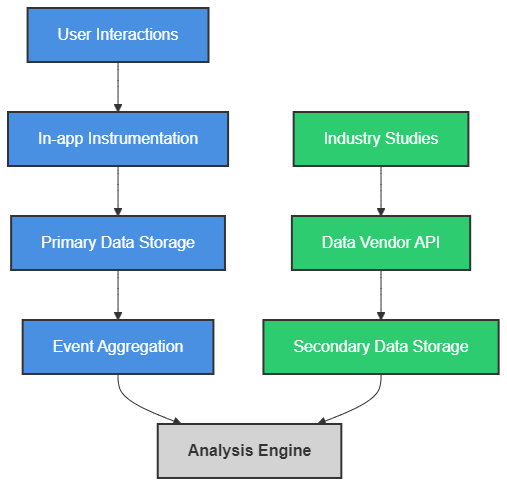
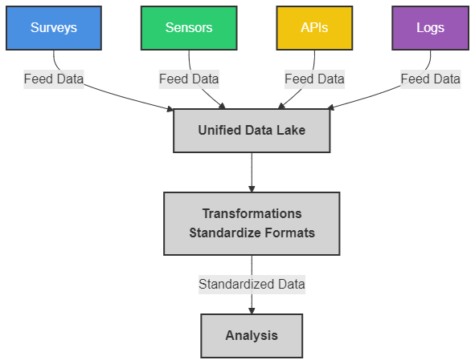
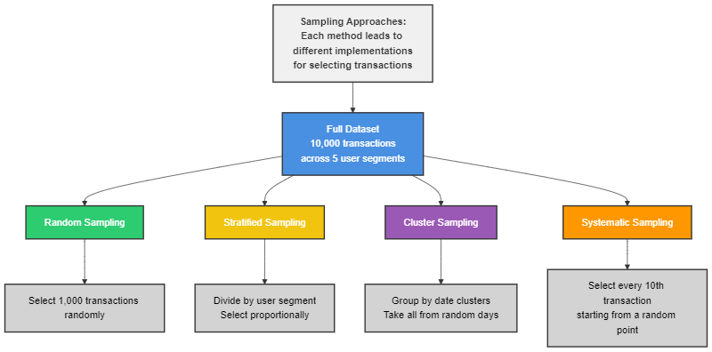
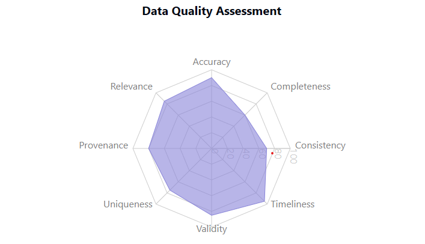
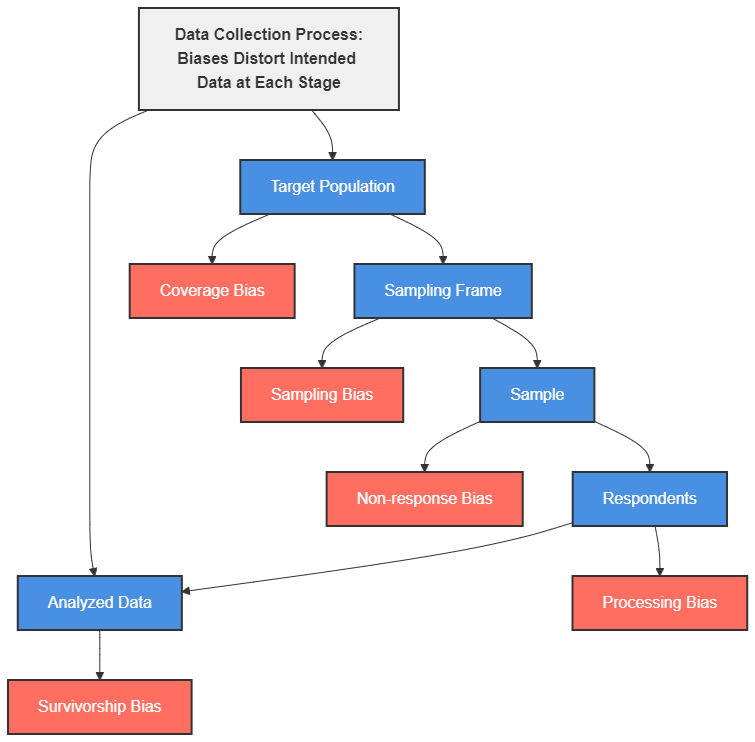
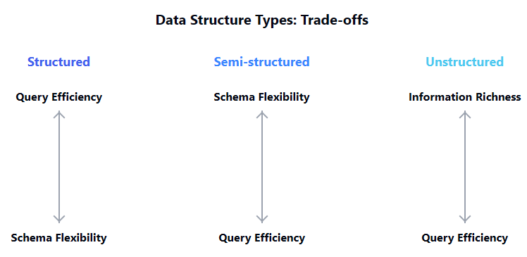

# Data Collection & Sources


## Introduction

Like designing system architecture before writing the first line of code, data collection forms the foundation upon which all data science and analytics work stands. Software developers understand that architectural decisions constrain and enable everything that follows. The same principle applies to data work. Even the most sophisticated algorithms and analytical techniques cannot overcome fundamental flaws in how data is sourced, collected, or structured. 

Throughout your development career, you've likely experienced how upstream decisions ripple through development; in data engineering, collection choices create similar cascading effects. This lesson explores the systematic approach to data sourcing and collection that ensures your analytical foundation is solid, not built on shifting sand. Let's examine the frameworks and methodologies that help transform data collection from an ad-hoc activity into a structured engineering practice.


## Learning Outcomes

By the end of this lesson, you will be able to:

1. Differentiate between primary and secondary data sources, evaluating their respective advantages for specific analytical contexts.
2. Assess various data collection methods including surveys, APIs, web scraping, and sensors to determine appropriate applications based on analytical requirements.
3. Implement appropriate sampling techniques such as random, stratified, cluster, and systematic sampling to ensure data representativeness.
4. Examine data quality across multiple dimensions including accuracy, completeness, consistency, timeliness, and validity using quantifiable metrics.
5. Identify potential biases in data collection processes and implement appropriate technical and procedural mitigation strategies.
6. Compare structured, semi-structured, and unstructured data sources to select optimal formats for specific analytical requirements.


## Primary vs Secondary Data Sources

### Understanding Data Origin

As developers, we're accustomed to distinguishing between code we write in-house versus third-party libraries. Data sources follow a similar dichotomy. Primary data is collected directly for your specific analytical purpose - it's your "first-party code." Secondary data, like a third-party library, was originally collected for other purposes but can be repurposed for your analysis.

Primary data comes with elevated control but higher costs. You define exactly what's collected, how it's structured, and establish direct chain of custody. However, just like writing custom code, it requires significant resources to implement collection pipelines, validation mechanisms, and storage solutions from scratch.

Secondary data offers faster time-to-insight at the cost of reduced control. You're working with someone else's design decisions, field definitions, and collection methodologies - similar to integrating a library with an API you didn't design.

The difference between primary and secondary data extends beyond mere origin. Primary data typically provides higher specificity and relevance to your exact research questions but requires more time for collection and infrastructure setup. Secondary data often provides broader context and historical perspective but may require extensive transformation to align with your analytical framework. This tradeoff between specificity and accessibility mirrors the build-versus-buy decisions common in software architecture.

When evaluating a potential data source, consider both direct acquisition costs and hidden operational expenses. Primary data collection typically involves frontend costs (survey design, sensor deployment, user tracking implementation) plus ongoing maintenance. Secondary data may have lower acquisition costs but higher integration and cleaning expenses - much like how third-party libraries might be free to download but expensive to integrate into legacy systems.


### Practical Applications

**Case Study: Customer Behavior Analysis**  
A retail app development team needed to understand how users navigated their interface. They approached this with a dual strategy: First, they implemented direct instrumentation (primary data) capturing in-app behaviors. Second, they licensed aggregated industry benchmarks (secondary data) from a market research firm. The primary data offered granular insights into specific UI elements but lacked competitive context, while the secondary data provided market comparison but with fewer dimensions.

The hybrid approach revealed a critical insight that neither source alone would have uncovered: while their checkout abandonment rate appeared acceptable when compared against internal historical data (primary source), the secondary data showed they were significantly underperforming against industry peers. This prompted a targeted UX redesign that wouldn't have been prioritized otherwise.

Consider this diagram of the data flow in a hybrid collection approach:




> **Diagram: Hybrid Collection Approach**
> 
> This represents how both primary and secondary data streams converge into a unified analysis system, similar to how you might combine proprietary algorithms with third-party libraries in software development.

In practice, the most effective data strategies involve methodical source documentation. For each dataset, maintain clear metadata about origin, collection methodology, update frequency, and known limitations - similar to dependency documentation in software projects. A systematic registry of data sources enables proper attribution, more accurate interpretations, and smoother transitions when data sources evolve or deprecate.


## Data Collection Methods

### Survey of Collection Techniques

Modern data collection resembles the evolution of input methods in software development. Just as we've moved from command-line inputs to complex APIs, data collection has evolved from manual surveys to automated sensor networks. Each method brings unique strengths and constraints:

1. **Surveys and Questionnaires**: Structured human feedback, analogous to form inputs in web applications. Provides direct answers to specific questions but suffers from self-reporting biases.

2. **API Integrations**: Programmatic access to structured data from external systems. Like RESTful service calls, these provide standardized interfaces to data but require proper authentication and error handling.

3. **Web Scraping**: Automated extraction of data from websites. Similar to parsing unstructured text files, scrapers transform human-readable content into machine-readable data.

4. **Sensor Networks**: IoT devices collecting environmental measurements. These work like event listeners in software, constantly streaming data based on triggers and thresholds.

5. **Log Analysis**: Extracting insights from system logs. Similar to debugging output, these provide a timeline of activities but often in semi-structured formats requiring parsing.

6. **Database Extracts**: Querying structured data from existing systems. Comparable to object-relational mapping (ORM) in software development, where database tables become usable data structures.

7. **Crowdsourcing**: Distributed data collection through voluntary contributions. Similar to open-source development models, this leverages collective effort but requires quality control mechanisms.

The collection method profoundly influences data characteristics. Survey data typically contains rich subjective information but may suffer from response bias. API data offers consistency and structure but only exposes what the provider chooses to make available. Log data provides exhaustive detail but often includes irrelevant noise requiring filtering. Understanding these inherent characteristics helps anticipate downstream data preparation needs.

Each method also carries distinct technical and operational requirements. Surveys need distribution infrastructure and response storage. APIs require credential management and rate-limit handling. Scraping demands robust parsing logic and respect for robots.txt restrictions. Sensor networks require device management and anomaly detection. The collection infrastructure itself often becomes a significant engineering challenge requiring dedicated architecture and maintenance.


### Selecting the Right Method

The decision framework for collection methods parallels how you'd choose between synchronous vs. asynchronous, pull vs. push, or batch vs. streaming approaches in system architecture:

```python
def select_collection_method(requirements):
    if requirements.needs_human_perception:
        if requirements.sample_size < 1000 and requirements.budget > 10000:
            return "Interviews"
        else:
            return "Surveys"
    elif requirements.data_exists_externally:
        if requirements.data_is_public and requirements.has_structured_api is False:
            return "Web Scraping"
        elif requirements.has_structured_api:
            return "API Integration"
        else:
            return "Data Purchase"
    else:  # New data must be generated
        if requirements.needs_continuous_monitoring:
            return "Sensor Network"
        else:
            return "Experimental Design"
```

Collection methods also carry distinct ethical and regulatory implications. Surveys require informed consent protocols. Web scraping must respect terms of service and copyright. Sensor networks raise privacy questions, especially in public spaces. API usage is bound by terms of service that may limit storage or redistribution. These considerations should be evaluated during method selection, not as afterthoughts during implementation.

In practice, most robust data strategies involve multiple collection methods, creating a pipeline similar to how ETL processes combine different data sources:





> **Diagram: Data Collection Pipeline**
>
> The diagram above shows how disparate collection methods (surveys, sensors, APIs, logs) feed into a unified data lake, with appropriate transformations applied to standardize formats before analysis begins.


The collection method selection fundamentally shapes all downstream analysis possibilities. Making this decision requires balancing technical feasibility, resource constraints, data quality requirements, and time-to-insight needs. The choice should be revisited periodically as both business needs and available collection technologies evolve.


## Sampling Techniques

### Fundamentals of Sampling

When dealing with large datasets, sampling becomes essential for the same reason we use test suites rather than exhaustive testing in software development: working with the entire population is often impractical or unnecessary. Sampling involves selecting a subset that adequately represents the whole.

The core principle resembles how we approach performance profiling - we need enough representative data points to draw valid conclusions without exhausting resources. Just as you wouldn't profile every function call in an application, you rarely need every data point to extract meaningful patterns.

Four primary sampling approaches include:

1. **Random Sampling**: Every element has an equal probability of selection. Like random testing in fuzzing operations, this removes systematic bias but might miss edge cases.

2. **Stratified Sampling**: The population is divided into subgroups (strata) with elements selected from each. Similar to ensuring test coverage across different components, this guarantees representation from critical segments.

3. **Cluster Sampling**: Groups (clusters) are randomly selected, then all elements within chosen clusters are included. This resembles testing all functions within randomly selected modules.

4. **Systematic Sampling**: Elements are selected at regular intervals. Comparable to performance testing at fixed load increments, this provides consistent coverage across the range.

Beyond these fundamental approaches, advanced techniques address specific analytical challenges. **Sequential sampling** dynamically adjusts sample size during collection until sufficient statistical power is achieved. **Reservoir sampling** maintains a fixed-size representative sample from streaming data without knowing the total population size in advance. **Importance sampling** oversamples rare but significant events to improve the statistical power for detecting unusual patterns.

The sampling method directly impacts statistical validity. Random sampling enables unbiased estimators but may require larger samples for adequate precision. Stratified sampling reduces variance for heterogeneous populations but requires prior knowledge of meaningful strata. Cluster sampling improves operational efficiency but typically requires larger total samples to achieve comparable confidence levels.

Sample size determination balances precision requirements against resource constraints. Statistical power calculations help determine minimum sample sizes needed to detect effects of interest with specified confidence levels. Unlike the heuristic "more data is better" approach, principled sampling focuses on representative adequacy rather than raw quantity.


### Implementing Different Sampling Strategies

Consider this visualization of the four sampling approaches applied to a dataset of user transactions:





> **Diagram: Four Sampling Approaches**
>
> Each approach leads to different implementations in practice. Random sampling requires generating random indices or using reservoir algorithms for streaming data. Stratified sampling necessitates pre-processing to identify strata boundaries before selection. Cluster sampling demands efficient group-level operations. Systematic sampling needs deterministic selection logic with controllable periodicity.


The implementation complexity varies significantly between batch and streaming contexts. Batch sampling from static datasets allows multiple passes and comprehensive preprocessing. Streaming contexts require single-pass algorithms that maintain representativeness without complete population knowledge - a significantly more challenging constraint reminiscent of online learning algorithms in machine learning.

**Example: A/B Testing Implementation**
For a website feature test, an e-commerce platform implemented stratified sampling to ensure representative distribution across customer segments. The system tagged visitors by acquisition channel and purchase history, then randomly assigned them to test groups within each stratum. This ensured both new and returning customers from various channels were proportionally represented in the experiment, preventing biased conclusions that might have resulted from simple random assignment.

The sampling approach directly influences statistical power - your ability to detect true effects when they exist - much like how test coverage influences your confidence in code quality.

Sampling strategies must evolve as data environments change. Modern systems often implement adaptive sampling patterns where the sampling rate dynamically adjusts based on system load, data variability, or detection of anomalous patterns. This approaches sampling as a continuous optimization problem rather than a static design decision.


## Data Quality Assessment

### Dimensions of Data Quality

Just as we evaluate code quality across multiple dimensions (performance, readability, maintainability), data quality must be assessed through multiple lenses. A comprehensive data quality framework considers:

1. **Accuracy**: Does the data correctly represent reality? Similar to correctness in algorithms, this is the fundamental measure of whether data values match actual values.

2. **Completeness**: Are all necessary data points present? Like test coverage, this measures whether your dataset includes all required elements.

3. **Consistency**: Are related data points coherent? Akin to maintaining invariants in code, this ensures logical relationships between values are preserved.

4. **Timeliness**: Is the data current enough for its intended use? Similar to caching considerations, this evaluates whether data staleness impacts analytical validity.

5. **Validity**: Does the data conform to defined formats and ranges? Like type checking and input validation, this ensures data follows specified constraints.

6. **Uniqueness**: Are duplicates appropriately managed? Similar to database normalization concerns, this addresses whether redundancies cause analytical distortions.

7. **Provenance**: Is the data's origin, transformations, and handling well-documented? Comparable to source control in code, this tracks the data's journey and enables accountability.

8. **Relevance**: Does the data actually measure what's needed for the analysis? Similar to the concept of measuring the right metrics in performance testing, this ensures alignment with analytical objectives.

These dimensions interact and sometimes conflict. Improving completeness by imputing missing values may reduce accuracy. Enhancing timeliness with real-time streams may compromise consistency. The quality assessment framework should prioritize dimensions based on analytical requirements rather than pursuing universal optimization.

Quality assessment should apply to both raw inputs and transformed outputs. The data pipeline itself can introduce quality issues through transformation errors, aggregation artifacts, or pipeline failures. Implementing quality gates at multiple stages creates a defensive architecture that prevents downstream propagation of quality issues.

Visual representation of data quality dimensions can be conceptualized as radar chart using the following values:

- Accuracy (90%)
- Uniqueness (75%)
- Completeness (60%)
- Validity (85%)
- Consistency (70%)
- Timeliness (95%)
- Relevance (85%)
- Provenance (80%)




> **Data Quality Dimensions**
> 
> The radar chart shows the relative strengths and weaknesses across all dimensions, with Timeliness being the strongest dimension at 95% and Completeness being the area that needs the most improvement at 60%.


### Quality Measurement Frameworks

Data quality can be quantified using metrics similar to how we measure code quality:

- **Null Ratio**: Percentage of null/missing values in required fields
- **Schema Conformity**: Percentage of records adhering to defined schema
- **Freshness Decay**: Function mapping data age to value degradation
- **Cross-Field Validation Rate**: Percentage of records passing relational constraints
- **Outlier Proportion**: Percentage of values falling outside statistical norms
- **Duplicate Ratio**: Percentage of records representing duplicate entities
- **Consistency Score**: Measure of logical coherence between related fields
- **Source Reliability Index**: Composite score based on historical quality from source

These metrics enable objective quality tracking and allow for data quality service-level agreements (SLAs) between teams. Quality trends often reveal systemic issues in upstream systems or collection processes that warrant investigation.

Automation is essential for sustainable quality assessment. Manual review quickly becomes impractical as data volumes grow. Automated quality pipelines can execute validation rules, calculate quality metrics, flag anomalies, and track quality trends over time. Integration with alerting systems enables proactive notification when quality degrades below acceptable thresholds.

**Example Implementation: Data Quality Pipeline**
A financial services company implemented automated quality gates in their data pipeline. Before analysis, datasets passed through validation modules that:

1. Measured completeness by field
2. Flagged statistical outliers 
3. Verified referential integrity across tables
4. Checked time-series continuity 

Reports failing these checks were automatically flagged for review, preventing downstream propagation of quality issues - similar to how CI/CD pipelines prevent merging code that fails tests.

Quality assessment becomes particularly challenging in federated data environments where multiple sources are combined. Each source may have different quality standards, measurement approaches, and documentation practices. Unified quality frameworks need to reconcile these differences while preserving source-specific context that might explain apparent discrepancies.


## Bias Identification and Mitigation

### Common Biases in Data Collection

Bias in data collection parallels anti-patterns in software development - both subtly undermine results in ways that can be difficult to detect without deliberate examination. Common biases include:

1. **Selection Bias**: The sampled population doesn't represent the target population. Similar to testing only on "happy path" scenarios while ignoring edge cases.

2. **Survivorship Bias**: Analysis includes only successful elements that "survived" some process. Like analyzing only production code while ignoring failed approaches that never made it past code review.

3. **Confirmation Bias**: Collection methods unconsciously designed to reinforce existing assumptions. Comparable to writing tests that validate what you expect rather than thoroughly testing functionality.

4. **Measurement Bias**: Systematic errors in the measurement instrument itself. Similar to using profiling tools that themselves impact system performance.

5. **Self-Selection Bias**: Subjects choose whether to participate, creating unrepresentative samples. Like user feedback forms that capture only extremely satisfied or dissatisfied customers.

6. **Temporal Bias**: Data collected at specific times may not represent other time periods. Similar to performance testing during low-traffic periods and missing peak-hour issues.

7. **Observer Bias**: The act of measurement influences the behavior being measured. Analogous to how adding debug logging can change application timing and mask race conditions.

8. **Automation Bias**: Overreliance on automated systems that may have embedded biases or limitations. Comparable to trusting static analysis tools without manual code review.

Bias can enter at multiple points in the data lifecycle - not just during initial collection. Preprocessing steps like cleaning and transformation can inadvertently remove important signals. Aggregation can mask critical variations across subgroups. Visualization choices can emphasize certain patterns while obscuring others. Each step requires scrutiny to maintain analytical integrity.

The impact of these biases can be visualized as a distortion between the intended and actual data collection:





> **Diagram: Impact of Biases**
> 
> This flowchart illustrates the flow from Target Population to Analyzed Data, highlighting key stages: Sampling Frame, Sample, and Respondents. Biases such as Coverage, Sampling, Non-response, Processing, and Survivorship can distort the intended data, emphasizing the need for careful scrutiny at each step to maintain analytical integrity.


Bias detection requires both statistical tests and domain expertise. Statistical approaches include comparing sample distributions against known population parameters, examining residual patterns in models, and conducting sensitivity analyses with different data subsets. Domain expertise helps identify implausible patterns that statistical tests might miss and contextualizes findings within broader knowledge.


### Strategies for Reducing Bias

**Case Study: Healthcare Prediction Model**
A predictive model for hospital readmissions suffered from selection bias when trained exclusively on current patients' data. The model failed to account for patients who recovered fully (never returned) or those who died (couldn't return). Developers mitigated this by:

1. Expanding data collection to include follow-up records from external systems
2. Implementing stratified sampling across demographic variables 
3. Conducting sensitivity analysis with different weighting schemes
4. Documenting remaining bias limitations in model outputs

This multi-faceted approach didn't eliminate bias entirely but made it explicit and quantifiable, enabling appropriate interpretation of results.

Effective bias mitigation requires a combination of technical approaches, process changes, and cultural shifts. Technical approaches include diversifying data sources, implementing weighted sampling, and using specialized algorithms designed to detect and adjust for specific biases. Process changes involve structured review protocols, adversarial testing, and continuous monitoring. Cultural shifts emphasize questioning assumptions, valuing diverse perspectives, and rewarding identification of analytical blind spots.

Documentation plays a crucial role in bias management. Even when biases cannot be eliminated, they should be thoroughly documented along with potential impacts on analysis. This transparency enables downstream users to make informed judgments about whether and how to apply the data to specific questions. Documentation should evolve as new biases are discovered or existing biases are mitigated.

Addressing bias requires combining technical approaches (diverse data sources, balanced sampling) with procedural safeguards (documentation, review by domain experts) - similar to how robust software combines technical solutions with process controls.

A systematic bias mitigation approach follows this pattern:
1. Map potential bias sources throughout the collection process
2. Implement technical controls where possible
3. Document unavoidable limitations
4. Validate results against external benchmarks
5. Continuously monitor for emerging bias patterns

The most insidious biases are often those that align with existing expectations or business interests. Creating structures that reward bias identification - even when uncomfortable - helps counteract the natural tendency to overlook confirming biases. This parallels how effective code review cultures reward identifying bugs rather than penalizing their existence.


## Data Structure Types

### Comparing Data Structures

Just as we select different data structures in software engineering based on access patterns and operations, data sources come in various structures optimized for different analytical needs:

1. **Structured Data**: Organized in rigid, predefined formats with consistent fields and relationships. Similar to strongly-typed, schema-defined objects in programming.
   - Examples: Relational databases, CSV files, spreadsheets
   - Advantages: Fast queries, efficient storage, clear relationships
   - Limitations: Rigid schema, complex for hierarchical data

2. **Semi-structured Data**: Contains organizational markers but allows flexibility in structure. Comparable to JSON or XML objects with some schema guidance.
   - Examples: JSON, XML, YAML, NoSQL documents
   - Advantages: Schema flexibility, nesting capabilities
   - Limitations: Less query efficiency, inconsistent fields

3. **Unstructured Data**: No predefined format or organization. Like raw text or binary files requiring parsing logic.
   - Examples: Text documents, images, audio files
   - Advantages: Rich information, natural format
   - Limitations: Difficult to query, requires preprocessing

4. **Time-Series Data**: Sequential data points indexed by time. Similar to event logs or monitoring metrics in software systems.
   - Examples: Stock prices, sensor readings, application metrics
   - Advantages: Temporal analysis capabilities, optimized for time-based operations
   - Limitations: Storage requirements, complex seasonal patterns

5. **Graph Data**: Focuses on relationships between entities. Comparable to object reference graphs in memory.
   - Examples: Social networks, knowledge graphs, recommendation systems
   - Advantages: Relationship traversal, network analysis
   - Limitations: Query complexity, scaling challenges

The boundary between these types has blurred with modern systems. Polyglot persistence approaches combine multiple storage paradigms, each optimized for specific access patterns. Graph databases often incorporate document storage for node properties. Relational databases have added JSON support for semi-structured fields. These hybrid approaches maximize flexibility but require careful design to maintain data integrity across structures.

This conceptual diagram shows the trade-offs between structure and flexibility across data types:





> **Diagram: Trade-offs Between Structure and Flexibility**
> 
> This diagram represents the trade-offs between data structure types as shown in the passage. The arrows indicate that as you move from one end to another, you gain one property while losing another.


The structure directly impacts analytical capabilities. Structured data enables efficient filtering, joining, and aggregation but constrains the questions you can ask to those anticipated in the schema design. Semi-structured data supports exploratory analysis and evolving requirements but requires more complex query patterns. Unstructured data captures nuanced information but demands sophisticated preprocessing to extract analytical value.


### Matching Structures to Problems

The selection of data structure should be driven by analytical requirements, much like how we choose between arrays, hashmaps, or trees based on algorithm needs:

- **Real-time Analytics**: Structured data in columnar formats
- **Complex Relationships**: Graph databases
- **Document Management**: Document stores
- **Text Analysis**: Unstructured with NLP preprocessing
- **Time-Series Analysis**: Specialized time-series databases
- **Hierarchical Data**: Semi-structured in nested formats

Structure selection must consider both current and anticipated future needs. Schema evolution capabilities vary dramatically between structures. Relational databases offer robust mechanisms for coordinated schema changes but may require downtime for major modifications. Document stores enable field-level evolution without global schema changes but may struggle with enforcing consistency across documents. These trade-offs should be evaluated against expected change patterns in your domain.

The distinction between logical and physical structure is increasingly important. Modern data systems often separate the storage format (optimized for efficiency) from the query interface (optimized for usability). For example, a data lake might physically store parquet files but expose virtual tables through SQL interfaces. This separation enables optimizing each layer independently while maintaining a consistent analytical experience.

**Implementation Example: Multi-structure Data Lake**
A logistics company implemented a tiered data architecture where:

1. Transactional data resided in PostgreSQL (structured)
2. Vehicle telemetry streamed to MongoDB (semi-structured)
3. Customer communications stored in Elasticsearch (unstructured)

This multi-structure approach allowed each data type to reside in its optimal format while a unified query layer provided integrated analytics capabilities. Similar to how modern applications might use different storage systems (SQL, Redis, file system) for different components based on access patterns.

Structure selection, like most architectural decisions, involves trade-offs between immediate productivity and long-term flexibility. Structured formats provide immediate query capabilities but may constrain future evolution. Unstructured formats preserve all information but require significant processing before analysis. The optimal approach often involves tiered strategies where raw data is preserved in flexible formats while derived views provide structured access for common analytical patterns.


## Key Takeaways

The foundation of successful data science isn't sophisticated algorithms but thoughtful data collection and source selection. Remember:

1. Consider the tradeoffs between primary and secondary sources—control versus efficiency
2. Match collection methods to analytical requirements and available resources
3. Choose sampling techniques that preserve representativeness for your specific analysis goals
4. Implement systematic quality assessment frameworks rather than ad-hoc checks
5. Document and mitigate biases throughout the collection and analysis pipeline
6. Select data structures based on analytical needs, not just convenience


## Conclusion

Data collection isn't just a preliminary step—it's the foundation that determines the ceiling of what's possible in your analysis. 

The decisions you make at this stage cascade through the entire data science workflow, from preprocessing to modeling to interpretation. By approaching data collection with the same rigor we apply to system architecture or algorithm design, we can build analyses on solid foundations rather than shifting sand. As you move forward to data interpretation in our next lesson, you'll leverage these structured approaches to transform raw data into meaningful insights, recognize patterns and anomalies, and effectively communicate your findings. 

Remember that no amount of sophisticated analysis can overcome fundamental weaknesses in your data's origin—the engineering principle of "garbage in, garbage out" remains as relevant in data science as it does in software development.


## Glossary

**API (Application Programming Interface)**: A set of rules and protocols that allows different software applications to communicate with each other; commonly used for accessing structured data from external systems.

**Bias**: Systematic errors in data collection or analysis that lead to incorrect or skewed results; includes selection bias, survivorship bias, and confirmation bias among others.

**Cluster Sampling**: A sampling technique where groups (clusters) are randomly selected, and all elements within those clusters are included in the sample.

**Data Lake**: A centralized repository that stores all structured and unstructured data at any scale, typically using a flat architecture.

**Data Provenance**: Documentation of where data originated, how it was collected, and any transformations applied to it; crucial for accountability and reproducibility.

**ETL (Extract, Transform, Load)**: A process used to collect data from various sources, transform it to suit operational needs, and load it into a destination database.

**Graph Database**: A database that uses graph structures with nodes, edges, and properties to represent and store data; optimized for complex relationships between entities.

**Imputation**: The process of replacing missing data with substituted values to create a complete dataset for analysis.

**Primary Data**: Data collected directly for a specific analytical purpose; offers high control but typically requires more resources to collect.

**Random Sampling**: A sampling technique where each element in the population has an equal probability of being selected.

**Reservoir Sampling**: A technique for randomly selecting k samples from a population of unknown size, particularly useful for streaming data.

**Schema**: The structure that defines how data is organized in a database, including tables, fields, relationships, and constraints.

**Secondary Data**: Data originally collected for purposes other than the current analysis; typically faster to acquire but offers less control.

**Selection Bias**: A statistical error where the sample selected is not representative of the population intended to be analyzed.

**Semi-structured Data**: Data that doesn't conform to a rigid structure but contains organizational markers or tags to separate semantic elements.

**Service-Level Agreement (SLA)**: A commitment between a service provider and client about aspects of the service including quality, availability, and responsibilities.

**Stratified Sampling**: A sampling technique where the population is divided into distinct subgroups (strata) before sampling, ensuring representation from all subgroups.

**Structured Data**: Data organized in a predefined format with consistent fields and relationships, typically found in relational databases.

**Systematic Sampling**: A sampling technique where elements are selected at regular intervals after a random starting point.

**Time-Series Data**: Sequential data points indexed in chronological order, often used for tracking changes over time.

**Unstructured Data**: Data that lacks a predefined format or organization, such as text documents, images, and audio files.

**Web Scraping**: The automated process of extracting data from websites, typically converting unstructured web content into structured data for analysis.