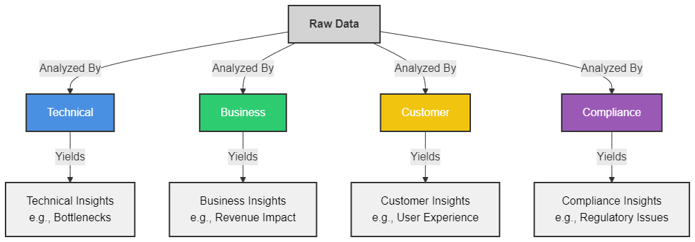
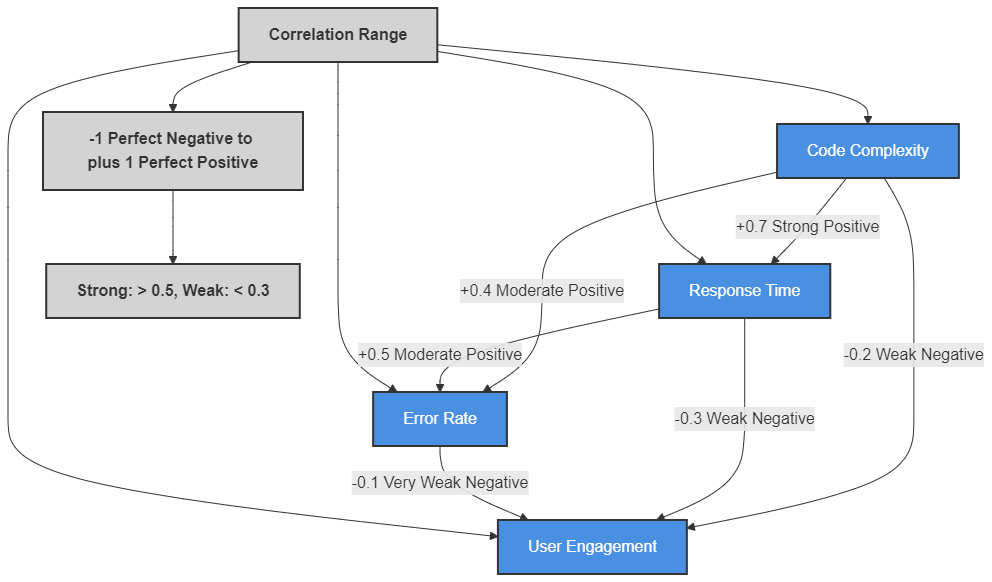
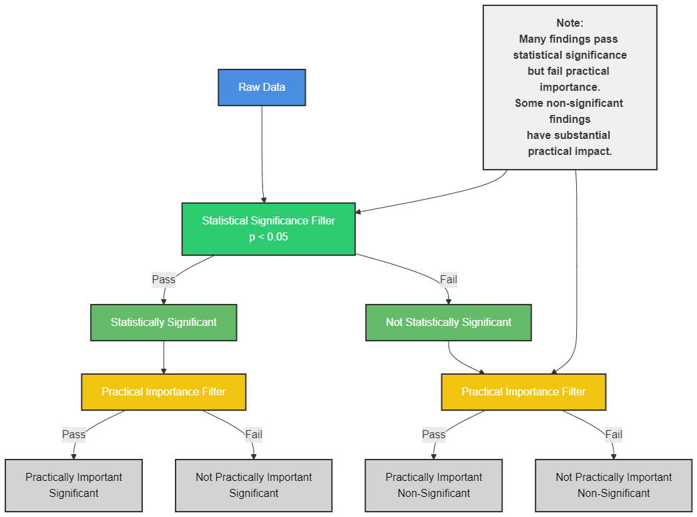
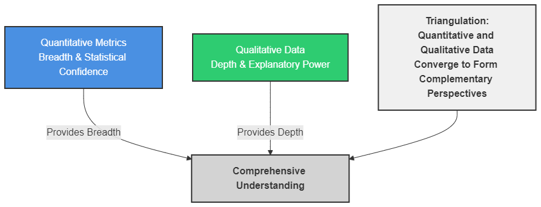
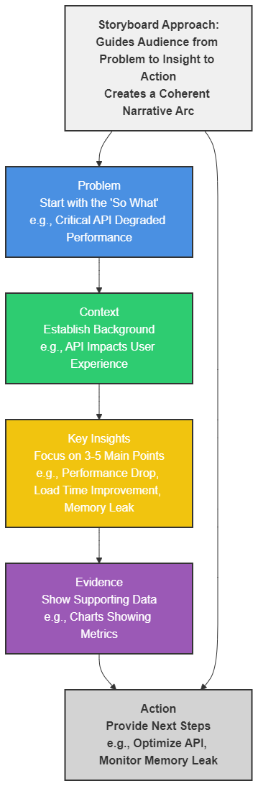

# Lesson: Data Interpretation


## Introduction

Software developers face mountains of metrics but struggle to extract meaning from the deluge of data their systems generate. The performance dashboards, error logs, and user analytics that once promised clarity often create confusion without proper interpretive frameworks. Effective data interpretation transforms raw numbers into actionable insights by applying contextual understanding, analytical rigor, and domain expertise. 

This skill becomes increasingly critical as development teams make technical decisions about architecture, optimization priorities, and feature development based on data-driven evidence rather than intuition alone. Throughout this lesson, you will learn systematic approaches to extract meaningful insights from data through context application, pattern recognition, significance evaluation, and narrative construction. These frameworks will equip you with the tools to make sense of the complex datasets that modern development environments produce.


## Learning Outcomes

By the end of this lesson, you will be able to:

1. Analyze raw data using contextual frameworks to extract meaningful insights from datasets.
2. Identify and interpret trends, patterns, and correlations in datasets to reveal underlying relationships.
3. Distinguish between statistical significance and practical importance when analyzing data anomalies.
4. Integrate quantitative metrics with qualitative context to develop comprehensive understanding of data.
5. Craft data narratives that effectively communicate insights to different stakeholders.


## Evaluating Raw Data with Contextual Frameworks


### Understanding the Data Interpretation Process

Raw data is like code without documentation—technically complete but lacking meaning. Data interpretation is the systematic process of applying context and analytical frameworks to transform raw values into meaningful insights.

Consider this server response time dataset:

```
2023-08-01, 120ms
2023-08-02, 122ms
2023-08-03, 118ms
2023-08-04, 245ms
2023-08-05, 119ms
```

Without context, these are merely numbers. But through interpretation, we can recognize that August 4th shows an anomaly worth investigating. Is it a deployment issue? Network problem? Scheduled maintenance? The interpretation process helps us ask these questions and find answers.

The data interpretation process follows these steps:

1. **Contextualization**: Understand what the data represents and its collection methodology
2. **Pattern recognition**: Identify trends, outliers, and relationships
3. **Framework application**: Apply relevant analytical frameworks (business, technical, statistical)
4. **Insight generation**: Extract meaningful conclusions and implications
5. **Validation**: Cross-check findings against other data sources or domain expertise

Effective data interpretation requires more than technical analysis—it demands critical thinking and domain knowledge. When examining a performance dataset, for instance, understanding the underlying system architecture, recent code changes, and business priorities transforms raw metrics into contextually relevant insights. Without this contextual lens, you might identify a spike in response times but miss that it coincided with a major marketing campaign that doubled normal traffic levels.


### Applying Contextual Frameworks

Different contexts require different interpretive frameworks. When evaluating API performance metrics, an engineering framework focuses on technical bottlenecks, while a business framework emphasizes user experience impact and potential revenue effects.

**Case Study: E-commerce Checkout Analysis**
A checkout funnel analysis showed a 35% drop-off rate at payment confirmation. Using a technical framework, engineers identified a JavaScript error occurring on certain browsers. Switching to a business framework revealed the drop-off primarily affected high-value customers. A customer experience framework uncovered that users were confused by ambiguous error messages, not just experiencing technical failures.

The diagram below illustrates how different contextual frameworks can be applied to the same dataset to yield different types of insights:





> **Diagram: Contextual Frameworks**
>
> This diagram shows a central "Raw Data" node connected to multiple frameworks (Technical, Business, Customer, Compliance) with arrows pointing outward to different types of insights derived from each framework.


Contextual frameworks function like specialized lenses that highlight particular aspects of your data. The security framework might emphasize authentication failures and access patterns, while the performance framework focuses on response times and resource utilization. These frameworks aren't mutually exclusive—the most robust interpretations typically incorporate multiple perspectives.

When interpreting data, developers should consistently ask:
- What business context surrounds this data?
- What technical constraints influenced these values?
- Who created this data and for what purpose?
- What might be missing from this dataset?
- How does this data align with or contradict existing knowledge?
- What assumptions am I making in my interpretation?

Remember that every dataset has limitations and built-in biases. Server logs might capture technical errors perfectly but completely miss user frustration. Conversion metrics might show what happened but not why. The most valuable interpretations acknowledge these constraints while extracting the maximum possible insight from available data.


## Identifying Trends, Patterns, and Correlations


### Recognizing Different Types of Patterns

Patterns in data typically fall into several categories:

1. **Trends**: Directional movements over time (upward, downward, stable)
2. **Cycles**: Recurring patterns that repeat at regular intervals
3. **Seasonality**: Time-based patterns tied to calendar periods
4. **Correlations**: Relationships between different variables
5. **Clusters**: Groupings of similar data points

Identifying these patterns requires both analytical tools and pattern recognition skills. For instance, when examining user engagement metrics, a weekly cycle might show higher activity on weekdays and lower on weekends, while a seasonal pattern might reveal higher engagement during specific months.

```python
# Pseudocode for basic trend analysis
def analyze_trend(time_series_data):
    # Calculate moving average to smooth noise
    smoothed_data = calculate_moving_average(time_series_data, window=7)
    
    # Determine trend direction
    if last_value(smoothed_data) > first_value(smoothed_data):
        trend = "upward"
    elif last_value(smoothed_data) < first_value(smoothed_data):
        trend = "downward"
    else:
        trend = "stable"
        
    # Calculate rate of change
    slope = calculate_linear_regression_slope(time_series_data)
    
    return {"trend": trend, "rate_of_change": slope}
```

The ability to distinguish between different pattern types is crucial for accurate interpretation. A temporary spike caused by a viral social media post requires different business responses than a steady upward trend indicating sustained growth. Similarly, understanding that an application's resource usage follows a predictable weekly cycle helps distinguish normal variations from actual performance issues.


**Example: Login Activity Analysis**
A development team observed authentication attempts peaking every Monday at 9 AM, creating system strain. Further analysis revealed this coincided with weekly team meetings when employees simultaneously logged in. They also identified a longer-term trend of 5% monthly growth in authentication volume, suggesting the need for capacity planning. By separating the weekly cycle from the growth trend, they could implement more targeted solutions.

When examining patterns, it's also essential to look for changes in the patterns themselves. A previously reliable seasonal pattern that suddenly changes might indicate shifting market conditions, customer preferences, or emerging competitors. These pattern disruptions often contain valuable business intelligence that pure numeric analysis might miss.


### Correlation Analysis Techniques

Correlations help us understand relationships between variables, though they don't necessarily imply causation. When analyzing how code changes affect performance, we must carefully interpret correlations.





> **Diagram: Correlation Matrix**
>
> The correlation matrix diagram shows the relationships between variables in a dataset through a color-coded grid. Darker colors represent stronger relationships, while the direction (positive/negative) indicates whether variables move together or in opposite directions.


**Techniques for effective correlation analysis:**

1. Start with visual exploration using scatter plots
2. Calculate correlation coefficients (Pearson, Spearman, or Kendall)
3. Test for statistical significance
4. Look for spurious correlations and confounding variables
5. Consider logical relationships and domain knowledge
6. Evaluate consistency across different time periods or segments

Remember that correlation strength varies from -1 (perfect negative) through 0 (no correlation) to +1 (perfect positive). However, the practical significance of these correlations depends on context—a correlation of 0.3 might be meaningful in some domains but negligible in others.

Strong correlations sometimes reveal unexpected relationships that lead to valuable insights. For example, a data analysis might show that users who customize their profile settings are 3x more likely to become paid subscribers. This doesn't prove causation (perhaps more committed users simply do both), but it does suggest potential areas to investigate further.

The most powerful pattern recognition combines computational techniques with human domain expertise. While algorithms excel at detecting statistical regularities, subject matter experts can interpret these patterns through the lens of business context, technical constraints, and practical application. This partnership between technological and human intelligence typically produces the most valuable interpretations.


## Statistical Significance vs. Practical Importance

### Analyzing Data Anomalies

Data anomalies—outliers, spikes, and unexpected patterns—often contain the most valuable insights. However, determining whether an anomaly represents a significant finding or statistical noise requires both statistical rigor and practical judgment.

Consider these metrics from an A/B test of a new user interface:

| Metric | Control | Test | Change | p-value |
|--------|---------|------|--------|---------|
| Conversion Rate | 5.2% | 5.8% | +11.5% | 0.048 |
| Avg. Session Time | 4:32 | 4:15 | -6.2% | 0.001 |
| Error Rate | 0.5% | 0.4% | -20.0% | 0.22 |

The statistical significance (p < 0.05) suggests the conversion rate increase is unlikely due to chance. But is a 0.6 percentage point increase meaningful from a business perspective? This is where practical importance enters the conversation.

The error rate decreased dramatically by 20%, but the p-value indicates this could be chance variation. Looking deeper, we might find that the actual number of errors is so small that even a 20% reduction has minimal practical impact.

Data anomalies challenge us to distinguish between what's mathematically significant and what's practically meaningful. A millisecond improvement in database query time might be statistically significant across millions of operations, but users won't notice this difference in their experience. Conversely, a seemingly small percentage increase in conversion rate might represent millions in additional annual revenue for a high-volume business.

The Sankey diagram shows how data flows through a statistical and practical significance filter. Many findings that pass statistical significance tests fail to meet practical importance thresholds, while others may lack statistical significance but carry substantial practical impact that warrants attention.





> **Sankey Diagram**
>
> This diagram shows how data flows through a statistical and practical significance filter.


### Evaluating Real-World Impact

Statistical significance tells us if an observation is likely real, but practical importance tells us if it matters. For developers, this distinction mirrors the difference between identifying all possible edge cases versus focusing on those that meaningfully impact users.

**Case Study: Database Query Optimization**
A team identified a statistically significant 15ms improvement in query response time after implementing a new indexing strategy. While statistically valid, further analysis showed this represented just a 0.5% improvement in overall page load time—unnoticeable to users. However, for specific high-volume queries powering critical dashboards, the same optimization yielded a 200ms improvement, demonstrating high practical importance despite affecting a smaller dataset.

The relationship between statistical and practical significance varies across contexts. In some scenarios, like medical testing or safety systems, even statistically questionable results might warrant action if the practical stakes are high enough. In other cases, like cosmetic interface changes, even statistically significant results might not justify implementation costs if the practical benefit is minimal.

When evaluating anomalies, ask these questions:
1. Is this finding statistically valid?
2. Does the magnitude of effect matter in our context?
3. Does it affect critical systems or high-value scenarios?
4. Is the pattern consistent or isolated?
5. What would be the cost of action versus inaction?
6. How does this fit with our domain knowledge and experience?
7. Would stakeholders perceive this change as valuable?

This balanced approach prevents both overreacting to statistical flukes and overlooking practically important signals that don't meet rigid significance thresholds. The most valuable data interpretation often lies in finding the sweet spot where statistical confidence and practical impact converge.


## Integrating Quantitative and Qualitative Analysis


### Data Triangulation Methods

Data interpretation becomes more robust when we triangulate across multiple data types and sources. This means combining quantitative metrics (what happened) with qualitative insights (why it happened).

Effective triangulation might include:
- Comparing quantitative performance metrics with qualitative user feedback
- Cross-referencing automated error logs with support ticket narratives
- Matching usage analytics with user interviews or survey responses
- Validating data trends against subject matter expert opinions
- Combining system monitoring data with direct observations of user behavior

Triangulation serves multiple purposes in data interpretation. It validates findings through multiple sources, fills gaps where either quantitative or qualitative data alone would be insufficient, and resolves contradictions that might emerge from a single data source. This multi-method approach produces more nuanced and reliable insights.

**Example: Application Performance Investigation**
Quantitative monitoring showed increased API response times (250ms → 400ms). Log analysis revealed higher database query counts, but didn't explain why. Customer support tickets mentioned slowness when performing multi-item operations. User interviews uncovered that a recent UI change encouraged users to process items in batches rather than individually, creating database load patterns not anticipated during development.

This triangulated approach provided a comprehensive understanding that no single data source could deliver. The quantitative data showed what was happening, while the qualitative data explained why, creating a complete picture that enabled effective resolution.

The triangulation diagram illustrates how different data sources converge to create a comprehensive understanding. Quantitative metrics provide breadth and statistical confidence, while qualitative data offers depth and explanatory power, creating complementary perspectives on the same phenomenon.





> **Triangulation Diagram**
>
> This diagram illustrates how different data sources converge to create a comprehensive understanding. 


### Applying Domain Knowledge

Domain knowledge transforms data interpretation from generic analysis into contextually relevant insights. When examining authentication failures, a security specialist will interpret patterns differently than a UX designer.

**Techniques for integrating domain expertise:**

1. Include subject matter experts in data analysis sessions
2. Map metrics to domain-specific frameworks and benchmarks
3. Translate technical findings into domain language
4. Consider implicit knowledge and unwritten rules
5. Challenge interpretations with cross-functional perspectives
6. Document domain assumptions that influenced the analysis

Domain expertise helps you see beyond the surface level of the data. An experienced developer might recognize that an unusual spike in memory usage isn't a bug but an expected consequence of a garbage collection strategy. A product manager might understand that a feature with low usage metrics might still be critically important to a key customer segment.

Domain knowledge helps you avoid misinterpretations by understanding:
- Standard operational patterns versus anomalies
- Acceptable thresholds for specific metrics
- Business cycles that influence data patterns
- Technical constraints that affect data collection
- Industry regulations that might impact data interpretation
- Historical context that explains current observations

The most effective data interpretation occurs at the intersection of quantitative rigor, qualitative depth, and domain expertise. Each perspective compensates for the blind spots of the others, creating a more complete and accurate understanding of complex situations.


## Crafting Effective Data Narratives


### Data Storytelling Principles

Data without narrative is just numbers; narrative without data is just opinion. Effective data storytelling combines both, transforming analytical findings into compelling, actionable stories.

The core principles of data storytelling include:

1. **Start with the "so what"**: Lead with the most significant insight
2. **Establish context**: Provide necessary background information
3. **Focus on key insights**: Prioritize 3-5 main points rather than exhaustive detail
4. **Show evidence**: Support claims with appropriate data visualizations
5. **Provide next steps**: Conclude with clear implications or recommendations

Effective data narratives create a logical flow that guides the audience from observation to insight to action. They balance analytical rigor with accessibility, ensuring that technical details support rather than overwhelm the core message.

**Example: Monthly Performance Report Transformation**
A development team transformed their monthly status report from a 20-slide deck of charts and metrics to a 5-slide narrative focused on three key findings: (1) a critical API experiencing degraded performance, (2) a successful deployment that improved load times by 40%, and (3) an emerging memory leak in the notification service. Each finding included supporting data, context about why it mattered, and specific recommended actions.

This narrative approach dramatically improved stakeholder comprehension and action compared to the previous metrics-heavy approach. By crafting a cohesive story rather than presenting disconnected data points, the team enabled more effective decision-making.

The storyboard diagram shows how data points can be arranged into a coherent narrative arc. Rather than presenting disconnected charts, the storyboard approach creates a logical flow that guides the audience through the journey from problem to insight to action.





> **Storyboard Diagram**
>
> This diagram shows how data points can be arranged into a coherent narrative arc.


### Adapting Insights for Different Audiences

The same data needs different interpretations for different stakeholders. When communicating performance metrics:

- **For executives**: Focus on business impact, costs, and strategic implications
- **For technical teams**: Emphasize root causes, technical details, and implementation considerations
- **For product managers**: Highlight user experience impacts and feature implications
- **For customers**: Translate into benefits, improvements, and service expectations

Audience adaptation isn't about changing the underlying data—it's about framing insights in terms that resonate with each group's priorities, technical background, and decision-making authority. This might mean adjusting terminology, visualization complexity, and recommendation specificity.

Effective adaptation requires:
1. Understanding each audience's priorities and language
2. Adjusting technical depth appropriately
3. Emphasizing relevant implications
4. Using appropriate visualization complexity
5. Framing recommendations in context of audience's decision authority
6. Anticipating questions specific to each stakeholder group

**Case Study: System Outage Reporting**
After a service disruption, a team prepared three different communications: (1) a technical post-mortem for engineering with code samples and detailed timeline, (2) an executive summary focusing on business impact and prevention strategies, and (3) a customer-facing explanation emphasizing affected functionality and compensation measures. Each narrative used the same core data but emphasized different aspects with appropriate language and detail level.

Keep in mind that adapting narratives for different audiences doesn't mean selective disclosure or manipulation—the core facts and findings should remain consistent. The adaptation lies in presentation style, emphasis, and framing to ensure each audience can effectively engage with and act upon the insights.


## Key Takeaways

From this lesson on data interpretation, remember:

- Raw data becomes valuable only when interpreted within appropriate contextual frameworks
- Pattern recognition skills help you identify trends, cycles, and correlations that reveal deeper insights
- Statistical significance establishes validity, but practical importance determines action priority
- Triangulating quantitative metrics with qualitative context creates more robust understanding
- Effective data narratives must be tailored to specific audiences and their decision-making needs


## Conclusion

Data interpretation represents the crucial bridge between collecting metrics and making informed decisions. By applying contextual frameworks, distinguishing between statistical and practical significance, triangulating across multiple data sources, and crafting targeted narratives, you transform raw numbers into valuable insights that drive action. 

This interpretive process mirrors many aspects of software development itself—requiring both technical precision and contextual understanding to be effective. As you strengthen these interpretation skills, you'll increasingly recognize patterns and relationships in your data that might otherwise remain hidden. The next logical challenge involves identifying and mitigating bias in your data and analysis processes. Just as proper interpretation creates value, unrecognized bias can undermine the validity of your conclusions and perpetuate systemic issues in your systems and decision-making processes.


## Glossary

- **Contextual Framework**: An analytical lens that places data within specific situational parameters
- **Correlation**: A statistical measure that expresses the extent to which two variables are linearly related
- **Data Triangulation**: The process of using multiple data sources or methods to develop a comprehensive understanding of phenomena
- **Outlier**: A data point that differs significantly from other observations
- **Practical Significance**: The real-world importance or usefulness of a finding, regardless of statistical validity
- **Statistical Significance**: The likelihood that a relationship between two or more variables is caused by something other than chance
- **Trend**: A pattern of gradual change in a condition, output, or process, typically viewed over time