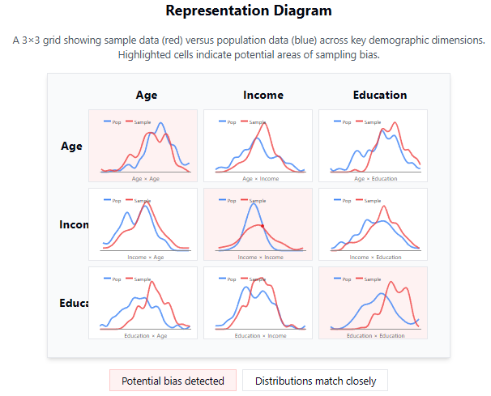
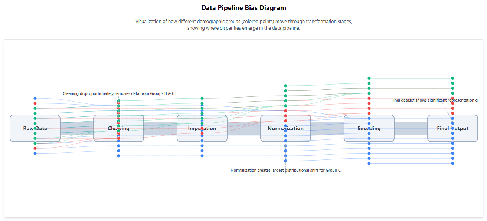
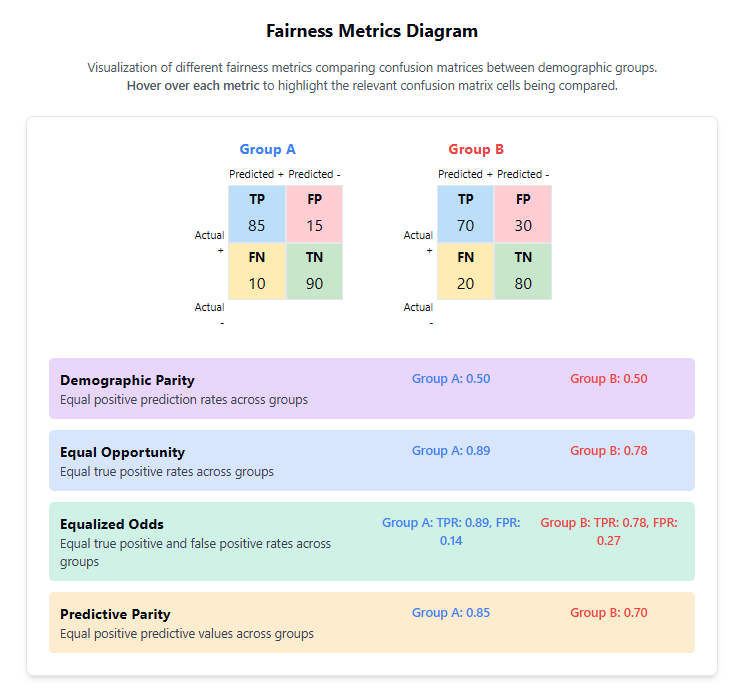
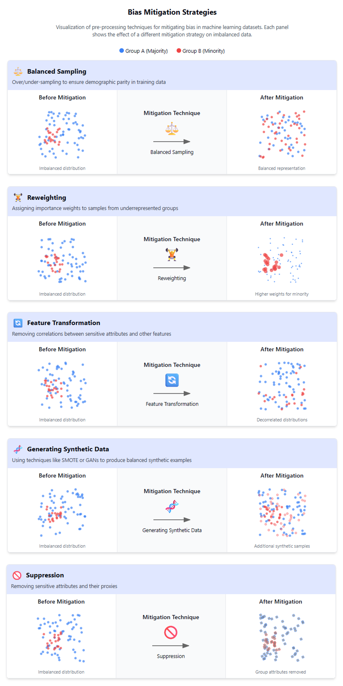

# Detecting and Mitigating Bias


## Introduction

Like performance bottlenecks or security vulnerabilities, bias often hides in seemingly neutral code and data transformations. Software developers readily debug logic errors and optimize algorithms, but identifying and fixing bias requires extending these skills into new territory. When left unchecked, biased systems can silently exclude user segments, amplify historical inequities, or produce discriminatory outcomes—all while appearing to function correctly by traditional metrics.

What makes bias detection particularly challenging is its distributed nature: it can infiltrate systems at data collection, preprocessing, model training, or deployment stages. This lesson provides systematic techniques to detect bias across your data pipeline, measure its impact quantitatively, and implement targeted mitigations—treating bias detection as an essential component of quality software development.


## Learning Outcomes

By the end of this lesson, you will be able to:

1. Differentiate between cognitive, statistical, and algorithmic biases in data systems by identifying their distinct sources, mechanisms, and manifestations.
2. Evaluate datasets for sampling and selection biases using statistical methods like distribution comparison, representativeness testing, and demographic parity analysis.
3. Implement techniques to detect measurement and processing biases in data pipelines through pre/post transformation analysis and feature correlation monitoring.
4. Utilize fairness metrics such as demographic parity, equal opportunity, and equalized odds to quantify bias in machine learning models.
5. Design appropriate bias mitigation strategies including pre-processing techniques, in-processing constraints, and post-processing adjustments across the analytics lifecycle.


## Differentiating Types of Bias

### Understanding Bias Taxonomies

When debugging code, we distinguish between syntax errors (won't compile), logic errors (compiles but wrong behavior), and integration bugs (components don't work together). Similarly, we need to differentiate between types of bias to apply the right fixes.

**Cognitive bias** originates in human judgment and decision-making processes. This manifests when data scientists select features based on preconceptions or when stakeholders interpret results according to their expectations. It's the human element in the pipeline.

**Statistical bias** refers to systematic errors in sampling or estimation that cause expected values to deviate from true population values. Think of this as selection bias in your test cases—if you only test the happy path, you'll miss edge cases.

**Algorithmic bias** occurs when a model produces systematically different outputs for different groups, often amplifying historical inequities. This is like having a logic error that only affects certain code paths.

These biases form a hierarchy of causation: cognitive biases lead to statistical biases in our collection methods, which lead to algorithmic biases in our models.

```python
// Simplified bias propagation chain
function developSystem() {
    let cognitiveAssumptions = developersAssumptions();
    let dataset = collectData(cognitiveAssumptions); // Statistical bias introduced
    let model = trainModel(dataset); // Algorithmic bias emerges
    return deploySystem(model); // Impacts real users
}
```


The distinction matters because mitigation approaches differ: cognitive bias requires awareness training and diverse teams; statistical bias requires sampling techniques and data augmentation; algorithmic bias requires fairness constraints and model adjustments.

Importantly, algorithmic bias isn't necessarily a flaw in the algorithm itself but rather in how the algorithm interacts with biased data. Machine learning systems effectively learn to replicate and sometimes amplify the biases present in their training data. A technically perfect algorithm trained on historically biased hiring decisions will learn to replicate those biases, not because of a coding error but because of the data it consumes.

Understanding these distinctions also helps with root cause analysis. When investigating a model that shows disparate performance across demographic groups, the instinct might be to tweak model parameters. However, if the underlying issue is a sampling bias in data collection, no amount of model tuning will solve the problem. You need to address the bias at its source—much like how fixing a memory leak requires addressing the allocation issue rather than just adding more RAM.

These bias categories also map to different stages of the development lifecycle. Cognitive biases impact requirements gathering and feature selection; statistical biases affect data collection and preparation; algorithmic biases emerge during modeling and persist through deployment. Having this taxonomy allows teams to implement appropriate quality control checkpoints at each stage.


### Real-world Examples of Bias Types

Let's analyze a facial recognition system that performs worse on darker-skinned individuals:

1. **Cognitive bias**: Development team might have unconsciously considered their own demographic's user stories as the primary use cases, neglecting diverse testing scenarios.

2. **Statistical bias**: Training dataset likely contained fewer examples of darker-skinned faces, creating a sampling bias that skews model performance.

3. **Algorithmic bias**: The trained model has learned to optimize accuracy for the majority group, resulting in higher error rates for minority groups.

If we approach this only as an algorithmic problem by tweaking model parameters, we miss the root causes in data collection and team composition.

This problem manifests across numerous real-world systems. Gender-detection systems like those used in marketing analytics often misclassify non-binary individuals or those who don't conform to traditional gender presentations. Healthcare algorithms have been found to allocate less care to Black patients than white patients with the same level of need, because they used healthcare costs (which are historically lower for Black patients due to systemic barriers to access) as a proxy for healthcare needs.

The key insight is that these biases cascade. A healthcare system isn't intentionally programmed to discriminate—it's learning from historically biased decisions and data collection practices. Without intervention at multiple levels, technical systems tend to calcify existing inequalities rather than reduce them.

Consider financial lending algorithms: cognitive biases might lead developers to select features like zip code (which correlates with race in many regions due to historical redlining); this creates a statistically biased dataset; and the resulting algorithmic decisions perpetuate disadvantages for certain communities. This same pattern appears across domains from criminal justice to education to employment.

The importance of distinguishing between these bias types becomes particularly clear when legal and compliance issues arise. Anti-discrimination laws often focus on disparate impact rather than intention—the effect of decisions rather than the thought process behind them. Understanding the full chain of bias causation helps organizations implement appropriate safeguards at each stage.


## Analyzing Datasets for Sampling Bias

### Statistical Methods for Bias Detection

Sampling bias is like having a test suite that only checks edge cases or only happy paths—neither gives you confidence in your system's behavior. To detect it, we need to compare our sample to a reference population and look for discrepancies.

A fundamental method is **distribution comparison**. We analyze whether the distribution of sensitive attributes (gender, race, age) in our dataset matches expectations based on the target population. Think of this as checking whether your load test properly represents real-world traffic patterns.

**Representation diagram**: Imagine a 3x3 grid showing your sample data versus population data across key demographic dimensions. Each cell contains density plots for comparison. Divergent cells highlight potential underrepresentation or overrepresentation that could lead to biased model outputs.





> **Representation diagram**
> 
> This diagram compares sample and population distributions across demographic dimensions. The diagonal cells (Age×Age, Income×Income, Education×Education) show distribution comparisons for each individual dimension, while off-diagonal cells show relationships between dimensions. Red-highlighted cells indicate where sample distributions differ significantly from population distributions, suggesting potential sampling bias that could affect model outputs.


For numerical verification, we typically use:

1. **Chi-square tests** to assess if categorical distributions in your sample match expected population distributions.

2. **K-S tests (Kolmogorov-Smirnov)** to determine if continuous distributions differ significantly.

3. **Propensity scoring** to identify which samples are over/under-represented.

When no reference population is available, unsupervised methods like **cluster analysis** can reveal potential gaps in representation by identifying isolated or sparse regions in feature space.

Distribution comparison should extend beyond simple univariate analysis. While checking that your gender distribution matches the population is necessary, it's not sufficient. You need to examine intersectional characteristics—for example, whether age distributions are consistent across different gender or ethnic groups. A dataset might have appropriate proportions of both young people and women, but still underrepresent young women specifically.

Temporal factors are equally important in sampling bias detection. Data collected during business hours might underrepresent shift workers; annual surveys might miss seasonal patterns; models trained on pre-pandemic behavior may fail in post-pandemic contexts. Comparing distributions across different time periods can reveal contextual biases that would otherwise remain hidden.

Geographic distribution analysis is another critical tool. In digital systems with global reach, subtle sampling biases can emerge from infrastructure differences. Users with slow internet connections are less likely to complete long surveys; certain regions may have lower smartphone penetration, leading to selection bias in mobile app data. Plotting response rates by region and correlating with infrastructure metrics can expose these hidden patterns.

For highly dimensional data, dimensionality reduction techniques like t-SNE or UMAP can help visualize the overall distribution of samples and identify areas where certain groups cluster or are absent. These visualizations can reveal sampling gaps that aren't apparent in simpler metrics.

It's also important to analyze missing data patterns across groups. If certain demographic groups have systematically higher rates of missing values for particular features, this indicates a form of sampling bias that can propagate through your pipeline. Techniques like Little's MCAR test can help determine if data is missing completely at random or follows patterns that might introduce bias.


### Implementing Representativeness Tests

Let's implement a basic representation test on a loan application dataset:

```python

# Example: Testing demographic parity in loan dataset

import pandas as pd
from scipy import stats

# Load dataset
df = pd.read_csv('loan_applications.csv')

# Compare gender distribution to expected population values
gender_counts = df['gender'].value_counts(normalize=True)
expected_dist = {'M': 0.49, 'F': 0.51}  # Population statistics

# Chi-square test for significant differences
observed = [gender_counts.get('M', 0) * len(df), gender_counts.get('F', 0) * len(df)]
expected = [expected_dist['M'] * len(df), expected_dist['F'] * len(df)]

chi2, p_value = stats.chisquare(observed, expected)

# Output results
print(f"Chi-square statistic: {chi2:.2f}, p-value: {p_value:.4f}")

if p_value < 0.05:
    print("⚠️ Gender representation in sample differs from population!")
    print(f"Sample: {dict(gender_counts)}")
    print(f"Expected: {expected_dist}")

```

This basic test can be extended to multiple dimensions and features. The key is having reliable reference data about your target population.

Beyond simple representation tests, progressive organizations implement more sophisticated sampling bias detection strategies. One approach is creating a "bias bounty" program similar to security bug bounties, where team members or external researchers can flag potential sampling issues in datasets before they propagate through models.

Another strategy is automated dataset validity testing as part of the CI/CD pipeline. Just as integration tests verify functional correctness, distribution tests can compare new data samples against known population distributions and flag significant deviations before they reach production systems.

Some organizations use synthetic data techniques to stress-test models by artificially creating demographically balanced datasets to compare with results from real-world data. Significant performance differences between synthetic and real data can highlight sampling biases that weren't detected through more traditional methods.

For continuous data collection processes, monitoring systems should track demographic distributions over time, alerting teams when significant shifts occur. This temporal analysis can reveal subtle bias introduction that might otherwise go unnoticed—for example, if an algorithm's feedback loop gradually shifts sampling toward certain groups.


**Case Study: ProPublica COMPAS Analysis**

ProPublica's investigation of the COMPAS recidivism prediction tool revealed racial bias in predictions. Their analysis compared false positive rates between black and white defendants, finding a significant disparity (45% vs 23%). The key insight wasn't just comparing overall accuracy, but measuring fairness metrics across subgroups—a critical sampling bias detection technique that revealed a two-tiered system of justice.

This investigation demonstrated the power of journalistic approaches to bias detection—comparing algorithmic predictions against real-world outcomes tracked over time. The research team needed to collect additional data beyond what was provided in the original dataset, tracking actual recidivism rates to evaluate the algorithm's predictions. This revealed that the algorithm wasn't just making random errors but was systematically overestimating risk for Black defendants.

What makes this case particularly instructive is that traditional accuracy metrics showed the algorithm performed reasonably well overall. Only by disaggregating results by demographic groups and examining specific error types (false positives vs. false negatives) did the bias pattern emerge. This highlights why representation testing must go beyond simple distribution matching to examine error distributions across groups.

## Detecting Measurement and Processing Biases

### Data Pipeline Audit Techniques

Measurement and processing biases occur when our data transformations systematically alter the relationships between variables in ways that disadvantage certain groups. This is conceptually similar to side effects in functions that alter global state—it's a hidden source of errors.


**Data pipeline bias diagram**: Visualize a flow diagram with data entering a pipeline containing multiple transformation stages (cleaning, imputation, normalization, encoding). At each stage, certain datapoints change position or are filtered out. Lines trace how demographic groups (colored differently) move through this pipeline, showing where disparities emerge.





> **Data Pipeline Bias Diagram**
> 
> This diagram traces how data from different demographic groups (represented by colored points) flows through various processing stages. Note how the points shift position and some disappear at each stage, representing how transformation steps can introduce bias. Group C (green) experiences the most significant data loss and distributional shift, while Group A (blue) remains relatively stable.
> 
> Key issues visible in this pipeline:
> - Disproportionate data removal during cleaning and imputation stages
> - Systematic position shifts (distributional changes) during normalization
> - Progressive underrepresentation of minority groups through the pipeline


Key detection techniques include:

1. **Pre/post transformation analysis**: Measure distributions before and after each processing step, particularly across sensitive attributes. Look for disproportionate changes.

2. **Missing value impact assessment**: Analyze patterns of missingness to determine if they correlate with sensitive attributes.

3. **Feature correlation drift**: Monitor how correlations between features change during processing, especially correlations with protected attributes.

4. **Data leakage detection**: Identify proxies for sensitive attributes that might persist after removing the direct attributes (e.g., zip code as proxy for race).

Effective auditing requires implementing measurement points throughout your pipeline rather than just at input and output.

Processing bias often remains hidden because engineers treat transformation steps as neutral technical procedures rather than potential sources of bias. In reality, every transformation embeds assumptions that may disadvantage certain groups. For example, standard imputation methods like mean-filling might work well for majority groups but poorly for minority groups with different distribution patterns.

Feature engineering steps deserve particular scrutiny. Derived features that combine multiple base features can encode biases in subtle ways. For instance, a "customer lifetime value" calculation might systematically undervalue certain customer segments if their purchasing patterns differ from the majority. Threshold-based feature transformations can similarly introduce bias when thresholds are chosen based on majority-group patterns.

Natural language processing pipelines are especially susceptible to processing bias. Text normalization steps like stemming or lemmatization may work differently across dialects or sociolects; sentiment analysis algorithms often show different accuracy rates for text produced by different demographic groups. Tokenization can even introduce bias when certain cultural expressions are improperly segmented.

Temporal aspects of processing are another common source of bias. Time-window features (like "purchases in the last 30 days") may disadvantage users with different usage patterns. Seasonal adjustments based on majority-culture calendars may miss important variations for different groups. Recency weighting in features can amplify existing advantage/disadvantage cycles.

Auditing should also examine mathematical transformations like normalization and scaling. Z-score normalization assumes normally distributed data, which may not hold across all subgroups. Min-max scaling can amplify outliers, which may disproportionately impact certain groups. Log transformations may have different effects on groups with different base distributions.

Importantly, processing biases can occur even when the initial dataset is perfectly representative. A balanced dataset can become imbalanced through seemingly innocent transformations. This highlights the need for continuous monitoring throughout the pipeline rather than simply validating the input and output.

### Implementing Bias Detection Tools

Here's a technique to detect preprocessing bias in a data pipeline:

```python
# Track distribution shifts across pipeline stages

import pandas as pd
import numpy as np
from scipy import stats

def measure_preprocessing_impact(data_before, data_after, sensitive_attr='gender', features=None):
    """Measure how preprocessing affects different demographic groups."""
    
    if features is None:
        features = [col for col in data_before.columns if col != sensitive_attr]
    
    results = []
    groups = data_before[sensitive_attr].unique()
    
    for feature in features:
        for group in groups:
            before_dist = data_before[data_before[sensitive_attr] == group][feature]
            after_dist = data_after[data_after[sensitive_attr] == group][feature]
            
            # Skip if not enough data
            if len(before_dist) < 10 or len(after_dist) < 10:
                continue
            
            # Measure distribution shift
            if before_dist.dtype.kind in 'ifc':  # Numeric feature
                # Shift in mean as percentage
                mean_shift = ((after_dist.mean() - before_dist.mean()) /
                            (before_dist.mean() if before_dist.mean() != 0 else 1))
                
                results.append({
                    'feature': feature,
                    'group': group,
                    'mean_shift': mean_shift,
                    'significant': abs(mean_shift) > 0.1  # Arbitrary threshold
                })
    
    return pd.DataFrame(results)

# Usage example
raw_data = pd.read_csv('raw_data.csv')
processed_data = preprocess_pipeline(raw_data)  # Your preprocessing function
impact_report = measure_preprocessing_impact(raw_data, processed_data)

# Identify concerning shifts
biased_processing = impact_report[impact_report['significant']]
print(biased_processing)
```

This function compares feature distributions before and after preprocessing, by demographic group, to identify disparate impacts. You should extend this with more sophisticated distribution comparison techniques for production use.

Advanced implementations might track multiple statistics beyond simple means—variance changes, quantile shifts, or changes in correlation structures can reveal more subtle processing biases. Measuring Earth Mover's Distance or Jensen-Shannon divergence between before/after distributions provides a more comprehensive view of distribution changes than simple metrics.

Beyond simple detection, robust bias monitoring includes visualization tools that help engineers understand the nature and source of detected biases. Dimensionality reduction techniques like PCA can visualize how different preprocessing steps transform the feature space differently for different groups. Counterfactual analysis—testing how data points would be transformed if their sensitive attributes were different—can reveal subtle disparities.

For streaming data pipelines, drift detection becomes particularly important. Concept drift detectors can be stratified by demographic group to identify when a processing step begins affecting one group differently than others. These tools should include alerting mechanisms that notify engineers when drift patterns differ significantly across groups.

Codifying these detection tools into automated testing frameworks ensures consistent application. Just as unit tests verify functional correctness, "fairness unit tests" can verify that each processing component maintains appropriate distribution characteristics across demographic groups. These tests can use synthetic data with known characteristics to validate transformation behavior under controlled conditions.

Finally, effective bias detection requires collaborative review across disciplines. Engineers may spot technical anomalies, while domain experts and ethicists can help interpret their significance. Regular pipeline reviews with diverse stakeholders help ensure that subtle processing biases don't go unnoticed due to disciplinary blind spots.


## Applying Fairness Metrics

### Quantitative Fairness Measures

Just as we use metrics like precision, recall, and F1-score to evaluate model performance, we need fairness metrics to evaluate bias. The challenge is that fairness itself has multiple definitions that can be mathematically incompatible.


**Fairness metrics diagram**: Picture a 2×2 confusion matrix for each demographic group, with arrows connecting corresponding cells between matrices. Arrows highlight where differences in false-positive or false-negative rates constitute fairness violations. Different fairness metrics focus on different cells or ratios between these matrices.

Key fairness metrics include:

1. **Demographic Parity**: Equal positive prediction rates across groups.
   - Math: P(Ŷ=1|A=a) = P(Ŷ=1|A=b) for groups a and b


2. **Equal Opportunity**: Equal true positive rates across groups.
   - Math: P(Ŷ=1|Y=1,A=a) = P(Ŷ=1|Y=1,A=b)


3. **Equalized Odds**: Equal true positive and false positive rates across groups.
   - Combines equal opportunity with equal false positive rates


4. **Predictive Parity**: Equal positive predictive values across groups.
   - Math: P(Y=1|Ŷ=1,A=a) = P(Y=1|Ŷ=1,A=b)





> **Fairness Metrics Diagram**
>
> This diagram shows confusion matrices for two demographic groups and illustrates how different fairness metrics compare values between them. **Hover over each metric** to see the relevant cells highlighted in the confusion matrices.
>
> - **Demographic Parity:** Compares overall positive prediction rates (TP+FP)
> - **Equal Opportunity:** Compares true positive rates (TP/TP+FN)
> - **Equalized Odds:** Compares both true positive and false positive rates
> - **Predictive Parity:** Compares positive predictive values (TP/TP+FP)
>
> As shown in the metrics, it's mathematically impossible to satisfy all fairness criteria simultaneously when base rates differ between groups.


The right metric depends on your application context. For criminal justice, equal opportunity might be paramount; for loan approval, demographic parity might be more appropriate.

The choice of fairness metric fundamentally depends on your ethical framework and application context. This isn't merely a technical decision but a values-based one. For instance, demographic parity (equal positive prediction rates) might seem intuitively fair, but it can lead to problematic outcomes if the base rates genuinely differ between groups. This creates tension between group fairness and individual fairness.

The impossibility theorems in fairness (proven by Kleinberg, Mullainathan, and Raghavan) demonstrate that it's mathematically impossible to simultaneously satisfy multiple reasonable definitions of fairness except in trivial cases. This means organizations must make explicit choices about which fairness criteria matter most for their application, recognizing the inherent tradeoffs.

When implementing fairness metrics, it's crucial to consider intersectional fairness. A model might achieve fairness across gender and fairness across race independently, yet still discriminate against specific intersectional groups like women of color. Measuring fairness along single dimensions can mask these combined effects.

Confidence intervals for fairness metrics are essential but often overlooked. Just as we wouldn't trust a performance metric without understanding its variance, we shouldn't report fairness metrics without confidence bounds. Small subgroup sizes can lead to wide confidence intervals, making it difficult to definitively assess fairness for underrepresented groups.

Beyond simple point-in-time fairness measures, temporal fairness should be considered. Systems can exhibit fairness initially but become unfair over time through feedback loops. For example, a recommendation system might start with balanced exposure across groups but gradually shift toward majority preferences as engagement data accumulates.

The distinction between observed outcomes and counterfactual outcomes adds another layer of complexity. Observed fairness metrics only tell us about what happened, not what would have happened under different circumstances. Causal inference techniques can help estimate counterfactual fairness but require strong assumptions about the underlying data-generating process.

For high-stakes applications, it's important to move beyond binary classifications to probabilistic decisions. This means examining the entire prediction distribution, not just the final classification. Calibration across groups—ensuring that predicted probabilities match empirical outcomes—becomes an important fairness consideration in probabilistic settings.


### Evaluating Model Bias

Here's how to implement basic fairness metrics for model evaluation:

```python
# Calculate fairness metrics across demographic groups

import pandas as pd
import numpy as np
from sklearn.metrics import confusion_matrix

def calculate_fairness_metrics(y_true, y_pred, sensitive_attr):
    """Calculate key fairness metrics across demographic groups."""
    
    groups = np.unique(sensitive_attr)
    metrics = {}
    
    # Overall positive prediction rate
    overall_positive_rate = np.mean(y_pred)
    
    for group in groups:
        group_mask = (sensitive_attr == group)
        group_y_true = y_true[group_mask]
        group_y_pred = y_pred[group_mask]
        
        # Skip if insufficient data
        if sum(group_mask) < 10:
            continue
        
        # Calculate confusion matrix
        tn, fp, fn, tp = confusion_matrix(group_y_true, group_y_pred).ravel()
        
        # Demographic parity (positive prediction rate)
        positive_rate = np.mean(group_y_pred)
        
        # Equal opportunity (true positive rate)
        true_positive_rate = tp / (tp + fn) if (tp + fn) > 0 else 0
        
        # False positive rate
        false_positive_rate = fp / (fp + tn) if (fp + tn) > 0 else 0
        
        # Predictive parity (positive predictive value)
        ppv = tp / (tp + fp) if (tp + fp) > 0 else 0
        
        metrics[group] = {
            'count': sum(group_mask),
            'demographic_parity': positive_rate,
            'demographic_parity_ratio': positive_rate / overall_positive_rate,
            'equal_opportunity': true_positive_rate,
            'false_positive_rate': false_positive_rate,
            'predictive_parity': ppv
        }
    
    # Convert to DataFrame for easier comparison
    return pd.DataFrame.from_dict(metrics, orient='index')

# Usage example
fairness_report = calculate_fairness_metrics(
    y_true=test_df['actual_outcome'],
    y_pred=model.predict(test_features),
    sensitive_attr=test_df['gender']
)

print(fairness_report)
```

This function calculates multiple fairness metrics across demographic groups, allowing you to identify disparities. In production, you'd want to add statistical significance tests and confidence intervals.

Production-grade fairness evaluation systems go beyond these basic metrics to implement more sophisticated analyses. One approach is fairness evaluation across multiple operating thresholds, generating ROC and precision-recall curves for each demographic group. Differences in AUC or average precision between groups indicate systematic performance disparities that simple threshold adjustments won't fix.

Another advanced technique is sensitivity analysis—evaluating how fairness metrics change when different features are included or excluded. This helps identify which features contribute most to unfairness and provides insights for targeted mitigation strategies. Feature importance methods stratified by demographic group can reveal whether the model relies on different features for different groups.

For text and image models, interpretation techniques like LIME or SHAP can be applied separately to different demographic groups to compare explanation patterns. Systematic differences in feature attributions may indicate the model is using different logic paths for different groups, potentially resulting in unfair outcomes.

When working with limited data for minority groups, bootstrap resampling can help quantify uncertainty in fairness metrics. By repeatedly sampling with replacement and calculating fairness metrics on each bootstrap sample, you can generate empirical confidence intervals that account for sample size limitations.

For ongoing monitoring, fairness control charts (similar to statistical process control charts) can track fairness metrics over time, with control limits indicating when variations exceed expected statistical fluctuations. This helps distinguish between random variation and systematic fairness degradation.

Ultimately, the most robust approach combines multiple fairness metrics with uncertainty quantification, interpretation tools, and sensitivity analyses. No single metric captures all dimensions of fairness, making multi-metric dashboards essential for comprehensive bias evaluation.


## Designing Bias Mitigation Strategies

### Pre-processing Mitigation Techniques

Think of bias mitigation like defensive programming—we need strategies at each stage of our pipeline. Pre-processing techniques address bias before model training begins.


**Mitigation strategy diagram**: Visualize a three-column diagram showing "Before Mitigation" (imbalanced data represented by scattered points colored by group), "Mitigation Technique" (transformation operation like reweighting or augmentation), and "After Mitigation" (balanced distribution of points). Arrows connect data from before/after states through the appropriate technique.

Key pre-processing strategies include:

1. **Balanced sampling**: Over/under-sampling to ensure demographic parity in training data.

2. **Reweighting**: Assigning importance weights to samples from underrepresented groups.

3. **Feature transformation**: Removing correlations between sensitive attributes and other features.

4. **Generating synthetic data**: Using techniques like SMOTE or GANs to produce balanced synthetic examples.

5. **Suppression**: Removing sensitive attributes and their proxies (though this can backfire if the model needs them for legitimate distinctions).





> **Mitigation Strategy Diagram**
>
> Each row shows a different bias mitigation technique. The "Before Mitigation" column shows imbalanced data with more points from Group A (majority) than Group B (minority). The "After Mitigation" column shows how each technique addresses this imbalance:
>
> - **Balanced Sampling:** Creates equal representation by under/over-sampling.
> - **Reweighting:** Assigns higher importance weights to minority samples (shown by larger circles).
> - **Feature Transformation:** Removes correlation between group membership and feature distribution.
> - **Synthetic Data:** Generates additional synthetic samples (lighter color) for the minority group.
> - **Suppression:** Removes group attributes (shown as gray circles with colored outlines).
>
> As noted in the passage, each technique has its own strengths and weaknesses, and often combining multiple approaches yields the best results while avoiding the pitfalls of any single method.


The right approach depends on your dataset characteristics and fairness goals. Often, combining multiple techniques yields the best results.

While these techniques are powerful, their implementation requires careful consideration. Balanced sampling approaches like oversampling can lead to overfitting on minority groups if not carefully regulated. Simple duplication of samples doesn't add information and may cause the model to memorize specific examples rather than learn generalizable patterns. More sophisticated techniques like SMOTE (Synthetic Minority Over-sampling Technique) create synthetic samples by interpolating between existing minority samples, but these can introduce unrealistic data points if the feature space is complex.

Reweighting strategies require calibration to avoid overcorrection. Too aggressive weighting can cause minority group samples to dominate the learning process, potentially reducing overall accuracy. Adaptive weighting schemes that adjust weights based on model performance can help balance fairness improvements against accuracy preservation.

Feature transformation methods like adversarial debiasing and fair representations aim to create embeddings that preserve predictive information while removing correlations with protected attributes. However, these approaches often require careful hyperparameter tuning and can be computationally expensive. They also struggle with intersectional fairness when multiple protected attributes interact.

Generating synthetic data presents another avenue for bias mitigation. Techniques range from simple perturbation methods to sophisticated generative models like GANs (Generative Adversarial Networks) and diffusion models. These approaches can create diverse synthetic samples that help balance dataset distributions without the overfitting risks of simple oversampling. However, generative models may inadvertently learn and reproduce biases from the original data if not carefully designed.

The suppression approach—removing sensitive attributes and their proxies—seems straightforward but often fails in practice due to redundant encoding. Modern ML models can reconstruct protected attributes from seemingly unrelated features with surprising accuracy. More sophisticated approaches involve causal modeling to identify and transform only the features that causally mediate discriminatory effects.

For all these techniques, rigorous evaluation is essential. Pre-processing methods should be validated not just on fairness metrics but also on performance preservation across groups. A common pitfall is improving fairness at the cost of substantially degraded performance for certain groups, which may create new forms of harm.


### In-processing and Post-processing Approaches

Beyond pre-processing, we can mitigate bias during model training (in-processing) or after prediction (post-processing):

**In-processing techniques**:

- **Adversarial debiasing**: Train the model to maximize prediction accuracy while minimizing ability to predict sensitive attributes.

- **Fairness constraints**: Add fairness metrics as regularization terms in the objective function.

- **Fair representations**: Learn intermediate representations that maintain predictive power while obscuring protected attributes.

**Post-processing techniques**:

- **Threshold adjustment**: Use different decision thresholds for different groups to equalize error rates.

- **Calibration**: Adjust prediction probabilities to ensure calibration across groups.

- **Rejection option**: Identify and manually review cases near the decision boundary.

Here's a practical example of threshold adjustment:

```python
import numpy as np

def adjust_thresholds_for_equal_opportunity(y_true, y_score, sensitive_attr):
    """Find thresholds that give equal true positive rates across groups."""
    
    groups = np.unique(sensitive_attr)
    thresholds = {}
    
    # Calculate overall TPR at default threshold (0.5)
    y_pred_default = (y_score >= 0.5).astype(int)
    overall_tpr = sum((y_true == 1) & (y_pred_default == 1)) / sum(y_true == 1)
    target_tpr = overall_tpr
    
    # Find threshold for each group that matches target TPR
    for group in groups:
        group_mask = (sensitive_attr == group)
        group_y_true = y_true[group_mask]
        group_y_score = y_score[group_mask]
        
        # Skip groups with no positive examples
        if sum(group_y_true == 1) == 0:
            thresholds[group] = 0.5
            continue
        
        # Try different thresholds
        best_threshold = 0.5
        best_tpr_diff = float('inf')
        
        for threshold in np.arange(0.01, 0.99, 0.01):
            group_y_pred = (group_y_score >= threshold).astype(int)
            group_tpr = sum((group_y_true == 1) & (group_y_pred == 1)) / sum(group_y_true == 1)
            tpr_diff = abs(group_tpr - target_tpr)
            
            if tpr_diff < best_tpr_diff:
                best_tpr_diff = tpr_diff
                best_threshold = threshold
        
        thresholds[group] = best_threshold
    
    return thresholds
```


In-processing techniques integrate fairness considerations directly into model training, creating models that inherently produce fairer predictions. Adversarial debiasing uses an adversarial network architecture with two components: a predictor that attempts to make accurate predictions, and an adversary that attempts to predict protected attributes from the predictor's internal representations. The predictor is trained to maximize prediction accuracy while minimizing the adversary's ability to discriminate protected groups, effectively learning representations that are both predictive and fair.

Fairness constraints methods reformulate the learning objective to include fairness terms alongside traditional accuracy measures. For example, prejudice remover regularization adds a discrimination-aware regularization term to the loss function, penalizing mutual information between predictions and sensitive attributes. Similarly, constrained optimization approaches like Learning Fair Representations find model parameters that maximize accuracy subject to formal fairness constraints.

Fair representations techniques transform the input data into a new feature space where protected attributes cannot be predicted, while preserving other information needed for the prediction task. These can be implemented using variational autoencoders, adversarial networks, or disentangled representations that separate sensitive information from task-relevant information.

Post-processing techniques modify a model's outputs rather than its internal structure or training process. They're appealing because they can be applied to black-box models without retraining, making them practical for legacy systems or third-party models. Threshold adjustment (as shown in the code example) is conceptually simple but powerful, allowing different decision thresholds for different groups to equalize error rates.

Calibration techniques ensure that predicted probabilities match empirical outcomes across groups. Platt scaling, isotonic regression, or beta calibration can be applied separately to different demographic groups to ensure that a predicted probability of 0.7 means the same thing regardless of group membership.

Rejection option classifiers identify cases near the decision boundary—where classification uncertainty is highest—and defer these to human review. This creates a three-way classification (positive, negative, uncertain) rather than a binary one, helping to mitigate bias in high-stakes scenarios by adding extra scrutiny to difficult cases.


**Case Study: Boston Housing Price Dataset**

Researchers found that a model predicting housing prices had significantly higher error rates for neighborhoods with high minority populations. They implemented a multi-pronged approach: (1) resampling to balance neighborhood representation, (2) adding fairness constraints to the model's loss function, and (3) implementing continuous monitoring of prediction disparities. This reduced the error gap between demographic groups by 67% while maintaining overall prediction accuracy.

This case illustrates the effectiveness of combining multiple mitigation strategies. Rather than relying solely on pre-processing, in-processing, or post-processing, the researchers integrated fairness considerations throughout the modeling lifecycle. The resampling strategy addressed representation issues in the training data; the modified loss function ensured that the model's optimization directly accounted for fairness objectives; and the monitoring system provided ongoing feedback about fairness metrics, enabling continuous improvement.

The researchers also found that targeting the right fairness metric was crucial. Initial attempts focused on equalizing average error across neighborhoods, but this didn't address the structural issues. By specifically measuring and optimizing for the gap in relative errors between minority and non-minority neighborhoods, they made more substantial progress.

Perhaps most importantly, the team engaged with domain experts and community representatives to understand the real-world impact of prediction errors in different contexts. This helped them prioritize certain types of errors over others, leading to more nuanced fairness objectives that better aligned with community needs.


## Key Takeaways

- Bias is a systematic issue that manifests at all stages of the data pipeline—from collection to modeling to deployment.

- Understanding the taxonomy of bias types helps target mitigation strategies appropriately.

- Statistical methods for detecting sampling bias can reveal representation issues before they propagate to model outputs.

- Pipeline auditing catches measurement and processing biases that might otherwise remain hidden.

- Fairness metrics provide quantifiable measures of model bias, but require context-specific interpretation.

- Effective mitigation strategies address bias at multiple pipeline stages and often combine techniques.


## Conclusion

In this lesson, we've established a systematic approach to bias detection and mitigation throughout the data engineering lifecycle. We've explored how to differentiate between cognitive, statistical, and algorithmic biases; analyze datasets for sampling issues; audit data pipelines for processing biases; apply appropriate fairness metrics; and implement targeted mitigation strategies at different stages. 

These techniques transform bias detection from an ad-hoc concern into a structured engineering practice integrated with your development workflow. As we move into our next lesson on data ethics and privacy, you'll build on this foundation by exploring broader ethical frameworks for responsible data handling. 

The regulatory requirements like GDPR and CCPA, anonymization techniques, and ethical considerations in data sharing all connect directly to the bias concerns we've addressed. Detecting and mitigating bias represents just one dimension of building truly responsible data systems—a practice that requires ongoing vigilance and adaptation as data, models, and society evolve.


## Glossary

- **Algorithmic bias**: Systematic errors in model outputs that disproportionately impact certain groups

- **Demographic parity**: Equal positive prediction rates across demographic groups

- **Disparate impact**: Legal concept measuring adverse effect on protected groups, often defined as impact ratio < 0.8

- **Equal opportunity**: Fairness metric requiring equal true positive rates across groups

- **Statistical bias**: Systematic error in sampling or estimation methods

- **Proxy variable**: Feature that correlates with protected attributes and can perpetuate discrimination

- **Fairness-accuracy tradeoff**: The often-observed tension between optimizing for predictive performance and demographic fairness

- **Intersectional bias**: Discrimination that affects people belonging to multiple marginalized groups in unique ways

- **Feedback loop**: Process where biased predictions influence future data collection, potentially amplifying existing biases