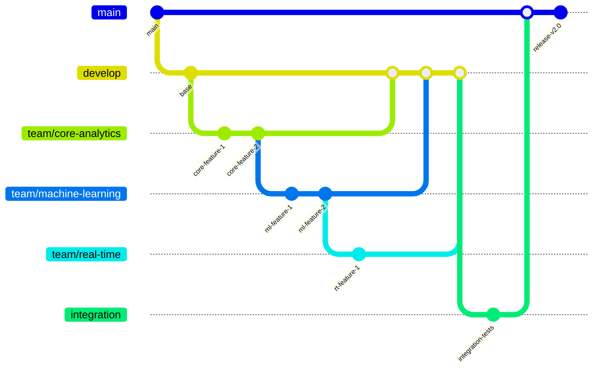

# Documentation and Handoff Preparation

## Introduction

The frustration of inheriting undocumented code is universal across development domains, but in data engineering, the stakes are significantly higher. When application code lacks documentation, developers waste time reverse-engineering functionality. When dimensional models lack proper documentation, organizations make incorrect business decisions that directly impact revenue and strategy. 

Beyond just writing SQL, professional data engineers establish clear documentation, visual representations, and version control practices that make their work understandable, maintainable, and trustworthy. These practices aren't merely professional courtesies—they're risk management strategies that protect business operations and enable collaboration. Let's explore the essential documentation and handoff practices that will distinguish you as a professional data engineer rather than just someone who writes queries.

## Learning Outcomes

By the end of this lesson, you will be able to:

1. Implement comprehensive data dictionaries for dimensional models that capture technical metadata, business context, and documentation standards for effective team collaboration.
2. Evaluate dimensional model designs through visualization techniques to validate relationships, identify potential issues, and communicate effectively with both technical and business stakeholders.
3. Apply version control workflows to database development artifacts using proper script organization, change tracking, and collaborative review processes for sustainable schema evolution.

## Implementing Comprehensive Data Dictionaries

### Data Dictionary Structure and Organization

**Focus:** Creating standardized documentation frameworks for dimensional models

In Java development, you've worked with JavaDoc to document classes and methods. Data dictionaries serve a similar purpose for database objects, but with more structure and business context.

A data dictionary is a centralized repository of information about your data assets. For dimensional models, your data dictionary needs to be comprehensive yet accessible. Let's look at what makes an effective data dictionary structure:

#### Industry-Standard Components

A well-structured data dictionary typically includes:

1. **Table Information**:
   - Table name
   - Description/purpose
   - Owner/steward
   - Update frequency
   - Row count estimate

2. **Column Details**:
   - Column name
   - Data type and length
   - Primary/foreign key status
   - Nullable status
   - Description
   - Business rules

3. **Relationship Information**:
   - Parent/child tables
   - Cardinality
   - Enforcement method

Here's a simple template you can use:

```
TABLE: [Table Name]
DESCRIPTION: [Business purpose of the table]
SUBJECT AREA: [Business domain]
REFRESH FREQUENCY: [How often the data is updated]
OWNER: [Business/technical owner]

COLUMNS:
| Column Name | Data Type | PK/FK | Nullable | Description | Business Rules |
|-------------|-----------|-------|----------|-------------|----------------|
| id          | INT       | PK    | No       | Surrogate key | Auto-increment |
| name        | VARCHAR(50)| No   | No       | Customer name | Proper case   |
```

#### Organization by Business Domain

Organize your data dictionary by subject areas that align with business domains:

- Customer
- Product
- Sales
- Inventory
- Finance

This organization helps business users find relevant tables quickly. It also creates a natural boundary for documentation ownership.

#### Balancing Technical Detail and Accessibility

A good data dictionary serves both technical and business users:

- Use clear, non-technical language in descriptions
- Avoid jargon when possible
- Include examples for complex concepts
- Link technical metadata to business glossary terms

When interviewing for data engineering roles, you'll often be asked how you make technical information accessible to business users. A well-organized data dictionary demonstrates this skill.

### Metadata Capture for Facts and Dimensions

**Focus:** Documenting the technical aspects of dimensional models

In the star schema lessons, you learned how fact and dimension tables serve different purposes. Their documentation needs are also different.

#### Essential Metadata for Fact Tables

Fact tables require these specific documentation elements:

1. **Grain Statement**: Define exactly what each row represents
   ```
   "Each row represents one product sale transaction at a store register"
   ```

2. **Measures Documentation**:
   - Measure name
   - Business definition
   - Calculation formula
   - Aggregation rules (SUM, AVG, COUNT, etc.)
   - Units of measure

3. **Dimension References**:
   - Which dimensions can be used to filter/group this fact
   - Foreign key relationships
   - Special handling (e.g., slowly changing dimensions)

Here's a fact table metadata example:

```
FACT TABLE: fact_Sales
GRAIN: One row per product per transaction
SUBJECT AREA: Sales

MEASURES:
| Measure Name | Definition | Formula | Aggregation | Units |
|--------------|------------|---------|-------------|-------|
| SalesAmount  | Total sales value | Quantity * UnitPrice | SUM | USD |
| Quantity     | Number of units sold | N/A | SUM | Count |
| Discount     | Discount applied | SalesAmount * DiscountPct | SUM | USD |

DIMENSIONS:
| Dimension | Foreign Key | Relationship | Notes |
|-----------|-------------|--------------|-------|
| Customer  | CustomerKey | Many-to-one  | SCD Type 2 |
| Product   | ProductKey  | Many-to-one  | SCD Type 1 |
| Date      | DateKey     | Many-to-one  | N/A |
```

#### Essential Metadata for Dimension Tables

Dimension tables need these documentation elements:

1. **Attribute Documentation**:
   - Attribute name
   - Description
   - Data type
   - Example values
   - Source/derivation

2. **Hierarchy Information**:
   - Hierarchy name
   - Levels (in order)
   - Drill-down path

3. **SCD Type Information**:
   - Which SCD type (1, 2, 3)
   - Which attributes trigger changes
   - Effective date handling

Here's a dimension table metadata example:

```
DIMENSION TABLE: dim_Customer
SUBJECT AREA: Customer
SCD TYPE: Type 2 (Historical tracking)

ATTRIBUTES:
| Attribute Name | Description | Data Type | Example | Source |
|----------------|-------------|-----------|---------|--------|
| CustomerKey    | Surrogate key | INT | 12345 | Generated |
| CustomerID     | Business key | VARCHAR | ABC123 | source.customers |
| Name           | Customer full name | VARCHAR | John Smith | source.customers |
| Segment        | Customer segment | VARCHAR | Premium | Derived from spending |

HIERARCHIES:
| Hierarchy Name | Levels | Description |
|----------------|--------|-------------|
| Geography | Country > State > City | Location hierarchy |

HISTORICAL TRACKING:
| Attribute | Tracked | Notes |
|-----------|---------|-------|
| Name      | Yes     | Track all changes |
| Segment   | Yes     | Business critical |
| Phone     | No      | Not historically relevant |
```

#### Tracking Data Lineage

Document where the data comes from and how it's transformed:

- Source system name
- Extraction method
- Transformation rules
- Loading frequency
- Data quality checks applied

When interviewing, you'll often be asked how you ensure data quality. Being able to track and document data lineage shows you understand this crucial aspect of data engineering.

### Business Context Integration

**Focus:** Connecting technical metadata to business meaning

Technical documentation alone isn't enough. You need to connect your tables and columns to their business meaning.

#### Business Definitions for Measures and KPIs

For each measure in your fact tables, document:

- Business-friendly definition
- How it's used in decision-making
- Who relies on this measure
- Known issues or limitations

Example:
```
MEASURE: Monthly Recurring Revenue (MRR)
BUSINESS DEFINITION: The predictable revenue expected each month from subscription customers
CALCULATION: SUM(SubscriptionPrice) for all active subscriptions
USED BY: Finance team for forecasting, Sales for commission calculations
LIMITATIONS: Does not account for potential churn or upgrades
```

This business context helps everyone understand not just what the data is, but why it matters.

#### Capturing Business Rules

Document the business rules that drive your transformations:

- Filtering conditions (e.g., "Only include completed orders")
- Derivation rules (e.g., "Premium status requires $1000+ spending")
- Classification logic (e.g., "Products are categorized based on department")

Example:
```
BUSINESS RULE: Customer Segmentation
DESCRIPTION: Customers are classified into segments based on spending
LOGIC:
- Premium: Lifetime value > $10,000
- Standard: Lifetime value $1,000-$10,000
- Basic: Lifetime value < $1,000
EFFECTIVE DATE: January 1, 2023
APPROVED BY: Marketing Director
```

#### Documenting Known Issues and Limitations

Be transparent about known data quality issues:

- Missing data patterns
- Known inaccuracies
- Time periods with suspect data
- Special cases or exceptions

Example:
```
KNOWN ISSUE: Customer Address Data
DESCRIPTION: ~15% of customer records have incomplete address information
AFFECTED PERIODS: Most prevalent in records before 2020
WORKAROUND: Use email as primary contact method for affected records
STATUS: In progress - cleanup project scheduled for Q3
```

In job interviews, you might be asked how you handle imperfect data. Showing that you document known issues demonstrates both honesty and professionalism.

## Evaluating Dimensional Models Through Visualization

### Schema Diagram Creation

**Focus:** Techniques to visually represent dimensional models

As a Java developer, you've likely worked with entity-relationship diagrams (ERDs). Schema diagrams for dimensional models are similar but focus on the star schema pattern with fact and dimension tables.

#### SQL Server Tools for Schema Visualization

SQL Server provides built-in tools to generate schema diagrams:

1. **SQL Server Management Studio (SSMS)**:
   - Right-click on a database > "Database Diagrams" > "New Database Diagram"
   - Add the tables you want to visualize
   - SSMS will automatically show primary and foreign key relationships

2. **Third-party options compatible with SQL Server**:
   - DbVisualizer
   - Lucidchart (with database connectors)
   - draw.io (manual creation)

Here's how to create a basic diagram in SSMS:

```
1. Open SSMS and connect to your database
2. Right-click on "Database Diagrams" folder
3. Select "New Database Diagram"
4. Select your fact and dimension tables
5. SSMS will generate the diagram with relationships
6. Rearrange tables: fact table in center, dimensions around it
7. Save the diagram with a descriptive name
```

#### Diagram Standards for Dimensional Models

Follow these standards for clear dimensional model diagrams:

1. **Layout**:
   - Place fact tables in the center
   - Arrange dimension tables around the fact table
   - Group related dimensions together

2. **Color Coding**:
   - Fact tables: one color (often yellow)
   - Dimension tables: another color (often blue)
   - Slowly changing dimensions: a third color or special border

3. **Relationship Lines**:
   - Show foreign key relationships clearly
   - Use different line styles for different types of relationships
   - Indicate cardinality (one-to-many, etc.)

#### Annotation Best Practices

Add these annotations to make your diagrams more useful:

1. **Table Annotations**:
   - Table purpose/description
   - Row count estimate
   - Update frequency

2. **Relationship Annotations**:
   - Nature of relationship
   - Join conditions
   - Filter recommendations

3. **General Diagram Notes**:
   - Subject area/star schema name
   - Author and creation date
   - Version number

Example annotation:
```
FACT TABLE: fact_Sales (12M rows, daily refresh)
PURPOSE: Tracks all product sales transactions
KEY MEASURES: SalesAmount, Quantity, Discount
```

In job interviews, you might be asked to draw a simple star schema. Having a standard approach to diagram creation demonstrates your attention to detail and communication skills.

### Visual Validation Techniques

**Focus:** Using diagrams to verify dimensional model integrity

Visual validation means using your schema diagrams to spot potential issues before implementation. This practice can save hours of debugging later.

#### Identifying Missing Relationships

Use your diagram to check for these relationship issues:

1. **Orphaned Fact Tables**: Fact tables without dimension connections
2. **Incomplete Relationships**: Missing foreign keys
3. **Circular References**: Dimensions that reference other dimensions

Visual check:
```
1. Each measure in your fact table should be analyzed by at least one dimension
2. Every foreign key in the fact table should connect to a dimension
3. Follow each relationship line to ensure it connects to the right table
```

#### Validating Dimension Hierarchies

Check your dimension hierarchies visually:

1. **Completeness**: All levels of the hierarchy exist
2. **Direction**: Hierarchies flow in the correct direction
3. **Granularity**: No skipped levels in the hierarchy

Visual check:
```
1. For a Date dimension, verify Year > Quarter > Month > Day hierarchy
2. For a Product dimension, verify Category > Subcategory > Product hierarchy
3. Ensure each level has appropriate attributes
```

#### Spotting Potential Performance Bottlenecks

Look for these performance warning signs in your diagram:

1. **Too Many Joins**: Fact tables that join to too many dimensions
2. **Overloaded Dimensions**: Dimensions with too many attributes
3. **Missing Aggregates**: Opportunities for summary tables

Visual check:
```
1. Count relationship lines from each fact table (10+ might be problematic)
2. Look for dimensions with 30+ columns (consider splitting)
3. Identify common analysis patterns that might benefit from aggregation
```

During technical interviews, you might be asked to review a schema diagram and identify issues. These validation techniques show you can think critically about database design.

### Stakeholder Communication Through Visualization

**Focus:** Using visuals to explain technical designs to non-technical audiences

As a data engineer, you'll often need to explain your dimensional models to business users. Visual representations make this much easier.

#### Simplifying Complex Models for Business Review

Adapt your technical diagrams for business audiences:

1. **Create simplified versions**:
   - Show only the most important tables
   - Hide technical columns (surrogate keys, etc.)
   - Emphasize business measures and attributes

2. **Use business terminology**:
   - Rename technical column names to business terms
   - Add descriptions in business language
   - Include example data values

Example simplification:
```
TECHNICAL: "fact_transaction JOIN dim_customer ON customer_key"
SIMPLIFIED: "Sales information can be analyzed by customer attributes"
```

#### Highlighting Business Value in Diagrams

Make your diagrams tell a business story:

1. **Annotate with business questions**:
   - "This model answers: Who are our top customers by region?"
   - "Use this fact table to analyze sales trends over time"

2. **Show example reports/dashboards**:
   - Include mockups of potential reports
   - Demonstrate how the model enables specific analyses

3. **Connect to business objectives**:
   - Note which strategic goals this model supports
   - Highlight KPIs that can be calculated

#### Effective Presentation Techniques

When presenting your models to stakeholders:

1. **Progressive disclosure**:
   - Start with a high-level overview
   - Zoom in on specific areas as needed
   - Don't overwhelm with all details at once

2. **Interactive exploration**:
   - Allow stakeholders to ask questions
   - Be prepared to drill into specific tables
   - Show sample data for concrete understanding

3. **Before/after comparisons**:
   - Demonstrate how your model improves existing capabilities
   - Show what new questions can be answered

In job interviews, you might be asked how you communicate with non-technical stakeholders. These visualization techniques demonstrate your ability to bridge the technical-business gap.

## Applying Version Control for Database Development

### Database Objects in Version Control

**Focus:** Structuring database code for effective version control

As Java developers, you're familiar with Git for code version control. The same principles apply to database objects, with some specific considerations.

#### Script Organization for Database Objects

Organize your database scripts with this structure:

1. **Folder hierarchy**:
   ```
   /sql
     /tables
       /fact
       /dimension
     /views
     /stored_procedures
     /functions
     /security
   ```

2. **Naming conventions**:
   ```
   V[version]__[description].sql
   
   Examples:
   V1.0__create_customer_dimension.sql
   V1.1__add_customer_classification.sql
   ```

3. **Object creation order**:
   ```
   4. Schemas
   5. Tables
   6. Constraints
   7. Views
   8. Functions
   9. Stored Procedures
   ```

This organization ensures dependencies are handled correctly and makes it easier to review changes.

#### Managing DDL Scripts in Version Control

Follow these practices for versioning database scripts:

1. **One object per file**:
   - Each table in its own creation script
   - Easier to track changes to specific objects

2. **Idempotent scripts**:
   - Scripts that can run multiple times without errors
   - Use IF EXISTS checks for object creation/modification

Example:
```sql
-- Idempotent table creation
IF NOT EXISTS (SELECT * FROM sys.tables WHERE name = 'dim_Customer')
BEGIN
    CREATE TABLE dim_Customer (
        CustomerKey INT IDENTITY(1,1) PRIMARY KEY,
        CustomerID VARCHAR(50) NOT NULL,
        Name VARCHAR(100) NOT NULL,
        -- other columns
    );
END
```

3. **Change scripts vs. state scripts**:
   - Change scripts: Alter existing objects
   - State scripts: Define the final state of objects

#### Handling Environment-Specific Configurations

Manage different environments (dev, test, prod) with these approaches:

1. **Configuration files**:
   - Store environment-specific values separately
   - Include placeholders in scripts to be replaced during deployment

2. **Conditional execution**:
   ```sql
   IF '$(Environment)' = 'Development'
   BEGIN
       -- Development-specific code
   END
   ELSE IF '$(Environment)' = 'Production'
   BEGIN
       -- Production-specific code
   END
   ```

3. **Post-deployment scripts**:
   - Keep environment-specific configurations in separate scripts
   - Run after main object creation

In job interviews, you'll often be asked about your experience with database version control. These practices demonstrate your understanding of professional database development.

### Schema Evolution Tracking

**Focus:** Managing schema changes over time

Data models evolve as business needs change. Tracking this evolution is crucial for maintenance and troubleshooting.

#### Documenting Schema Changes with Proper Commit Messages

Write clear commit messages that explain:

1. **What changed**:
   - Which objects were modified
   - What attributes/columns changed

2. **Why it changed**:
   - Business reason for the change
   - Issue/ticket reference

3. **Potential impact**:
   - Downstream effects
   - Migration considerations

Example commit message:
```
Add CustomerSegment column to dim_Customer

- Added VARCHAR(50) column to store customer segmentation
- Added reference data for Premium, Standard, Basic segments
- Updated CustomerClassification view to use new column

Reason: Marketing team needs segmentation for Q2 campaigns (JIRA-1234)
Impact: Existing reports need to be updated to use new classification
```

#### Version Tagging for Major Schema Releases

Use tags to mark significant schema versions:

1. **Semantic versioning**:
   - Major.Minor.Patch (e.g., v1.2.3)
   - Major: Breaking changes
   - Minor: New features, backward compatible
   - Patch: Bug fixes

2. **Release notes with tags**:
   - Summarize all changes in the release
   - Highlight any migration requirements
   - List known issues

Example tagging:
```
git tag -a v2.0.0 -m "Sales Star Schema v2.0.0

Major changes:
- Added customer segmentation dimension
- Split product table into product and category dimensions
- Added time-of-day analysis capability

Migration required: Run V2.0.0__migration.sql to update existing data"
```

#### Change History Documentation for Auditing

Maintain a separate change log for non-technical audiences:

1. **Schema change log**:
   ```
   # Schema Change Log
   
   ## v2.0.0 (2023-06-15)
   
   ### Added
   - Customer segmentation capability
   - Time-of-day analysis dimension
   
   ### Changed
   - Product dimension split into separate tables
   
   ### Fixed
   - Corrected region hierarchy in geography dimension
   ```

2. **Include in documentation**:
   - Add change log to your data dictionary
   - Update documentation with each release
   - Note which features are new/changed

In job interviews, you might be asked how you handle database schema changes. Having a structured approach to schema evolution demonstrates your understanding of database lifecycle management.

### Collaborative Database Development

**Focus:** Team-based database development workflows

Database development is rarely a solo activity. Establishing collaborative workflows ensures quality and consistency.

#### Pull Request Workflows for Database Code Review

Implement these PR practices for database code:

1. **Branch naming conventions**:
   ```
   feature/add-customer-segment
   bugfix/fix-date-dimension-hierarchy
   ```

2. **PR template for database changes**:
   ```
   ## Description
   [What does this change do?]
   
   ## Database Objects Changed
   - Table: dim_Customer (modified)
   - View: vw_CustomerSummary (new)
   
   ## Testing Performed
   [How was this change tested?]
   
   ## Deployment Instructions
   [Any special deployment steps?]
   ```

3. **Automated validation**:
   - Syntax checking
   - Naming convention compliance
   - Documentation completeness

#### Code Review Checklist for Database Objects

Use this checklist when reviewing database PRs:

1. **Design review**:
   - Does the change follow dimensional modeling best practices?
   - Are relationships properly defined?
   - Is the grain of fact tables appropriate?

2. **Performance review**:
   - Are appropriate indexes included?
   - Will the change impact query performance?
   - Are there any potential bottlenecks?

3. **Documentation review**:
   - Is the data dictionary updated?
   - Are business definitions included?
   - Is the change log updated?

Example checklist item:
```
✓ Table naming follows convention (dim_*, fact_*)
✓ Primary key defined for all tables
✓ Foreign keys properly defined with appropriate indexes
✓ Data dictionary entries created/updated
✓ Schema diagram updated
```

#### Handling Merge Conflicts in Database Scripts

Database scripts often cause merge conflicts. Handle them with these strategies:

1. **Object isolation**:
   - One object per file reduces conflict chance
   - Coordinate changes to the same object

2. **Conflict resolution process**:
   ```
   3. Identify conflicting changes
   4. Determine if changes can be combined
   5. Test merged script in development environment
   6. Update documentation to reflect combined changes
   ```

7. **Communication practices**:
   - Announce major schema changes to the team
   - Schedule time for collaborative reviews of complex changes
   - Document merge decisions

In job interviews, you might be asked about your experience with collaborative development. These practices show you understand how to work effectively on a data team.

## Hands-On Practice

Let's apply what you've learned with a practical exercise.

**Focus:** Creating complete documentation and version control for a dimensional model

### Exercise: Document and Version a Sales Star Schema

In this exercise, you'll:
1. Create a comprehensive data dictionary for a sales star schema
2. Generate and annotate schema diagrams
3. Set up a Git repository for database artifacts

#### Step 1: Create a Data Dictionary

Create a data dictionary for these tables:
- fact_Sales
- dim_Customer
- dim_Product
- dim_Date

Use this template for each table:

```
TABLE: [Table Name]
DESCRIPTION: [Business purpose]
TYPE: [Fact/Dimension]
GRAIN: [For fact tables only]
SUBJECT AREA: Sales

COLUMNS:
| Column Name | Data Type | PK/FK | Description | Business Rules |
|-------------|-----------|-------|-------------|----------------|
| [Column 1]  | [Type]    | [Key] | [Desc]      | [Rules]        |
```

For fact_Sales, add a Measures section:

```
MEASURES:
| Measure Name | Definition | Calculation | Aggregation |
|--------------|------------|-------------|-------------|
| [Measure 1]  | [Def]      | [Calc]      | [Agg]       |
```

For dimension tables, add a Hierarchies section (if applicable):

```
HIERARCHIES:
| Hierarchy Name | Levels | Description |
|----------------|--------|-------------|
| [Hierarchy]    | [Lvls] | [Desc]      |
```

#### Step 2: Create a Schema Diagram

1. Using SQL Server Management Studio or a drawing tool:
   - Create a star schema diagram with fact_Sales in the center
   - Connect dimension tables with relationship lines
   - Color-code fact and dimension tables

2. Add annotations:
   - Table descriptions
   - Key business attributes
   - Relationship notes

3. Create a simplified business version:
   - Rename technical columns to business terms
   - Highlight key measures and attributes
   - Add notes about business questions answered

#### Step 3: Set Up Version Control

1. Create a Git repository with this structure:
   ```
   /sql
     /tables
       fact_Sales.sql
       dim_Customer.sql
       dim_Product.sql
       dim_Date.sql
     /views
       vw_SalesSummary.sql
     /documentation
       data_dictionary.md
       schema_diagram.png
       business_diagram.png
     README.md
   ```

2. Write idempotent creation scripts:
   ```sql
   -- Example for dim_Customer
   IF NOT EXISTS (SELECT * FROM sys.tables WHERE name = 'dim_Customer')
   BEGIN
       CREATE TABLE dim_Customer (
           CustomerKey INT IDENTITY(1,1) PRIMARY KEY,
           CustomerID VARCHAR(50) NOT NULL,
           Name VARCHAR(100) NOT NULL,
           -- other columns
       );
   END
   ```

3. Create a README.md with:
   - Project overview
   - Schema description
   - Setup instructions
   - Change log

4. Make a series of commits with proper messages:
   - Initial schema creation
   - Add documentation
   - Update with additional attributes

This hands-on practice reinforces the documentation and version control skills that will make you stand out in entry-level data engineering roles.

## Conclusion

Strong documentation and version control practices separate professional data engineers from those who just write SQL. These skills might seem less exciting than writing complex queries, but they're often what hiring managers notice first about junior candidates. When you document your data models thoroughly and manage changes professionally, you show that you understand data engineering as a collaborative discipline. You demonstrate that you can build solutions others can use, maintain, and extend. The practices you've learned today form the foundation of scalable data engineering work. 

In your upcoming lessons, you'll build on these practices by adding robust transaction management and error handling. These skills will ensure your well-documented models also operate reliably in production environments. Remember: in an interview, being able to discuss how you document and version your database work will set you apart from candidates who focus only on technical skills. Employers know that maintainable, well-documented solutions deliver more long-term value than clever code that no one can understand.

---

# Glossary

## Core Documentation Concepts

**Data Dictionary** A centralized repository of information about data assets that includes table descriptions, column definitions, data types, relationships, and business context. Essential for maintaining data understanding across teams and time.

**Technical Documentation** Detailed information about database structures, relationships, constraints, and implementation details primarily intended for developers and database administrators.

**Business Documentation** User-friendly descriptions of data assets that explain business purpose, usage context, and value to non-technical stakeholders without overwhelming technical detail.

**Metadata** Data about data—information that describes the structure, content, quality, condition, and characteristics of data assets, including both technical specifications and business context.

**Data Lineage** The ability to trace data from its source through various transformations to its final destination, documenting the complete journey of data through systems and processes.

**Documentation Standards** Established guidelines and conventions for creating consistent, high-quality documentation across an organization's data assets and development practices.

**Knowledge Transfer** The systematic process of sharing expertise, understanding, and institutional knowledge about data systems from one person or team to another.

## Data Dictionary Components

**Table Metadata** Essential information about database tables including name, purpose, owner, refresh frequency, row count estimates, and business subject area classification.

**Column Specification** Detailed information about individual table columns including name, data type, length, nullable status, primary/foreign key designation, and business description.

**Data Type Documentation** Specification of column data types, precision, scale, and any special formatting requirements or constraints that affect data storage and processing.

**Constraint Documentation** Information about database constraints including primary keys, foreign keys, unique constraints, check constraints, and business rules enforced at the database level.

**Relationship Mapping** Documentation of how tables connect to each other through foreign key relationships, including cardinality, referential integrity rules, and join conditions.

**Business Glossary** Standardized definitions of business terms, metrics, and concepts that ensure consistent understanding across technical and business teams.

**Usage Guidelines** Instructions on how data should be accessed, filtered, aggregated, or joined to produce accurate and meaningful results for different business scenarios.

## Dimensional Model Documentation

**Grain Statement** A precise definition of what each row in a fact table represents, establishing the level of detail and the business event being measured.

**Measures Documentation** Detailed specification of numeric values in fact tables including calculation formulas, aggregation rules, units of measure, and business definitions.

**Dimension Hierarchy** Documentation of hierarchical relationships within dimensions (e.g., Year > Quarter > Month > Day) that enable drill-down analysis and reporting.

**Slowly Changing Dimension (SCD) Documentation** Specification of how dimensional changes are handled over time, including which SCD type is implemented and which attributes trigger historical tracking.

**Conformed Dimension** A dimension that has consistent meaning and structure across multiple fact tables or data marts, enabling integrated analysis across subject areas.

**Subject Area Documentation** Organization of dimensional models into business domains or subject areas, making it easier for users to find relevant data assets.

**Business Context Integration** Connection of technical data structures to their business purpose, usage patterns, and strategic value within the organization.

## Schema Visualization

**Entity-Relationship Diagram (ERD)** A visual representation of database tables and their relationships, showing primary keys, foreign keys, and cardinality between entities.

**Star Schema Diagram** A specialized ERD that clearly shows the dimensional model structure with fact tables at the center connected to surrounding dimension tables.

**Schema Diagram Standards** Established conventions for creating consistent, readable diagrams including layout rules, color coding, annotation practices, and relationship notation.

**Visual Validation** The process of using diagrams to identify potential design issues, missing relationships, or structural problems before implementation.

**Diagram Annotation** Additional information added to schema diagrams to explain business context, usage notes, or important implementation details.

**Stakeholder Visualization** Simplified versions of technical diagrams designed for business audiences, emphasizing business value over technical implementation details.

**Interactive Diagrams** Dynamic visualizations that allow users to explore schema relationships, drill into specific tables, or filter views based on subject areas.

## Version Control Concepts

**Version Control System (VCS)** Software that tracks changes to files over time, enabling multiple developers to collaborate on code while maintaining a complete history of modifications.

**Database Version Control** Application of version control principles to database objects including tables, views, stored procedures, and functions, treating them as code artifacts.

**Repository Structure** Organized file and folder hierarchy for storing database scripts, documentation, and related artifacts in a version control system.

**Branching Strategy** Systematic approach to creating and managing parallel development streams for different features, bug fixes, or releases in version control.

**Commit Message Standards** Established conventions for writing clear, informative commit messages that explain what changed, why it changed, and potential impact.

**Schema Evolution** The managed process of changing database structures over time while maintaining data integrity and minimizing disruption to dependent systems.

**Migration Scripts** Automated scripts that modify existing database structures, data, or configurations to implement schema changes across different environments.

## Database Development Lifecycle

**Database DevOps** The application of DevOps principles to database development, emphasizing automation, collaboration, and continuous integration/deployment practices.

**Environment Management** Systematic handling of different deployment environments (development, testing, staging, production) with appropriate configurations and data.

**Change Management Process** Formal procedures for proposing, reviewing, approving, and implementing database changes in a controlled, traceable manner.

**Release Management** Coordination of database changes with application releases, ensuring compatibility and proper sequencing of deployments.

**Rollback Strategy** Predefined procedures for undoing database changes if problems occur during or after deployment, minimizing business impact.

**Configuration Management** Systematic handling of environment-specific settings, connection strings, and parameters that vary across deployment environments.

**Continuous Integration (CI)** Automated processes that validate database changes through testing, compilation, and quality checks when code is committed to version control.

## Collaborative Development

**Code Review Process** Systematic examination of database changes by team members before implementation, ensuring quality, consistency, and knowledge sharing.

**Pull Request (PR)** A formal request to merge code changes from one branch to another, typically accompanied by description, testing notes, and reviewer assignments.

**Merge Conflict Resolution** The process of resolving conflicts when multiple developers modify the same database objects, requiring manual intervention to combine changes.

**Peer Review** Collaborative evaluation of database designs, code quality, and documentation completeness by team members with relevant expertise.

**Knowledge Sharing** Systematic practices for distributing expertise about database systems, business logic, and development practices across team members.

**Team Documentation Standards** Agreed-upon conventions for naming, commenting, and documenting database objects that ensure consistency across team members.

**Collaborative Workflows** Established processes that enable multiple developers to work on the same database project efficiently without conflicts or confusion.

## Quality Assurance and Standards

**Documentation Quality Metrics** Measurable criteria for assessing documentation completeness, accuracy, and usefulness, such as coverage percentage and freshness indicators.

**Naming Conventions** Standardized rules for naming database objects, columns, and files that promote consistency and understandability across projects.

**Code Standards** Established guidelines for writing database code including formatting rules, commenting practices, and structural conventions.

**Review Checklist** Systematic list of items to verify during code review, ensuring consistent evaluation of technical quality, documentation, and business alignment.

**Documentation Template** Standardized formats for creating consistent documentation across different types of database objects and projects.

**Quality Gates** Predefined criteria that must be met before database changes can be promoted to the next environment or released to production.

**Compliance Documentation** Specialized documentation required to meet regulatory, audit, or organizational governance requirements related to data management.

## Business Integration

**Stakeholder Communication** Practices for effectively conveying technical information to business users, executives, and other non-technical audiences.

**Business Impact Analysis** Assessment of how technical changes might affect business processes, reporting, or decision-making capabilities.

**User Acceptance Documentation** Materials that help business users understand and validate that technical implementations meet their requirements.

**Training Materials** Documentation and resources designed to help users understand how to access and use data assets effectively.

**Business Glossary Integration** Connection of technical data definitions to standardized business terminology and concepts used across the organization.

**Requirements Traceability** The ability to trace technical implementations back to specific business requirements or use cases that drove their creation.

**Change Communication** Systematic notification and explanation of database changes to affected stakeholders, including impact assessment and migration guidance.

## Metadata Management

**Metadata Repository** Centralized system for storing, managing, and accessing metadata about data assets across the organization.

**Active Metadata** Metadata that is automatically generated and maintained by systems, staying current without manual intervention.

**Passive Metadata** Metadata that requires manual creation and maintenance, often including business context and usage guidelines.

**Metadata Lineage** The ability to trace metadata through its lifecycle, understanding how data definitions and context evolve over time.

**Metadata Standards** Established conventions for what metadata to capture, how to format it, and where to store it for maximum utility.

**Metadata Governance** Policies and processes for ensuring metadata quality, consistency, and accessibility across the organization.

**Semantic Layer** Abstraction layer that provides business-friendly names and descriptions for technical data structures, making data more accessible to business users.

## Documentation Tools and Technologies

**Database Documentation Tools** Specialized software for generating, maintaining, and publishing database documentation, often with automated metadata extraction capabilities.

**Diagramming Software** Tools for creating database diagrams, flowcharts, and other visual representations of data structures and relationships.

**Markdown Documentation** Lightweight markup language commonly used for creating readable documentation that can be version controlled alongside code.

**Wiki Platforms** Collaborative documentation systems that allow multiple contributors to create and maintain living documentation resources.

**API Documentation** Specialized documentation for database APIs, stored procedures, or functions that external systems might consume.

**Documentation Generation** Automated tools that extract metadata from database systems and generate formatted documentation with minimal manual effort.

**Documentation Publishing** Processes and tools for making documentation accessible to intended audiences through web portals, intranets, or specialized platforms.

## Advanced Documentation Concepts

**Living Documentation** Documentation that evolves with the system it describes, often maintained through automated processes and tight integration with development workflows.

**Documentation as Code** Treating documentation as a software artifact that is version controlled, reviewed, and deployed using the same processes as application code.

**Self-Documenting Systems** Database designs and implementations that include enough embedded metadata and context to be largely self-explanatory.

**Documentation Analytics** Measurement and analysis of how documentation is used, helping identify gaps, popular content, and improvement opportunities.

**Multi-Audience Documentation** Documentation strategies that serve different stakeholder needs through layered or parallel documentation systems.

**Documentation Automation** Tools and processes that automatically generate, update, or validate documentation based on system changes or usage patterns.

**Knowledge Graphs** Advanced metadata structures that capture complex relationships between data assets, business concepts, and organizational knowledge.

---

# Documentation and Handoff Preparation - Progressive Exercises

## Exercise 1: Basic Data Dictionary Creation (Beginner)

**Learning Objective:** Master the fundamentals of data dictionary creation for dimensional models, building on your experience with JavaDoc but applied to database documentation.

### Scenario
You're working for a small online bookstore that recently migrated from a simple transaction system to a dimensional model for analytics. The business team is struggling to understand the new star schema structure, and your manager has asked you to create clear documentation that both technical and business users can understand.

### Sample Data Setup
```sql
-- Create the dimensional model tables
CREATE TABLE dim_customer (
    customer_key INT IDENTITY(1,1) PRIMARY KEY,
    customer_id VARCHAR(20) NOT NULL,
    first_name VARCHAR(50),
    last_name VARCHAR(50),
    email VARCHAR(100),
    registration_date DATE,
    customer_segment VARCHAR(20), -- Premium, Standard, Basic
    city VARCHAR(50),
    state VARCHAR(2),
    country VARCHAR(50)
);

CREATE TABLE dim_product (
    product_key INT IDENTITY(1,1) PRIMARY KEY,
    product_id VARCHAR(20) NOT NULL,
    title VARCHAR(200),
    author VARCHAR(100),
    category VARCHAR(50), -- Fiction, Non-Fiction, Children, etc.
    publisher VARCHAR(100),
    publication_year INT,
    list_price DECIMAL(10,2),
    is_active BIT DEFAULT 1
);

CREATE TABLE dim_date (
    date_key INT PRIMARY KEY, -- YYYYMMDD format
    full_date DATE NOT NULL,
    year_number INT,
    month_number INT,
    month_name VARCHAR(10),
    quarter_number INT,
    day_of_week INT,
    day_name VARCHAR(10),
    is_weekend BIT,
    is_holiday BIT
);

CREATE TABLE fact_sales (
    sales_key BIGINT IDENTITY(1,1) PRIMARY KEY,
    customer_key INT NOT NULL,
    product_key INT NOT NULL,
    date_key INT NOT NULL,
    order_id VARCHAR(20),
    quantity INT,
    unit_price DECIMAL(10,2),
    discount_amount DECIMAL(10,2),
    total_amount DECIMAL(10,2),
    FOREIGN KEY (customer_key) REFERENCES dim_customer(customer_key),
    FOREIGN KEY (product_key) REFERENCES dim_product(product_key),
    FOREIGN KEY (date_key) REFERENCES dim_date(date_key)
);

-- Insert sample data
INSERT INTO dim_customer VALUES
(1, 'CUST001', 'John', 'Smith', 'john.smith@email.com', '2023-01-15', 'Premium', 'New York', 'NY', 'USA'),
(2, 'CUST002', 'Jane', 'Doe', 'jane.doe@email.com', '2023-02-20', 'Standard', 'Los Angeles', 'CA', 'USA');

INSERT INTO dim_product VALUES  
(1, 'BOOK001', 'The Great Gatsby', 'F. Scott Fitzgerald', 'Fiction', 'Scribner', 1925, 12.99, 1),
(2, 'BOOK002', 'To Kill a Mockingbird', 'Harper Lee', 'Fiction', 'J.B. Lippincott', 1960, 14.99, 1);

INSERT INTO dim_date VALUES
(20230315, '2023-03-15', 2023, 3, 'March', 1, 4, 'Wednesday', 0, 0),
(20230320, '2023-03-20', 2023, 3, 'March', 1, 1, 'Monday', 0, 0);

INSERT INTO fact_sales VALUES
(1, 1, 20230315, 'ORD001', 2, 12.99, 1.00, 24.98),
(2, 2, 20230320, 'ORD002', 1, 14.99, 0.00, 14.99);
```

### Your Tasks

**Task 1: Create Table-Level Documentation**
For each table, create documentation that includes:
- Table name and description
- Business purpose
- Subject area classification
- Owner/steward information
- Refresh frequency
- Approximate row count

Use this template:
```
TABLE: [Table Name]
TYPE: [Fact/Dimension]
DESCRIPTION: [Clear business purpose]
SUBJECT AREA: [Business domain]
OWNER: [Business owner]
TECHNICAL CONTACT: [Your name]
REFRESH FREQUENCY: [How often updated]
ESTIMATED ROWS: [Approximate count]
```

**Task 2: Document Column Specifications**
Create detailed column documentation including:
- Column name
- Data type and length
- Primary/Foreign key designation
- Nullable status
- Business-friendly description
- Example values
- Business rules or constraints

Use this format:
```
COLUMNS:
| Column Name | Data Type | Key | Nullable | Description | Example | Business Rules |
|-------------|-----------|-----|----------|-------------|---------|----------------|
| customer_key| INT       | PK  | No       | Unique ID   | 12345   | Auto-generated |
```

**Task 3: Add Business Context**
For the fact table, add:
- Grain statement (what each row represents)
- Measures section with calculation rules
- Available dimensions for analysis

For dimension tables, add:
- Available hierarchies
- Slowly changing dimension information
- Common filter attributes

### Expected Outcomes
- Complete data dictionary covering all four tables
- Clear distinction between technical and business information
- Documentation that a business user could understand
- Consistent format and terminology across all tables

### Success Criteria
- All required fields documented for each table and column
- Business descriptions use clear, non-technical language
- Grain statement accurately describes fact table contents
- Measures are clearly defined with aggregation rules
- Documentation follows consistent formatting standards

---

## Exercise 2: Schema Diagram Creation and Validation (Beginner-Intermediate)

**Learning Objective:** Create professional schema diagrams for dimensional models and use visual validation techniques to identify design issues, similar to creating UML diagrams for Java applications.

### Scenario
Your bookstore's data dictionary was well-received, but the business stakeholders are asking for visual representations to help them understand the relationships between tables. Additionally, the development team wants to use diagrams to validate the dimensional model design before implementing additional subject areas.

### Enhanced Sample Data Setup
```sql
-- Add more complex dimensional model with additional tables
CREATE TABLE dim_store (
    store_key INT IDENTITY(1,1) PRIMARY KEY,
    store_id VARCHAR(10) NOT NULL,
    store_name VARCHAR(100),
    address VARCHAR(200),
    city VARCHAR(50),
    state VARCHAR(2),
    region VARCHAR(20), -- Northeast, Southeast, etc.
    store_type VARCHAR(20), -- Physical, Online
    opening_date DATE,
    manager_name VARCHAR(100)
);

CREATE TABLE dim_promotion (
    promotion_key INT IDENTITY(1,1) PRIMARY KEY,
    promotion_id VARCHAR(20) NOT NULL,
    promotion_name VARCHAR(100),
    promotion_type VARCHAR(30), -- Discount, BOGO, Free Shipping
    discount_percentage DECIMAL(5,2),
    start_date DATE,
    end_date DATE,
    is_active BIT
);

-- Update fact table to include new dimensions
ALTER TABLE fact_sales ADD store_key INT;
ALTER TABLE fact_sales ADD promotion_key INT;
ALTER TABLE fact_sales ADD FOREIGN KEY (store_key) REFERENCES dim_store(store_key);
ALTER TABLE fact_sales ADD FOREIGN KEY (promotion_key) REFERENCES dim_promotion(promotion_key);

-- Create a second fact table for inventory
CREATE TABLE fact_inventory (
    inventory_key BIGINT IDENTITY(1,1) PRIMARY KEY,
    product_key INT NOT NULL,
    store_key INT NOT NULL,
    date_key INT NOT NULL,
    beginning_inventory INT,
    purchases_received INT,
    units_sold INT,
    ending_inventory INT,
    inventory_value DECIMAL(12,2),
    FOREIGN KEY (product_key) REFERENCES dim_product(product_key),
    FOREIGN KEY (store_key) REFERENCES dim_store(store_key),
    FOREIGN KEY (date_key) REFERENCES dim_date(date_key)
);

-- Insert sample data for new tables
INSERT INTO dim_store VALUES
(1, 'ST001', 'Downtown Bookstore', '123 Main St', 'New York', 'NY', 'Northeast', 'Physical', '2020-01-15', 'Alice Johnson'),
(2, 'ST002', 'Online Store', 'Virtual', 'Virtual', 'NA', 'Online', 'Online', '2019-06-01', 'Bob Wilson');

INSERT INTO dim_promotion VALUES
(1, 'PROMO001', 'Spring Sale', 'Discount', 15.00, '2023-03-01', '2023-03-31', 1),
(2, 'PROMO002', 'Buy One Get One', 'BOGO', 50.00, '2023-03-15', '2023-04-15', 1);
```

### Your Tasks

**Task 1: Create Technical Schema Diagram**
Using SQL Server Management Studio, draw.io, or similar tool:
- Create a star schema diagram with fact_sales at the center
- Position dimension tables around the fact table
- Show all primary and foreign key relationships
- Use consistent color coding (facts vs dimensions)
- Include second fact table (fact_inventory) in the same diagram

Follow these standards:
- Fact tables: Yellow background
- Dimension tables: Light blue background
- Relationship lines clearly show cardinality
- Table names follow naming conventions

**Task 2: Add Professional Annotations**
Enhance your diagram with:
- Table descriptions (business purpose)
- Row count estimates for each table
- Refresh frequency indicators
- Key measures highlighted in fact tables
- Important attributes highlighted in dimensions

Annotation format:
```
[Table Name]
Purpose: [Brief business description]
Rows: ~[Estimated count]
Refresh: [Frequency]
```

**Task 3: Perform Visual Validation**
Use your diagram to identify potential issues:
- Orphaned tables (tables without relationships)
- Missing relationships (foreign keys without connections)
- Potential performance bottlenecks (too many relationships)
- Dimension table completeness (missing important attributes)
- Fact table grain consistency

Create a validation checklist:
```
VALIDATION CHECKLIST:
□ All fact tables have clear grain definition
□ Every foreign key has corresponding primary key
□ No orphaned dimension tables
□ Consistent naming conventions across all objects
□ Appropriate indexes identified for relationships
```

**Task 4: Create Business-Friendly Version**
Create a simplified version for business stakeholders:
- Remove technical columns (surrogate keys, etc.)
- Use business terminology instead of technical names
- Highlight business-relevant attributes
- Add annotations explaining business value
- Include sample business questions the model answers

### Expected Outcomes
- Professional-quality technical schema diagram
- Annotated diagram suitable for development team use
- Business-friendly version for stakeholder communication
- Completed validation checklist with identified issues
- Clear documentation of diagram standards used

### Advanced Challenge
- Create interactive diagram with drill-down capability
- Add data lineage arrows showing source system connections
- Include performance optimization notes (indexing recommendations)
- Design alternative layouts for different audiences (technical vs business)

---

## Exercise 3: Version Control Setup and Workflows (Intermediate)

**Learning Objective:** Implement professional version control practices for database development, applying Git workflows you know from Java development to database artifacts and documentation.

### Scenario
Your bookstore's dimensional model is successful, but the team is growing and multiple developers need to work on database changes simultaneously. Management wants to implement professional development practices including version control, code reviews, and deployment automation. You need to establish the foundation for collaborative database development.

### Project Structure Setup
Create a complete database project with proper organization:

```
BookstoreDataWarehouse/
├── README.md
├── .gitignore
├── sql/
│   ├── tables/
│   │   ├── dimensions/
│   │   │   ├── dim_customer.sql
│   │   │   ├── dim_product.sql
│   │   │   ├── dim_date.sql
│   │   │   ├── dim_store.sql
│   │   │   └── dim_promotion.sql
│   │   └── facts/
│   │       ├── fact_sales.sql
│   │       └── fact_inventory.sql
│   ├── views/
│   │   ├── vw_sales_summary.sql
│   │   └── vw_customer_analysis.sql
│   ├── stored_procedures/
│   │   ├── sp_load_daily_sales.sql
│   │   └── sp_refresh_customer_segments.sql
│   └── migrations/
│       ├── V1.0.0__initial_schema.sql
│       ├── V1.1.0__add_promotions.sql
│       └── V1.2.0__add_inventory_tracking.sql
├── documentation/
│   ├── data_dictionary.md
│   ├── schema_diagrams/
│   │   ├── technical_diagram.png
│   │   └── business_diagram.png
│   ├── business_glossary.md
│   └── deployment_guide.md
├── tests/
│   ├── data_validation/
│   └── schema_tests/
└── environments/
    ├── development.config
    ├── testing.config
    └── production.config
```

### Your Tasks

**Task 1: Initialize Git Repository with Proper Structure**
Set up a professional Git repository:
- Initialize repository with appropriate .gitignore
- Create branching strategy (main, develop, feature branches)
- Set up directory structure as shown above
- Create README.md with project overview
- Establish commit message standards

Example .gitignore:
```
# SQL Server files
*.bak
*.log
*.ldf
*.mdf

# Environment-specific files
**/appsettings.local.json
**/connectionstrings.local.config

# IDE files
.vs/
*.suo
*.user

# OS files
.DS_Store
Thumbs.db
```

**Task 2: Create Idempotent Database Scripts**
Write database creation scripts that can run multiple times safely:
- Use IF NOT EXISTS checks for object creation
- Include DROP statements where appropriate
- Add proper error handling
- Include rollback capabilities

Example script structure:
```sql
-- V1.0.0__create_dim_customer.sql
-- Description: Create customer dimension table
-- Author: [Your Name]
-- Date: [Date]

-- Check if table exists, drop if recreating
IF EXISTS (SELECT * FROM sys.tables WHERE name = 'dim_customer')
BEGIN
    PRINT 'Dropping existing dim_customer table'
    DROP TABLE dim_customer;
END

-- Create the table
CREATE TABLE dim_customer (
    customer_key INT IDENTITY(1,1) PRIMARY KEY,
    customer_id VARCHAR(20) NOT NULL,
    -- ... other columns
    
    -- Metadata columns
    created_date DATETIME2 DEFAULT GETDATE(),
    modified_date DATETIME2 DEFAULT GETDATE()
);

-- Create indexes
CREATE INDEX IX_dim_customer_id ON dim_customer(customer_id);

-- Add constraints
ALTER TABLE dim_customer ADD CONSTRAINT UK_dim_customer_id UNIQUE(customer_id);

PRINT 'Successfully created dim_customer table';
```

**Task 3: Implement Change Management Workflow**
Establish procedures for managing database changes:
- Create feature branch naming conventions
- Design pull request templates
- Establish code review checklists
- Document deployment procedures

Pull Request Template:
```markdown
## Database Change Request

### Description
Brief description of the changes made.

### Type of Change
- [ ] New table/view
- [ ] Schema modification
- [ ] Data migration
- [ ] Documentation update
- [ ] Bug fix

### Database Objects Changed
List all tables, views, procedures, etc. that are modified.

### Testing Performed
- [ ] Scripts tested in development environment
- [ ] Data validation queries executed
- [ ] Performance impact assessed
- [ ] Documentation updated

### Deployment Notes
Any special instructions for deploying these changes.

### Rollback Plan
How to undo these changes if necessary.
```

**Task 4: Version Database Schema Changes**
Implement semantic versioning for database releases:
- Establish versioning strategy (Major.Minor.Patch)
- Create migration scripts with version numbers
- Document change history
- Plan release management process

Version Strategy:
```
Major (X.0.0): Breaking changes, major schema restructuring
Minor (X.Y.0): New features, additional tables/columns (backward compatible)
Patch (X.Y.Z): Bug fixes, small adjustments (backward compatible)

Examples:
V1.0.0: Initial schema
V1.1.0: Add promotion tracking
V1.1.1: Fix customer segmentation logic
V2.0.0: Restructure product hierarchy (breaking change)
```

**Task 5: Create Collaborative Development Guidelines**
Establish team practices for database development:
- Code review checklist
- Naming conventions enforcement
- Documentation requirements
- Testing standards

Code Review Checklist:
```markdown
## Database Code Review Checklist

### Design Review
- [ ] Follows dimensional modeling best practices
- [ ] Appropriate table and column naming
- [ ] Proper primary/foreign key relationships
- [ ] Suitable data types and constraints

### Code Quality
- [ ] Scripts are idempotent
- [ ] Proper error handling included
- [ ] Performance considerations addressed
- [ ] Security best practices followed

### Documentation
- [ ] Data dictionary updated
- [ ] Schema diagrams updated
- [ ] Business glossary updated
- [ ] Change log updated

### Testing
- [ ] Scripts tested in development environment
- [ ] Data validation performed
- [ ] Performance impact assessed
- [ ] Rollback procedure tested
```

### Expected Outcomes
- Professional Git repository with proper structure
- Idempotent database scripts ready for automation
- Documented change management process
- Version control workflow that supports team collaboration
- Code review process ensuring quality and knowledge sharing

### Success Criteria
- Repository structure follows professional standards
- All database scripts can run multiple times safely
- Clear branching and merging strategy established
- Documentation is version controlled alongside code
- Team can collaborate on database changes without conflicts

### Advanced Features
- Automated testing integration with Git hooks
- Continuous integration pipeline setup
- Database deployment automation
- Environment-specific configuration management
- Automated documentation generation from code

---

## Exercise 4: Advanced Documentation Framework Development (Intermediate-Advanced)

**Learning Objective:** Build a comprehensive documentation system that automatically maintains itself and serves multiple audiences, similar to enterprise application documentation but focused on data assets.

### Scenario
Your bookstore has grown into a multi-channel retailer with complex data needs. The dimensional model has expanded to include web analytics, customer service, and supply chain data. Manual documentation maintenance is becoming unsustainable, and different stakeholders need different views of the same information. You need to build an advanced documentation framework that can scale with the business.

### Extended Schema Setup
```sql
-- Additional subject areas for complex documentation needs

-- Web Analytics Dimension
CREATE TABLE dim_web_session (
    session_key BIGINT IDENTITY(1,1) PRIMARY KEY,
    session_id VARCHAR(50) NOT NULL,
    customer_key INT,
    start_timestamp DATETIME2,
    end_timestamp DATETIME2,
    device_type VARCHAR(20),
    browser VARCHAR(50),
    operating_system VARCHAR(50),
    referrer_source VARCHAR(100),
    utm_campaign VARCHAR(100),
    utm_source VARCHAR(50),
    utm_medium VARCHAR(50),
    session_duration_minutes INT,
    page_views INT,
    bounce_flag BIT,
    conversion_flag BIT
);

-- Supply Chain Dimensions
CREATE TABLE dim_supplier (
    supplier_key INT IDENTITY(1,1) PRIMARY KEY,
    supplier_id VARCHAR(20) NOT NULL,
    supplier_name VARCHAR(100),
    contact_name VARCHAR(100),
    contact_email VARCHAR(100),
    address VARCHAR(200),
    city VARCHAR(50),
    country VARCHAR(50),
    supplier_tier VARCHAR(20), -- Tier 1, Tier 2, Tier 3
    payment_terms VARCHAR(50),
    quality_rating DECIMAL(3,2),
    is_preferred BIT,
    contract_start_date DATE,
    contract_end_date DATE
);

-- Complex Fact Tables
CREATE TABLE fact_web_events (
    event_key BIGINT IDENTITY(1,1) PRIMARY KEY,
    session_key BIGINT NOT NULL,
    customer_key INT,
    product_key INT,
    date_key INT NOT NULL,
    event_timestamp DATETIME2,
    event_type VARCHAR(50), -- page_view, add_to_cart, purchase, etc.
    page_url VARCHAR(500),
    event_value DECIMAL(10,2),
    conversion_step INT,
    FOREIGN KEY (session_key) REFERENCES dim_web_session(session_key),
    FOREIGN KEY (customer_key) REFERENCES dim_customer(customer_key),
    FOREIGN KEY (product_key) REFERENCES dim_product(product_key),
    FOREIGN KEY (date_key) REFERENCES dim_date(date_key)
);

CREATE TABLE fact_purchase_orders (
    po_key BIGINT IDENTITY(1,1) PRIMARY KEY,
    supplier_key INT NOT NULL,
    product_key INT NOT NULL,
    date_key INT NOT NULL,
    po_number VARCHAR(20),
    quantity_ordered INT,
    unit_cost DECIMAL(10,2),
    total_cost DECIMAL(12,2),
    delivery_date DATE,
    quality_score DECIMAL(3,2),
    on_time_delivery_flag BIT,
    FOREIGN KEY (supplier_key) REFERENCES dim_supplier(supplier_key),
    FOREIGN KEY (product_key) REFERENCES dim_product(product_key),
    FOREIGN KEY (date_key) REFERENCES dim_date(date_key)
);

-- Metadata tables for advanced documentation
CREATE TABLE doc_table_metadata (
    table_name VARCHAR(100) PRIMARY KEY,
    table_type VARCHAR(20), -- FACT, DIMENSION, BRIDGE
    subject_area VARCHAR(50),
    business_owner VARCHAR(100),
    technical_owner VARCHAR(100),
    description NVARCHAR(MAX),
    grain_statement NVARCHAR(500),
    refresh_frequency VARCHAR(50),
    data_retention_days INT,
    compliance_classification VARCHAR(20),
    last_updated DATETIME2 DEFAULT GETDATE(),
    documentation_version VARCHAR(10)
);

CREATE TABLE doc_column_metadata (
    table_name VARCHAR(100),
    column_name VARCHAR(100),
    business_name VARCHAR(100),
    description NVARCHAR(500),
    data_classification VARCHAR(20), -- PII, Confidential, Public
    example_values NVARCHAR(200),
    validation_rules NVARCHAR(500),
    source_system VARCHAR(50),
    transformation_logic NVARCHAR(MAX),
    last_updated DATETIME2 DEFAULT GETDATE(),
    PRIMARY KEY (table_name, column_name)
);

CREATE TABLE doc_business_glossary (
    term_id INT IDENTITY(1,1) PRIMARY KEY,
    business_term VARCHAR(100) UNIQUE,
    definition NVARCHAR(MAX),
    synonyms NVARCHAR(200),
    related_tables NVARCHAR(500),
    subject_area VARCHAR(50),
    owner VARCHAR(100),
    approved_by VARCHAR(100),
    approval_date DATE,
    last_reviewed DATE
);
```

### Your Tasks

**Task 1: Design Multi-Audience Documentation System**
Create a documentation architecture that serves different stakeholder needs:
- Executive dashboards: High-level metrics and KPIs
- Business users: Functional descriptions and usage guides
- Data analysts: Detailed column specifications and business rules
- Developers: Technical implementation details and relationships
- Compliance officers: Data classification and retention policies

Architecture Components:
```markdown
## Documentation Architecture

### Executive Layer
- Subject area summaries
- Key business metrics available
- Data quality scorecards
- Compliance status overview

### Business User Layer  
- Business-friendly table descriptions
- Common analysis patterns
- Pre-built query examples
- Glossary of business terms

### Analyst Layer
- Detailed column specifications
- Calculation formulas
- Data lineage information
- Quality rules and exceptions

### Developer Layer
- Technical schemas and relationships
- Index and performance notes
- Deployment and maintenance procedures
- API documentation for data access

### Compliance Layer
- Data classification matrices
- Retention and archival policies
- Audit trail documentation
- Privacy and security controls
```

**Task 2: Implement Automated Documentation Generation**
Create scripts that automatically generate documentation from database metadata:
- Extract table and column information from system catalogs
- Generate data dictionaries in multiple formats (HTML, PDF, Markdown)
- Create relationship diagrams programmatically
- Build documentation websites automatically

Example automated generation script:
```sql
-- Automated Data Dictionary Generation
CREATE PROCEDURE sp_GenerateDataDictionary
    @SubjectArea VARCHAR(50) = NULL,
    @OutputFormat VARCHAR(10) = 'HTML' -- HTML, JSON, CSV
AS
BEGIN
    -- Generate comprehensive documentation from metadata
    WITH TableInfo AS (
        SELECT 
            t.name AS table_name,
            CASE 
                WHEN t.name LIKE 'fact_%' THEN 'Fact Table'
                WHEN t.name LIKE 'dim_%' THEN 'Dimension Table'
                ELSE 'Other'
            END AS table_type,
            ep.value AS table_description,
            (SELECT COUNT(*) FROM sys.columns WHERE object_id = t.object_id) AS column_count
        FROM sys.tables t
        LEFT JOIN sys.extended_properties ep ON t.object_id = ep.major_id 
            AND ep.minor_id = 0 AND ep.name = 'MS_Description'
        WHERE (@SubjectArea IS NULL OR t.name LIKE '%' + @SubjectArea + '%')
    ),
    ColumnInfo AS (
        SELECT 
            t.name AS table_name,
            c.name AS column_name,
            ty.name AS data_type,
            c.max_length,
            c.is_nullable,
            CASE WHEN pk.column_id IS NOT NULL THEN 'Primary Key'
                 WHEN fk.parent_column_id IS NOT NULL THEN 'Foreign Key'
                 ELSE '' END AS key_type,
            ep.value AS column_description
        FROM sys.tables t
        JOIN sys.columns c ON t.object_id = c.object_id
        JOIN sys.types ty ON c.user_type_id = ty.user_type_id
        LEFT JOIN (
            SELECT ic.object_id, ic.column_id
            FROM sys.index_columns ic
            JOIN sys.indexes i ON ic.object_id = i.object_id AND ic.index_id = i.index_id
            WHERE i.is_primary_key = 1
        ) pk ON c.object_id = pk.object_id AND c.column_id = pk.column_id
        LEFT JOIN sys.foreign_key_columns fk ON c.object_id = fk.parent_object_id 
            AND c.column_id = fk.parent_column_id
        LEFT JOIN sys.extended_properties ep ON c.object_id = ep.major_id 
            AND c.column_id = ep.minor_id AND ep.name = 'MS_Description'
    )
    
    -- Output formatted documentation based on requested format
    SELECT * FROM TableInfo
    ORDER BY table_type, table_name;
    
    SELECT * FROM ColumnInfo
    ORDER BY table_name, column_name;
END;
```

**Task 3: Create Dynamic Documentation Portal**
Build a web-based documentation system that provides:
- Search functionality across all documentation
- Interactive schema exploration
- User role-based content filtering
- Collaborative commenting and feedback
- Version history and change tracking

Portal Features:
```html
<!-- Example documentation portal structure -->
<!DOCTYPE html>
<html>
<head>
    <title>Bookstore Data Warehouse Documentation</title>
    <style>
        .nav-tabs { display: flex; background: #f1f1f1; }
        .tab-content { display: none; padding: 20px; }
        .active { display: block; }
        .search-box { width: 100%; padding: 10px; margin-bottom: 20px; }
        .metadata-table { width: 100%; border-collapse: collapse; }
        .metadata-table th, .metadata-table td { 
            border: 1px solid #ddd; padding: 8px; text-align: left; 
        }
    </style>
</head>
<body>
    <h1>Data Warehouse Documentation Portal</h1>
    
    <div class="nav-tabs">
        <button onclick="showTab('overview')">Overview</button>
        <button onclick="showTab('tables')">Tables</button>
        <button onclick="showTab('relationships')">Relationships</button>
        <button onclick="showTab('glossary')">Business Glossary</button>
        <button onclick="showTab('lineage')">Data Lineage</button>
    </div>
    
    <input type="text" class="search-box" placeholder="Search documentation...">
    
    <div id="overview" class="tab-content active">
        <h2>Data Warehouse Overview</h2>
        <p>Subject Areas: Sales, Customers, Products, Inventory, Web Analytics</p>
        <!-- Dynamic content populated from database -->
    </div>
    
    <div id="tables" class="tab-content">
        <h2>Table Documentation</h2>
        <table class="metadata-table">
            <thead>
                <tr><th>Table</th><th>Type</th><th>Description</th><th>Owner</th></tr>
            </thead>
            <tbody id="table-list">
                <!-- Populated dynamically -->
            </tbody>
        </table>
    </div>
    
    <!-- Additional tabs for other content -->
</body>
</html>
```

**Task 4: Implement Documentation Quality Metrics**
Create measurement and monitoring for documentation quality:
- Coverage metrics (percentage of tables/columns documented)
- Freshness indicators (when documentation was last updated)  
- Usage analytics (which documentation is accessed most)
- Quality scores (completeness of business context)

Quality Metrics Dashboard:
```sql
-- Documentation Quality Metrics
CREATE VIEW v_documentation_quality AS
WITH DocumentationCoverage AS (
    SELECT 
        'Tables' AS metric_type,
        COUNT(*) AS total_objects,
        SUM(CASE WHEN tm.description IS NOT NULL THEN 1 ELSE 0 END) AS documented_objects,
        CAST(100.0 * SUM(CASE WHEN tm.description IS NOT NULL THEN 1 ELSE 0 END) / COUNT(*) AS DECIMAL(5,2)) AS coverage_percentage
    FROM sys.tables t
    LEFT JOIN doc_table_metadata tm ON t.name = tm.table_name
    
    UNION ALL
    
    SELECT 
        'Columns',
        COUNT(*),
        SUM(CASE WHEN cm.description IS NOT NULL THEN 1 ELSE 0 END),
        CAST(100.0 * SUM(CASE WHEN cm.description IS NOT NULL THEN 1 ELSE 0 END) / COUNT(*) AS DECIMAL(5,2))
    FROM sys.columns c
    JOIN sys.tables t ON c.object_id = t.object_id
    LEFT JOIN doc_column_metadata cm ON t.name = cm.table_name AND c.name = cm.column_name
),
DocumentationFreshness AS (
    SELECT 
        table_name,
        last_updated,
        DATEDIFF(DAY, last_updated, GETDATE()) AS days_since_update,
        CASE 
            WHEN DATEDIFF(DAY, last_updated, GETDATE()) <= 30 THEN 'Fresh'
            WHEN DATEDIFF(DAY, last_updated, GETDATE()) <= 90 THEN 'Stale'
            ELSE 'Outdated'
        END AS freshness_status
    FROM doc_table_metadata
)
SELECT 
    dc.*,
    (SELECT COUNT(*) FROM DocumentationFreshness WHERE freshness_status = 'Fresh') AS fresh_docs,
    (SELECT COUNT(*) FROM DocumentationFreshness WHERE freshness_status = 'Stale') AS stale_docs,
    (SELECT COUNT(*) FROM DocumentationFreshness WHERE freshness_status = 'Outdated') AS outdated_docs
FROM DocumentationCoverage dc;
```

**Task 5: Establish Documentation Governance**
Create policies and processes for maintaining documentation quality:
- Review cycles and approval workflows
- Content ownership and responsibility assignments
- Update triggers and notification systems
- Integration with development lifecycle

Governance Framework:
```yaml
# Documentation Governance Policy
governance:
  review_cycle: quarterly
  approval_required: true
  
  roles:
    data_steward:
      - approve business definitions
      - validate business rules
      - ensure compliance with standards
    
    technical_lead:
      - review technical accuracy
      - validate relationships and constraints
      - approve schema changes
    
    business_analyst:
      - provide business context
      - validate use cases
      - maintain business glossary

  quality_standards:
    minimum_coverage: 90%
    maximum_staleness_days: 60
    required_fields:
      - business_description
      - business_owner
      - data_classification
      
  automation:
    update_triggers:
      - schema_change
      - data_refresh
      - quarterly_review
    
    notifications:
      - stale_documentation: weekly
      - missing_documentation: daily
      - quality_metrics: monthly
```

### Expected Outcomes
- Multi-layered documentation system serving different audiences
- Automated documentation generation reducing manual effort
- Interactive documentation portal with search and navigation
- Quality metrics and monitoring for continuous improvement
- Governance framework ensuring sustained documentation quality

### Advanced Requirements
- Integration with business intelligence tools for embedded documentation
- API-driven documentation system for integration with other tools
- Machine learning-powered content suggestions and quality scoring
- Automated data lineage visualization and impact analysis
- Real-time collaboration features for distributed teams

---

## Exercise 5: Collaborative Database Development Processes (Advanced)

**Learning Objective:** Establish enterprise-grade collaborative workflows for database development that support multiple teams, complex change management, and continuous integration practices.

### Scenario
Your bookstore has become a major e-commerce platform with multiple development teams working on different aspects of the data warehouse: core dimensional modeling, real-time analytics, machine learning features, and compliance reporting. You need to establish sophisticated development processes that allow teams to work independently while maintaining system integrity and documentation quality.

### Multi-Team Project Structure
```
EnterpriseDataWarehouse/
├── teams/
│   ├── core-analytics/
│   │   ├── dimensional-models/
│   │   ├── etl-pipelines/
│   │   └── data-quality/
│   ├── real-time-analytics/
│   │   ├── streaming-views/
│   │   ├── real-time-aggregates/
│   │   └── event-processing/
│   ├── machine-learning/
│   │   ├── feature-stores/
│   │   ├── ml-pipelines/
│   │   └── model-metadata/
│   └── compliance/
│       ├── audit-tables/
│       ├── data-retention/
│       └── privacy-controls/
├── shared/
│   ├── common-dimensions/
│   ├── reference-data/
│   ├── security-framework/
│   └── monitoring/
├── environments/
│   ├── development/
│   ├── integration/
│   ├── staging/
│   └── production/
├── ci-cd/
│   ├── build-scripts/
│   ├── test-suites/
│   ├── deployment-pipelines/
│   └── rollback-procedures/
└── governance/
    ├── architecture-decisions/
    ├── change-approval-process/
    ├── quality-gates/
    └── compliance-documentation/
```

### Complex Schema for Multi-Team Collaboration
```sql
-- Shared core dimensions (managed by core-analytics team)
CREATE TABLE shared.dim_customer_master (
    customer_key BIGINT IDENTITY(1,1) PRIMARY KEY,
    customer_id VARCHAR(50) NOT NULL,
    customer_type VARCHAR(20), -- Individual, Business
    master_record_flag BIT DEFAULT 1,
    -- Core attributes managed by core team
    registration_date DATE,
    status VARCHAR(20),
    -- Extended attributes managed by other teams
    ml_segment VARCHAR(30), -- Managed by ML team
    risk_score DECIMAL(5,2), -- Managed by compliance team
    real_time_flags XML, -- Managed by real-time team
    -- Metadata
    created_by VARCHAR(100),
    created_date DATETIME2 DEFAULT GETDATE(),
    modified_by VARCHAR(100),
    modified_date DATETIME2 DEFAULT GETDATE(),
    version_number INT DEFAULT 1
);

-- Team-specific extensions (example: ML team's customer features)
CREATE TABLE ml.customer_features (
    customer_key BIGINT PRIMARY KEY,
    feature_vector VARBINARY(MAX), -- Serialized ML features
    last_model_score DECIMAL(8,4),
    segment_probability_distribution XML,
    feature_importance_ranking XML,
    last_updated DATETIME2 DEFAULT GETDATE(),
    model_version VARCHAR(20),
    FOREIGN KEY (customer_key) REFERENCES shared.dim_customer_master(customer_key)
);

-- Real-time team's streaming aggregates
CREATE TABLE realtime.customer_session_aggregates (
    customer_key BIGINT,
    session_date DATE,
    session_count INT,
    total_session_duration_minutes INT,
    page_views INT,
    conversion_events INT,
    real_time_flags XML,
    last_updated DATETIME2 DEFAULT GETDATE(),
    PRIMARY KEY (customer_key, session_date),
    FOREIGN KEY (customer_key) REFERENCES shared.dim_customer_master(customer_key)
);

-- Compliance team's audit framework
CREATE TABLE compliance.data_access_log (
    access_id BIGINT IDENTITY(1,1) PRIMARY KEY,
    table_name VARCHAR(100),
    access_type VARCHAR(20), -- SELECT, INSERT, UPDATE, DELETE
    user_name VARCHAR(100),
    application_name VARCHAR(100),
    row_count INT,
    access_timestamp DATETIME2 DEFAULT GETDATE(),
    data_classification VARCHAR(20),
    approved_by VARCHAR(100),
    business_justification NVARCHAR(500)
);

-- Cross-team dependency tracking
CREATE TABLE governance.team_dependencies (
    dependency_id INT IDENTITY(1,1) PRIMARY KEY,
    dependent_team VARCHAR(50),
    dependency_team VARCHAR(50),
    dependency_type VARCHAR(30), -- TABLE, VIEW, PROCEDURE, DATA
    dependency_name VARCHAR(100),
    criticality VARCHAR(20), -- LOW, MEDIUM, HIGH, CRITICAL
    notification_required BIT DEFAULT 1,
    last_validated DATE,
    created_date DATETIME2 DEFAULT GETDATE()
);
```

### Your Tasks

**Task 1: Design Multi-Team Branching Strategy**
Create a sophisticated Git workflow that supports multiple teams:
- Team-specific feature branches
- Integration branch for cross-team testing
- Staging branch for pre-production validation
- Production branch with release management
- Hotfix procedures for emergency changes

Branching Strategy:


Team Workflow Rules:
```yaml
# .github/workflows/team-collaboration.yml
name: Multi-Team Database Development

branching_rules:
  team_branches:
    pattern: "team/*"
    permissions:
      - team_members_only
      - requires_team_lead_approval
    
  integration_branch:
    pattern: "integration"
    auto_merge_from:
      - "team/core-analytics"
      - "team/machine-learning"  
      - "team/real-time"
      - "team/compliance"
    requires:
      - all_team_approvals
      - integration_tests_pass
      - documentation_updated

  production_branch:
    pattern: "main"
    requires:
      - integration_branch_approval
      - security_scan_pass
      - performance_tests_pass
      - compliance_approval
```

**Task 2: Implement Cross-Team Change Impact Analysis**
Create systems to identify and manage dependencies between teams:
- Automated dependency detection
- Impact analysis for proposed changes
- Cross-team notification systems
- Dependency approval workflows

Impact Analysis System:
```sql
-- Cross-team impact analysis stored procedure
CREATE PROCEDURE governance.sp_AnalyzeChangeImpact
    @ChangedObject VARCHAR(100),
    @ChangeType VARCHAR(20), -- CREATE, ALTER, DROP
    @ProposedByTeam VARCHAR(50)
AS
BEGIN
    -- Identify direct dependencies
    CREATE TABLE #DirectImpacts (
        affected_team VARCHAR(50),
        affected_object VARCHAR(100),
        dependency_type VARCHAR(30),
        impact_level VARCHAR(20)
    );
    
    -- Find teams that directly depend on this object
    INSERT INTO #DirectImpacts
    SELECT DISTINCT
        td.dependent_team,
        td.dependency_name,
        td.dependency_type,
        td.criticality
    FROM governance.team_dependencies td
    WHERE td.dependency_name = @ChangedObject
    AND td.dependency_team != @ProposedByTeam;
    
    -- Identify indirect (cascading) dependencies
    CREATE TABLE #IndirectImpacts (
        affected_team VARCHAR(50),
        affected_object VARCHAR(100),
        dependency_chain NVARCHAR(500),
        impact_level VARCHAR(20)
    );
    
    -- Recursive dependency analysis (simplified)
    WITH DependencyChain AS (
        SELECT 
            dependent_team,
            dependency_name,
            dependency_type,
            criticality,
            CAST(dependency_name AS NVARCHAR(500)) AS chain,
            1 AS level
        FROM governance.team_dependencies
        WHERE dependency_name = @ChangedObject
        
        UNION ALL
        
        SELECT 
            td.dependent_team,
            td.dependency_name,
            td.dependency_type,
            td.criticality,
            CAST(dc.chain + ' -> ' + td.dependency_name AS NVARCHAR(500)),
            dc.level + 1
        FROM governance.team_dependencies td
        JOIN DependencyChain dc ON td.dependency_name = dc.dependency_name
        WHERE dc.level < 5 -- Prevent infinite recursion
    )
    INSERT INTO #IndirectImpacts
    SELECT DISTINCT
        dependent_team,
        dependency_name,
        chain,
        criticality
    FROM DependencyChain
    WHERE level > 1;
    
    -- Generate impact report
    SELECT 
        'CHANGE IMPACT ANALYSIS' AS report_type,
        @ChangedObject AS changed_object,
        @ChangeType AS change_type,
        @ProposedByTeam AS proposing_team,
        GETDATE() AS analysis_date;
    
    SELECT 'DIRECT IMPACTS' AS impact_type, * FROM #DirectImpacts;
    SELECT 'INDIRECT IMPACTS' AS impact_type, * FROM #IndirectImpacts;
    
    -- Generate notification list
    SELECT DISTINCT
        affected_team,
        'CHANGE_NOTIFICATION' AS notification_type,
        'Team ' + @ProposedByTeam + ' is proposing ' + @ChangeType + ' on ' + @ChangedObject AS message,
        CASE 
            WHEN impact_level IN ('HIGH', 'CRITICAL') THEN 'IMMEDIATE'
            WHEN impact_level = 'MEDIUM' THEN 'WITHIN_24_HOURS'
            ELSE 'WITHIN_WEEK'
        END AS notification_priority
    FROM #DirectImpacts
    UNION
    SELECT DISTINCT
        affected_team,
        'CHANGE_NOTIFICATION',
        'Indirect impact from ' + @ChangedObject + ' change may affect your team',
        'WITHIN_WEEK'
    FROM #IndirectImpacts;
    
    DROP TABLE #DirectImpacts;
    DROP TABLE #IndirectImpacts;
END;
```

**Task 3: Create Automated Quality Gates**
Implement comprehensive quality checking that runs automatically:
- Schema validation across team boundaries
- Documentation completeness checking
- Performance impact analysis
- Security and compliance scanning

Quality Gate Framework:
```python
# quality_gates.py - Automated quality checking
import subprocess
import json
import sys

class DatabaseQualityGates:
    def __init__(self, connection_string, team_name):
        self.connection_string = connection_string
        self.team_name = team_name
        self.results = []
    
    def run_schema_validation(self):
        """Validate schema changes don't break dependencies"""
        try:
            # Run schema validation queries
            result = subprocess.run([
                'sqlcmd', '-S', self.connection_string,
                '-Q', f"EXEC governance.sp_ValidateSchemaChanges '{self.team_name}'"
            ], capture_output=True, text=True)
            
            if result.returncode == 0:
                self.results.append({
                    'gate': 'schema_validation',
                    'status': 'PASSED',
                    'message': 'Schema changes validated successfully'
                })
            else:
                self.results.append({
                    'gate': 'schema_validation', 
                    'status': 'FAILED',
                    'message': f'Schema validation failed: {result.stderr}'
                })
        except Exception as e:
            self.results.append({
                'gate': 'schema_validation',
                'status': 'ERROR', 
                'message': f'Error running schema validation: {str(e)}'
            })
    
    def check_documentation_completeness(self):
        """Ensure all new objects are properly documented"""
        try:
            result = subprocess.run([
                'sqlcmd', '-S', self.connection_string,
                '-Q', f"EXEC governance.sp_CheckDocumentationCompleteness '{self.team_name}'"
            ], capture_output=True, text=True)
            
            # Parse results and check documentation coverage
            if "DOCUMENTATION_COMPLETE" in result.stdout:
                self.results.append({
                    'gate': 'documentation_completeness',
                    'status': 'PASSED',
                    'message': 'All objects properly documented'
                })
            else:
                self.results.append({
                    'gate': 'documentation_completeness',
                    'status': 'FAILED', 
                    'message': 'Missing documentation detected'
                })
        except Exception as e:
            self.results.append({
                'gate': 'documentation_completeness',
                'status': 'ERROR',
                'message': f'Error checking documentation: {str(e)}'
            })
    
    def analyze_performance_impact(self):
        """Check if changes will negatively impact performance"""
        try:
            result = subprocess.run([
                'sqlcmd', '-S', self.connection_string,
                '-Q', f"EXEC governance.sp_AnalyzePerformanceImpact '{self.team_name}'"
            ], capture_output=True, text=True)
            
            if "PERFORMANCE_ACCEPTABLE" in result.stdout:
                self.results.append({
                    'gate': 'performance_impact',
                    'status': 'PASSED',
                    'message': 'Performance impact within acceptable limits'
                })
            else:
                self.results.append({
                    'gate': 'performance_impact',
                    'status': 'WARNING',
                    'message': 'Potential performance impact detected - review required'
                })
        except Exception as e:
            self.results.append({
                'gate': 'performance_impact',
                'status': 'ERROR',
                'message': f'Error analyzing performance: {str(e)}'
            })
    
    def run_all_gates(self):
        """Execute all quality gates and return results"""
        self.run_schema_validation()
        self.check_documentation_completeness()
        self.analyze_performance_impact()
        
        # Determine overall result
        failed_gates = [r for r in self.results if r['status'] == 'FAILED']
        error_gates = [r for r in self.results if r['status'] == 'ERROR']
        
        overall_status = 'PASSED'
        if failed_gates or error_gates:
            overall_status = 'FAILED'
        
        return {
            'overall_status': overall_status,
            'team': self.team_name,
            'timestamp': str(datetime.now()),
            'individual_results': self.results,
            'summary': {
                'total_gates': len(self.results),
                'passed': len([r for r in self.results if r['status'] == 'PASSED']),
                'failed': len(failed_gates),
                'errors': len(error_gates)
            }
        }

# Usage in CI/CD pipeline
if __name__ == "__main__":
    team_name = sys.argv[1] if len(sys.argv) > 1 else "unknown"
    connection_string = os.environ.get('DB_CONNECTION_STRING')
    
    gates = DatabaseQualityGates(connection_string, team_name)
    results = gates.run_all_gates()
    
    print(json.dumps(results, indent=2))
    
    # Exit with error code if gates failed
    if results['overall_status'] == 'FAILED':
        sys.exit(1)
```

**Task 4: Establish Continuous Integration Pipeline**
Create automated CI/CD pipeline for database changes:
- Automated testing across environments
- Integration testing with cross-team dependencies
- Automated deployment with rollback capabilities
- Performance monitoring and alerting

CI/CD Pipeline Configuration:
```yaml
# .github/workflows/database-ci-cd.yml
name: Database CI/CD Pipeline

on:
  push:
    branches: [ team/*, integration, main ]
  pull_request:
    branches: [ integration, main ]

jobs:
  quality-gates:
    runs-on: ubuntu-latest
    strategy:
      matrix:
        team: [core-analytics, machine-learning, real-time, compliance]
    
    steps:
    - uses: actions/checkout@v3
    
    - name: Setup Database Tools
      run: |
        sudo apt-get update
        sudo apt-get install -y mssql-tools unixodbc-dev
    
    - name: Run Quality Gates
      env:
        DB_CONNECTION_STRING: ${{ secrets.DEV_DB_CONNECTION }}
      run: |
        python quality_gates.py ${{ matrix.team }}
    
    - name: Upload Quality Report
      uses: actions/upload-artifact@v3
      with:
        name: quality-report-${{ matrix.team }}
        path: quality_report.json

  integration-tests:
    needs: quality-gates
    runs-on: ubuntu-latest
    if: github.ref == 'refs/heads/integration'
    
    steps:
    - uses: actions/checkout@v3
    
    - name: Deploy to Integration Environment
      env:
        DB_CONNECTION_STRING: ${{ secrets.INT_DB_CONNECTION }}
      run: |
        ./scripts/deploy_to_integration.sh
    
    - name: Run Cross-Team Integration Tests
      run: |
        ./scripts/run_integration_tests.sh
    
    - name: Performance Baseline Testing
      run: |
        ./scripts/performance_tests.sh
    
    - name: Generate Integration Report
      run: |
        ./scripts/generate_integration_report.sh

  production-deployment:
    needs: integration-tests
    runs-on: ubuntu-latest
    if: github.ref == 'refs/heads/main'
    environment: production
    
    steps:
    - uses: actions/checkout@v3
    
    - name: Pre-deployment Validation
      env:
        DB_CONNECTION_STRING: ${{ secrets.PROD_DB_CONNECTION }}
      run: |
        ./scripts/pre_deployment_checks.sh
    
    - name: Create Deployment Backup
      run: |
        ./scripts/backup_production.sh
    
    - name: Deploy to Production
      run: |
        ./scripts/deploy_to_production.sh
    
    - name: Post-deployment Validation
      run: |
        ./scripts/post_deployment_validation.sh
    
    - name: Update Documentation Portal
      run: |
        ./scripts/update_documentation_portal.sh
```

**Task 5: Create Team Communication and Governance Framework**
Establish processes for effective team coordination:
- Regular cross-team synchronization meetings
- Shared decision-making processes for architectural changes
- Conflict resolution procedures
- Knowledge sharing and cross-team training

Governance Framework:
```markdown
# Multi-Team Database Development Governance

## Team Structure and Responsibilities

### Core Analytics Team
- **Scope**: Dimensional models, core ETL processes, data quality framework
- **Decision Authority**: Schema design standards, data modeling conventions
- **Dependencies**: Provides foundation for all other teams
- **Communication**: Weekly sync with all teams, architectural decisions communicated immediately

### Machine Learning Team  
- **Scope**: Feature stores, ML pipelines, model metadata, advanced analytics
- **Decision Authority**: ML-specific schema extensions, feature engineering processes
- **Dependencies**: Depends on core analytics for base dimensions and facts
- **Communication**: Bi-weekly sync with core analytics, monthly demo to all teams

### Real-Time Analytics Team
- **Scope**: Streaming data processing, real-time aggregates, event processing
- **Decision Authority**: Real-time data structures, streaming architectures
- **Dependencies**: Integrates with all teams for real-time requirements
- **Communication**: Weekly technical sync, immediate notification for real-time impacts

### Compliance Team
- **Scope**: Audit frameworks, data retention, privacy controls, regulatory compliance
- **Decision Authority**: Data classification, retention policies, audit requirements
- **Dependencies**: Reviews all team changes for compliance implications
- **Communication**: Monthly compliance review, immediate notification for sensitive data changes

## Decision-Making Framework

### Architectural Decisions
1. **Proposal**: Any team can propose architectural changes
2. **Impact Analysis**: Automated and manual impact analysis performed
3. **Cross-Team Review**: All affected teams review and provide feedback
4. **Architecture Board**: Representatives from each team make final decision
5. **Implementation Planning**: Coordinated implementation across teams
6. **Retrospective**: Post-implementation review and lessons learned

### Conflict Resolution
1. **Direct Team Negotiation**: Teams attempt to resolve conflicts directly
2. **Technical Lead Mediation**: Technical leads from both teams mediate
3. **Architecture Board Escalation**: Formal review by architecture board
4. **Executive Escalation**: Final escalation to data engineering management

### Change Approval Process
- **Low Impact**: Team lead approval sufficient
- **Medium Impact**: Architecture board review required
- **High Impact**: All team leads must approve
- **Critical Impact**: Executive approval required

## Communication Protocols

### Regular Meetings
- **Daily**: Team standups (individual teams)
- **Weekly**: Cross-team sync meeting (all teams)
- **Bi-weekly**: Architecture review board
- **Monthly**: All-hands technical review
- **Quarterly**: Strategic planning and retrospective

### Notification Requirements
- **Schema Changes**: 48-hour advance notice to affected teams
- **Performance Impact**: Immediate notification to all teams
- **Security Changes**: Immediate notification to compliance team
- **Production Issues**: Immediate notification to all teams via Slack/Teams

### Documentation Standards
- **All Changes**: Must update relevant documentation before merge
- **Cross-Team Impact**: Must document dependencies and integration points
- **Decision Records**: All architectural decisions documented with rationale
- **Runbooks**: All teams maintain operational runbooks for their components
```

### Expected Outcomes
- Sophisticated multi-team development workflow supporting complex organizations
- Automated quality gates preventing integration issues before they occur
- Comprehensive impact analysis ensuring informed decision-making
- Continuous integration pipeline supporting rapid, safe deployments
- Governance framework enabling effective collaboration at scale

### Success Metrics
- Zero production incidents caused by undocumented team dependencies
- 95%+ automated quality gate pass rate across all teams
- Average 2-day time from development to integration environment
- 100% documentation coverage for all cross-team interfaces
- Monthly cross-team knowledge sharing sessions with >90% attendance

---

## Exercise 6: Enterprise Documentation and Governance System (Advanced)

**Learning Objective:** Design and implement an enterprise-scale documentation and governance system that supports regulatory compliance, automated governance, and strategic business alignment across a large organization.

### Scenario
Your successful data platform has become the foundation for a large enterprise with multiple business units, regulatory requirements, and complex data governance needs. You need to design a comprehensive system that provides enterprise-grade documentation management, automated compliance monitoring, strategic business alignment, and self-service capabilities for hundreds of users across different roles and departments.

### Enterprise-Scale Architecture
```sql
-- Enterprise metadata management system
CREATE SCHEMA enterprise_metadata;
CREATE SCHEMA compliance_management;
CREATE SCHEMA business_alignment;
CREATE SCHEMA self_service;

-- Hierarchical business structure
CREATE TABLE enterprise_metadata.business_hierarchy (
    hierarchy_id INT IDENTITY(1,1) PRIMARY KEY,
    parent_id INT,
    level_type VARCHAR(20), -- CORPORATION, DIVISION, DEPARTMENT, TEAM
    entity_name VARCHAR(100),
    entity_code VARCHAR(20),
    description NVARCHAR(500),
    data_steward VARCHAR(100),
    compliance_officer VARCHAR(100),
    budget_code VARCHAR(50),
    regulatory_scope NVARCHAR(200),
    data_classification_default VARCHAR(20),
    retention_policy_default VARCHAR(50),
    geographical_scope VARCHAR(100),
    FOREIGN KEY (parent_id) REFERENCES enterprise_metadata.business_hierarchy(hierarchy_id)
);

-- Comprehensive data asset registry
CREATE TABLE enterprise_metadata.data_asset_registry (
    asset_id BIGINT IDENTITY(1,1) PRIMARY KEY,
    asset_name VARCHAR(200),
    asset_type VARCHAR(50), -- DATABASE, TABLE, VIEW, API, REPORT, DASHBOARD
    business_hierarchy_id INT,
    asset_description NVARCHAR(MAX),
    business_purpose NVARCHAR(MAX),
    data_classification VARCHAR(20), -- PUBLIC, INTERNAL, CONFIDENTIAL, RESTRICTED
    compliance_requirements NVARCHAR(500),
    business_owner VARCHAR(100),
    technical_owner VARCHAR(100),
    data_steward VARCHAR(100),
    
    -- Business value metrics
    business_criticality VARCHAR(20), -- LOW, MEDIUM, HIGH, CRITICAL
    usage_frequency VARCHAR(20), -- DAILY, WEEKLY, MONTHLY, QUARTERLY
    user_base_size VARCHAR(20), -- SMALL, MEDIUM, LARGE, ENTERPRISE
    revenue_impact VARCHAR(20), -- NONE, LOW, MEDIUM, HIGH
    strategic_importance VARCHAR(20), -- OPERATIONAL, TACTICAL, STRATEGIC
    
    -- Technical metadata
    source_systems NVARCHAR(500),
    update_frequency VARCHAR(50),
    data_retention_period VARCHAR(50),
    backup_requirements NVARCHAR(200),
    disaster_recovery_tier VARCHAR(20),
    
    -- Lifecycle information
    created_date DATETIME2 DEFAULT GETDATE(),
    last_modified_date DATETIME2 DEFAULT GETDATE(),
    lifecycle_stage VARCHAR(20), -- DEVELOPMENT, TESTING, PRODUCTION, DEPRECATED
    deprecation_date DATE,
    replacement_asset_id BIGINT,
    
    -- Compliance and audit
    last_audit_date DATE,
    next_audit_due_date DATE,
    compliance_status VARCHAR(20), -- COMPLIANT, NON_COMPLIANT, UNDER_REVIEW
    risk_assessment_score DECIMAL(5,2),
    
    FOREIGN KEY (business_hierarchy_id) REFERENCES enterprise_metadata.business_hierarchy(hierarchy_id),
    FOREIGN KEY (replacement_asset_id) REFERENCES enterprise_metadata.data_asset_registry(asset_id)
);

-- Regulatory compliance framework
CREATE TABLE compliance_management.regulations (
    regulation_id INT IDENTITY(1,1) PRIMARY KEY,
    regulation_name VARCHAR(100),
    regulation_code VARCHAR(20),
    jurisdiction VARCHAR(50),
    effective_date DATE,
    description NVARCHAR(MAX),
    compliance_requirements XML,
    penalty_framework NVARCHAR(500),
    audit_frequency VARCHAR(20),
    responsible_officer VARCHAR(100)
);

CREATE TABLE compliance_management.compliance_rules (
    rule_id INT IDENTITY(1,1) PRIMARY KEY,
    regulation_id INT,
    rule_name VARCHAR(100),
    rule_description NVARCHAR(MAX),
    rule_type VARCHAR(30), -- DATA_RETENTION, ACCESS_CONTROL, AUDIT_TRAIL, ENCRYPTION
    applicability_criteria NVARCHAR(MAX),
    implementation_sql NVARCHAR(MAX),
    validation_sql NVARCHAR(MAX),
    remediation_steps NVARCHAR(MAX),
    severity_level VARCHAR(20), -- LOW, MEDIUM, HIGH, CRITICAL
    auto_remediation_possible BIT DEFAULT 0,
    FOREIGN KEY (regulation_id) REFERENCES compliance_management.regulations(regulation_id)
);

-- Business glossary and strategic alignment
CREATE TABLE business_alignment.strategic_objectives (
    objective_id INT IDENTITY(1,1) PRIMARY KEY,
    objective_name VARCHAR(100),
    description NVARCHAR(MAX),
    business_hierarchy_id INT,
    success_metrics NVARCHAR(500),
    target_completion_date DATE,
    current_status VARCHAR(20),
    executive_sponsor VARCHAR(100),
    FOREIGN KEY (business_hierarchy_id) REFERENCES enterprise_metadata.business_hierarchy(hierarchy_id)
);

CREATE TABLE business_alignment.data_asset_business_value (
    asset_id BIGINT,
    objective_id INT,
    contribution_score DECIMAL(5,2), -- 0-100 scale
    contribution_description NVARCHAR(500),
    measurement_method NVARCHAR(300),
    last_assessed_date DATE,
    assessed_by VARCHAR(100),
    PRIMARY KEY (asset_id, objective_id),
    FOREIGN KEY (asset_id) REFERENCES enterprise_metadata.data_asset_registry(asset_id),
    FOREIGN KEY (objective_id) REFERENCES business_alignment.strategic_objectives(objective_id)
);

-- Self-service portal and user management
CREATE TABLE self_service.user_roles (
    role_id INT IDENTITY(1,1) PRIMARY KEY,
    role_name VARCHAR(50),
    role_description NVARCHAR(300),
    default_permissions XML,
    data_access_level VARCHAR(20), -- PUBLIC, INTERNAL, CONFIDENTIAL, RESTRICTED
    approval_required_level VARCHAR(20), -- NONE, MANAGER, STEWARD, COMPLIANCE
    self_service_capabilities XML
);

CREATE TABLE self_service.user_profiles (
    user_id BIGINT IDENTITY(1,1) PRIMARY KEY,
    username VARCHAR(100) UNIQUE,
    full_name VARCHAR(100),
    email VARCHAR(100),
    department VARCHAR(100),
    business_hierarchy_id INT,
    role_id INT,
    manager_user_id BIGINT,
    data_access_certification_date DATE,
    certification_expires_date DATE,
    last_login_date DATETIME2,
    account_status VARCHAR(20), -- ACTIVE, INACTIVE, SUSPENDED, PENDING
    FOREIGN KEY (business_hierarchy_id) REFERENCES enterprise_metadata.business_hierarchy(hierarchy_id),
    FOREIGN KEY (role_id) REFERENCES self_service.user_roles(role_id),
    FOREIGN KEY (manager_user_id) REFERENCES self_service.user_profiles(user_id)
);

-- Advanced analytics and insights
CREATE TABLE enterprise_metadata.usage_analytics (
    usage_id BIGINT IDENTITY(1,1) PRIMARY KEY,
    asset_id BIGINT,
    user_id BIGINT,
    access_timestamp DATETIME2 DEFAULT GETDATE(),
    access_type VARCHAR(20), -- READ, WRITE, EXPORT, QUERY
    session_duration_minutes INT,
    records_accessed BIGINT,
    query_complexity_score INT, -- 1-10 scale
    business_context VARCHAR(200),
    success_flag BIT,
    error_message NVARCHAR(500),
    FOREIGN KEY (asset_id) REFERENCES enterprise_metadata.data_asset_registry(asset_id),
    FOREIGN KEY (user_id) REFERENCES self_service.user_profiles(user_id)
);
```

### Your Tasks

**Task 1: Design Enterprise Governance Framework**
Create a comprehensive governance system that supports:
- Multi-level approval workflows based on data sensitivity and business impact
- Automated compliance monitoring and remediation
- Strategic business alignment tracking
- Risk assessment and mitigation planning

Governance Framework Implementation:
```sql
-- Enterprise governance workflow engine
CREATE PROCEDURE enterprise_metadata.sp_ProcessGovernanceWorkflow
    @WorkflowType VARCHAR(50), -- DATA_ACCESS_REQUEST, SCHEMA_CHANGE, COMPLIANCE_EXCEPTION
    @RequestDetails XML,
    @RequestedBy VARCHAR(100),
    @BusinessJustification NVARCHAR(MAX)
AS
BEGIN
    DECLARE @WorkflowId BIGINT;
    DECLARE @RequiredApprovals XML;
    DECLARE @RiskScore DECIMAL(5,2);
    
    -- Create workflow instance
    INSERT INTO enterprise_metadata.governance_workflows (
        workflow_type, 
        request_details, 
        requested_by, 
        business_justification,
        current_status,
        created_date
    )
    VALUES (
        @WorkflowType, 
        @RequestDetails, 
        @RequestedBy, 
        @BusinessJustification,
        'SUBMITTED',
        GETDATE()
    );
    
    SET @WorkflowId = SCOPE_IDENTITY();
    
    -- Determine required approvals based on risk assessment
    EXEC enterprise_metadata.sp_AssessWorkflowRisk 
        @WorkflowId = @WorkflowId,
        @RiskScore = @RiskScore OUTPUT;
    
    -- Auto-route to appropriate approvers
    IF @RiskScore < 3.0
    BEGIN
        -- Low risk: Manager approval only
        INSERT INTO enterprise_metadata.workflow_approvals (
            workflow_id, approver_type, approver_id, required_approval
        )
        SELECT @WorkflowId, 'MANAGER', manager_user_id, 1
        FROM self_service.user_profiles 
        WHERE username = @RequestedBy;
    END
    ELSE IF @RiskScore < 7.0
    BEGIN
        -- Medium risk: Manager + Data Steward approval
        INSERT INTO enterprise_metadata.workflow_approvals (
            workflow_id, approver_type, approver_id, required_approval
        )
        SELECT @WorkflowId, 'MANAGER', manager_user_id, 1
        FROM self_service.user_profiles 
        WHERE username = @RequestedBy
        
        UNION ALL
        
        SELECT @WorkflowId, 'DATA_STEWARD', ds.user_id, 1
        FROM self_service.user_profiles up
        JOIN enterprise_metadata.business_hierarchy bh ON up.business_hierarchy_id = bh.hierarchy_id
        JOIN self_service.user_profiles ds ON bh.data_steward = ds.username
        WHERE up.username = @RequestedBy;
    END
    ELSE
    BEGIN
        -- High risk: Full approval chain including compliance
        INSERT INTO enterprise_metadata.workflow_approvals (
            workflow_id, approver_type, approver_id, required_approval
        )
        SELECT @WorkflowId, 'FULL_CHAIN', NULL, 1;
        
        -- Generate compliance review requirement
        INSERT INTO compliance_management.compliance_reviews (
            workflow_id, 
            review_type, 
            assigned_officer, 
            due_date,
            priority
        )
        VALUES (
            @WorkflowId, 
            'RISK_ASSESSMENT', 
            'CHIEF_COMPLIANCE_OFFICER', 
            DATEADD(DAY, 3, GETDATE()),
            'HIGH'
        );
    END;
    
    -- Send notifications to required approvers
    EXEC enterprise_metadata.sp_SendWorkflowNotifications @WorkflowId;
    
    -- Return workflow details
    SELECT 
        @WorkflowId AS workflow_id,
        @RiskScore AS risk_score,
        'Workflow submitted for approval' AS status_message;
END;
```

**Task 2: Implement Automated Compliance Monitoring**
Create systems that continuously monitor compliance across all data assets:
- Real-time compliance rule validation
- Automated violation detection and alerting  
- Compliance dashboard with trend analysis
- Automated remediation for certain violation types

Compliance Monitoring System:
```sql
-- Automated compliance monitoring engine
CREATE PROCEDURE compliance_management.sp_RunComplianceMonitoring
    @ScopeFilter VARCHAR(100) = NULL -- Optional: limit to specific business unit
AS
BEGIN
    DECLARE @MonitoringRunId BIGINT;
    DECLARE @TotalViolations INT = 0;
    DECLARE @CriticalViolations INT = 0;
    
    -- Create monitoring run record
    INSERT INTO compliance_management.monitoring_runs (
        run_timestamp,
        scope_filter,
        status
    )
    VALUES (
        GETDATE(),
        @ScopeFilter,
        'RUNNING'
    );
    
    SET @MonitoringRunId = SCOPE_IDENTITY();
    
    -- Check each active compliance rule
    DECLARE rule_cursor CURSOR FOR
    SELECT rule_id, rule_name, validation_sql, severity_level, auto_remediation_possible
    FROM compliance_management.compliance_rules cr
    JOIN compliance_management.regulations r ON cr.regulation_id = r.regulation_id
    WHERE r.effective_date <= GETDATE()
    AND (r.expiration_date IS NULL OR r.expiration_date > GETDATE());
    
    DECLARE @RuleId INT, @RuleName VARCHAR(100), @ValidationSql NVARCHAR(MAX);
    DECLARE @SeverityLevel VARCHAR(20), @AutoRemediationPossible BIT;
    DECLARE @ViolationCount INT;
    
    OPEN rule_cursor;
    FETCH NEXT FROM rule_cursor INTO @RuleId, @RuleName, @ValidationSql, @SeverityLevel, @AutoRemediationPossible;
    
    WHILE @@FETCH_STATUS = 0
    BEGIN
        BEGIN TRY
            -- Execute validation query
            DECLARE @Sql NVARCHAR(MAX) = REPLACE(@ValidationSql, '{SCOPE_FILTER}', ISNULL(@ScopeFilter, '1=1'));
            
            CREATE TABLE #ViolationResults (
                asset_id BIGINT,
                violation_details NVARCHAR(MAX),
                severity VARCHAR(20)
            );
            
            INSERT INTO #ViolationResults
            EXEC sp_executesql @Sql;
            
            SET @ViolationCount = @@ROWCOUNT;
            SET @TotalViolations = @TotalViolations + @ViolationCount;
            
            IF @SeverityLevel = 'CRITICAL'
                SET @CriticalViolations = @CriticalViolations + @ViolationCount;
            
            -- Record violations
            INSERT INTO compliance_management.compliance_violations (
                monitoring_run_id,
                rule_id,
                asset_id,
                violation_details,
                severity_level,
                detected_timestamp,
                status,
                auto_remediation_attempted
            )
            SELECT 
                @MonitoringRunId,
                @RuleId,
                asset_id,
                violation_details,
                @SeverityLevel,
                GETDATE(),
                'OPEN',
                CASE WHEN @AutoRemediationPossible = 1 THEN 0 ELSE NULL END
            FROM #ViolationResults;
            
            -- Attempt auto-remediation if enabled
            IF @AutoRemediationPossible = 1 AND @ViolationCount > 0
            BEGIN
                EXEC compliance_management.sp_AttemptAutoRemediation 
                    @RuleId = @RuleId,
                    @MonitoringRunId = @MonitoringRunId;
            END;
            
            DROP TABLE #ViolationResults;
            
        END TRY
        BEGIN CATCH
            -- Log validation error
            INSERT INTO compliance_management.monitoring_errors (
                monitoring_run_id,
                rule_id,
                error_message,
                error_timestamp
            )
            VALUES (
                @MonitoringRunId,
                @RuleId,
                ERROR_MESSAGE(),
                GETDATE()
            );
        END CATCH
        
        FETCH NEXT FROM rule_cursor INTO @RuleId, @RuleName, @ValidationSql, @SeverityLevel, @AutoRemediationPossible;
    END;
    
    CLOSE rule_cursor;
    DEALLOCATE rule_cursor;
    
    -- Update monitoring run with results
    UPDATE compliance_management.monitoring_runs
    SET 
        status = 'COMPLETED',
        total_violations = @TotalViolations,
        critical_violations = @CriticalViolations,
        completion_timestamp = GETDATE()
    WHERE monitoring_run_id = @MonitoringRunId;
    
    -- Generate alerts for critical violations
    IF @CriticalViolations > 0
    BEGIN
        EXEC compliance_management.sp_GenerateCriticalComplianceAlert 
            @MonitoringRunId = @MonitoringRunId,
            @ViolationCount = @CriticalViolations;
    END;
    
    -- Return summary
    SELECT 
        @MonitoringRunId AS monitoring_run_id,
        @TotalViolations AS total_violations,
        @CriticalViolations AS critical_violations,
        'Compliance monitoring completed' AS status_message;
END;
```

**Task 3: Build Strategic Business Alignment System**
Create capabilities to connect data assets to business strategy:
- Strategic objective tracking and measurement
- Data asset business value quantification
- ROI calculation for data investments
- Strategic alignment reporting for executives

Business Alignment Framework:
```sql
-- Strategic business value calculation engine
CREATE PROCEDURE business_alignment.sp_CalculateStrategicValue
    @BusinessHierarchyId INT = NULL,
    @TimeRange VARCHAR(20) = 'QUARTERLY' -- MONTHLY, QUARTERLY, YEARLY
AS
BEGIN
    -- Calculate business value metrics for data assets
    WITH AssetValueMetrics AS (
        SELECT 
            dar.asset_id,
            dar.asset_name,
            dar.business_hierarchy_id,
            bh.entity_name AS business_unit,
            
            -- Usage-based value calculation
            COUNT(ua.usage_id) AS total_usage_count,
            COUNT(DISTINCT ua.user_id) AS unique_users,
            AVG(ua.session_duration_minutes) AS avg_session_duration,
            SUM(ua.records_accessed) AS total_records_accessed,
            
            -- Strategic alignment scoring
            AVG(dabv.contribution_score) AS avg_strategic_contribution,
            COUNT(DISTINCT dabv.objective_id) AS strategic_objectives_supported,
            
            -- Business impact scoring
            CASE dar.revenue_impact
                WHEN 'HIGH' THEN 4
                WHEN 'MEDIUM' THEN 3
                WHEN 'LOW' THEN 2
                ELSE 1
            END AS revenue_impact_score,
            
            CASE dar.business_criticality
                WHEN 'CRITICAL' THEN 4
                WHEN 'HIGH' THEN 3
                WHEN 'MEDIUM' THEN 2
                ELSE 1
            END AS criticality_score,
            
            -- Calculate composite business value score
            (
                (COUNT(ua.usage_id) * 0.2) + -- Usage frequency weight
                (COUNT(DISTINCT ua.user_id) * 0.15) + -- User adoption weight
                (AVG(ISNULL(dabv.contribution_score, 0)) * 0.3) + -- Strategic alignment weight
                (CASE dar.revenue_impact
                    WHEN 'HIGH' THEN 40
                    WHEN 'MEDIUM' THEN 30
                    WHEN 'LOW' THEN 20
                    ELSE 10
                 END * 0.25) + -- Revenue impact weight
                (CASE dar.business_criticality
                    WHEN 'CRITICAL' THEN 40
                    WHEN 'HIGH' THEN 30
                    WHEN 'MEDIUM' THEN 20
                    ELSE 10
                 END * 0.1) -- Criticality weight
            ) AS composite_business_value_score
            
        FROM enterprise_metadata.data_asset_registry dar
        JOIN enterprise_metadata.business_hierarchy bh ON dar.business_hierarchy_id = bh.hierarchy_id
        LEFT JOIN enterprise_metadata.usage_analytics ua ON dar.asset_id = ua.asset_id
            AND ua.access_timestamp >= 
                CASE @TimeRange
                    WHEN 'MONTHLY' THEN DATEADD(MONTH, -1, GETDATE())
                    WHEN 'QUARTERLY' THEN DATEADD(QUARTER, -1, GETDATE())
                    WHEN 'YEARLY' THEN DATEADD(YEAR, -1, GETDATE())
                    ELSE DATEADD(QUARTER, -1, GETDATE())
                END
        LEFT JOIN business_alignment.data_asset_business_value dabv ON dar.asset_id = dabv.asset_id
        WHERE (@BusinessHierarchyId IS NULL OR dar.business_hierarchy_id = @BusinessHierarchyId)
        GROUP BY 
            dar.asset_id, dar.asset_name, dar.business_hierarchy_id, bh.entity_name,
            dar.revenue_impact, dar.business_criticality
    ),
    StrategicObjectiveProgress AS (
        SELECT 
            so.objective_id,
            so.objective_name,
            so.business_hierarchy_id,
            AVG(dabv.contribution_score) AS avg_asset_contribution,
            COUNT(DISTINCT dabv.asset_id) AS supporting_assets_count,
            -- Calculate objective progress based on asset contributions
            CASE 
                WHEN AVG(dabv.contribution_score) >= 80 THEN 'ON_TRACK'
                WHEN AVG(dabv.contribution_score) >= 60 THEN 'AT_RISK'
                ELSE 'BEHIND'
            END AS progress_status
        FROM business_alignment.strategic_objectives so
        LEFT JOIN business_alignment.data_asset_business_value dabv ON so.objective_id = dabv.objective_id
        WHERE so.target_completion_date >= GETDATE()
        GROUP BY so.objective_id, so.objective_name, so.business_hierarchy_id
    )
    
    -- Generate comprehensive business value report
    SELECT 
        'ASSET_VALUE_RANKING' AS report_section,
        avm.business_unit,
        avm.asset_name,
        avm.total_usage_count,
        avm.unique_users,
        avm.strategic_objectives_supported,
        CAST(avm.composite_business_value_score AS DECIMAL(8,2)) AS business_value_score,
        CASE 
            WHEN avm.composite_business_value_score >= 80 THEN 'HIGH_VALUE'
            WHEN avm.composite_business_value_score >= 60 THEN 'MEDIUM_VALUE'
            WHEN avm.composite_business_value_score >= 40 THEN 'LOW_VALUE'
            ELSE 'MINIMAL_VALUE'
        END AS value_category,
        -- ROI indicators
        CASE 
            WHEN avm.total_usage_count > 1000 AND avm.strategic_objectives_supported > 2 THEN 'EXCELLENT_ROI'
            WHEN avm.total_usage_count > 500 OR avm.strategic_objectives_supported > 1 THEN 'GOOD_ROI'
            WHEN avm.total_usage_count > 100 THEN 'MODERATE_ROI'
            ELSE 'POOR_ROI'
        END AS roi_assessment
    FROM AssetValueMetrics avm
    ORDER BY avm.composite_business_value_score DESC;
    
    -- Strategic objectives progress summary
    SELECT 
        'STRATEGIC_PROGRESS' AS report_section,
        sop.objective_name,
        sop.supporting_assets_count,
        CAST(sop.avg_asset_contribution AS DECIMAL(5,2)) AS avg_contribution_score,
        sop.progress_status,
        CASE 
            WHEN sop.progress_status = 'BEHIND' THEN 'Increase data asset utilization and capabilities'
            WHEN sop.progress_status = 'AT_RISK' THEN 'Monitor closely and address bottlenecks'
            ELSE 'Continue current trajectory'
        END AS recommended_action
    FROM StrategicObjectiveProgress sop
    ORDER BY sop.avg_asset_contribution DESC;
    
    -- Investment recommendation summary
    SELECT 
        'INVESTMENT_RECOMMENDATIONS' AS report_section,
        bh.entity_name AS business_unit,
        COUNT(avm.asset_id) AS total_assets,
        AVG(avm.composite_business_value_score) AS avg_value_score,
        SUM(CASE WHEN avm.composite_business_value_score < 40 THEN 1 ELSE 0 END) AS underperforming_assets,
        CASE 
            WHEN AVG(avm.composite_business_value_score) < 50 THEN 'HIGH_INVESTMENT_PRIORITY'
            WHEN AVG(avm.composite_business_value_score) < 70 THEN 'MEDIUM_INVESTMENT_PRIORITY'
            ELSE 'LOW_INVESTMENT_PRIORITY'
        END AS investment_priority,
        CASE 
            WHEN SUM(CASE WHEN avm.composite_business_value_score < 40 THEN 1 ELSE 0 END) > 5 
            THEN 'Consider asset consolidation or retirement'
            WHEN AVG(avm.composite_business_value_score) < 50 
            THEN 'Invest in capability enhancement and user adoption'
            ELSE 'Maintain current investment levels'
        END AS investment_recommendation
    FROM AssetValueMetrics avm
    JOIN enterprise_metadata.business_hierarchy bh ON avm.business_hierarchy_id = bh.hierarchy_id
    GROUP BY bh.entity_name, avm.business_hierarchy_id
    ORDER BY AVG(avm.composite_business_value_score) ASC;
END;
```

**Task 4: Create Advanced Self-Service Portal**
Build a comprehensive self-service system for business users:
- Intelligent data discovery with AI-powered search
- Automated data access provisioning with approval workflows
- Usage analytics and personalized recommendations
- Collaborative features for knowledge sharing

Self-Service Portal Architecture:
```javascript
// Advanced self-service portal with AI-powered features
class EnterpriseDataPortal {
    constructor(config) {
        this.apiEndpoint = config.apiEndpoint;
        this.userContext = config.userContext;
        this.searchIndex = null;
        this.recommendations = [];
        this.initializePortal();
    }
    
    async initializePortal() {
        await this.loadUserProfile();
        await this.initializeSearchIndex();
        await this.loadPersonalizedRecommendations();
        this.setupCollaborativeFeatures();
    }
    
    async intelligentDataSearch(query, filters = {}) {
        // AI-powered search with semantic understanding
        const searchRequest = {
            query: query,
            user_context: this.userContext,
            filters: filters,
            search_type: 'SEMANTIC', // KEYWORD, SEMANTIC, HYBRID
            include_recommendations: true
        };
        
        const response = await fetch(`${this.apiEndpoint}/search/intelligent`, {
            method: 'POST',
            headers: { 'Content-Type': 'application/json' },
            body: JSON.stringify(searchRequest)
        });
        
        const results = await response.json();
        
        return {
            direct_matches: results.assets.filter(a => a.relevance_score > 0.8),
            related_assets: results.assets.filter(a => a.relevance_score <= 0.8 && a.relevance_score > 0.5),
            suggested_queries: results.query_suggestions,
            business_context: results.business_context,
            usage_examples: results.usage_examples
        };
    }
    
    async requestDataAccess(assetId, accessType, businessJustification) {
        // Automated access provisioning with intelligent workflow routing
        const accessRequest = {
            asset_id: assetId,
            access_type: accessType, // READ, WRITE, EXPORT, API_ACCESS
            business_justification: businessJustification,
            requested_by: this.userContext.username,
            urgency_level: this.assessUrgency(businessJustification),
            estimated_usage_duration: this.estimateUsageDuration(businessJustification)
        };
        
        // Pre-validate request
        const validation = await this.preValidateAccess(accessRequest);
        if (!validation.valid) {
            return {
                status: 'VALIDATION_FAILED',
                message: validation.message,
                required_actions: validation.required_actions
            };
        }
        
        // Submit request through governance workflow
        const workflowResponse = await fetch(`${this.apiEndpoint}/governance/access-request`, {
            method: 'POST',
            headers: { 'Content-Type': 'application/json' },
            body: JSON.stringify(accessRequest)
        });
        
        const workflow = await workflowResponse.json();
        
        // Set up real-time status tracking
        this.trackWorkflowProgress(workflow.workflow_id);
        
        return {
            status: 'SUBMITTED',
            workflow_id: workflow.workflow_id,
            estimated_approval_time: workflow.estimated_approval_time,
            required_approvers: workflow.required_approvers,
            tracking_url: `${this.apiEndpoint}/governance/track/${workflow.workflow_id}`
        };
    }
    
    async generateUsageAnalytics(timeRange = 'LAST_30_DAYS') {
        // Personalized usage analytics and insights
        const analytics = await fetch(`${this.apiEndpoint}/analytics/personal-usage?range=${timeRange}`, {
            headers: { 'Authorization': `Bearer ${this.userContext.token}` }
        });
        
        const data = await analytics.json();
        
        return {
            usage_summary: {
                total_assets_accessed: data.unique_assets_count,
                total_queries_executed: data.query_count,
                avg_session_duration: data.avg_session_minutes,
                most_used_assets: data.top_assets.slice(0, 5)
            },
            productivity_insights: {
                efficiency_score: data.efficiency_metrics.score,
                time_saved_hours: data.efficiency_metrics.estimated_time_saved,
                automation_opportunities: data.automation_suggestions,
                skill_development_suggestions: data.learning_recommendations
            },
            collaboration_metrics: {
                assets_shared: data.collaboration.shared_count,
                knowledge_contributions: data.collaboration.contributions_count,
                peer_interactions: data.collaboration.peer_interactions
            },
            business_impact: {
                strategic_objectives_supported: data.business_impact.objectives_count,
                estimated_business_value_generated: data.business_impact.estimated_value,
                compliance_adherence_score: data.compliance.adherence_score
            }
        };
    }
    
    async createCollaborativeWorkspace(workspaceConfig) {
        // Advanced collaboration features for team data projects
        const workspace = {
            name: workspaceConfig.name,
            description: workspaceConfig.description,
            team_members: workspaceConfig.members,
            data_assets: workspaceConfig.initial_assets || [],
            collaboration_features: {
                shared_queries: true,
                collaborative_annotations: true,
                real_time_comments: true,
                version_control: true,
                access_sharing: true
            },
            governance_settings: {
                data_classification_inheritance: 'MOST_RESTRICTIVE',
                approval_delegation: workspaceConfig.approval_delegation || false,
                audit_level: 'DETAILED'
            }
        };
        
        const response = await fetch(`${this.apiEndpoint}/collaboration/workspaces`, {
            method: 'POST',
            headers: { 'Content-Type': 'application/json' },
            body: JSON.stringify(workspace)
        });
        
        const createdWorkspace = await response.json();
        
        // Initialize real-time collaboration features
        this.initializeCollaborationSocket(createdWorkspace.workspace_id);
        
        return createdWorkspace;
    }
    
    // AI-powered recommendation engine
    async loadPersonalizedRecommendations() {
        const recommendations = await fetch(`${this.apiEndpoint}/recommendations/personalized`, {
            headers: { 'Authorization': `Bearer ${this.userContext.token}` }
        });
        
        this.recommendations = await recommendations.json();
        
        return {
            asset_recommendations: this.recommendations.assets.map(asset => ({
                ...asset,
                recommendation_reason: asset.ai_explanation,
                confidence_score: asset.confidence,
                potential_business_value: asset.estimated_value
            })),
            skill_development: this.recommendations.learning_paths,
            collaboration_opportunities: this.recommendations.collaboration_suggestions,
            efficiency_improvements: this.recommendations.automation_opportunities
        };
    }
    
    // Enterprise integration capabilities
    async integrateWithBusinessTools() {
        // Integration with common business tools
        const integrations = {
            microsoft_office: {
                excel_plugin: await this.setupExcelIntegration(),
                powerbi_connector: await this.setupPowerBIIntegration(),
                teams_bot: await this.setupTeamsBot()
            },
            salesforce: {
                data_connector: await this.setupSalesforceConnector(),
                report_embedding: await this.setupSalesforceEmbedding()
            },
            tableau: {
                data_source_publisher: await this.setupTableauPublisher(),
                embedded_analytics: await this.setupTableauEmbedding()
            }
        };
        
        return integrations;
    }
}

// Usage example for the portal
const portalConfig = {
    apiEndpoint: 'https://enterprise-data-api.company.com',
    userContext: {
        username: 'john.doe@company.com',
        roles: ['DATA_ANALYST', 'BUSINESS_USER'],
        department: 'MARKETING',
        clearance_level: 'CONFIDENTIAL',
        token: 'jwt_token_here'
    }
};

const dataPortal = new EnterpriseDataPortal(portalConfig);

// Example usage scenarios
async function demonstratePortalCapabilities() {
    // Intelligent search
    const searchResults = await dataPortal.intelligentDataSearch(
        "customer acquisition metrics for Q3 marketing campaigns",
        { business_unit: 'MARKETING', data_classification: 'INTERNAL' }
    );
    
    // Access request
    const accessRequest = await dataPortal.requestDataAccess(
        searchResults.direct_matches[0].asset_id,
        'READ',
        'Need to analyze customer acquisition trends for quarterly business review presentation'
    );
    
    // Usage analytics
    const analytics = await dataPortal.generateUsageAnalytics('LAST_QUARTER');
    
    // Collaborative workspace
    const workspace = await dataPortal.createCollaborativeWorkspace({
        name: 'Q4 Marketing Analysis',
        description: 'Collaborative space for Q4 marketing campaign analysis',
        members: ['john.doe@company.com', 'jane.smith@company.com', 'bob.wilson@company.com'],
        initial_assets: [searchResults.direct_matches[0].asset_id]
    });
    
    console.log('Portal capabilities demonstrated:', {
        searchResults,
        accessRequest,
        analytics,
        workspace
    });
}
```

**Task 5: Implement Executive Reporting and Strategic Insights**
Create comprehensive reporting for senior leadership:
- Executive dashboards with strategic KPIs
- Data asset portfolio analysis
- Compliance risk assessment and mitigation tracking
- ROI analysis for data investments

Executive Reporting Framework:
```sql
-- Executive dashboard data generation
CREATE PROCEDURE enterprise_metadata.sp_GenerateExecutiveDashboard
    @ReportingPeriod VARCHAR(20) = 'QUARTERLY',
    @BusinessHierarchyLevel VARCHAR(20) = 'DIVISION' -- CORPORATION, DIVISION, DEPARTMENT
AS
BEGIN
    -- Strategic KPI calculations
    WITH StrategicKPIs AS (
        SELECT 
            -- Data Asset Portfolio Health
            COUNT(DISTINCT dar.asset_id) AS total_data_assets,
            COUNT(DISTINCT CASE WHEN dar.lifecycle_stage = 'PRODUCTION' THEN dar.asset_id END) AS production_assets,
            COUNT(DISTINCT CASE WHEN dar.business_criticality = 'CRITICAL' THEN dar.asset_id END) AS critical_assets,
            
            -- Usage and Adoption Metrics
            COUNT(DISTINCT ua.user_id) AS active_users,
            SUM(ua.records_accessed) AS total_records_accessed,
            AVG(ua.session_duration_minutes) AS avg_session_duration,
            
            -- Compliance and Risk Metrics
            COUNT(DISTINCT cv.violation_id) AS total_compliance_violations,
            COUNT(DISTINCT CASE WHEN cv.severity_level = 'CRITICAL' THEN cv.violation_id END) AS critical_violations,
            AVG(dar.risk_assessment_score) AS avg_risk_score,
            
            -- Business Value Metrics
            COUNT(DISTINCT dabv.objective_id) AS strategic_objectives_supported,
            AVG(dabv.contribution_score) AS avg_strategic_contribution,
            
            -- Operational Efficiency
            COUNT(DISTINCT gw.workflow_id) AS governance_workflows_processed,
            AVG(DATEDIFF(DAY, gw.created_date, gw.completed_date)) AS avg_approval_time_days
            
        FROM enterprise_metadata.data_asset_registry dar
        LEFT JOIN enterprise_metadata.usage_analytics ua ON dar.asset_id = ua.asset_id
            AND ua.access_timestamp >= 
                CASE @ReportingPeriod
                    WHEN 'MONTHLY' THEN DATEADD(MONTH, -1, GETDATE())
                    WHEN 'QUARTERLY' THEN DATEADD(QUARTER, -1, GETDATE())
                    WHEN 'YEARLY' THEN DATEADD(YEAR, -1, GETDATE())
                END
        LEFT JOIN business_alignment.data_asset_business_value dabv ON dar.asset_id = dabv.asset_id
        LEFT JOIN compliance_management.compliance_violations cv ON dar.asset_id = cv.asset_id
            AND cv.detected_timestamp >= 
                CASE @ReportingPeriod
                    WHEN 'MONTHLY' THEN DATEADD(MONTH, -1, GETDATE())
                    WHEN 'QUARTERLY' THEN DATEADD(QUARTER, -1, GETDATE())
                    WHEN 'YEARLY' THEN DATEADD(YEAR, -1, GETDATE())
                END
        LEFT JOIN enterprise_metadata.governance_workflows gw ON gw.created_date >= 
                CASE @ReportingPeriod
                    WHEN 'MONTHLY' THEN DATEADD(MONTH, -1, GETDATE())
                    WHEN 'QUARTERLY' THEN DATEADD(QUARTER, -1, GETDATE())
                    WHEN 'YEARLY' THEN DATEADD(YEAR, -1, GETDATE())
                END
    ),
    TrendAnalysis AS (
        SELECT 
            -- Period-over-period comparison
            'CURRENT_PERIOD' AS period_type,
            sk.*
        FROM StrategicKPIs sk
        
        UNION ALL
        
        SELECT 
            'PREVIOUS_PERIOD' AS period_type,
            COUNT(DISTINCT dar.asset_id) AS total_data_assets,
            COUNT(DISTINCT CASE WHEN dar.lifecycle_stage = 'PRODUCTION' THEN dar.asset_id END) AS production_assets,
            COUNT(DISTINCT CASE WHEN dar.business_criticality = 'CRITICAL' THEN dar.asset_id END) AS critical_assets,
            COUNT(DISTINCT ua.user_id) AS active_users,
            SUM(ua.records_accessed) AS total_records_accessed,
            AVG(ua.session_duration_minutes) AS avg_session_duration,
            COUNT(DISTINCT cv.violation_id) AS total_compliance_violations,
            COUNT(DISTINCT CASE WHEN cv.severity_level = 'CRITICAL' THEN cv.violation_id END) AS critical_violations,
            AVG(dar.risk_assessment_score) AS avg_risk_score,
            COUNT(DISTINCT dabv.objective_id) AS strategic_objectives_supported,
            AVG(dabv.contribution_score) AS avg_strategic_contribution,
            COUNT(DISTINCT gw.workflow_id) AS governance_workflows_processed,
            AVG(DATEDIFF(DAY, gw.created_date, gw.completed_date)) AS avg_approval_time_days
        FROM enterprise_metadata.data_asset_registry dar
        LEFT JOIN enterprise_metadata.usage_analytics ua ON dar.asset_id = ua.asset_id
            AND ua.access_timestamp BETWEEN 
                CASE @ReportingPeriod
                    WHEN 'MONTHLY' THEN DATEADD(MONTH, -2, GETDATE())
                    WHEN 'QUARTERLY' THEN DATEADD(QUARTER, -2, GETDATE())
                    WHEN 'YEARLY' THEN DATEADD(YEAR, -2, GETDATE())
                END
                AND
                CASE @ReportingPeriod
                    WHEN 'MONTHLY' THEN DATEADD(MONTH, -1, GETDATE())
                    WHEN 'QUARTERLY' THEN DATEADD(QUARTER, -1, GETDATE())
                    WHEN 'YEARLY' THEN DATEADD(YEAR, -1, GETDATE())
                END
        LEFT JOIN business_alignment.data_asset_business_value dabv ON dar.asset_id = dabv.asset_id
        LEFT JOIN compliance_management.compliance_violations cv ON dar.asset_id = cv.asset_id
            AND cv.detected_timestamp BETWEEN 
                CASE @ReportingPeriod
                    WHEN 'MONTHLY' THEN DATEADD(MONTH, -2, GETDATE())
                    WHEN 'QUARTERLY' THEN DATEADD(QUARTER, -2, GETDATE())
                    WHEN 'YEARLY' THEN DATEADD(YEAR, -2, GETDATE())
                END
                AND
                CASE @ReportingPeriod
                    WHEN 'MONTHLY' THEN DATEADD(MONTH, -1, GETDATE())
                    WHEN 'QUARTERLY' THEN DATEADD(QUARTER, -1, GETDATE())
                    WHEN 'YEARLY' THEN DATEADD(YEAR, -1, GETDATE())
                END
        LEFT JOIN enterprise_metadata.governance_workflows gw ON gw.created_date BETWEEN 
                CASE @ReportingPeriod
                    WHEN 'MONTHLY' THEN DATEADD(MONTH, -2, GETDATE())
                    WHEN 'QUARTERLY' THEN DATEADD(QUARTER, -2, GETDATE())
                    WHEN 'YEARLY' THEN DATEADD(YEAR, -2, GETDATE())
                END
                AND
                CASE @ReportingPeriod
                    WHEN 'MONTHLY' THEN DATEADD(MONTH, -1, GETDATE())
                    WHEN 'QUARTERLY' THEN DATEADD(QUARTER, -1, GETDATE())
                    WHEN 'YEARLY' THEN DATEADD(YEAR, -1, GETDATE())
                END
    )
    
    -- Generate executive summary report
    SELECT 
        'DATA_PORTFOLIO_HEALTH' AS kpi_category,
        curr.total_data_assets,
        curr.production_assets,
        CAST(100.0 * curr.production_assets / NULLIF(curr.total_data_assets, 0) AS DECIMAL(5,2)) AS production_asset_percentage,
        curr.critical_assets,
        CAST(100.0 * curr.critical_assets / NULLIF(curr.total_data_assets, 0) AS DECIMAL(5,2)) AS critical_asset_percentage,
        
        -- Trend indicators
        CASE 
            WHEN curr.total_data_assets > prev.total_data_assets THEN 'GROWING'
            WHEN curr.total_data_assets < prev.total_data_assets THEN 'SHRINKING'
            ELSE 'STABLE'
        END AS portfolio_trend,
        
        CAST(100.0 * (curr.total_data_assets - prev.total_data_assets) / NULLIF(prev.total_data_assets, 0) AS DECIMAL(5,2)) AS portfolio_growth_rate
        
    FROM TrendAnalysis curr
    JOIN TrendAnalysis prev ON curr.period_type = 'CURRENT_PERIOD' AND prev.period_type = 'PREVIOUS_PERIOD'
    
    UNION ALL
    
    SELECT 
        'USER_ADOPTION_METRICS' AS kpi_category,
        curr.active_users AS metric_value,
        NULL, NULL, NULL, NULL,
        CASE 
            WHEN curr.active_users > prev.active_users THEN 'INCREASING'
            WHEN curr.active_users < prev.active_users THEN 'DECREASING'
            ELSE 'STABLE'
        END AS trend,
        CAST(100.0 * (curr.active_users - prev.active_users) / NULLIF(prev.active_users, 0) AS DECIMAL(5,2)) AS growth_rate
    FROM TrendAnalysis curr
    JOIN TrendAnalysis prev ON curr.period_type = 'CURRENT_PERIOD' AND prev.period_type = 'PREVIOUS_PERIOD'
    
    UNION ALL
    
    SELECT 
        'COMPLIANCE_RISK_STATUS' AS kpi_category,
        curr.total_compliance_violations,
        curr.critical_violations,
        CAST(curr.avg_risk_score AS DECIMAL(5,2)),
        NULL, NULL,
        CASE 
            WHEN curr.total_compliance_violations < prev.total_compliance_violations THEN 'IMPROVING'
            WHEN curr.total_compliance_violations > prev.total_compliance_violations THEN 'DETERIORATING'
            ELSE 'STABLE'
        END AS trend,
        CAST(100.0 * (curr.total_compliance_violations - prev.total_compliance_violations) / NULLIF(prev.total_compliance_violations, 0) AS DECIMAL(5,2)) AS change_rate
    FROM TrendAnalysis curr
    JOIN TrendAnalysis prev ON curr.period_type = 'CURRENT_PERIOD' AND prev.period_type = 'PREVIOUS_PERIOD'
    
    UNION ALL
    
    SELECT 
        'STRATEGIC_ALIGNMENT' AS kpi_category,
        curr.strategic_objectives_supported,
        NULL,
        CAST(curr.avg_strategic_contribution AS DECIMAL(5,2)),
        NULL, NULL,
        CASE 
            WHEN curr.avg_strategic_contribution > prev.avg_strategic_contribution THEN 'STRENGTHENING'
            WHEN curr.avg_strategic_contribution < prev.avg_strategic_contribution THEN 'WEAKENING'
            ELSE 'STABLE'
        END AS trend,
        CAST(100.0 * (curr.avg_strategic_contribution - prev.avg_strategic_contribution) / NULLIF(prev.avg_strategic_contribution, 0) AS DECIMAL(5,2)) AS improvement_rate
    FROM TrendAnalysis curr
    JOIN TrendAnalysis prev ON curr.period_type = 'CURRENT_PERIOD' AND prev.period_type = 'PREVIOUS_PERIOD';
    
    -- Additional executive insights
    SELECT 
        'TOP_RISKS_AND_OPPORTUNITIES' AS insight_type,
        'HIGH_RISK_ASSETS' AS category,
        dar.asset_name,
        dar.risk_assessment_score,
        dar.business_criticality,
        'Consider risk mitigation strategies' AS recommendation
    FROM enterprise_metadata.data_asset_registry dar
    WHERE dar.risk_assessment_score > 7.0
    AND dar.business_criticality IN ('HIGH', 'CRITICAL')
    ORDER BY dar.risk_assessment_score DESC;
    
    -- ROI and investment recommendations
    SELECT 
        'INVESTMENT_PRIORITIES' AS insight_type,
        bh.entity_name AS business_unit,
        COUNT(dar.asset_id) AS asset_count,
        AVG(dar.risk_assessment_score) AS avg_risk_score,
        SUM(CASE WHEN cv.severity_level = 'CRITICAL' THEN 1 ELSE 0 END) AS critical_violations,
        CASE 
            WHEN AVG(dar.risk_assessment_score) > 6.0 OR SUM(CASE WHEN cv.severity_level = 'CRITICAL' THEN 1 ELSE 0 END) > 5
            THEN 'HIGH_PRIORITY_INVESTMENT'
            WHEN AVG(dar.risk_assessment_score) > 4.0 OR SUM(CASE WHEN cv.severity_level = 'CRITICAL' THEN 1 ELSE 0 END) > 2
            THEN 'MEDIUM_PRIORITY_INVESTMENT'
            ELSE 'MAINTENANCE_LEVEL_INVESTMENT'
        END AS investment_recommendation,
        'Focus on compliance and risk reduction' AS strategic_guidance
    FROM enterprise_metadata.data_asset_registry dar
    JOIN enterprise_metadata.business_hierarchy bh ON dar.business_hierarchy_id = bh.hierarchy_id
    LEFT JOIN compliance_management.compliance_violations cv ON dar.asset_id = cv.asset_id
        AND cv.status = 'OPEN'
    WHERE bh.level_type = @BusinessHierarchyLevel
    GROUP BY bh.entity_name, dar.business_hierarchy_id
    ORDER BY AVG(dar.risk_assessment_score) DESC;
END;
```

### Expected Outcomes
- Enterprise-scale documentation and governance system supporting hundreds of users
- Automated compliance monitoring with real-time violation detection and remediation
- Strategic business alignment tracking with quantified ROI analysis
- Advanced self-service portal with AI-powered discovery and collaboration features
- Executive reporting providing strategic insights and investment recommendations

### Success Metrics
- 95%+ compliance adherence across all regulated data assets
- 50%+ reduction in manual governance activities through automation
- 40%+ improvement in data discovery time through intelligent search
- 90%+ user satisfaction with self-service capabilities
- Executive dashboard usage by 100% of senior leadership
- Measurable ROI demonstration for all major data investments
- Zero compliance violations resulting in regulatory penalties

### Advanced Enterprise Features
- Machine learning-powered data classification and risk assessment
- Blockchain-based audit trails for immutable compliance records
- Integration with enterprise architecture and strategic planning tools
- Predictive analytics for capacity planning and investment optimization
- Advanced privacy controls including differential privacy and data anonymization
- Global multi-jurisdiction compliance management with automated regulatory change tracking

This final exercise represents the pinnacle of enterprise data documentation and governance, requiring mastery of not just technical documentation but also business strategy, regulatory compliance, and organizational change management that distinguish chief data officers and enterprise architects.
