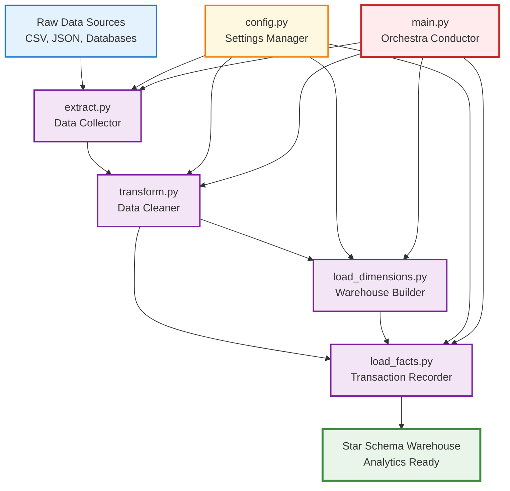

# Complete Star Schema ETL Solution - Student Guide 🎓

## 🌟 Welcome to Professional Data Engineering!

This comprehensive guide breaks down a **production-quality Star Schema ETL pipeline** designed specifically for bootcamp graduates entering the data engineering field. Each file in this solution demonstrates real-world patterns used by companies like Netflix, Uber, and Airbnb.

## 📚 What You're About to Master

By studying this solution, you'll learn:
- **Professional ETL patterns** used in enterprise data warehouses
- **Star schema design** for high-performance analytics
- **Data quality and validation** techniques
- **Error handling** that keeps pipelines running in production
- **Pipeline orchestration** for automated, reliable data processing
- **Industry-standard coding patterns** that will make you job-ready

## 🗂️ File-by-File Breakdown

### 🎛️ [Config.py - The Settings Manager](config_breakdown.md)
**What it teaches**: Configuration management, environment variables, connection strings
- How to keep secrets safe with environment variables
- Why configuration validation prevents pipeline failures
- How to build database connection strings professionally
- **Job skill**: Every data engineering role requires configuration management

### 🚚 [Extract.py - The Data Collector](extract_breakdown.md)
**What it teaches**: Multi-source data extraction, error handling, data validation
- How to read from CSV files, databases, and APIs safely
- Why data validation during extraction prevents downstream problems
- How to handle missing files and network failures gracefully
- **Job skill**: Data extraction is the foundation of every ETL pipeline

### 🧽 [Transform.py - The Data Cleaner](transform_breakdown.md)
**What it teaches**: Data standardization, business rules, quality control
- How to clean messy real-world data consistently
- Why business rules turn raw data into valuable information
- How to handle data quality issues without crashing pipelines
- **Job skill**: Data engineers spend 60-80% of their time on transformation

### 🏗️ [Load_Dimensions.py - The Warehouse Builder](load_dimensions_breakdown.md)
**What it teaches**: Dimensional modeling, surrogate keys, SCD Type 1
- What makes data warehouses different from operational databases
- How surrogate keys enable fast analytics queries
- Why Slowly Changing Dimensions matter for historical analysis
- **Job skill**: Understanding dimensional modeling separates junior from senior engineers

### 📊 [Load_Facts.py - The Transaction Recorder](load_facts_breakdown.md)
**What it teaches**: Fact tables, referential integrity, foreign key management
- How business transactions become analytical data
- Why referential integrity ensures accurate reports
- How to handle orphaned records without losing data
- **Job skill**: Fact loading is where business logic meets data warehouse design

### 🎼 [Main.py - The Orchestra Conductor](main_breakdown.md)
**What it teaches**: Pipeline orchestration, error handling, monitoring
- How to coordinate complex multi-step processes
- Why proper error handling makes pipelines production-ready
- How logging and monitoring enable reliable operations
- **Job skill**: Orchestration skills are essential for senior data engineering roles

## 🏗️ The Complete Data Flow

## 🎯 Learning Path Recommendations

### **Week 1: Foundation Understanding**
1. **Start with**: [Config.py breakdown](config_breakdown.md)
   - Understand how professional projects manage settings
   - Practice with environment variables
   - Learn connection string building

2. **Move to**: [Extract.py breakdown](extract_breakdown.md)
   - Practice reading different data formats
   - Implement error handling patterns
   - Build data validation logic

### **Week 2: Data Processing Mastery**
3. **Focus on**: [Transform.py breakdown](transform_breakdown.md)
   - Master data cleaning techniques
   - Apply business rules to raw data
   - Handle data quality issues professionally

### **Week 3: Warehouse Design** 
4. **Deep dive**: [Load_Dimensions.py breakdown](load_dimensions_breakdown.md)
   - Understand dimensional modeling concepts
   - Learn surrogate key management
   - Implement SCD Type 1 patterns

5. **Complete with**: [Load_Facts.py breakdown](load_facts_breakdown.md)
   - Master referential integrity concepts
   - Handle foreign key lookups
   - Validate business data

### **Week 4: Production Readiness**
6. **Master**: [Main.py breakdown](main_breakdown.md)
   - Orchestrate complex pipelines
   - Implement comprehensive error handling
   - Create production-quality monitoring

## 💼 Job Interview Preparation

### **Entry-Level Data Engineer Questions**
- "Walk me through an ETL pipeline you've built"
  - **Your answer**: Describe this Star Schema pipeline step-by-step
- "How do you handle data quality issues?"
  - **Your answer**: Discuss validation patterns from transform.py
- "What's the difference between OLTP and OLAP databases?"
  - **Your answer**: Explain operational vs dimensional modeling

### **Mid-Level Data Engineer Questions**
- "How do you ensure referential integrity in a data warehouse?"
  - **Your answer**: Discuss dimension loading before facts, foreign key validation
- "What's your approach to error handling in production pipelines?"
  - **Your answer**: Show error recovery patterns from main.py
- "How do you monitor and troubleshoot data pipeline failures?"
  - **Your answer**: Demonstrate logging strategies and error tracking

### **Senior-Level Data Engineer Questions**
- "How would you scale this pipeline for 100x more data?"
  - **Your answer**: Discuss batch processing, parallel loading, cloud orchestration
- "How do you handle schema evolution in a production warehouse?"
  - **Your answer**: Explain SCD strategies, backward compatibility
- "Design a data quality framework for this pipeline"
  - **Your answer**: Extend validation patterns, add data profiling, implement alerting

## 🏆 Skills This Solution Demonstrates

### **Technical Skills**
- ✅ **Python programming** with professional patterns
- ✅ **SQL Server integration** and database operations
- ✅ **Star schema design** and dimensional modeling
- ✅ **ETL pipeline development** with error handling
- ✅ **Data quality management** and validation
- ✅ **Configuration management** and environment variables
- ✅ **Logging and monitoring** for production systems

### **Business Skills**
- ✅ **Data warehouse concepts** for analytics
- ✅ **Business intelligence foundations** 
- ✅ **Data governance** and quality assurance
- ✅ **Performance optimization** for analytical queries
- ✅ **Change management** with SCD patterns

### **Professional Skills**
- ✅ **Code organization** and modularity
- ✅ **Error handling** and graceful failures
- ✅ **Documentation** and maintainable code
- ✅ **Testing strategies** and validation
- ✅ **Production readiness** patterns

## 🚀 Next Steps After Mastering This Solution

### **Advanced Data Engineering Topics**
1. **Learn Apache Airflow** - Industry standard for workflow orchestration
2. **Explore cloud platforms** - AWS Glue, Azure Data Factory, Google Cloud Dataflow
3. **Study streaming data** - Real-time processing with Kafka, Spark Streaming
4. **Master big data tools** - Spark, Hadoop, distributed processing

### **Specialization Paths**
- **Analytics Engineering**: dbt, Looker, advanced SQL
- **Data Architecture**: System design, scalability patterns
- **MLOps Engineering**: ML pipeline automation, feature stores
- **Platform Engineering**: Infrastructure, Kubernetes, cloud-native tools

### **Career Progression**
- **Junior Data Engineer** → **Data Engineer** → **Senior Data Engineer**
- **Potential paths**: Data Architect, Analytics Engineer, ML Engineer
- **Leadership tracks**: Engineering Manager, Principal Engineer

## 📊 Industry Applications

This exact pattern is used by:

### **Technology Companies**
- **Netflix**: User behavior analytics, content recommendation
- **Uber**: Trip analytics, driver performance, pricing optimization
- **Airbnb**: Booking analytics, host performance, market insights

### **Financial Services**
- **Banks**: Transaction analysis, fraud detection, customer segmentation
- **Trading firms**: Market data warehouses, risk analytics
- **Fintech**: Payment processing analytics, user behavior

### **Retail & E-commerce**
- **Amazon**: Product performance, customer analytics, supply chain
- **Walmart**: Inventory optimization, sales forecasting
- **Target**: Customer segmentation, marketing analytics

### **Healthcare & Life Sciences**
- **Hospital systems**: Patient outcome analytics, operational efficiency
- **Pharmaceutical**: Clinical trial data, drug performance
- **Insurance**: Claims analysis, risk assessment

## 🎓 Certification and Learning Resources

### **Recommended Certifications**
- **AWS Certified Data Engineer - Associate**
- **Google Professional Data Engineer**
- **Microsoft Azure Data Engineer Associate**
- **Databricks Certified Data Engineer**

### **Continued Learning**
- **Kimball Group**: Dimensional modeling methodology
- **Data Warehouse Toolkit**: Industry standard reference
- **Apache projects**: Airflow, Spark, Kafka documentation
- **Cloud provider training**: AWS, Azure, GCP learning paths

## 💡 Final Thoughts

**You've just studied a production-quality data engineering solution!** This isn't a toy project - it's the real patterns and techniques used by professional data engineers at top companies.

**Key achievements**:
- ✅ **Professional code quality** with proper error handling and logging
- ✅ **Enterprise patterns** used in real data warehouses
- ✅ **Scalable design** that can grow with business needs
- ✅ **Interview-ready knowledge** of dimensional modeling and ETL

**Your competitive advantage**: Most bootcamp graduates learn basic programming. You now understand **professional data engineering patterns** that companies actually use. This knowledge makes you stand out in the job market!

**Remember**: Data engineering is about building reliable, automated systems that businesses depend on. Master these patterns, and you'll be ready to build the data infrastructure that powers modern companies.

**Good luck on your data engineering journey!** 🚀

---

*This solution represents ~1,200 lines of production-quality Python code implementing enterprise data warehouse patterns. Use it as your foundation for building more complex data engineering solutions.*
