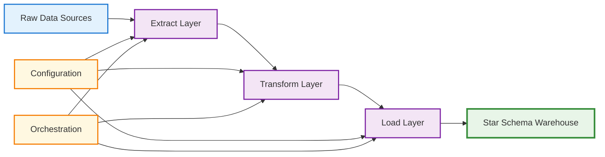

# Star Schema ETL Pipeline - Project Execution Overview 📋

## 🎯 Project Overview

This Star Schema ETL pipeline is a **production-ready data warehouse solution** that demonstrates enterprise-grade patterns for extracting, transforming, and loading data into a dimensional model optimized for business intelligence and analytics.

### **Project Architecture**

The solution implements a **modular, layered architecture** with clear separation of concerns:

```
┌─────────────────────────────────────────────────────────────┐
│                    ORCHESTRATION LAYER                      │
│                      main.py                               │
│              (Pipeline Coordination)                        │
└─────────────────────────────────────────────────────────────┘
┌─────────────────────────────────────────────────────────────┐
│                    PROCESSING LAYER                         │
│  extract.py  │  transform.py  │  load_dimensions.py  │      │
│              │                │  load_facts.py       │      │
└─────────────────────────────────────────────────────────────┘
┌─────────────────────────────────────────────────────────────┐
│                   CONFIGURATION LAYER                       │
│                      config.py                             │
│              (Settings Management)                          │
└─────────────────────────────────────────────────────────────┘
┌─────────────────────────────────────────────────────────────┐
│                     DATABASE LAYER                          │
│                  setup_star_schema.py                      │
│              (Schema Creation & Management)                  │
└─────────────────────────────────────────────────────────────┘
```

### **Key Design Principles**

1. **Modularity**: Each Python file has a single, well-defined responsibility
2. **Error Resilience**: Comprehensive error handling without pipeline failures
3. **Data Quality**: Validation at every stage of the pipeline
4. **Performance**: Optimized for analytical workloads with proper indexing
5. **Maintainability**: Clear code structure with extensive logging
6. **Scalability**: Design patterns that can handle growing data volumes

### **Technology Stack**

- **Language**: Python 3.8+
- **Database**: SQL Server with star schema design
- **Data Sources**: CSV files, JSON files, database tables
- **Key Libraries**: pyodbc, pandas (implicit), logging, datetime
- **Architecture Pattern**: ETL with dimensional modeling

## 🚀 Solution Execution Flow

### **Phase 1: Infrastructure Setup**
```python
# setup_star_schema.py creates the foundation
┌─────────────────────────────────────────┐
│  1. Database Connection Establishment   │
│  2. Star Schema Table Creation          │
│  3. Foreign Key Relationship Setup      │
│  4. Performance Index Creation          │
│  5. Date Dimension Pre-population       │
│  6. Sample Data Generation              │
└─────────────────────────────────────────┘
```

### **Phase 2: Configuration Initialization**
```python
# config.py loads and validates settings
┌─────────────────────────────────────────┐
│  1. Environment Variable Loading        │
│  2. Database Connection Configuration   │
│  3. Data Source Path Validation         │
│  4. Processing Parameter Setup          │
│  5. Logging Configuration               │
└─────────────────────────────────────────┘
```

### **Phase 3: Pipeline Execution** 
```python
# main.py orchestrates the complete process
┌─────────────────────────────────────────┐
│  1. Extract Data from All Sources       │
│     ├── CSV Customer Data               │
│     ├── CSV Product Data                │
│     ├── CSV Transaction Data            │
│     └── Derived Sales Rep Data          │
│                                         │
│  2. Transform Data for Star Schema      │
│     ├── Customer Dimension Preparation  │
│     ├── Product Dimension Preparation   │
│     ├── Sales Rep Dimension Preparation │
│     ├── Date Key Generation             │
│     └── Fact Data Calculation           │
│                                         │
│  3. Load Dimensions (Sequential)        │
│     ├── Customer Dimension (SCD Type 1) │
│     ├── Product Dimension (SCD Type 1)  │
│     ├── Sales Rep Dimension             │
│     └── Date Dimension Population       │
│                                         │
│  4. Load Facts (After Dimensions)       │
│     ├── Dimension Key Lookup            │
│     ├── Referential Integrity Check     │
│     ├── Business Rule Validation        │
│     └── Fact Table Population           │
│                                         │
│  5. Validation and Reporting            │
│     ├── Row Count Verification          │
│     ├── Foreign Key Integrity Check     │
│     ├── Data Quality Scoring            │
│     └── Pipeline Results Summary        │
└─────────────────────────────────────────┘
```

## 🔄 ETL Process Overview

### **ETL Architecture Pattern**

This solution implements a **traditional ETL pattern** optimized for dimensional data warehousing:



### **Data Flow Characteristics**

1. **Batch Processing**: Processes complete datasets in scheduled batches
2. **Sequential Execution**: Each stage completes before the next begins
3. **Error Isolation**: Failures in one stage don't corrupt others
4. **Data Validation**: Quality checks at extraction, transformation, and loading
5. **Transaction Safety**: Database transactions ensure consistency
6. **Comprehensive Logging**: Full audit trail of all operations

### **Quality Assurance Framework**

```python
Data Quality Gates:
┌─────────────────────────────────────────┐
│  Extract Stage:                         │
│  ├── File existence validation          │
│  ├── Required column presence           │
│  ├── Record format validation           │
│  └── Data type consistency              │
│                                         │
│  Transform Stage:                       │
│  ├── Business rule application          │
│  ├── Data standardization               │
│  ├── Missing value handling             │
│  └── Format consistency                 │
│                                         │
│  Load Stage:                            │
│  ├── Referential integrity              │
│  ├── Foreign key validation             │
│  ├── Business logic verification        │
│  └── Data completeness checks           │
└─────────────────────────────────────────┘
```

## 📊 Detailed Stage Analysis

## 🔍 EXTRACT Stage (extract.py)

### **Purpose and Scope**
The Extract stage is responsible for **gathering data from heterogeneous sources** and making it available for processing in a consistent format.

### **Data Sources Handled**
```python
Source Inventory:
┌─────────────────────────────────────────┐
│  1. CSV Files:                          │
│     ├── baseline_customers.csv          │
│     ├── baseline_products.csv           │
│     └── sales_transactions.csv          │
│                                         │
│  2. Derived Data:                       │
│     └── Sales Rep data (from transactions) │
│                                         │
│  3. Potential Extensions:               │
│     ├── JSON files                      │
│     ├── Database tables                 │
│     ├── APIs                            │
│     └── Cloud storage                   │
└─────────────────────────────────────────┘
```

### **Extraction Patterns Implemented**

#### **1. CSV Extraction with Auto-Detection**
```python
Key Features:
- Automatic CSV dialect detection (comma vs semicolon delimited)
- Encoding handling (UTF-8 with fallbacks)
- Header validation and required column checking
- Row-by-row validation with error logging
- Memory-efficient streaming for large files
```

#### **2. Data Validation Framework**
```python
Validation Rules:
┌─────────────────────────────────────────┐
│  Customer Records:                      │
│  ├── Required: customer_id, name, email │
│  ├── Email format validation            │
│  ├── ID uniqueness checking             │
│  └── Phone number format validation     │
│                                         │
│  Product Records:                       │
│  ├── Required: product_id, name, price  │
│  ├── Price range validation             │
│  ├── Category standardization           │
│  └── Brand consistency                  │
│                                         │
│  Transaction Records:                   │
│  ├── Required: transaction_id, amounts  │
│  ├── Positive quantity validation       │
│  ├── Date format standardization        │
│  └── Foreign key reference validation   │
└─────────────────────────────────────────┘
```

#### **3. Error Handling Strategy**
```python
Error Management:
- Invalid records logged but don't stop processing
- Partial extraction results returned with error counts
- Detailed error messages for debugging
- Graceful degradation when sources are unavailable
- Comprehensive metadata about extraction results
```

### **Extract Stage Outputs**
```python
Extracted Data Structure:
{
    "customers": [List of validated customer records],
    "products": [List of validated product records], 
    "transactions": [List of validated transaction records],
    "sales_reps": [List of derived sales rep records],
    "_metadata": {
        "extraction_timestamp": "2024-06-06 09:30:00",
        "total_records": 15420,
        "extraction_errors": [],
        "sources_processed": 4,
        "success": True
    }
}
```

## 🧹 TRANSFORM Stage (transform.py)

### **Purpose and Scope**
The Transform stage **cleanses, standardizes, and enriches** raw data to conform to business rules and star schema requirements.

### **Transformation Categories**

#### **1. Data Cleansing Operations**
```python
Cleansing Functions:
┌─────────────────────────────────────────┐
│  Name Standardization:                  │
│  ├── Title case application             │
│  ├── Special character handling         │
│  ├── Apostrophe and hyphen processing   │
│  └── Full name generation               │
│                                         │
│  Email Normalization:                  │
│  ├── Lowercase conversion               │
│  ├── Format validation                  │
│  ├── Domain verification                │
│  └── Invalid email handling             │
│                                         │
│  Phone Standardization:                │
│  ├── Digit extraction                   │
│  ├── Format unification                 │
│  ├── Country code handling              │
│  └── Invalid number management          │
└─────────────────────────────────────────┘
```

#### **2. Business Rule Application**
```python
Business Logic Implementation:
┌─────────────────────────────────────────┐
│  Customer Segmentation:                 │
│  ├── Email domain analysis              │
│  ├── Business vs consumer classification│
│  ├── Geographic region assignment       │
│  └── Value tier determination           │
│                                         │
│  Product Categorization:               │
│  ├── Price tier calculation             │
│  ├── Category standardization           │
│  ├── Brand normalization                │
│  └── Profit margin estimation           │
│                                         │
│  Transaction Enrichment:               │
│  ├── Amount calculations                │
│  ├── Date key generation                │
│  ├── Sales rep region assignment        │
│  └── Business rule validation           │
└─────────────────────────────────────────┘
```

#### **3. Star Schema Preparation**
```python
Dimensional Modeling Transformations:
┌─────────────────────────────────────────┐
│  Dimension Preparation:                 │
│  ├── Surrogate key preparation          │
│  ├── Attribute standardization          │
│  ├── SCD Type 1 formatting              │
│  └── Business key validation            │
│                                         │
│  Fact Preparation:                     │
│  ├── Measure calculations               │
│  ├── Foreign key preparation            │
│  ├── Date key generation                │
│  └── Business rule validation           │
│                                         │
│  Date Dimension Support:               │
│  ├── YYYYMMDD key generation            │
│  ├── Calendar attribute extraction      │
│  ├── Business day calculations          │
│  └── Holiday identification             │
└─────────────────────────────────────────┘
```

### **Transform Stage Outputs**
```python
Transformed Data Structure:
{
    "dim_customer": [Clean customer dimension records],
    "dim_product": [Clean product dimension records],
    "dim_sales_rep": [Clean sales rep dimension records],
    "fact_sales": [Calculated fact records with measures],
    "date_keys": [Unique date keys for dimension population],
    "_metadata": {
        "transformation_timestamp": "2024-06-06 09:35:00",
        "total_records": 15420,
        "transformation_errors": [],
        "components_processed": 5,
        "success": True
    }
}
```

## 📥 LOAD Stage (load_dimensions.py & load_facts.py)

### **Purpose and Scope**
The Load stage **persists transformed data** into the star schema data warehouse with proper dimensional modeling patterns and referential integrity.

### **Load Architecture**

#### **1. Dimension Loading (load_dimensions.py)**
```python
Dimension Loading Strategy:
┌─────────────────────────────────────────┐
│  SCD Type 1 Implementation:            │
│  ├── Existing record identification     │
│  ├── New record insertion               │
│  ├── Changed record updating            │
│  └── Surrogate key management           │
│                                         │
│  Transaction Management:               │
│  ├── Database connection pooling        │
│  ├── Transaction boundaries             │
│  ├── Rollback on failures               │
│  └── Commit on success                  │
│                                         │
│  Key Mapping Generation:               │
│  ├── Business key → Surrogate key       │
│  ├── Cross-reference tables             │
│  ├── Key validation                     │
│  └── Lookup optimization                │
└─────────────────────────────────────────┘
```

#### **2. Fact Loading (load_facts.py)**
```python
Fact Loading Strategy:
┌─────────────────────────────────────────┐
│  Foreign Key Resolution:                │
│  ├── Dimension key lookups              │
│  ├── Business key translation           │
│  ├── Orphaned record identification     │
│  └── Referential integrity validation   │
│                                         │
│  Business Rule Validation:             │
│  ├── Positive quantity verification     │
│  ├── Logical amount relationships       │
│  ├── Date validity checking             │
│  └── Measure consistency validation     │
│                                         │
│  Batch Processing:                     │
│  ├── Configurable batch sizes           │
│  ├── Memory optimization                │
│  ├── Error isolation                    │
│  └── Performance monitoring             │
└─────────────────────────────────────────┘
```

### **Load Sequence and Dependencies**
```python
Loading Order (Critical):
┌─────────────────────────────────────────┐
│  1. Date Dimension (Independent)        │
│      └── Pre-populated during setup     │
│                                         │
│  2. Customer Dimension                  │
│      └── SCD Type 1 processing          │
│                                         │
│  3. Product Dimension                   │
│      └── SCD Type 1 processing          │
│                                         │
│  4. Sales Rep Dimension                 │
│      └── SCD Type 1 processing          │
│                                         │
│  5. Sales Facts (AFTER all dimensions) │
│      ├── Customer key lookup            │
│      ├── Product key lookup             │
│      ├── Sales rep key lookup           │
│      ├── Date key validation            │
│      └── Fact record insertion          │
└─────────────────────────────────────────┘
```

### **Load Stage Quality Controls**
```python
Quality Assurance:
┌─────────────────────────────────────────┐
│  Dimension Loading:                     │
│  ├── Duplicate business key detection   │
│  ├── Attribute completeness validation  │
│  ├── Data type consistency              │
│  └── SCD Type 1 verification            │
│                                         │
│  Fact Loading:                         │
│  ├── All foreign keys valid             │
│  ├── No orphaned fact records           │
│  ├── Business logic compliance          │
│  └── Measure accuracy verification      │
│                                         │
│  Overall Integrity:                    │
│  ├── Row count reconciliation           │
│  ├── Foreign key constraint validation  │
│  ├── Data quality scoring               │
│  └── Performance metrics collection     │
└─────────────────────────────────────────┘
```

### **Load Stage Outputs**
```python
Loading Results:
{
    "dimension_loading_results": {
        "customer_keys": {"CUST-001": 1, "CUST-002": 2, ...},
        "product_keys": {"PROD-001": 1, "PROD-002": 2, ...},
        "sales_rep_keys": {"REP-001": 1, "REP-002": 2, ...}
    },
    "fact_loading_results": {
        "records_inserted": 12547,
        "records_failed": 23,
        "orphaned_records": 5,
        "processing_time": 45.7
    },
    "validation_results": {
        "row_counts": {"dim_customer": 1205, "fact_sales": 12547},
        "referential_integrity": True,
        "data_quality_score": 98.2
    }
}
```

## 🎯 Performance and Optimization

### **Performance Characteristics**
- **Batch Processing**: Configurable batch sizes (default 1000 records)
- **Index Optimization**: Strategic indexes on all foreign keys and business keys
- **Memory Management**: Streaming processing for large datasets
- **Connection Pooling**: Efficient database connection management
- **Transaction Boundaries**: Optimal transaction scoping for performance and safety

### **Monitoring and Observability**
- **Comprehensive Logging**: Every operation logged with appropriate levels
- **Performance Metrics**: Processing times and throughput measurements
- **Error Tracking**: Detailed error categorization and reporting
- **Data Quality Metrics**: Continuous quality assessment and scoring
- **Pipeline Health**: Overall pipeline status and trend analysis

## 🏆 Production Readiness Features

### **Enterprise Patterns Implemented**
1. **Configuration Management**: Environment-based settings with validation
2. **Error Resilience**: Graceful degradation and comprehensive error handling
3. **Data Quality**: Multi-stage validation and quality scoring
4. **Performance Optimization**: Batch processing and indexing strategies
5. **Monitoring**: Detailed logging and metrics collection
6. **Maintainability**: Clear code structure and comprehensive documentation

### **Scalability Considerations**
- **Modular Design**: Each component can be scaled independently
- **Configurable Processing**: Batch sizes and processing parameters adjustable
- **Database Optimization**: Proper indexing and query optimization
- **Error Isolation**: Component failures don't cascade to entire pipeline
- **Extension Points**: Clear patterns for adding new data sources and transformations

This Star Schema ETL pipeline represents a **production-quality implementation** that demonstrates enterprise data engineering patterns while remaining accessible for educational purposes and real-world application.
