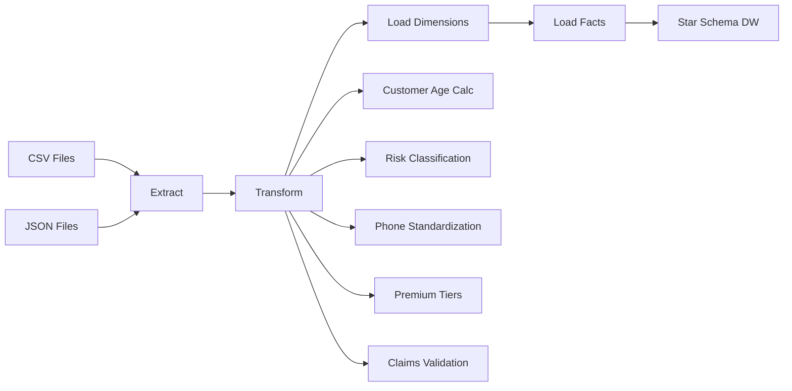

# Insurance ETL Assessment Package

## 📋 Overview

A comprehensive ETL (Extract, Transform, Load) assessment for students learning data engineering with Python. This assessment focuses on building a complete insurance data warehouse using star schema design with realistic business scenarios.

**Designed for:** Java bootcamp graduates transitioning to data engineering  
**Duration:** 3-4 hours  
**Difficulty:** Intermediate  
**Domain:** Insurance (customers, policies, claims)


## 🏗️ Package Structure

```
insurance-etl-assessment/
├── student-starter/              # Student working directory
│   ├── config.py                # Complete - database configuration
│   ├── extract.py               # 90% complete - 2 TODOs
│   ├── transform.py             # 60% complete - 5 TODOs  
│   ├── data/                    # Synthetic datasets (generated)
│   ├── logs/                    # ETL execution logs
│   └── .env.example             # Environment template
├── instructor-solution/          # Complete working solution
│   ├── config.py                # Database configuration
│   ├── setup_star_schema.py     # Database schema creation
│   ├── extract.py               # Data extraction module
│   ├── transform.py             # Business logic transformations
│   ├── load_dimensions.py       # Dimension loading with SCD Type 1
│   ├── load_facts.py            # Fact loading with referential integrity
│   ├── main.py                  # Complete ETL pipeline orchestrator
│   └── data/                    # Sample datasets
├── synthetic-data-generator/     # Realistic data creation
│   ├── generate_customers.py    # Customer data (75 records)
│   ├── generate_policies.py     # Policy data (125 records)
│   └── generate_claims.py       # Claims data (650 records)
└── assessment-materials/         # Instructor resources
    ├── instructions.md           # Detailed student instructions
    ├── grading-rubric.md         # Assessment criteria
    └── todo-checklist.md         # Progress tracking
```


## 🎯 Learning Objectives

### Technical Skills
1. **Python ETL Development**
   - Multi-source data extraction (CSV, JSON)
   - Business rule implementation
   - Error handling and data validation
   - Database connectivity and operations

2. **Data Warehouse Concepts**
   - Star schema design and implementation
   - Dimension and fact table relationships
   - Surrogate key management
   - SCD Type 1 updates

3. **Insurance Domain Knowledge**
   - Customer risk classification algorithms
   - Policy premium tier structures
   - Claims validation business rules
   - Data quality standards

### Soft Skills
- Problem-solving with incomplete code templates
- Following detailed technical specifications
- Debugging and testing methodologies
- Documentation reading and comprehension


## 📊 Assessment Components

### Core TODO Methods (7 total)

**Extract Module (2 methods):**
- `_safe_float_conversion()` - Type conversion with error handling
- `_safe_int_conversion()` - Integer conversion with validation

**Transform Module (5 methods):**
- `_calculate_customer_age()` - Date arithmetic and validation
- `_classify_customer_risk()` - Multi-criteria business logic
- `_standardize_phone()` - Data cleaning and formatting
- `_determine_premium_tier()` - Threshold-based classification
- `_validate_claim_amount()` - Business rule validation

### Data Pipeline Flow




## 🚀 Quick Start Guide

### For Instructors

1. **Setup Environment:**
   ```bash
   # Clone or download the assessment package
   cd insurance-etl-assessment
   ```

2. **Generate Synthetic Data:**
   ```bash
   cd synthetic-data-generator
   python generate_customers.py
   python generate_policies.py
   python generate_claims.py
   ```

3. **Create Database Schema:**
   ```bash
   cd ../instructor-solution
   python setup_star_schema.py
   ```

4. **Test Complete Solution:**
   ```bash
   python main.py
   ```

### For Students

Follow the detailed instructions in `assessment-materials/instructions.md`


## 📈 Assessment Metrics

### Completion Criteria
- ✅ All 7 TODO methods implemented correctly
- ✅ Individual module tests pass
- ✅ Complete ETL pipeline executes successfully  
- ✅ Data warehouse populated with expected volumes
- ✅ Business rules correctly applied
- ✅ Claims processing success rate > 95%

### Expected Data Volumes
- **Customers:** 75 records → dim_customer
- **Policies:** 125 records → dim_policy  
- **Claims:** 650 records → fact_claims
- **Agents:** ~15 records → dim_agent (extracted from claims)
- **Dates:** 2,191 records → dim_date (2020-2025)

### Performance Benchmarks
- **Total Runtime:** < 30 seconds (typical: 10-15 seconds)
- **Memory Usage:** < 100MB peak
- **Success Rate:** > 95% claims loaded successfully
- **Data Quality:** < 5% validation warnings


## 🧪 Testing Strategy

### Unit Testing
Each TODO method includes:
- Multiple test cases with expected outputs
- Edge case handling verification
- Error condition testing
- Business rule validation

### Integration Testing
- End-to-end pipeline execution
- Cross-module data consistency
- Database integrity validation
- Performance monitoring

### Data Quality Testing
- Referential integrity checks
- Business rule compliance
- Data completeness validation
- Duplicate detection


## 🔧 Technical Architecture

### Technology Stack
- **Language:** Python 3.8+
- **Database:** SQL Server (configurable)
- **Libraries:** pyodbc, python-dotenv, datetime
- **Data Formats:** CSV, JSON
- **Architecture:** Modular ETL with clear separation of concerns

### Design Patterns
- **Configuration Management:** Environment-based settings
- **Error Handling:** Graceful degradation with logging
- **Modularity:** Single responsibility principle
- **Scalability:** Batch processing with configurable sizes

### Star Schema Design

```
                    dim_date
                        |
dim_customer -----> fact_claims <----- dim_policy
                        |
                    dim_agent
```

**Fact Table:** `fact_claims`
- Surrogate key relationships to all dimensions
- Measures: claim_amount, payout_amount, processing_days
- Calculated fields: claim_ratio

**Dimension Tables:**
- `dim_customer`: Demographics, risk profile, contact info
- `dim_policy`: Coverage details, premium tier, status
- `dim_agent`: Agent information, region, experience
- `dim_date`: Calendar attributes for time-based analysis


## 🎓 Educational Value

### Progression Difficulty
1. **Beginner:** Data type conversion and basic validation
2. **Intermediate:** Date arithmetic and conditional logic
3. **Advanced:** Multi-criteria classification and business rules

### Real-World Relevance
- **Insurance Industry:** Authentic business scenarios
- **Data Engineering:** Production-grade ETL patterns
- **Problem Solving:** Debugging incomplete implementations
- **Best Practices:** Error handling, logging, validation

### Assessment Scaffolding
- **85% Complete:** Students focus on core business logic
- **Clear Examples:** Every TODO includes expected inputs/outputs
- **Progressive Testing:** Test methods individually before integration
- **Helpful Hints:** Guidance without giving away solutions


## 📋 Instructor Resources

### Grading Rubric
- **Functionality (60%):** TODO methods work correctly
- **Code Quality (25%):** Error handling, edge cases
- **Pipeline Success (15%):** End-to-end execution

### Common Student Issues
1. **Environment Setup:** Database connection problems
2. **Type Conversion:** Edge cases and error handling
3. **Business Logic:** Misunderstanding requirements
4. **Integration:** Module interdependencies

### Time Management Guidance
- **Setup (15 min):** Environment and data generation
- **Extract TODOs (30 min):** Type conversion methods
- **Transform TODOs (90 min):** Business logic implementation
- **Testing (30 min):** Validation and debugging
- **Buffer (15 min):** Troubleshooting and questions


