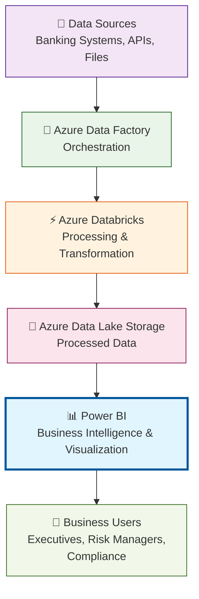

# L04A: Power BI Fraud Detection Dashboard

**Duration:** 150-180 minutes (2.5-3 hours)

## Introduction

**"From Data Processing to Business Intelligence"**

You've spent the last three lessons building sophisticated data pipelines: extracting banking transactions, detecting fraud patterns, and enriching customer profiles. Your Spark jobs can process millions of records in minutes. Your data is clean, validated, and ready for analysis.

But here's the reality check: **If business stakeholders can't see and interact with your data insights, your engineering work has zero business impact.**

The most technically perfect data pipeline in the world is worthless if executives can't monitor fraud trends, risk managers can't track suspicious patterns, and compliance officers can't generate regulatory reports.

**What You're About to Discover:**
Today, you'll transform from a data engineer who processes data to a data engineer who delivers actionable insights. You'll take the transaction analysis and fraud detection data you've built and turn it into executive-ready dashboards that make million-dollar business decisions possible.

**Your Journey Today:**
- **Connect the dots**: Link Power BI directly to your Databricks processed data
- **Build executive dashboards**: Fraud KPIs that protect customer accounts
- **Create business value**: Turn technical achievements into visible business impact

**The Challenge:**
By the end of today's lesson, you'll have built a comprehensive fraud monitoring dashboard that connects directly to your Databricks data warehouse. It's the same type of dashboard that bank executives use to monitor fraud patterns in real-time.

Ready to bridge the gap between engineering and business? Let's turn your data into decisions.

## Learning Outcomes
By the end of this lesson, students will be able to:
- Explain what Power BI is and its role in the data engineering ecosystem
- Connect Power BI to Azure Databricks tables and views
- Create fraud detection KPIs and transaction monitoring dashboards
- Build executive-ready visualizations for business stakeholders
- Publish and share dashboards with appropriate permissions

## Prerequisites
- Completion of L01: Introduction to Azure Databricks and PySpark
- Completion of L02: Working with JSON and SparkSQL
- Completion of L03: Azure Data Factory for Data Integration
- Active Azure account with Power BI license (Pro, Premium per user, or trial)
- Transaction and fraud detection data from previous labs

---

## Lesson Content

### Introduction to Power BI for Data Engineers (30 minutes)

#### What is Power BI and Why Data Engineers Need to Know It

**Power BI Definition:**
Microsoft Power BI is a business analytics service that enables organizations to visualize data, share insights, and make data-driven decisions. For data engineers, it's the primary tool for delivering the business value of your data pipelines.

**Java Developer Connection:**
In your Java applications, you've built REST APIs that serve data to frontend applications. Power BI is similar - it's a sophisticated frontend that consumes your data and presents it to business users. The difference is that instead of serving individual API calls, you're serving entire datasets for interactive exploration.

```java
// Java - Serving data via REST API
@GetMapping("/api/transactions")
public List<Transaction> getTransactions() {
    return transactionService.findAll();
}
```

```python
# Data Engineering - Serving data via Databricks tables
CREATE OR REPLACE VIEW fraud_metrics AS
SELECT
    DATE(transaction_date) as date,                                    -- Turn the full transaction date into just the date (like 2024-01-15)
    COUNT(*) as total_transactions,                                    -- Count how many total transactions happened each day
    SUM(CASE WHEN fraud_flag = 1 THEN 1 ELSE 0 END) as fraud_count   -- Count how many fraud transactions happened each day (fraud_flag = 1 means fraud, 0 means normal)
FROM transactions_enriched
GROUP BY DATE(transaction_date)                                       -- Group all the data by date so we get one row per day
```

The data engineering approach focuses on aggregated, analytics-ready datasets rather than individual record lookups.

#### Power BI vs Other BI Tools in the Microsoft Ecosystem

Understanding where Power BI fits in the business intelligence landscape:

**Power BI vs Excel:**
- **Excel:** Desktop-based, limited data volumes (1M rows max)
- **Power BI:** Cloud-based, unlimited data volumes, real-time refresh
- **When to use Power BI:** When you need to process more than Excel can handle

**Power BI vs Tableau:**
- **Tableau:** More advanced visualization capabilities, higher learning curve
- **Power BI:** Better Azure integration, lower cost, easier for business users
- **When to use Power BI:** When working within Microsoft ecosystem

**Power BI vs Azure Synapse Analytics:**
- **Synapse:** SQL-based data warehouse for complex queries
- **Power BI:** Visual interface for business users to explore data
- **How they work together:** Synapse stores data, Power BI visualizes it

**Power BI in the Data Engineering Stack:**



#### Common Use Cases for Data Engineers

Power BI enables data engineers to deliver value across four key areas:


**1. Executive Reporting**
- High-level KPIs for C-suite decision making
- Automated regulatory compliance reports
- Strategic performance monitoring

**2. Operational Dashboards**
- Real-time fraud detection monitoring
- System health and performance metrics
- Data quality scorecards

**3. Self-Service Analytics**
- Enabling business users to explore data independently
- Reducing ad-hoc reporting requests
- Democratizing data access

**4. Data Pipeline Monitoring**
- ETL job success/failure tracking
- Data freshness indicators
- Performance optimization insights

### Setting Up Power BI to Connect to Azure Databricks (45 minutes)

#### Installing Power BI Desktop and Azure Integration

**Step 1: Download and Install Power BI Desktop**

1. **Navigate** to https://powerbi.microsoft.com/desktop/
2. **Click** "Download free"
3. **Install** Power BI Desktop (Windows required - use Azure VM if on Mac/Linux)
4. **Launch** Power BI Desktop
5. **Sign in** with your Azure account

**Step 2: Verify Power BI Security Settings**

```
File → Options and settings → Options → Security
Recommended settings:
- Certificate Revocation: Basic check (selected)
- Data Extensions: (Recommended) Only allow Microsoft certified... (selected)
- Custom visuals: Show security warning when adding... (checked)
```

These settings ensure secure connections to Azure services while maintaining usability.

**Step 3: Prepare Sample Data in Databricks**

Before connecting Power BI, let's ensure you have fraud detection data available:

1. **Open** your Azure Databricks workspace
2. **Create** a new notebook called "PowerBI-Data-Prep"
3. **Run** the following code to create sample fraud data:

```python
# Create sample fraud transaction data for Power BI lesson
# Import specific types to avoid function conflicts
from pyspark.sql.types import StructType, StructField, StringType, DoubleType, TimestampType, IntegerType
from pyspark.sql.functions import lit, round as spark_round
from builtins import round
import random
from datetime import datetime, timedelta

print("Creating sample fraud detection data for Power BI lesson...")

# Create sample transaction data using pure Python
sample_data = []
merchants = ["Amazon", "Walmart", "Shell", "Starbucks", "ATM Withdrawal", "Best Buy", "Target", "McDonald's"]
states = ["CA", "TX", "NY", "FL", "WA", "AZ", "NV", "UT"]

# Generate 1000 sample transactions
for i in range(1000):
    # Generate random date in first 3 months of 2024
    days_offset = random.randint(0, 90)
    base_date = datetime(2024, 1, 1) + timedelta(days=days_offset)

    # Generate random transaction amount between $10 and $8000
    min_amount = 10.0
    max_amount = 8000.0
    amount_value = round(random.uniform(min_amount, max_amount), 2)

    # Determine if this transaction is fraud (3% chance)
    fraud_probability = random.random()
    is_fraud = 1 if fraud_probability < 0.03 else 0

    # Create transaction record with all required fields
    transaction_record = {
        "transaction_id": f"TXN_{i+1:04d}",
        "account_id": f"ACC_{random.randint(1000, 9999)}",
        "amount": amount_value,
        "merchant": random.choice(merchants),
        "transaction_date": base_date,
        "location_state": random.choice(states),
        "fraud_flag": is_fraud,
        "risk_score": random.randint(10, 95),
        "customer_age": random.randint(21, 75),
        "income_segment": random.choice(["LOW", "MEDIUM", "HIGH"])
    }

    sample_data.append(transaction_record)

print(f"Generated {len(sample_data)} sample transactions")

# Define the schema for our DataFrame explicitly
schema = StructType([
    StructField("transaction_id", StringType(), True),
    StructField("account_id", StringType(), True),
    StructField("amount", DoubleType(), True),
    StructField("merchant", StringType(), True),
    StructField("transaction_date", TimestampType(), True),
    StructField("location_state", StringType(), True),
    StructField("fraud_flag", IntegerType(), True),
    StructField("risk_score", IntegerType(), True),
    StructField("customer_age", IntegerType(), True),
    StructField("income_segment", StringType(), True)
])

# Create the Spark DataFrame from our Python data
fraud_data_df = spark.createDataFrame(sample_data, schema)

# Save as table for Power BI to access
fraud_data_df.write.mode("overwrite").saveAsTable("fraud_flagged_transactions")

print("✅ Sample fraud data created and saved!")
print(f"📊 Records created: {fraud_data_df.count()}")
print("\n📋 Sample of the data:")
display(fraud_data_df)
```

4. **Verify** the table was created successfully:

```python
# Verify our table exists and check the data
spark.sql("SHOW TABLES").show()

# Quick data verification
spark.sql("""
SELECT
    COUNT(*) as total_transactions,
    SUM(fraud_flag) as fraud_transactions,
    ROUND(AVG(amount), 2) as avg_amount,
    ROUND(100.0 * SUM(fraud_flag) / COUNT(*), 2) as fraud_rate_percent
FROM fraud_flagged_transactions
""").show()
```
#### Configuring Databricks Connection Parameters

**Step 4: Gather Databricks Connection Information**

In your Azure Databricks workspace:


1. **Click** "Compute" in the left sidebar
2. **Click** on your cluster name
3. **Navigate** to "Configuration" → "Advanced Options" → "JDBC/ODBC"
4. **Copy** the following information:

```
Server Hostname: adb-1234567890123456.78.azuredatabricks.net
Port: 443
HTTP Path: /sql/1.0/warehouses/abcd1234efgh5678
```

**Step 5: Create Power BI Data Source Connection**

In Power BI Desktop:


1. **Click** "Get Data" → "More"
2. **Search** for "Azure Databricks"
3. **Select** "Azure Databricks" → "Connect"
4. **Enter** connection details:

```
Server Hostname: [Your Server Hostname from above]
HTTP Path: [Your HTTP Path from above]
Data Connectivity mode: DirectQuery (recommended for large datasets)
```

5. **Click** "OK"

**Step 6: Authentication Setup**

When prompted for credentials:

```
Authentication Method: Microsoft Entra ID
Username: [Your Azure account email]
Password: [Your Azure password]
```

**Important Notes:**
- **DirectQuery vs Import:** Use DirectQuery for live data, Import for better performance with smaller datasets
- **Security:** Power BI inherits your Databricks permissions - you can only see data you have access to
- **Performance:** DirectQuery sends queries to Databricks in real-time, so query performance depends on your cluster size

#### Verifying Connection to Processed Transaction Data

**Step 7: Browse Available Tables and Views**

After successful authentication, you should see your Databricks data structure in the Navigator:

**Navigator Structure You'll See:**
1. **Expand** the workspace folder (shows your Databricks workspace URL)
2. **Expand** `hive_metastore` (the main metadata catalog)
3. **Expand** `default [1]` (shows there's 1 table in the default database)
4. **You should see** `fraud_flagged_transactions` table (the table we created in Step 3)

**What Each Element Means:**
- **Workspace folder**: Your Azure Databricks workspace connection
- **hive_metastore**: The main Databricks metadata catalog
- **default [1]**: The default database with 1 table (the number shows how many tables)
- **fraud_flagged_transactions**: Our sample fraud detection data
- **samples**: Databricks sample datasets (ignore these for now)

**If you see the `fraud_flagged_transactions` table:**
Perfect! The sample data creation worked correctly. Proceed to Step 8.

**If you don't see the `fraud_flagged_transactions` table:**
1. **Go back** to Step 3 and re-run the sample data creation code
2. **Verify** the table was created by running `spark.sql("SHOW TABLES").show()` in Databricks
3. **Refresh** the Power BI Navigator (right-click and select "Refresh")

**Step 8: Preview Your Data**

1. **Click** on `fraud_flagged_transactions` table
2. **Review** the data preview on the right
3. **Verify** you see expected columns:

```
Expected Columns:
- transaction_id
- account_id
- amount
- merchant
- transaction_date
- fraud_flag
- risk_score
- customer_age
- income_segment
```

**Step 9: Load Initial Dataset**

1. **Select** `fraud_flagged_transactions` table
2. **Click** "Load" (this may take 2-3 minutes for large datasets)
3. **Power BI** downloads data structure and sample records

**Troubleshooting Common Issues:**

**Issue 1: "Can't connect to Databricks"**
- **Check:** Cluster is running (start it if stopped)
- **Verify:** Copied connection string exactly
- **Try:** Using browser-based Power BI if desktop version fails

**Issue 2: "Authentication failed"**
- **Verify:** Azure account has Databricks access
- **Try:** Clearing browser cache and re-authenticating
- **Check:** Two-factor authentication requirements

**Issue 3: "Tables not visible"**
- **Confirm:** Tables exist in Databricks (run `SHOW TABLES` in notebook)
- **Check:** Database permissions (can you query tables in Databricks?)
- **Refresh:** Navigator window and try again


### Building Fraud KPI Dashboard (75 minutes)

#### Creating Key Performance Indicators

**Step 1: Design Fraud Monitoring KPIs**

Before building visualizations, let's define the key metrics that fraud analysts need:

**Primary KPIs:**
- **Daily Fraud Rate:** Percentage of transactions flagged as fraudulent
- **Fraud Dollar Impact:** Total dollar amount of fraudulent transactions
- **Top Risk Merchants:** Merchants with highest fraud rates
- **Geographic Risk Patterns:** States/cities with elevated fraud activity
- **Time-based Trends:** Fraud patterns by hour/day/month

**Step 2: Create Calculated Measures**

In Power BI, measures are calculations that aggregate data across your dataset:

1. **Click** "Data" view in right panel
2. **Right-click** on your dataset → "New measure"


3. **Create** the following measures:

**Fraud Rate Calculation:**
```dax
Fraud Rate =
DIVIDE(
    COUNTROWS(FILTER(fraud_flagged_transactions, fraud_flagged_transactions[fraud_flag] = 1)),
    COUNTROWS(fraud_flagged_transactions),
    0
) * 100
```

**Total Fraud Amount:**
```dax
Total Fraud Amount =
CALCULATE(
    SUM(fraud_flagged_transactions[amount]),
    fraud_flagged_transactions[fraud_flag] = 1
)
```

**Average Transaction Amount:**
```dax
Avg Transaction Amount =
AVERAGE(fraud_flagged_transactions[amount])
```

**Daily Transaction Count:**
```dax
Daily Transactions =
COUNTROWS(fraud_flagged_transactions)
```

**Step 3: Build Executive Summary Cards**

Executive dashboards start with high-level KPI cards:

1. **Switch** to "Report" view
2. **Insert** → "Card" visualization
3. **Drag** "Fraud Rate" measure to the card
4. **Format** the card by clicking the card and then using the Format panel on the right:


**To format the Fraud Rate card:**

a) **General Settings:**
   - Click the **paintbrush icon** (Format) in the Visualizations panel
   - Expand **General** section
   - Under **Title**: Turn ON and type "Fraud Rate %"
   - Under **Effects**: Add drop shadow for professional look

b) **Callout Value (the main number):**
   - In the Format panel, scroll down and find **"Callout value"** section
   - **Click** to expand the "Callout value" section (this controls the big number displayed)
   - **Font**: Change to bold, size 48
   - **Color**: Click the **fx** button next to Color to set conditional formatting:
     - Set **Format style** to "Rules"
     - **What field should we base this on?**: Select "Fraud Rate"
     - **Create rules**:
       - **Rule 1**: If value **>** 2 **and** **<** 100, then set color to red (#FF0000)
       - **Rule 2**: If value **>** 0 **and** **<** 1, then set color to green (#00FF00)
       - **Rule 3**: If value **>=** 1 **and** **<=** 2, then set color to dark blue (#003366)

   

c) **Data Label (shows "%" symbol):**
   - Expand **Data label** section
   - **Font**: Size 24, same color as callout value
   - **Position**: Right of value

d) **Category Label (optional subtitle):**
   - Expand **Category label** section
   - Turn ON and type "Current Rate"
   - **Font**: Size 16, gray color

e) **Background and Border:**
   - Expand **Effects** section
   - **Background**: Light gray (#F8F8F8)
   - **Border**: Turn ON, 2px, dark gray

5. **Repeat** for other KPIs with these specific formats:

**Total Fraud Amount Card:**
- Title: "Total Fraud Impact"
- Callout value: Red color, currency format ($)
- Display units: Auto (will show as $10K, $1M, etc.)

**Daily Transactions Card:**
- Title: "Daily Transaction Volume"
- Callout value: Blue color, whole numbers
- Display units: Auto

**Average Transaction Amount Card:**
- Title: "Average Transaction"
- Callout value: Green color, currency format ($)
- Decimal places: 0

**Step 4: Arrange KPI Cards**

1. **Resize** cards to fit 4 across the top of your dashboard
2. **Align** cards using Format → Align options
3. **Add** background colors to distinguish different metric types

#### Transaction Volume and Risk Analysis Charts

**Step 5: Daily Transaction Volume Trend**

1. **Insert** → "Line chart"
2. **Configure** the chart:

```
X-axis: transaction_date (change to Date Hierarchy → Date)
Y-axis: Daily Transactions (measure we created)
Secondary Y-axis: Fraud Rate (measure we created)
```

3. **Format** the chart:
```
Title: "Daily Transaction Volume and Fraud Rate"
X-axis: Show title, format as "MMM DD"
Y-axis: Transaction count, show data labels
Secondary Y-axis: Percentage, red color
```

**Step 6: Risk Score Distribution**

1. **Insert** → "Histogram"
2. **Configure** the chart:

```
Values: risk_score
Bucket Count: 10
```

3. **Add** conditional formatting:
```
Color by: risk_score ranges
Green: 0-30 (Low Risk)
Yellow: 31-70 (Medium Risk)
Red: 71-100 (High Risk)
```

**Step 7: Top Risk Merchants**

1. **Insert** → "Table" visualization
2. **Configure** the table:

```
Columns:
- merchant
- Daily Transactions (count of transactions for this merchant)
- Fraud Rate (percentage for this merchant)
- Total Fraud Amount (sum of fraud amounts for this merchant)
```

3. **Sort** by Fraud Rate descending
4. **Apply** conditional formatting:
```
Fraud Rate column: Red background if > 5%
Total Fraud Amount column: Red text if > $10,000
```

**Step 8: Geographic Risk Analysis**

1. **Insert** → "Filled map"
2. **Configure** the map:

```
Location: customer_state (from enriched data)
Color saturation: Fraud Rate (measure)
Tooltips:
- State name
- Total transactions
- Fraud count
- Fraud rate percentage
```

3. **Format** the map:
```
Colors: Light green (low fraud) to dark red (high fraud)
Border: White, 1px
Title: "Fraud Rate by State"
```

#### Time-based Pattern Analysis

**Step 9: Hourly Fraud Patterns**

First, create a calculated column for transaction hour:

1. **Go to** Data view
2. **Right-click** dataset → "New column"
3. **Create** calculated column:

```dax
Transaction Hour = HOUR(fraud_flagged_transactions[transaction_date])
```

4. **Insert** → "Column chart"
5. **Configure** the chart:

```
X-axis: Transaction Hour
Y-axis: Fraud Rate (measure)
```

**Step 10: Monthly Trend Analysis**

1. **Insert** → "Line and stacked column chart"
2. **Configure** the chart:

```
Shared X-axis: transaction_date (Month level)
Column Y-axis: Daily Transactions
Line Y-axis: Total Fraud Amount
```

3. **This shows** volume trends and fraud dollar impact over time

### Basic Dashboard Publishing (30 minutes)

#### Publishing to Power BI Service

**Step 1: Publish Your Dashboard**

1. **Click** "Publish" in Power BI Desktop
2. **Select** workspace (create "Fraud Monitoring" workspace if needed)
3. **Wait** for publish to complete
4. **Click** "Open in Power BI" link

**Step 2: Test Data Refresh**

In Power BI Service (browser):

1. **Navigate** to Datasets tab
2. **Find** your published dataset
3. **Click** "Refresh now" to test connection
4. **Verify** data updates successfully

**Step 3: Basic Sharing**

1. **Navigate** to your published dashboard
2. **Click** "Share"
3. **Add** a colleague's email to test sharing functionality
4. **Set** permissions to "Can view"

## Conclusion and Next Steps

**What You've Accomplished:**

Today, you've built a comprehensive fraud detection dashboard that transforms your data engineering work into business value. You've:

- **Connected** Power BI to your Databricks data warehouse
- **Created** executive-ready KPIs and visualizations
- **Built** interactive dashboards for fraud analysis
- **Published** and shared your insights with stakeholders

**Business Impact:**

Your dashboard now enables:
- **Real-time fraud monitoring** for risk management teams
- **Pattern identification** that prevents financial losses
- **Executive reporting** that drives strategic decisions
- **Self-service analytics** that reduces IT requests

**Next Lesson Preview:**

In **L04B: Power BI Operations and Monitoring**, you'll build:
- **Pipeline health monitoring** dashboards
- **Data quality scorecards** and alerting
- **Advanced security** and deployment practices
- **Performance optimization** techniques

**Career Value:**

You now possess a complete skill set bridging technical data engineering with business intelligence - exactly what employers seek in senior data engineering roles.

Ready to monitor your data pipelines? See you in the next lesson!