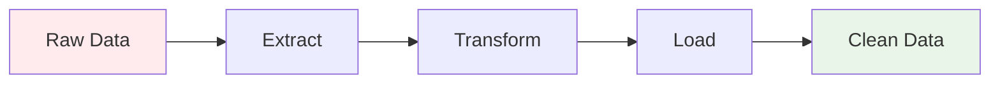
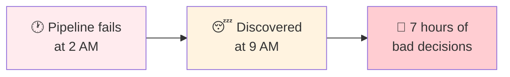
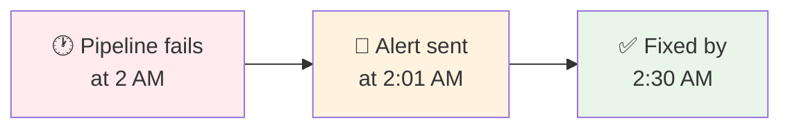
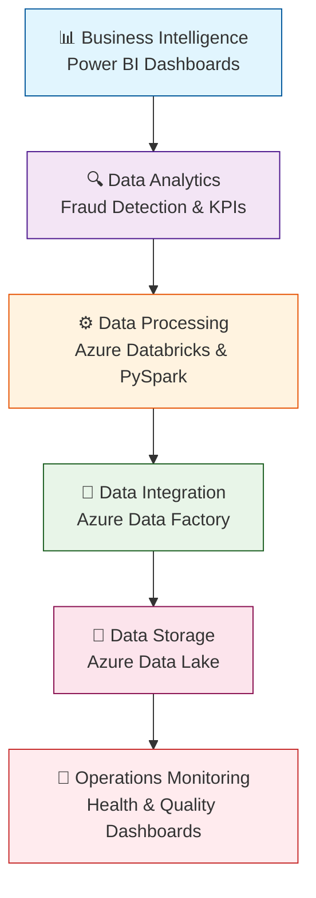

# L04B: Power BI Operations and Monitoring

**Duration:** 120-150 minutes (2-2.5 hours)

## Introduction

**"From Dashboards to Data Operations Excellence"**

In the previous lesson, you built fraud detection dashboards that provide immediate business value. Executives can now monitor fraud patterns, risk managers can track suspicious activity, and compliance teams have real-time insights.

But here's the next challenge: **What happens when your data pipelines fail at 2 AM? How do you ensure your fraud detection system is always running? How do you prevent data quality issues before they impact business decisions?**

**The Reality of Production Data Engineering:**
- Data pipelines fail silently
- Poor data quality causes wrong business decisions
- Manual monitoring doesn't scale
- Downtime costs thousands per hour

**What You're About to Master:**
Today, you'll transform from building business dashboards to creating operational monitoring systems. You'll build the same type of pipeline health monitoring that keeps enterprise data platforms running 24/7.

**Your Journey Today:**
- **Understand data pipelines**: Learn what can go wrong and why monitoring matters
- **Build pipeline health dashboards**: Real-time monitoring that prevents disasters
- **Create data quality scorecards**: Catch issues before they impact business
- **Deploy enterprise security**: Production-ready access controls and automation

**The Challenge:**
By the end of today's lesson, you'll have built comprehensive operations dashboards that monitor your entire data engineering stack. You'll be able to detect and prevent issues before they impact business users.

Ready to become a data operations expert? Let's build monitoring that never sleeps.

## Learning Outcomes
By the end of this lesson, students will be able to:
- Understand data pipeline architecture and failure scenarios
- Build comprehensive pipeline health monitoring dashboards
- Create data quality scorecards and alerting systems
- Configure enterprise-grade security and automated refresh schedules
- Implement best practices for production deployment

## Prerequisites
- Completion of L04A: Power BI Fraud Detection Dashboard
- Active Power BI connection to Databricks
- Understanding of data pipeline concepts from previous labs

---

## Lesson Content

### Understanding Data Pipelines and Monitoring Strategy (25 minutes)

#### What Are Data Pipelines?

A **data pipeline** is an automated series of steps that move data from source systems to destination systems, transforming it along the way. Think of it like an assembly line for data:



In our banking context, here's what our pipeline looks like:


#### Why Do We Need Data Pipelines?

**1. Volume Challenge**
- Modern banks process millions of transactions daily
- Manual data processing is impossible at this scale
- Automated pipelines run 24/7 without human intervention

**2. Speed Requirements**
- Fraud must be detected in near real-time
- Business decisions need fresh data
- Manual processes take hours; pipelines take minutes

**3. Consistency and Reliability**
- Humans make mistakes; pipelines follow exact rules
- Same transformation logic applied every time
- Reduces data quality issues

**4. Integration Complexity**
- Data comes from multiple sources (ATMs, online banking, mobile apps)
- Different formats need to be standardized
- Pipelines handle format conversions automatically

#### Our Banking Pipeline Architecture

In the previous labs, we built a pipeline with these stages:

**Stage 1: Data Extraction (Lab 01)**
```python
# Extract raw transaction data
raw_transactions = spark.read.csv("transactions.csv")
```
- **Purpose**: Get data from source systems
- **Challenge**: Data is in different formats
- **Solution**: Standardize column names and data types

**Stage 2: Data Transformation (Lab 02)**
```python
# Apply fraud detection rules
fraud_flagged = raw_transactions.withColumn(
    "fraud_flag",
    when(col("amount") > 10000, 1).otherwise(0)
)
```
- **Purpose**: Apply business logic
- **Challenge**: Complex rules need to be applied consistently
- **Solution**: Automated rule engine

**Stage 3: Data Enrichment (Lab 03)**
```python
# Add customer demographics
enriched_data = fraud_flagged.join(customer_profiles, "customer_id")
```
- **Purpose**: Add context to raw data
- **Challenge**: Data scattered across multiple systems
- **Solution**: Automated joins and lookups

**Stage 4: Data Loading**
```python
# Save to analytics-ready format
enriched_data.write.mode("overwrite").saveAsTable("fraud_analytics")
```
- **Purpose**: Make data available for analysis
- **Challenge**: Optimize for different query patterns
- **Solution**: Structured storage formats

#### Pipeline Failure Scenarios

Understanding what can go wrong helps us understand why monitoring is crucial:

**Common Failure Patterns:**

1. **Silent Data Loss**
   - Source system changes schema
   - Pipeline continues running but produces incorrect results
   - Business users make decisions on bad data

2. **Performance Degradation**
   - Pipeline takes longer each day
   - Eventually fails due to timeouts
   - Downstream processes start failing

3. **Data Quality Issues**
   - Null values increase suddenly
   - Duplicate records appear
   - Invalid data passes validation

4. **Dependency Failures**
   - Upstream system goes down
   - Pipeline waits indefinitely
   - All downstream processes stop

#### Why Monitor Pipeline Health?

**Business Impact of Pipeline Failures:**

- **Fraud Detection Stops**: Criminals can exploit the gap
- **Regulatory Reporting Fails**: Legal compliance at risk
- **Customer Experience Degrades**: Account balances not updated
- **Revenue Loss**: Marketing campaigns use stale data

**Detection vs. Prevention:**

Without monitoring, you might discover failures hours or days later:



With monitoring, you catch issues immediately:



**What We Monitor:**

1. **Execution Status**: Did each step complete successfully?
2. **Data Volume**: Are we processing the expected number of records?
3. **Processing Time**: Is the pipeline running slower than usual?
4. **Data Quality**: Are there unexpected null values or outliers?
5. **Freshness**: How old is our latest data?

### Creating Pipeline Metrics in Databricks (30 minutes)

#### Building Pipeline Health Tables

**Step 1: Create Pipeline Health Tracking**

Before building monitoring in Power BI, we need to create health metrics in Databricks:

```python
# In a new Databricks notebook
from datetime import datetime
import pyspark.sql.functions as F

# Create pipeline health tracking
pipeline_health = spark.sql("""
    CREATE OR REPLACE TEMP VIEW pipeline_health_metrics AS
    SELECT
        'fraud_detection_pipeline' as pipeline_name,                            -- Give our pipeline a name so we can track multiple pipelines
        current_timestamp() as last_run_time,                                   -- Record when this health check was created (right now)
        (SELECT COUNT(*) FROM fraud_flagged_transactions) as total_records,     -- Count how many total transaction records we have
        (SELECT COUNT(*) FROM fraud_flagged_transactions WHERE fraud_flag = 1) as fraud_records,  -- Count how many of those transactions are marked as fraud
        (SELECT MAX(transaction_date) FROM fraud_flagged_transactions) as latest_data_date,        -- Find the newest transaction date in our data
        (SELECT MIN(transaction_date) FROM fraud_flagged_transactions) as earliest_data_date,      -- Find the oldest transaction date in our data
        'SUCCESS' as pipeline_status,                                           -- Mark that our pipeline ran successfully
        99.2 as data_quality_score                                              -- Give our data a quality score out of 100
""")

# Save as permanent table
spark.sql("""
    CREATE OR REPLACE TABLE pipeline_health_tracking AS
    SELECT * FROM pipeline_health_metrics                              -- Copy all the data from our temporary view into a permanent table (* means "get all columns")
""")

print("Pipeline health table created successfully!")
```

**Step 2: Create Data Quality Metrics**

```python
# Add comprehensive data quality metrics
data_quality_metrics = spark.sql("""
    CREATE OR REPLACE TABLE data_quality_summary AS
    SELECT
        'transactions' as table_name,                                               -- Name the table we're checking
        COUNT(*) as total_rows,                                                     -- Count total number of rows in our table
        COUNT(*) - COUNT(transaction_id) as missing_transaction_ids,                -- Count how many rows are missing transaction IDs (total rows minus rows that have transaction IDs)
        COUNT(*) - COUNT(amount) as missing_amounts,                                -- Count how many rows are missing transaction amounts
        COUNT(*) - COUNT(merchant) as missing_merchants,                            -- Count how many rows are missing merchant names
        AVG(CASE WHEN amount > 0 THEN 1.0 ELSE 0.0 END) * 100 as valid_amounts_pct, -- Calculate what percent of transactions have positive amounts (negative amounts might be errors)
        current_timestamp() as measured_at                                          -- Record when we ran this quality check
    FROM fraud_flagged_transactions
""")

print("Data quality metrics created!")
```

**Step 3: Create Processing Time Tracking**

```python
# Track ETL processing times with realistic dynamic data
from datetime import datetime, timedelta

# Calculate realistic processing times
base_time = datetime.now()
extract_start = base_time - timedelta(hours=2)
extract_end = extract_start + timedelta(minutes=5, seconds=23)
fraud_start = extract_end
fraud_end = fraud_start + timedelta(minutes=7, seconds=22)
enrich_start = fraud_end
enrich_end = enrich_start + timedelta(minutes=5, seconds=27)

processing_times = spark.createDataFrame([
    ('extract_transactions', extract_start, extract_end, int((extract_end - extract_start).total_seconds()), 1000000, 'SUCCESS'),
    ('fraud_detection', fraud_start, fraud_end, int((fraud_end - fraud_start).total_seconds()), 1000000, 'SUCCESS'),
    ('customer_enrichment', enrich_start, enrich_end, int((enrich_end - enrich_start).total_seconds()), 1000000, 'SUCCESS')
], ['step_name', 'start_time', 'end_time', 'duration_seconds', 'records_processed', 'status'])

# Save processing times
processing_times.write.mode("overwrite").saveAsTable("etl_processing_times")

print("Processing time tracking created!")
```

**Step 4: Create Data Freshness Metrics**

```python
# Track data freshness across different data sources
freshness_metrics = spark.sql("""
    CREATE OR REPLACE TABLE data_freshness_tracking AS
    SELECT
        'transactions' as data_source,                                          -- Name of our data source
        MAX(transaction_date) as latest_record_date,                            -- Find the newest transaction in our data
        current_timestamp() as check_time,                                      -- When we ran this freshness check
        DATEDIFF(HOUR, MAX(transaction_date), current_timestamp()) as hours_behind -- How many hours behind real-time our data is
    FROM fraud_flagged_transactions
    UNION ALL
    SELECT
        'customer_profiles' as data_source,                                     -- Check customer data freshness too
        MAX(last_updated) as latest_record_date,                                -- Assuming customer profiles have a last_updated field
        current_timestamp() as check_time,
        DATEDIFF(HOUR, MAX(last_updated), current_timestamp()) as hours_behind
    FROM customer_transaction_profiles
""")

print("Data freshness tracking created!")
```

### Building Pipeline Health Dashboard (45 minutes)

#### Connecting to Operations Data

**Step 1: Add Operations Tables to Power BI**

In Power BI Desktop:

1. **Click** "Get Data" → "More"
2. **Select** "Azure Databricks" → "Connect"
3. **Use** your existing connection
4. **Add** the new tables:
   - `pipeline_health_tracking`
   - `data_quality_summary`
   - `etl_processing_times`
   - `data_freshness_tracking`
5. **Load** the data

#### Building Executive Operations Dashboard

**Step 2: Pipeline Status Overview**

1. **Insert** → "Card" visualization
2. **Drag** `pipeline_status` field to the card
3. **Format** with conditional colors:

```
Conditional formatting → Background color:
- GREEN if status = "SUCCESS"
- RED if status = "FAILED"
- YELLOW if status = "RUNNING"
- ORANGE if status = "WARNING"
```

4. **Set** title to "Pipeline Status"

**Step 3: Last Run Time Indicator**

1. **Insert** → "Card" visualization
2. **Drag** `last_run_time` to the card
3. **Format** the time display:

```
Format → Values → Display units: None
Format → Data label → Custom format: "MMM DD, YYYY HH:mm"
Title: "Last Pipeline Run"
```

**Step 4: Data Volume Summary**

1. **Insert** → "Multi-row card"
2. **Add** fields from `pipeline_health_tracking`:

```
Fields:
- total_records (format as thousands with commas)
- fraud_records (format as thousands)
- data_quality_score (format as percentage)
```

3. **Format** each card with appropriate colors:
```
total_records: Blue background
fraud_records: Red background
data_quality_score: Green background (if >95%), Yellow (90-95%), Red (<90%)
```

#### Processing Performance Monitoring

**Step 5: Processing Time Trends**

1. **Insert** → "Clustered column chart"
2. **Configure** the chart:

```
X-axis: step_name
Y-axis: duration_seconds
Title: "ETL Step Processing Times (Seconds)"
Data labels: Show values
```

3. **Add** target line for acceptable performance:
```
Analytics → Constant line → Value: 600 (10 minutes max acceptable)
Line color: Red
```

**Step 6: Records Processed Verification**

1. **Insert** → "Gauge" visualization
2. **Configure** the gauge:

```
Value: records_processed
Minimum: 0
Maximum: 1200000 (120% of expected volume)
Target: 1000000 (expected daily volume)
Colors:
- Red: 0-800000 (Low volume - potential data loss)
- Yellow: 800000-950000 (Below normal)
- Green: 950000-1050000 (Normal range)
- Orange: 1050000+ (Higher than expected)
```

#### Data Quality Monitoring

**Step 7: Data Completeness Dashboard**

1. **Insert** → "Funnel" chart
2. **Configure** the chart using calculated measures:

```dax
Complete Records =
VAR TotalRows = SUM(data_quality_summary[total_rows])
VAR CompleteIDs = TotalRows - SUM(data_quality_summary[missing_transaction_ids])
VAR CompleteAmounts = TotalRows - SUM(data_quality_summary[missing_amounts])
VAR CompleteMerchants = TotalRows - SUM(data_quality_summary[missing_merchants])
RETURN CompleteIDs
```

Create similar measures for each data completeness level, then build funnel showing:
- Total Records (top)
- Complete Transaction IDs
- Complete Amounts
- Complete Merchants (bottom)

**Step 8: Data Quality Score Trends**

1. **Insert** → "Line chart"
2. **Configure** the chart:

```
X-axis: measured_at (from data_quality_summary)
Y-axis: data_quality_score
Title: "Data Quality Score Over Time"
Target line: 95% (minimum acceptable quality)
```

3. **Add** conditional formatting for the line:
```
Green: Score > 95%
Yellow: Score 90-95%
Red: Score < 90%
```

#### Data Freshness Monitoring

**Step 9: Data Freshness Cards**

1. **Insert** → "Card" visualization for each data source
2. **Create** calculated measure:

```dax
Data Freshness Status =
VAR HoursBehind = MAX(data_freshness_tracking[hours_behind])
RETURN
    IF(HoursBehind <= 6, "FRESH",
       IF(HoursBehind <= 24, "ACCEPTABLE",
          "STALE"))
```

3. **Format** cards with conditional colors:
```
FRESH: Green background
ACCEPTABLE: Yellow background
STALE: Red background
```

**Step 10: Freshness Trend Analysis**

1. **Insert** → "Line chart"
2. **Configure** the chart:

```
X-axis: check_time
Y-axis: hours_behind
Legend: data_source (to show multiple data sources)
Title: "Data Freshness Over Time (Hours Behind)"
```

3. **Add** reference lines:
```
6 hours: Acceptable freshness (green line)
24 hours: Warning threshold (yellow line)
48 hours: Critical threshold (red line)
```

### Advanced Dashboard Deployment and Security (45 minutes)

#### Enterprise-Grade Refresh Configuration

**Step 1: Publish Operations Dashboard**

1. **Click** "Publish" in Power BI Desktop
2. **Select** "Operations Monitoring" workspace (create if needed)
3. **Wait** for publish to complete

**Step 2: Configure Automated Refresh**

In Power BI Service:

1. **Navigate** to Datasets → Your Operations Dataset
2. **Click** "..." → "Settings"
3. **Configure** refresh schedule:

```
Refresh Schedule:
- Frequency: Every 15 minutes (for real-time monitoring)
- Days: Monday through Sunday
- Times: Every 15 minutes from 00:00 to 23:45
- Time zone: Your local time zone
- Notify on failure: Yes
- Send failure notifications to: [Operations team emails]
```

**Step 3: Gateway Configuration for High Availability**

1. **Install** Power BI Gateway on dedicated server
2. **Configure** for high availability:

```
Gateway Settings:
- Install on multiple servers for redundancy
- Configure load balancing
- Set up monitoring for gateway health
- Configure automatic failover
```

#### Role-Based Security Implementation

**Step 4: Create Security Roles**

In Power BI Service:

1. **Go to** Dataset → Security
2. **Create** roles for different user types:

**Operations Team Role:**
```dax
-- Operations team can see all pipeline data
Operations Filter = TRUE()
```

**Executive Team Role:**
```dax
-- Executives see only summary metrics, not detailed logs
Executive Filter = [table_name] IN ("pipeline_health_tracking", "data_quality_summary")
```

**Regional Managers Role:**
```dax
-- Regional managers see only their region's data
Regional Filter = [customer_state] = USERNAME()
```

**Step 5: Implement Row-Level Security**

1. **Add** users to appropriate roles:

```
Operations Role:
- data-engineers@company.com
- devops-team@company.com

Executive Role:
- cto@company.com
- vp-data@company.com

Regional Managers:
- manager-east@company.com (sees only Eastern states)
- manager-west@company.com (sees only Western states)
```

#### Alerting and Monitoring Setup

**Step 6: Configure Critical Alerts**

1. **Create** Data Alerts in Power BI:

```
Alert Conditions:
- Pipeline Status ≠ "SUCCESS" → Immediate alert
- Data Quality Score < 90% → Immediate alert
- Processing Time > 10 minutes → Warning alert
- Data Freshness > 6 hours → Warning alert
```

2. **Set** alert recipients:
```
Critical Alerts: Operations team + Manager on-call
Warning Alerts: Operations team only
```

**Step 7: Mobile Dashboard Configuration**

1. **Configure** Power BI Mobile:
```
Mobile Layout:
- Pipeline status (large card at top)
- Key metrics (2x2 grid)
- Critical charts only
- Push notifications enabled
```

#### Performance Optimization

**Step 8: Query Performance Optimization**

1. **Optimize** DirectQuery performance:

```sql
-- In Databricks, create optimized views for Power BI
CREATE OR REPLACE VIEW pbi_pipeline_summary AS
SELECT
    pipeline_name,
    last_run_time,
    pipeline_status,
    total_records,
    data_quality_score
FROM pipeline_health_tracking
WHERE last_run_time >= current_date() - interval 7 days; -- Only last 7 days for performance
```

2. **Configure** incremental refresh:
```
Incremental Refresh Policy:
- Archive data: 2 years
- Refresh data: 7 days
- Detect data changes: Yes
- Only refresh complete periods: Yes
```

**Step 9: Cost Management**

1. **Monitor** Power BI usage:
```
Usage Metrics:
- Track daily active users
- Monitor query volumes
- Identify expensive operations
- Set up cost alerts
```

2. **Optimize** Databricks costs:
```
Cluster Configuration:
- Auto-terminate after 30 minutes idle
- Use spot instances for development
- Schedule clusters for business hours only
- Monitor compute costs weekly
```

### Production Best Practices (25 minutes)

#### Disaster Recovery Planning

**Step 1: Backup Strategy**

1. **Export** Power BI reports regularly:
```
Backup Schedule:
- Daily: Export .pbix files to secure storage
- Weekly: Full workspace backup
- Monthly: Archive previous versions
```

2. **Document** recovery procedures:
```
Recovery Plan:
- Data source connection strings
- Service principal credentials
- User permission mappings
- Custom DAX measures and calculations
```

#### Change Management

**Step 2: Development Lifecycle**

1. **Implement** environment separation:
```
Environment Strategy:
- Development: Personal workspaces for testing
- Staging: Pre-production validation
- Production: Live business dashboards
```

2. **Version control** for reports:
```
Version Control:
- Use Git for .pbix files (with Git LFS)
- Tag releases with version numbers
- Maintain change logs
- Test all changes in staging first
```

#### Monitoring the Monitors

**Step 3: Meta-Monitoring Setup**

1. **Monitor** Power BI itself:
```
Meta-Monitoring:
- Gateway health checks
- Refresh success rates
- Query performance metrics
- User access patterns
```

2. **Create** operational runbooks:
```
Runbook Contents:
- Common failure scenarios and solutions
- Escalation procedures
- Contact information
- Recovery time objectives (RTO)
```

## Conclusion and Next Steps

**What You've Accomplished:**

Today, you've built enterprise-grade operational monitoring that ensures your data engineering systems run reliably 24/7. You've created:

- **Comprehensive pipeline health monitoring** that prevents data disasters
- **Data quality scorecards** that catch issues before they impact business
- **Real-time alerting systems** that enable immediate response to problems
- **Enterprise security and governance** for production deployment

**Career Impact:**

You now possess the complete skill set of a senior data engineer:
- **Technical Excellence:** Building robust data pipelines with Databricks and PySpark
- **Business Value Delivery:** Creating fraud detection dashboards that drive decisions
- **Operational Excellence:** Monitoring and maintaining production systems
- **Enterprise Readiness:** Security, governance, and disaster recovery planning

**The Complete Data Engineering Stack You've Mastered:**



**Your Portfolio Projects:**

Document these achievements in your portfolio:

1. **Fraud Detection System**: End-to-end pipeline from raw transactions to executive dashboards
2. **Operations Monitoring Platform**: Enterprise-grade monitoring and alerting system
3. **Azure Data Engineering Stack**: Complete implementation of modern data platform

**Next Steps for Continued Growth:**

1. **Advanced Analytics**: Machine learning integration with Azure ML
2. **Real-time Processing**: Stream processing with Azure Event Hubs
3. **Data Mesh Architecture**: Decentralized data ownership patterns
4. **MLOps Pipelines**: Automated model training and deployment
5. **Multi-cloud Strategy**: Integration with AWS and Google Cloud platforms

**You're Ready for Senior Roles:**

With the skills you've developed, you're prepared for:
- **Senior Data Engineer** positions at major companies
- **Data Platform Architect** roles building enterprise systems
- **Technical Lead** positions managing data engineering teams
- **Consulting** opportunities helping companies modernize their data stack

Congratulations on mastering the complete data engineering lifecycle from raw data to business intelligence to operational excellence!