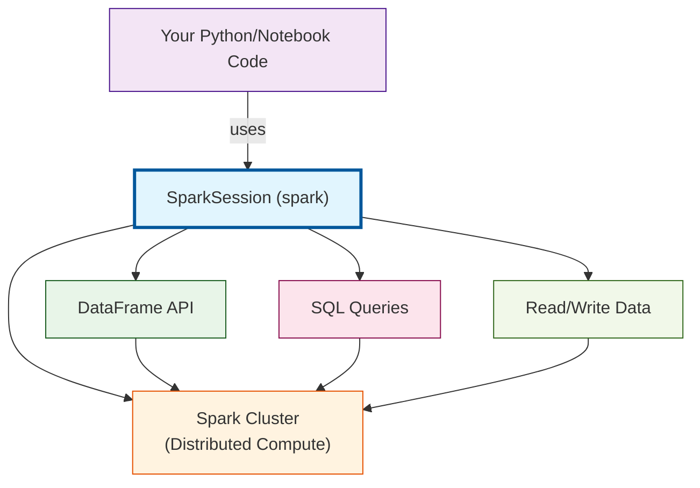
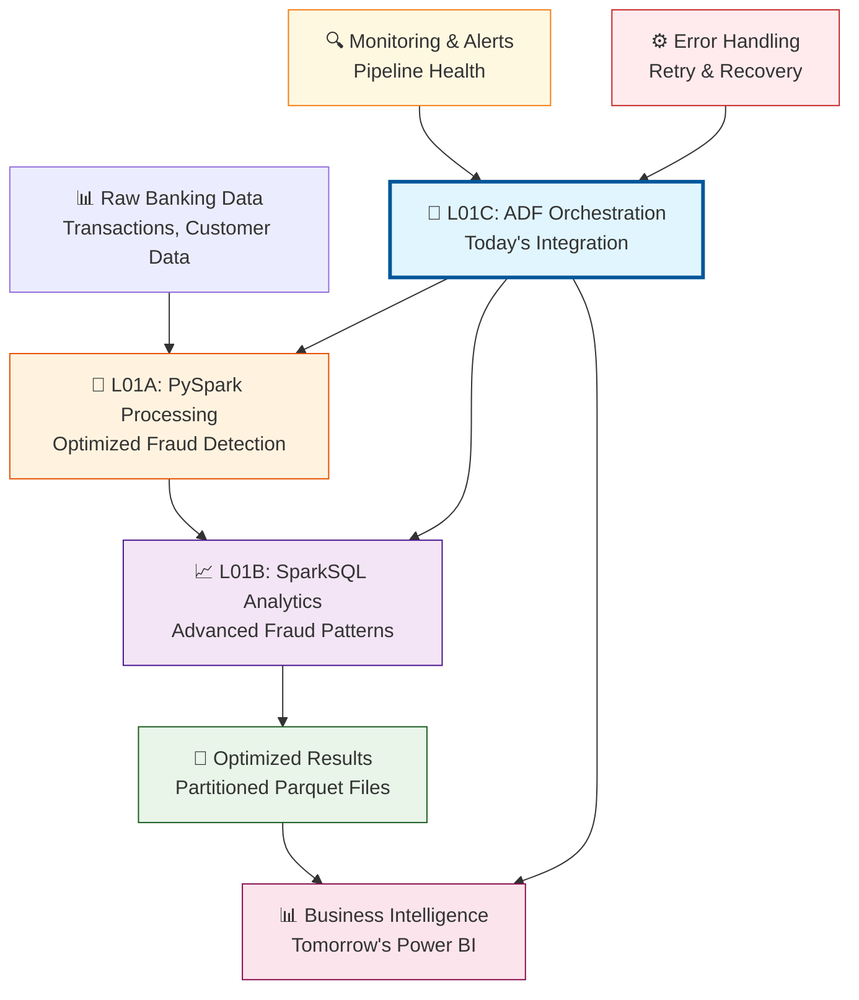

# L01C: Azure Data Factory Integration Patterns

**Duration:** 180 minutes (3 hours)


## Introduction

**"The difference between a data engineer who builds one-off scripts and one who builds enterprise data platforms is understanding orchestration, error handling, and data integration patterns."**

In L01A and L01B, you transformed your individual PySpark jobs and SparkSQL queries from basic functional code into optimized, production-ready components. You now have a robust fraud detection pipeline with proper error handling and performance optimization. But here's the enterprise reality: **individual components, no matter how well-optimized, don't create production data platforms.**

Production data engineering requires orchestrating multiple optimized components, handling failures gracefully across the entire workflow, and integrating disparate systems reliably. This is where Azure Data Factory transforms your collection of optimized processing jobs into an enterprise-grade data platform.

**Building on Your L01A & L01B Foundation:**
- ✅ You have optimized PySpark jobs with proper error handling (L01A)
- ✅ You have efficient SparkSQL queries for complex analytics (L01B)
- ✅ You understand performance optimization and resource management
- 🎯 **Today's Goal:** Orchestrate these components into an integrated platform

**What You're About to Master:**
Today, you'll evolve from building individual optimized data processing jobs to designing integrated data pipelines that orchestrate your fraud detection components, handle errors systematically across the entire workflow, and scale with enterprise requirements.

**Your Journey Today:**
- **Orchestrate**: Your optimized L01A/L01B components into cohesive workflows
- **Scale**: Error handling and retry logic across multi-component pipelines
- **Monitor**: End-to-end pipeline execution with detailed logging and alerting
- **Optimize**: Resource usage and cost management for integrated workloads

**The Challenge:**
By the end of today's lesson, you'll have built a production-ready data integration platform that orchestrates your optimized fraud detection components from L01A and L01B, processes banking data from multiple sources reliably, and delivers results to analytical systems—transforming individual excellence into platform excellence.

Ready to transform from component optimizer to platform architect? Let's orchestrate your optimized components into enterprise systems.


## What is SparkSession?

**SparkSession** is the main entry point for working with Spark in Databricks and PySpark. It lets you create DataFrames, run SQL, read and write data, and connect to Spark's distributed cluster.

- In Databricks notebooks, a SparkSession named `spark` is already available for you.
- If you run PySpark code outside Databricks, you need to create it yourself:

```python
from pyspark.sql import SparkSession
spark = SparkSession.builder.appName("MyApp").getOrCreate()
```

**Why does this matter?**
- All DataFrame, SQL, and data operations require a SparkSession.
- In Databricks, just use the `spark` object in any cell.
- If you see `NameError: name 'spark' is not defined`, make sure you're in Databricks or have created a SparkSession.

**How SparkSession fits in your workflow:**




## Learning Outcomes

By the end of this lesson, students will be able to:
- Design and implement robust Azure Data Factory pipelines with comprehensive error handling
- Create parameterized, reusable workflows that adapt to multiple data sources and schedules
- Implement monitoring, logging, and alerting systems for production data integration
- Optimize ADF pipeline performance and cost management for enterprise-scale workloads
- Integrate ADF with Azure Databricks for end-to-end data processing workflows


## Prerequisites

- Completion of L01A: Azure Databricks Deep Dive Review
- Completion of L01B: SparkSQL Mastery Workshop
- Understanding of basic Azure Data Factory concepts from Week 5
- Access to Azure subscription with Data Factory and Databricks resources


---


## Lesson Content

### Orchestrating Your L01A and L01B Components (45 minutes)

#### Step 1: Review Your Optimized Fraud Detection Components

**Let's start by inventorying what you've built in L01A and L01B.** You now have sophisticated, optimized components that need enterprise orchestration:

**From L01A - Production-Ready PySpark Components:**
- ✅ Optimized fraud detection pipeline with explicit schemas
- ✅ Comprehensive error handling and logging
- ✅ Strategic caching and memory management
- ✅ Performance monitoring and cost optimization

**From L01B - Advanced SparkSQL Analytics:**
- ✅ Optimized fraud detection queries with broadcast joins
- ✅ Advanced window functions for customer behavior analysis
- ✅ Production-ready SQL patterns with data quality monitoring
- ✅ High-performance analytical queries

**Today's Challenge:** Orchestrate these components into an integrated enterprise platform.


#### Step 2: From Individual Components to Integrated Platform

**Your L01A/L01B Architecture vs. Enterprise Requirements:**




#### Step 3: Orchestrating Your Fraud Detection Components

**ADF Pipeline to Integrate Your L01A and L01B Work:**

```json
{
  "name": "fraud-detection-integrated-pipeline",
  "properties": {
    "description": "Orchestrates L01A PySpark and L01B SparkSQL components for complete fraud detection",
    "activities": [
      {
        "name": "ExecuteL01A_OptimizedProcessing",
        "type": "DatabricksNotebook",
        "typeProperties": {
          "notebookPath": "/Notebooks/L01A_ProductionFraudDetection",
          "baseParameters": {
            "inputPath": "@pipeline().parameters.rawDataPath",
            "outputPath": "@pipeline().parameters.processedDataPath",
            "processDate": "@formatDateTime(pipeline().TriggerTime, 'yyyy-MM-dd')"
          }
        },
        "policy": {
          "timeout": "1:00:00",
          "retry": 2,
          "retryIntervalInSeconds": 300
        }
      },
      {
        "name": "ExecuteL01B_AdvancedAnalytics",
        "type": "DatabricksNotebook",
        "dependsOn": [
          {
            "activity": "ExecuteL01A_OptimizedProcessing",
            "dependencyConditions": ["Succeeded"]
          }
        ],
        "typeProperties": {
          "notebookPath": "/Notebooks/L01B_FraudAnalytics",
          "baseParameters": {
            "inputPath": "@activity('ExecuteL01A_OptimizedProcessing').output.runOutput.outputPath",
            "analyticsOutputPath": "@pipeline().parameters.analyticsOutputPath",
            "processDate": "@formatDateTime(pipeline().TriggerTime, 'yyyy-MM-dd')"
          }
        },
        "policy": {
          "timeout": "1:30:00",
          "retry": 2,
          "retryIntervalInSeconds": 300
        }
      }
    ],
    "parameters": {
      "rawDataPath": {
        "type": "String",
        "defaultValue": "/banking/raw/transactions/"
      },
      "processedDataPath": {
        "type": "String",
        "defaultValue": "/banking/processed/fraud_detection/"
      },
      "analyticsOutputPath": {
        "type": "String",
        "defaultValue": "/banking/analytics/fraud_patterns/"
      }
    }
  }
}
```


**Core Pattern 2: Error Handling and Retry Framework**

```json
{
  "name": "robust-databricks-activity",
  "type": "DatabricksNotebook",
  "policy": {
    "timeout": "1:00:00",
    "retry": 3,
    "retryIntervalInSeconds": 300
  },
  "typeProperties": {
    "notebookPath": "/Notebooks/ProcessBankingData",
    "baseParameters": {
      "inputPath": "@pipeline().parameters.inputPath",
      "outputPath": "@pipeline().parameters.outputPath",
      "processDate": "@formatDateTime(pipeline().TriggerTime, 'yyyy-MM-dd')"
    }
  },
  "onFailureActivities": [
    {
      "name": "SendFailureNotification",
      "type": "WebActivity",
      "typeProperties": {
        "url": "https://prod-webhook.logic.azure.com/workflows/...",
        "method": "POST",
        "body": {
          "pipeline": "@pipeline().Pipeline",
          "runId": "@pipeline().RunId",
          "error": "@activity('robust-databricks-activity').error.message",
          "timestamp": "@utcnow()"
        }
      }
    }
  ]
}
```


### Hands-On Exercise: Build Your Integrated Fraud Detection Platform (60 minutes)

#### Exercise 1: Create ADF Pipeline for Your L01A/L01B Components (20 minutes)

**Your Task:** Build an ADF pipeline that orchestrates your actual L01A and L01B work.

```python
def create_integrated_pipeline_exercise():
    """
    EXERCISE: Create ADF pipeline to orchestrate your L01A and L01B components
    """

    print("🏗️  BUILDING INTEGRATED FRAUD DETECTION PLATFORM")
    print("=" * 60)

    # Step 1: Inventory your L01A and L01B deliverables
    print("📋 Step 1: Review your components")
    print("L01A Components:")
    print("  ✅ Production fraud detection notebook")
    print("  ✅ Optimized cluster configuration")
    print("  ✅ Error handling and logging")

    print("L01B Components:")
    print("  ✅ Advanced fraud analytics SQL queries")
    print("  ✅ Customer behavior analysis")
    print("  ✅ Performance-optimized joins")

    # Step 2: Design integration workflow
    print("\n🔗 Step 2: Design integration workflow")
    integration_workflow = {
        "step_1": "Execute L01A optimized PySpark processing",
        "step_2": "Execute L01B advanced SQL analytics on L01A output",
        "step_3": "Generate integrated fraud insights",
        "step_4": "Prepare data for Power BI consumption"
    }

    for step, description in integration_workflow.items():
        print(f"  {step}: {description}")

    # TODO: Students implement their ADF pipeline design
    print("\n🎯 YOUR TASK:")
    print("1. Create ADF pipeline JSON for your specific L01A/L01B notebooks")
    print("2. Define parameters for your data paths")
    print("3. Set up dependencies between L01A and L01B activities")
    print("4. Configure error handling and retry policies")

    return "Integration pipeline design exercise ready"

# Students complete this during guided walkthrough
# create_integrated_pipeline_exercise()
```


#### Exercise 2: Implement Error Handling for Your Integrated Pipeline (20 minutes)

**Your Task:** Add comprehensive error handling to your fraud detection pipeline.

```json
{
  "name": "robust-fraud-detection-activity",
  "type": "DatabricksNotebook",
  "typeProperties": {
    "notebookPath": "/Notebooks/YourL01A_FraudDetection",
    "baseParameters": {
      "inputPath": "@pipeline().parameters.inputPath",
      "outputPath": "@pipeline().parameters.outputPath",
      "processDate": "@formatDateTime(pipeline().TriggerTime, 'yyyy-MM-dd')"
    }
  },
  "policy": {
    "timeout": "1:00:00",
    "retry": 3,
    "retryIntervalInSeconds": 300
  },
  "onFailureActivities": [
    {
      "name": "SendFraudDetectionFailureAlert",
      "type": "WebActivity",
      "typeProperties": {
        "url": "https://your-webhook-url/fraud-alerts",
        "method": "POST",
        "body": {
          "alert_type": "pipeline_failure",
          "pipeline": "@pipeline().Pipeline",
          "runId": "@pipeline().RunId",
          "failed_activity": "fraud-detection-processing",
          "error": "@activity('robust-fraud-detection-activity').error.message",
          "timestamp": "@utcnow()",
          "data_date": "@formatDateTime(pipeline().TriggerTime, 'yyyy-MM-dd')"
        }
      }
    }
  ]
}
```


#### Exercise 3: Performance Monitoring and Cost Optimization (20 minutes)

**Your Task:** Implement monitoring for your integrated fraud detection platform.

```python
def implement_monitoring_exercise():
    """
    EXERCISE: Add monitoring to your integrated fraud detection platform
    """

    print("📊 MONITORING YOUR INTEGRATED PLATFORM")
    print("=" * 50)

    # Monitoring metrics for your fraud detection pipeline
    monitoring_metrics = {
        "l01a_metrics": [
            "Processing time for PySpark fraud detection",
            "Number of transactions processed",
            "Number of high-risk transactions flagged",
            "Data quality score",
            "Memory usage and cluster efficiency"
        ],
        "l01b_metrics": [
            "SQL query execution time",
            "Advanced analytics processing duration",
            "Customer behavior patterns detected",
            "Query optimization effectiveness",
            "Join performance improvements"
        ],
        "integration_metrics": [
            "End-to-end pipeline duration",
            "Data handoff success rate between L01A and L01B",
            "Overall fraud detection accuracy",
            "Cost per processed transaction",
            "Pipeline reliability (success rate)"
        ]
    }

    for category, metrics in monitoring_metrics.items():
        print(f"\n📈 {category.replace('_', ' ').title()}:")
        for metric in metrics:
            print(f"  • {metric}")

    # TODO: Students implement monitoring for their specific pipeline
    print("\n🎯 YOUR TASK:")
    print("1. Define KPIs for your L01A and L01B components")
    print("2. Set up alerting thresholds for your fraud detection pipeline")
    print("3. Create cost monitoring for your cluster usage")
    print("4. Implement data quality monitoring across L01A → L01B flow")

    return "Monitoring implementation exercise ready"

# Students complete this during guided walkthrough
# implement_monitoring_exercise()
```


### Advanced Error Handling and Monitoring Patterns (45 minutes)

#### Pattern 1: Multi-Level Error Handling for Your Fraud Detection Pipeline

```python
# Create error handling notebook for Databricks integration
# Notebook: /Notebooks/BankingDataProcessor

import logging
from datetime import datetime
import json

# Configure structured logging
logging.basicConfig(
    level=logging.INFO,
    format='%(asctime)s - %(name)s - %(levelname)s - %(message)s'
)
logger = logging.getLogger(__name__)

class DataProcessingError(Exception):
    """Custom exception for data processing errors"""
    pass

class DataQualityError(Exception):
    """Custom exception for data quality issues"""
    pass

def process_banking_data_with_error_handling(spark, input_path, output_path, process_date):
    """
    Process banking data with comprehensive error handling and monitoring
    """

    processing_metrics = {
        "process_date": process_date,
        "start_time": datetime.now().isoformat(),
        "input_path": input_path,
        "output_path": output_path,
        "status": "started"
    }

    try:
        logger.info(f"Starting banking data processing for {process_date}")

        # Stage 1: Data Ingestion with validation
        logger.info("Stage 1: Data ingestion")
        raw_data = spark.read.parquet(input_path)

        # Validate data exists
        if raw_data.count() == 0:
            raise DataProcessingError(f"No data found in {input_path}")

        processing_metrics["input_record_count"] = raw_data.count()
        logger.info(f"Loaded {processing_metrics['input_record_count']} records")

        # Stage 2: Data Quality Validation
        logger.info("Stage 2: Data quality validation")
        quality_issues = validate_data_quality(raw_data)

        if quality_issues["critical_issues"] > 0:
            raise DataQualityError(f"Critical data quality issues found: {quality_issues}")

        processing_metrics["quality_warnings"] = quality_issues["warnings"]

        # Stage 3: Data Transformation
        logger.info("Stage 3: Data transformation")
        transformed_data = apply_banking_transformations(raw_data)

        processing_metrics["output_record_count"] = transformed_data.count()

        # Stage 4: Data Persistence
        logger.info("Stage 4: Data persistence")
        transformed_data.write.mode("overwrite").parquet(output_path)

        processing_metrics["status"] = "completed"
        processing_metrics["end_time"] = datetime.now().isoformat()

        logger.info(f"Processing completed successfully: {processing_metrics}")

        # Write processing metrics for monitoring
        write_processing_metrics(spark, processing_metrics)

        return processing_metrics

    except DataQualityError as e:
        logger.error(f"Data quality error: {str(e)}")
        processing_metrics["status"] = "failed"
        processing_metrics["error_type"] = "data_quality"
        processing_metrics["error_message"] = str(e)
        processing_metrics["end_time"] = datetime.now().isoformat()

        # Write error metrics for monitoring
        write_processing_metrics(spark, processing_metrics)
        raise

    except DataProcessingError as e:
        logger.error(f"Data processing error: {str(e)}")
        processing_metrics["status"] = "failed"
        processing_metrics["error_type"] = "processing"
        processing_metrics["error_message"] = str(e)
        processing_metrics["end_time"] = datetime.now().isoformat()

        # Write error metrics for monitoring
        write_processing_metrics(spark, processing_metrics)
        raise

    except Exception as e:
        logger.error(f"Unexpected error: {str(e)}")
        processing_metrics["status"] = "failed"
        processing_metrics["error_type"] = "unexpected"
        processing_metrics["error_message"] = str(e)
        processing_metrics["end_time"] = datetime.now().isoformat()

        # Write error metrics for monitoring
        write_processing_metrics(spark, processing_metrics)
        raise

def validate_data_quality(df):
    """Validate data quality and return issues summary"""

    total_records = df.count()

    # Check for null values in critical fields
    null_transaction_ids = df.filter(df.transaction_id.isNull()).count()
    null_amounts = df.filter(df.amount.isNull()).count()
    null_dates = df.filter(df.transaction_date.isNull()).count()

    # Check for invalid values
    negative_amounts = df.filter(df.amount < 0).count()
    future_dates = df.filter(df.transaction_date > datetime.now()).count()

    # Calculate quality metrics
    critical_issues = null_transaction_ids + null_amounts + null_dates
    warnings = negative_amounts + future_dates

    quality_summary = {
        "total_records": total_records,
        "null_transaction_ids": null_transaction_ids,
        "null_amounts": null_amounts,
        "null_dates": null_dates,
        "negative_amounts": negative_amounts,
        "future_dates": future_dates,
        "critical_issues": critical_issues,
        "warnings": warnings,
        "quality_score": ((total_records - critical_issues - warnings) / total_records) * 100
    }

    logger.info(f"Data quality summary: {quality_summary}")
    return quality_summary

def apply_banking_transformations(df):
    """Apply banking-specific transformations"""

    from pyspark.sql.functions import col, when, current_timestamp

    # Add risk scoring
    transformed_df = df.withColumn(
        "risk_score",
        when(col("amount") > 10000, 90)
        .when(col("amount") > 5000, 70)
        .when(col("amount") > 1000, 50)
        .otherwise(20)
    ).withColumn(
        "risk_category",
        when(col("risk_score") >= 80, "HIGH")
        .when(col("risk_score") >= 60, "MEDIUM")
        .otherwise("LOW")
    ).withColumn(
        "processed_timestamp",
        current_timestamp()
    )

    return transformed_df

def write_processing_metrics(spark, metrics):
    """Write processing metrics to monitoring table"""

    from pyspark.sql.types import StructType, StructField, StringType, IntegerType, DoubleType

    # Convert metrics to DataFrame
    metrics_df = spark.createDataFrame([metrics])

    # Append to monitoring table
    metrics_df.write.mode("append").saveAsTable("banking_processing_metrics")

    logger.info("Processing metrics written to monitoring table")

# Execute the processing function
if __name__ == "__main__":
    # Get parameters from ADF
    input_path = dbutils.widgets.get("inputPath")
    output_path = dbutils.widgets.get("outputPath")
    process_date = dbutils.widgets.get("processDate")

    # Execute processing
    result = process_banking_data_with_error_handling(spark, input_path, output_path, process_date)

    # Return result for ADF monitoring
    dbutils.notebook.exit(json.dumps(result))
```


#### Advanced Monitoring and Alerting Configuration

**Pattern 1: Custom Metrics Collection**

```json
{
  "name": "CollectProcessingMetrics",
  "type": "Lookup",
  "typeProperties": {
    "source": {
      "type": "DeltaSource",
      "query": "SELECT COUNT(*) as total_records, AVG(quality_score) as avg_quality_score, MAX(end_time) as last_processed FROM banking_processing_metrics WHERE process_date = '@{formatDateTime(pipeline().TriggerTime, 'yyyy-MM-dd')}'"
    },
    "dataset": {
      "referenceName": "DeltaTable",
      "type": "DatasetReference"
    }
  }
}
```


**Pattern 2: Conditional Alerting Logic**

```json
{
  "name": "CheckProcessingHealth",
  "type": "IfCondition",
  "typeProperties": {
    "expression": {
      "value": "@less(activity('CollectProcessingMetrics').output.firstRow.avg_quality_score, 95)",
      "type": "Expression"
    },
    "ifTrueActivities": [
      {
        "name": "SendQualityAlert",
        "type": "WebActivity",
        "typeProperties": {
          "url": "https://hooks.slack.com/services/...",
          "method": "POST",
          "body": {
            "text": "⚠️ Data Quality Alert: Banking pipeline quality score below threshold",
            "attachments": [
              {
                "color": "warning",
                "fields": [
                  {
                    "title": "Pipeline",
                    "value": "@pipeline().Pipeline",
                    "short": true
                  },
                  {
                    "title": "Quality Score",
                    "value": "@activity('CollectProcessingMetrics').output.firstRow.avg_quality_score",
                    "short": true
                  },
                  {
                    "title": "Process Date",
                    "value": "@formatDateTime(pipeline().TriggerTime, 'yyyy-MM-dd')",
                    "short": true
                  }
                ]
              }
            ]
          }
        }
      }
    ]
  }
}
```


### Performance Optimization and Cost Management (75 minutes)

#### Optimizing ADF Pipeline Performance

**Pattern 1: Parallel Processing with Controlled Concurrency**

```json
{
  "name": "ProcessMultipleDataSources",
  "type": "ForEach",
  "typeProperties": {
    "items": "@pipeline().parameters.dataSources",
    "batchCount": 3,
    "activities": [
      {
        "name": "ProcessDataSource",
        "type": "ExecutePipeline",
        "typeProperties": {
          "pipeline": {
            "referenceName": "process-single-source",
            "type": "PipelineReference"
          },
          "parameters": {
            "sourceConfig": "@item()"
          },
          "waitOnCompletion": true
        }
      }
    ]
  }
}
```


**Pattern 2: Dynamic Resource Allocation**

```python
# Databricks notebook for dynamic cluster management
# Notebook: /Notebooks/DynamicClusterManager

def calculate_optimal_cluster_size(data_size_gb, processing_complexity="medium"):
    """
    Calculate optimal cluster configuration based on data size and complexity
    """

    # Base configuration
    base_config = {
        "spark_version": "12.2.x-scala2.12",
        "node_type_id": "i3.xlarge",
        "driver_node_type_id": "i3.xlarge"
    }

    # Adjust based on data size
    if data_size_gb < 1:
        # Small datasets - minimize cost
        base_config["num_workers"] = 1
        base_config["autotermination_minutes"] = 10

    elif data_size_gb < 10:
        # Medium datasets - balance cost and performance
        base_config["num_workers"] = 2
        base_config["autotermination_minutes"] = 15

    elif data_size_gb < 100:
        # Large datasets - optimize for performance
        base_config["num_workers"] = 4
        base_config["autotermination_minutes"] = 20
        base_config["node_type_id"] = "i3.2xlarge"

    else:
        # Very large datasets - use autoscaling
        base_config["min_workers"] = 2
        base_config["max_workers"] = 8
        base_config["autoscale"] = True
        base_config["node_type_id"] = "i3.2xlarge"

    # Adjust based on processing complexity
    if processing_complexity == "high":
        base_config["num_workers"] = base_config.get("num_workers", 2) * 2
        base_config["node_type_id"] = "i3.2xlarge"

    return base_config

# Usage in ADF pipeline
data_size = float(dbutils.widgets.get("dataSizeGB"))
complexity = dbutils.widgets.get("processingComplexity")

optimal_config = calculate_optimal_cluster_size(data_size, complexity)
print(f"Optimal cluster configuration: {optimal_config}")

# Return configuration for ADF to use
dbutils.notebook.exit(json.dumps(optimal_config))
```


#### Cost Optimization Strategies

**Strategy 1: Schedule-Based Resource Management**

```json
{
  "name": "ScheduleBasedProcessing",
  "type": "Switch",
  "typeProperties": {
    "on": {
      "value": "@formatDateTime(pipeline().TriggerTime, 'HH')",
      "type": "Expression"
    },
    "cases": [
      {
        "value": "02",
        "activities": [
          {
            "name": "NightlyFullProcessing",
            "type": "DatabricksNotebook",
            "typeProperties": {
              "notebookPath": "/Notebooks/FullDataRefresh",
              "existingClusterId": "@variables('LargeClusterId')"
            }
          }
        ]
      },
      {
        "value": "06",
        "activities": [
          {
            "name": "MorningIncrementalProcessing",
            "type": "DatabricksNotebook",
            "typeProperties": {
              "notebookPath": "/Notebooks/IncrementalUpdate",
              "existingClusterId": "@variables('SmallClusterId')"
            }
          }
        ]
      }
    ],
    "defaultActivities": [
      {
        "name": "HourlyLightProcessing",
        "type": "DatabricksNotebook",
        "typeProperties": {
          "notebookPath": "/Notebooks/RealTimeUpdate",
          "newClusterSpec": {
            "spark_version": "12.2.x-scala2.12",
            "node_type_id": "i3.large",
            "num_workers": 1,
            "autotermination_minutes": 5
          }
        }
      }
    ]
  }
}
```


**Strategy 2: Data Lifecycle Management**

```python
# Notebook: /Notebooks/DataLifecycleManager

from datetime import datetime, timedelta
import logging

logger = logging.getLogger(__name__)

def manage_data_lifecycle(spark, base_path, retention_days=90):
    """
    Manage data lifecycle with automatic archival and cleanup
    """

    try:
        # Get current date
        current_date = datetime.now()
        cutoff_date = current_date - timedelta(days=retention_days)

        logger.info(f"Managing data lifecycle for path: {base_path}")
        logger.info(f"Cutoff date: {cutoff_date}")

        # List all partitions
        partitions = spark.sql(f"""
            SHOW PARTITIONS delta.`{base_path}`
        """).collect()

        archived_partitions = []
        deleted_partitions = []

        for partition in partitions:
            partition_path = partition.partition

            # Extract date from partition path (assuming format: date=YYYY-MM-DD)
            try:
                date_str = partition_path.split('=')[1]
                partition_date = datetime.strptime(date_str, '%Y-%m-%d')

                if partition_date < cutoff_date:
                    # Archive old data to cheaper storage
                    archive_path = f"{base_path}/archive/{date_str}"

                    spark.sql(f"""
                        CREATE TABLE IF NOT EXISTS archive_banking_data_{date_str.replace('-', '_')}
                        USING DELTA
                        LOCATION '{archive_path}'
                        AS SELECT * FROM delta.`{base_path}` WHERE date = '{date_str}'
                    """)

                    archived_partitions.append(date_str)

                    # Delete from main table after successful archive
                    spark.sql(f"""
                        DELETE FROM delta.`{base_path}` WHERE date = '{date_str}'
                    """)

                    deleted_partitions.append(date_str)

            except Exception as e:
                logger.warning(f"Could not process partition {partition_path}: {str(e)}")

        # Run VACUUM to reclaim space
        spark.sql(f"VACUUM delta.`{base_path}` RETAIN 168 HOURS")  # Keep 7 days

        lifecycle_summary = {
            "processed_date": current_date.isoformat(),
            "retention_days": retention_days,
            "archived_partitions": len(archived_partitions),
            "deleted_partitions": len(deleted_partitions),
            "archived_dates": archived_partitions,
            "deleted_dates": deleted_partitions
        }

        logger.info(f"Data lifecycle management completed: {lifecycle_summary}")
        return lifecycle_summary

    except Exception as e:
        logger.error(f"Data lifecycle management failed: {str(e)}")
        raise

# Execute lifecycle management
base_path = dbutils.widgets.get("basePath")
retention_days = int(dbutils.widgets.get("retentionDays"))

result = manage_data_lifecycle(spark, base_path, retention_days)
dbutils.notebook.exit(json.dumps(result))
```


## Conclusion and Next Steps

**What You've Accomplished:**

You've successfully integrated your L01A and L01B optimized components into a complete enterprise-grade fraud detection platform that can:

- **Orchestrate your optimized components** - L01A PySpark processing flows seamlessly into L01B advanced analytics
- **Handle failures systematically** - Comprehensive error handling across your entire fraud detection workflow
- **Monitor performance end-to-end** - Track performance from raw data ingestion through advanced fraud pattern detection
- **Scale with enterprise requirements** - Production-ready platform that handles real-world data volumes and complexity

**Your Complete Platform Journey:**
- ✅ **L01A**: Optimized PySpark fraud detection with production-ready error handling
- ✅ **L01B**: Advanced SparkSQL analytics with sophisticated fraud pattern detection
- ✅ **L01C**: Integrated ADF orchestration platform with monitoring and error handling
- 🎯 **Tomorrow (L03)**: Automated deployment and CI/CD for your complete platform

**Business Impact:**

Your integrated fraud detection platform now enables:
- **Financial Institutions** to process banking transactions with automated fraud detection at enterprise scale
- **Risk Management Teams** to receive reliable, real-time fraud insights with full audit trails
- **Data Engineering Teams** to maintain and scale sophisticated fraud detection capabilities

**Technical Skills Demonstrated:**

- **Platform Integration:** Successfully orchestrating optimized data processing components
- **End-to-End Architecture:** Building complete data platforms from ingestion through analytics
- **Production Operations:** Implementing monitoring, error handling, and cost optimization
- **Enterprise Patterns:** Using industry-standard orchestration and workflow management

**Portfolio Value:**

This integrated platform demonstrates your ability to:
- **Transform individual optimizations into enterprise platforms**
- **Orchestrate complex data workflows with proper error handling and monitoring**
- **Build production-ready systems that scale with business requirements**

**Ready for L03 Automation:**

Your complete fraud detection platform is now ready for enterprise deployment automation:
- ✅ **Optimized Components**: L01A PySpark + L01B SparkSQL working together
- ✅ **Integrated Orchestration**: ADF pipeline managing end-to-end workflow
- ✅ **Production Monitoring**: Comprehensive error handling and performance tracking
- 🎯 **Tomorrow**: Automate deployment with CI/CD pipelines for enterprise delivery

**Career Value:**

These platform integration skills are exactly what senior data engineers and data platform architects use to build mission-critical fraud detection systems at major financial institutions. You've now demonstrated the complete skillset for building enterprise-scale data platforms.

Tomorrow, we'll complete your journey by automating the deployment of your integrated platform using CI/CD practices, making you ready for enterprise data engineering roles.