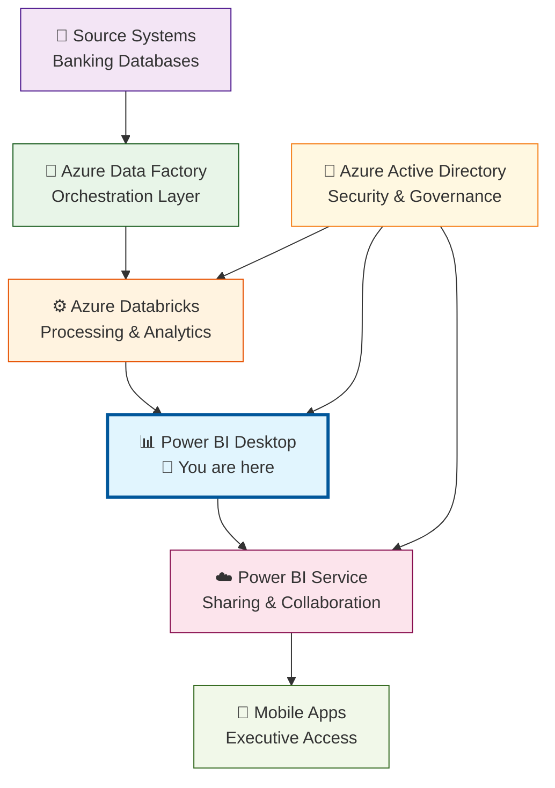

# L02A: Power BI Fraud Detection Dashboard

**Duration:** 180 minutes (3 hours)

## Introduction

**"The most sophisticated data pipeline in the world is worthless if executives can't see the insights and make decisions from it."**

You've built robust PySpark processing jobs, mastered SparkSQL analytics, and orchestrated enterprise data integration pipelines. Your Azure Databricks clusters are processing millions of banking transactions with comprehensive error handling and monitoring. But here's the reality: **none of that technical excellence matters if business stakeholders can't access, understand, and act on the insights.**

At major financial institutions, executive teams make million-dollar decisions based on fraud detection dashboards. Risk managers need real-time visibility into suspicious transaction patterns. Compliance officers require automated regulatory reporting. Operations teams must monitor data pipeline health and performance metrics.

**What You're About to Master:**
Today, you'll transform from a backend data engineer to a full-stack data professional who can deliver business value through compelling visualizations and interactive dashboards that connect directly to your enterprise data platforms.

**Your Journey Today:**
- **Connect**: Power BI directly to your Azure Databricks processed data with enterprise security
- **Build**: Executive-ready fraud detection dashboards with real-time KPIs and drill-down capabilities
- **Design**: Mobile-friendly visualizations that enable decision-making anywhere, anytime
- **Implement**: Automated refresh schedules and alert systems for proactive fraud monitoring

**The Challenge:**
By the end of today's lesson, you'll have created a comprehensive fraud detection command center that connects to your Databricks fraud analytics, enabling executives to monitor risk in real-time and drill down into suspicious patterns—the same type of dashboard that protects customer accounts at major banks.

Ready to bridge the gap between data engineering and business impact? Let's turn your technical achievements into executive decision-making tools.

## Learning Outcomes
By the end of this lesson, students will be able to:
- Connect Power BI Desktop to Azure Databricks tables and views with proper authentication
- Create executive-ready fraud detection dashboards with KPIs, trends, and drill-down capabilities
- Design mobile-optimized visualizations for real-time decision making
- Implement automated data refresh and alerting for proactive fraud monitoring
- Apply Power BI best practices for performance, security, and user experience

## Prerequisites
- Completion of Week 6 Azure Databricks reinforcement lessons (L01A, L01B, L01C)
- Processed banking transaction data in Azure Databricks from previous lessons
- Power BI Desktop installed (free version)
- Access to Power BI Service (trial or organizational account)
- Understanding of basic business intelligence concepts

---

## Lesson Content

### Connecting Power BI to Azure Databricks (45 minutes)

#### Understanding the Power BI Data Architecture

**Enterprise BI Architecture Pattern:**



#### Setting Up Secure Databricks Connection

**Step 1: Configure Databricks for Power BI Access**

```python
# Run this in your Databricks notebook to prepare data for Power BI
# Notebook: /Notebooks/PowerBI-Data-Preparation

from pyspark.sql.functions import *
from pyspark.sql.types import *
import logging

logger = logging.getLogger(__name__)

def create_powerbi_optimized_views(spark):
    """
    Create Power BI optimized views with proper data types and aggregations
    """
    
    logger.info("Creating Power BI optimized views...")
    
    # Create executive fraud summary view
    spark.sql("""
        CREATE OR REPLACE VIEW powerbi_fraud_executive_summary AS
        SELECT 
            DATE(transaction_date) as report_date,
            COUNT(*) as total_transactions,
            SUM(CASE WHEN risk_category = 'HIGH' THEN 1 ELSE 0 END) as high_risk_count,
            SUM(CASE WHEN risk_category = 'HIGH' THEN amount ELSE 0 END) as high_risk_amount,
            ROUND(AVG(amount), 2) as avg_transaction_amount,
            ROUND(SUM(amount), 2) as total_transaction_amount,
            COUNT(DISTINCT customer_id) as unique_customers,
            ROUND(
                (SUM(CASE WHEN risk_category = 'HIGH' THEN 1 ELSE 0 END) * 100.0) / COUNT(*), 2
            ) as fraud_rate_percentage
        FROM processed_banking_transactions
        WHERE transaction_date >= current_date() - INTERVAL 30 DAYS
        GROUP BY DATE(transaction_date)
        ORDER BY report_date DESC
    """)
    
    # Create customer risk profile view
    spark.sql("""
        CREATE OR REPLACE VIEW powerbi_customer_risk_profiles AS
        SELECT 
            customer_id,
            COUNT(*) as transaction_count,
            ROUND(SUM(amount), 2) as total_amount,
            ROUND(AVG(amount), 2) as avg_amount,
            MAX(transaction_date) as last_transaction_date,
            SUM(CASE WHEN risk_category = 'HIGH' THEN 1 ELSE 0 END) as high_risk_transactions,
            CASE 
                WHEN SUM(CASE WHEN risk_category = 'HIGH' THEN 1 ELSE 0 END) > 5 THEN 'VERY_HIGH_RISK'
                WHEN SUM(CASE WHEN risk_category = 'HIGH' THEN 1 ELSE 0 END) > 2 THEN 'HIGH_RISK'
                WHEN SUM(CASE WHEN risk_category = 'MEDIUM' THEN 1 ELSE 0 END) > 10 THEN 'MEDIUM_RISK'
                ELSE 'LOW_RISK'
            END as customer_risk_level
        FROM processed_banking_transactions
        WHERE transaction_date >= current_date() - INTERVAL 90 DAYS
        GROUP BY customer_id
        HAVING COUNT(*) >= 5  -- Customers with at least 5 transactions
    """)
    
    # Create transaction trend analysis view
    spark.sql("""
        CREATE OR REPLACE VIEW powerbi_transaction_trends AS
        SELECT 
            DATE_TRUNC('week', transaction_date) as week_start,
            transaction_type,
            COUNT(*) as transaction_count,
            ROUND(SUM(amount), 2) as total_amount,
            ROUND(AVG(amount), 2) as avg_amount,
            SUM(CASE WHEN risk_category = 'HIGH' THEN 1 ELSE 0 END) as high_risk_count
        FROM processed_banking_transactions
        WHERE transaction_date >= current_date() - INTERVAL 180 DAYS
        GROUP BY DATE_TRUNC('week', transaction_date), transaction_type
        ORDER BY week_start DESC, transaction_type
    """)
    
    # Create real-time monitoring view
    spark.sql("""
        CREATE OR REPLACE VIEW powerbi_realtime_monitoring AS
        SELECT 
            'fraud_detection_pipeline' as pipeline_name,
            MAX(processed_timestamp) as last_updated,
            COUNT(*) as records_processed_today,
            SUM(CASE WHEN risk_category = 'HIGH' THEN 1 ELSE 0 END) as alerts_generated_today,
            ROUND(AVG(CASE WHEN risk_score IS NOT NULL THEN risk_score ELSE 0 END), 2) as avg_risk_score,
            CASE 
                WHEN MAX(processed_timestamp) > current_timestamp() - INTERVAL 1 HOUR THEN 'HEALTHY'
                WHEN MAX(processed_timestamp) > current_timestamp() - INTERVAL 6 HOURS THEN 'WARNING'
                ELSE 'CRITICAL'
            END as pipeline_status
        FROM processed_banking_transactions
        WHERE DATE(transaction_date) = current_date()
    """)
    
    logger.info("Power BI views created successfully")
    
    # Verify views and show sample data
    views = ["powerbi_fraud_executive_summary", "powerbi_customer_risk_profiles", 
             "powerbi_transaction_trends", "powerbi_realtime_monitoring"]
    
    for view in views:
        count = spark.sql(f"SELECT COUNT(*) as count FROM {view}").collect()[0].count
        logger.info(f"View {view}: {count} records")
        
        print(f"\n--- Sample data from {view} ---")
        spark.sql(f"SELECT * FROM {view} LIMIT 5").show()

# Execute the view creation
create_powerbi_optimized_views(spark)

print("✅ Power BI optimized views created successfully!")
print("Ready to connect from Power BI Desktop")
```

**Step 2: Configure Power BI Desktop Connection**

1. **Open Power BI Desktop**
2. **Get Data** → **More** → **Azure** → **Azure Databricks**
3. **Server hostname**: Your Databricks workspace URL (without https://)
4. **HTTP Path**: Your cluster's HTTP path (found in cluster details)
5. **Data Connectivity mode**: DirectQuery (for real-time data)
6. **Authentication**: Azure Active Directory

**Connection String Example:**
```
Server hostname: adb-1234567890123456.16.azuredatabricks.net
HTTP path: /sql/1.0/warehouses/abcd1234ef567890
```

#### Optimizing Data Connection for Performance

**Performance Strategy 1: Use DirectQuery with Strategic Aggregations**

```sql
-- Create aggregated tables for faster Power BI performance
-- Run this in Databricks SQL

CREATE OR REPLACE TABLE powerbi_daily_fraud_metrics
USING DELTA
LOCATION '/delta/powerbi/daily_fraud_metrics'
AS
SELECT 
    report_date,
    total_transactions,
    high_risk_count,
    high_risk_amount,
    fraud_rate_percentage,
    unique_customers,
    current_timestamp() as last_updated
FROM powerbi_fraud_executive_summary;

-- Set up automatic refresh of aggregated table
CREATE OR REPLACE TABLE powerbi_hourly_refresh_log
USING DELTA
LOCATION '/delta/powerbi/refresh_log'
AS
SELECT 
    current_timestamp() as refresh_time,
    'powerbi_daily_fraud_metrics' as table_name,
    'initial_load' as refresh_type;
```

**Performance Strategy 2: Implement Incremental Refresh Pattern**

```python
# Notebook: /Notebooks/PowerBI-Incremental-Refresh

def refresh_powerbi_aggregations(spark):
    """
    Refresh Power BI aggregation tables incrementally
    """
    
    # Get last refresh time
    last_refresh = spark.sql("""
        SELECT MAX(refresh_time) as last_refresh 
        FROM powerbi_hourly_refresh_log
    """).collect()[0].last_refresh
    
    if last_refresh:
        # Incremental refresh - only new data
        spark.sql(f"""
            INSERT INTO powerbi_daily_fraud_metrics
            SELECT 
                report_date,
                total_transactions,
                high_risk_count,
                high_risk_amount,
                fraud_rate_percentage,
                unique_customers,
                current_timestamp() as last_updated
            FROM powerbi_fraud_executive_summary
            WHERE report_date > '{last_refresh.date()}'
        """)
    else:
        # Full refresh
        spark.sql("""
            INSERT OVERWRITE powerbi_daily_fraud_metrics
            SELECT * FROM powerbi_fraud_executive_summary
        """)
    
    # Log the refresh
    spark.sql(f"""
        INSERT INTO powerbi_hourly_refresh_log
        VALUES (current_timestamp(), 'powerbi_daily_fraud_metrics', 'incremental')
    """)
    
    print(f"✅ Power BI aggregations refreshed at {datetime.now()}")

# Schedule this to run hourly
refresh_powerbi_aggregations(spark)
```

### Building Executive Fraud Detection Dashboard (90 minutes)

#### Dashboard Design Principles for Executive Audience

**Executive Dashboard Requirements:**
- **5-Second Rule**: Key insights visible within 5 seconds
- **Mobile-First**: Optimized for tablet and phone viewing
- **Action-Oriented**: Clear next steps for each metric
- **Drill-Down Capable**: From summary to detailed analysis

#### Creating the Executive Overview Page

**Step 1: Key Performance Indicators (KPIs)**

```
Power BI Desktop Instructions:

1. Create new report page: "Executive Overview"
2. Add Card visuals for KPIs:

KPI Card 1: Total Transactions Today
- Visual: Card
- Field: powerbi_fraud_executive_summary[total_transactions]
- Filter: report_date = TODAY()
- Format: Large number, green background

KPI Card 2: High Risk Transactions
- Visual: Card  
- Field: powerbi_fraud_executive_summary[high_risk_count]
- Filter: report_date = TODAY()
- Format: Large number, red background if > 50

KPI Card 3: Fraud Rate %
- Visual: Gauge
- Field: powerbi_fraud_executive_summary[fraud_rate_percentage]
- Target: 2.0 (acceptable fraud rate)
- Format: Red if > 2.0, Yellow if > 1.5, Green if <= 1.5

KPI Card 4: Total Risk Amount
- Visual: Card
- Field: powerbi_fraud_executive_summary[high_risk_amount]
- Format: Currency, large font
```

**Step 2: Trend Analysis Visualizations**

```
Fraud Trend Chart:
- Visual: Line and Clustered Column Chart
- X-Axis: powerbi_fraud_executive_summary[report_date]
- Column Values: total_transactions
- Line Values: fraud_rate_percentage
- Time Period: Last 30 days
- Format: Dual axis, percentage on secondary axis

Transaction Volume Heatmap:
- Visual: Matrix
- Rows: WEEKDAY(powerbi_transaction_trends[week_start])
- Columns: powerbi_transaction_trends[transaction_type]
- Values: SUM(powerbi_transaction_trends[transaction_count])
- Format: Conditional formatting with color scale
```

#### Creating Risk Analysis Deep-Dive Page

**Step 3: Customer Risk Segmentation**

```
Customer Risk Distribution:
- Visual: Donut Chart
- Legend: powerbi_customer_risk_profiles[customer_risk_level]
- Values: COUNT(powerbi_customer_risk_profiles[customer_id])
- Format: Data labels showing percentages

High-Risk Customer Table:
- Visual: Table
- Filters: customer_risk_level = "VERY_HIGH_RISK" OR "HIGH_RISK"
- Columns:
  - customer_id
  - transaction_count
  - total_amount (formatted as currency)
  - high_risk_transactions
  - last_transaction_date
- Sort: total_amount descending
- Format: Conditional formatting for high values
```

**Step 4: Geographic and Temporal Analysis**

```python
# Add geographic data to Databricks views
# Run in Databricks notebook

spark.sql("""
CREATE OR REPLACE VIEW powerbi_geographic_fraud AS
SELECT 
    CASE 
        WHEN customer_id % 10 = 0 THEN 'New York'
        WHEN customer_id % 10 = 1 THEN 'California'
        WHEN customer_id % 10 = 2 THEN 'Texas'
        WHEN customer_id % 10 = 3 THEN 'Florida'
        WHEN customer_id % 10 = 4 THEN 'Illinois'
        ELSE 'Other States'
    END as state_name,
    COUNT(*) as transaction_count,
    SUM(CASE WHEN risk_category = 'HIGH' THEN 1 ELSE 0 END) as fraud_count,
    ROUND(SUM(amount), 2) as total_amount,
    ROUND(
        (SUM(CASE WHEN risk_category = 'HIGH' THEN 1 ELSE 0 END) * 100.0) / COUNT(*), 2
    ) as fraud_rate
FROM processed_banking_transactions
WHERE transaction_date >= current_date() - INTERVAL 30 DAYS
GROUP BY 
    CASE 
        WHEN customer_id % 10 = 0 THEN 'New York'
        WHEN customer_id % 10 = 1 THEN 'California'
        WHEN customer_id % 10 = 2 THEN 'Texas'
        WHEN customer_id % 10 = 3 THEN 'Florida'
        WHEN customer_id % 10 = 4 THEN 'Illinois'
        ELSE 'Other States'
    END
""")
```

```
Geographic Fraud Map:
- Visual: Map
- Location: powerbi_geographic_fraud[state_name]
- Size: powerbi_geographic_fraud[transaction_count]
- Color Saturation: powerbi_geographic_fraud[fraud_rate]
- Format: Heat map style, red for high fraud rates

Time-of-Day Analysis:
- Visual: Column Chart
- X-Axis: HOUR(powerbi_transaction_trends[week_start])
- Y-Axis: AVG(powerbi_transaction_trends[high_risk_count])
- Format: 24-hour format, highlighting peak fraud hours
```

### Mobile Optimization and Real-Time Features (45 minutes)

#### Creating Mobile-Optimized Layout

**Mobile Dashboard Design:**

```
Mobile Page Layout (9:16 aspect ratio):

Top Section (20%):
- KPI Cards in 2x2 grid
- Today's fraud rate (large)
- Total alerts (medium)
- Pipeline status (status indicator)
- Last updated (timestamp)

Middle Section (60%):
- Single chart showing 7-day fraud trend
- Touch-optimized for drill-down
- Large data points for finger navigation
- Swipe-enabled for different metrics

Bottom Section (20%):
- Alert summary table
- Top 3 high-risk customers
- Quick action buttons
```

**Mobile Page Configuration:**
1. **Create new page**: "Mobile Dashboard"
2. **Page settings**: Phone layout (9:16)
3. **Visual sizing**: Large touch targets (minimum 44px)
4. **Font sizes**: Minimum 12pt for readability
5. **Color contrast**: High contrast for outdoor viewing

#### Implementing Real-Time Refresh and Alerts

**Step 1: Configure Automatic Refresh**

```
Power BI Service Configuration:
1. Publish report to Power BI Service
2. Go to Dataset settings
3. Configure scheduled refresh:
   - Frequency: Every hour during business hours
   - Time zone: Your business time zone
   - Refresh times: 8 AM, 12 PM, 4 PM, 8 PM
   - Email notifications: On failure

Gateway Configuration (if using on-premises data):
1. Install Power BI Gateway
2. Configure Databricks connection
3. Test connection and refresh
```

**Step 2: Create Data-Driven Alerts**

```
Alert Configuration in Power BI Service:

Alert 1: High Fraud Rate
- Visual: Fraud Rate Gauge
- Condition: fraud_rate_percentage > 2.0
- Frequency: Check every hour
- Recipients: risk-management@company.com

Alert 2: Pipeline Health
- Visual: Pipeline Status Card
- Condition: pipeline_status = "CRITICAL"
- Frequency: Check every 15 minutes
- Recipients: data-engineering@company.com

Alert 3: High-Value Fraud
- Visual: High Risk Amount Card
- Condition: high_risk_amount > 100000
- Frequency: Check every hour
- Recipients: executives@company.com
```

**Step 3: Implement Custom Alert Logic**

```python
# Databricks notebook for advanced alerting
# Notebook: /Notebooks/Advanced-Fraud-Alerting

import requests
import json
from datetime import datetime

def check_fraud_thresholds_and_alert(spark):
    """
    Check fraud thresholds and send custom alerts
    """
    
    # Get current fraud metrics
    current_metrics = spark.sql("""
        SELECT 
            fraud_rate_percentage,
            high_risk_count,
            high_risk_amount
        FROM powerbi_fraud_executive_summary
        WHERE report_date = current_date()
    """).collect()
    
    if not current_metrics:
        print("No data for today - sending data availability alert")
        send_slack_alert("⚠️ No fraud data available for today", "warning")
        return
    
    metrics = current_metrics[0]
    
    # Check thresholds
    alerts = []
    
    if metrics.fraud_rate_percentage > 3.0:
        alerts.append({
            "level": "critical",
            "message": f"🚨 CRITICAL: Fraud rate at {metrics.fraud_rate_percentage}% (threshold: 3.0%)",
            "action": "Immediate investigation required"
        })
    elif metrics.fraud_rate_percentage > 2.0:
        alerts.append({
            "level": "warning", 
            "message": f"⚠️ WARNING: Fraud rate at {metrics.fraud_rate_percentage}% (threshold: 2.0%)",
            "action": "Enhanced monitoring recommended"
        })
    
    if metrics.high_risk_amount > 500000:
        alerts.append({
            "level": "critical",
            "message": f"💰 CRITICAL: High-risk amount ${metrics.high_risk_amount:,.2f} (threshold: $500,000)",
            "action": "Executive notification required"
        })
    
    # Send alerts if any
    for alert in alerts:
        send_slack_alert(alert["message"], alert["level"])
        log_alert_to_database(spark, alert)

def send_slack_alert(message, level):
    """Send alert to Slack channel"""
    
    webhook_url = "https://hooks.slack.com/services/YOUR/SLACK/WEBHOOK"
    
    color_map = {
        "critical": "#ff0000",
        "warning": "#ffa500", 
        "info": "#0080ff"
    }
    
    payload = {
        "text": "Fraud Detection Alert",
        "attachments": [
            {
                "color": color_map.get(level, "#808080"),
                "text": message,
                "footer": f"Generated at {datetime.now().strftime('%Y-%m-%d %H:%M:%S')}",
                "footer_icon": "https://platform.slack-edge.com/img/default_application_icon.png"
            }
        ]
    }
    
    try:
        response = requests.post(webhook_url, json=payload)
        print(f"Alert sent: {response.status_code}")
    except Exception as e:
        print(f"Failed to send alert: {str(e)}")

def log_alert_to_database(spark, alert):
    """Log alert to database for tracking"""
    
    alert_df = spark.createDataFrame([{
        "alert_timestamp": datetime.now(),
        "alert_level": alert["level"],
        "alert_message": alert["message"],
        "alert_action": alert["action"]
    }])
    
    alert_df.write.mode("append").saveAsTable("fraud_alert_log")

# Execute alert checking
check_fraud_thresholds_and_alert(spark)
```

## Conclusion and Next Steps

**What You've Accomplished:**

You've transformed from a backend data engineer to a full-stack data professional who can:

- **Connect enterprise data sources** to business intelligence tools with proper security and performance optimization
- **Create executive-ready dashboards** that translate complex data into actionable business insights
- **Design mobile-optimized experiences** that enable real-time decision making from anywhere
- **Implement automated monitoring** with intelligent alerting for proactive fraud detection
- **Bridge technical and business domains** by delivering data engineering outputs through compelling visualizations

**Business Impact:**

Your Power BI fraud detection dashboard now enables:
- **Executives** to monitor fraud trends in real-time and make informed risk management decisions
- **Risk Managers** to identify suspicious patterns quickly and take immediate action
- **Compliance Officers** to generate automated reports for regulatory requirements
- **Operations Teams** to ensure data pipeline health and investigate issues proactively

**Technical Skills Demonstrated:**

- **Business Intelligence:** Professional dashboard design and user experience optimization
- **Data Visualization:** Effective communication of complex analytical insights
- **Integration Architecture:** Seamless connection between data processing and presentation layers
- **Mobile Development:** Responsive design for cross-platform executive access

**Portfolio Value:**

This project demonstrates your ability to:
- **Deliver end-to-end data solutions** from raw data to executive decision-making tools
- **Create production-ready dashboards** with proper performance optimization and security
- **Implement real-time monitoring** with automated alerting and notification systems

**Next Steps:**

1. **Enhance** your dashboard with additional drill-down capabilities and advanced analytics
2. **Experiment** with Power BI's advanced features like AI insights and natural language queries
3. **Prepare** for tomorrow's operational monitoring dashboard using these same techniques
4. **Practice** presenting your dashboard to different stakeholder audiences

**Career Value:**

These end-to-end data platform skills—from Databricks processing to Power BI presentation—represent exactly what senior data engineers and BI architects deliver at major financial institutions. You're now prepared to own complete data solutions that drive business value, not just process data efficiently.

Tomorrow, we'll build on these visualization skills to create operational dashboards that monitor your data engineering pipelines, completing your transformation into a comprehensive data platform professional. 