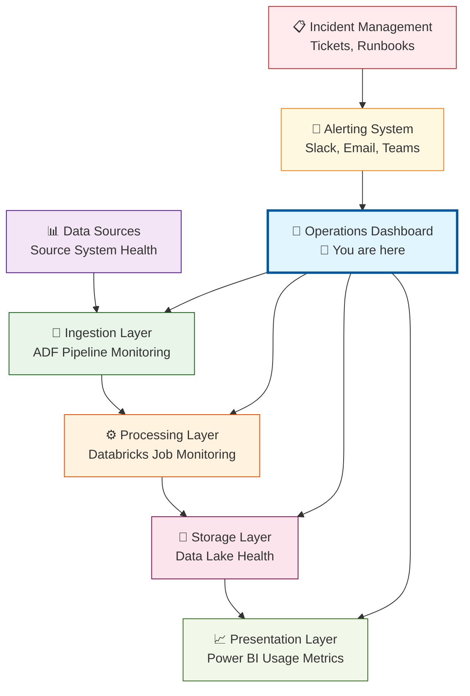

# L02B: Power BI Operations Monitoring

**Duration:** 180 minutes (3 hours)

## Introduction

**"The difference between a data engineer who puts pipelines into production and one who keeps them running reliably is comprehensive operational monitoring and proactive alerting."**

Your fraud detection dashboard serves business stakeholders, but what about the data engineering team that maintains the infrastructure? Production data pipelines fail—servers crash, data sources become unavailable, processing jobs timeout, and quality issues emerge. Without operational visibility, you're flying blind until users complain about missing or incorrect data.

At enterprise data teams, operational dashboards are mission-critical infrastructure. They provide real-time visibility into pipeline health, performance metrics, cost optimization opportunities, and data quality trends. These dashboards enable proactive problem resolution instead of reactive fire-fighting.

**What You're About to Master:**
Today, you'll build the operational command center that monitors your entire data platform, from source system health to processing performance to data quality metrics—the same type of monitoring that keeps enterprise data platforms running 24/7.

**Your Journey Today:**
- **Monitor**: Real-time pipeline execution status, performance metrics, and failure detection
- **Track**: Data quality trends, processing volumes, and cost optimization opportunities
- **Alert**: Proactive notification systems for pipeline failures and data quality issues
- **Optimize**: Resource utilization dashboards for cost management and performance tuning

**The Challenge:**
By the end of today's lesson, you'll have created a comprehensive operational monitoring platform that provides complete visibility into your data engineering infrastructure, enabling proactive maintenance and optimization—the same type of system that powers 99.9% uptime at major technology companies.

Ready to transform from building pipelines to operating platforms? Let's master data engineering operations.

## Learning Outcomes
By the end of this lesson, students will be able to:
- Create comprehensive operational dashboards monitoring pipeline health and performance
- Implement data quality tracking and trend analysis for proactive issue detection
- Build cost monitoring and resource optimization dashboards for Azure data platforms
- Design alerting systems for proactive operational issue resolution
- Apply DevOps principles to data engineering through monitoring and observability

## Prerequisites
- Completion of L02A: Power BI Fraud Detection Dashboard
- Running Azure Data Factory and Databricks pipelines from previous lessons
- Understanding of data engineering pipeline architecture
- Access to Azure monitoring and logging resources

---

## Lesson Content

### Data Engineering Operations Architecture (45 minutes)

#### Understanding Operational Monitoring Layers

**Complete Observability Stack:**



#### Creating Comprehensive Monitoring Data Model

**Step 1: Pipeline Execution Tracking**

```python
# Databricks notebook: /Notebooks/Operations-Data-Collection
# This collects operational metrics for Power BI monitoring

from pyspark.sql.functions import *
from pyspark.sql.types import *
from datetime import datetime, timedelta
import json
import requests

def collect_pipeline_execution_metrics(spark):
    """
    Collect comprehensive pipeline execution metrics
    """
    
    # Create pipeline execution log table
    spark.sql("""
        CREATE TABLE IF NOT EXISTS pipeline_execution_log (
            execution_id STRING,
            pipeline_name STRING,
            execution_start_time TIMESTAMP,
            execution_end_time TIMESTAMP,
            execution_duration_minutes DOUBLE,
            status STRING,
            records_processed BIGINT,
            records_failed BIGINT,
            data_quality_score DOUBLE,
            cost_estimate_usd DOUBLE,
            cluster_size STRING,
            processing_errors ARRAY<STRING>,
            execution_date DATE
        ) USING DELTA
        LOCATION '/delta/monitoring/pipeline_execution_log'
    """)
    
    # Create data quality metrics table
    spark.sql("""
        CREATE TABLE IF NOT EXISTS data_quality_metrics (
            metric_timestamp TIMESTAMP,
            table_name STRING,
            total_records BIGINT,
            null_values BIGINT,
            duplicate_records BIGINT,
            invalid_values BIGINT,
            completeness_score DOUBLE,
            validity_score DOUBLE,
            consistency_score DOUBLE,
            overall_quality_score DOUBLE,
            metric_date DATE
        ) USING DELTA
        LOCATION '/delta/monitoring/data_quality_metrics'
    """)
    
    # Create resource utilization table
    spark.sql("""
        CREATE TABLE IF NOT EXISTS resource_utilization (
            timestamp TIMESTAMP,
            cluster_id STRING,
            cluster_name STRING,
            node_count INT,
            cpu_utilization_percent DOUBLE,
            memory_utilization_percent DOUBLE,
            storage_used_gb DOUBLE,
            cost_per_hour_usd DOUBLE,
            utilization_date DATE
        ) USING DELTA
        LOCATION '/delta/monitoring/resource_utilization'
    """)
    
    print("✅ Operational monitoring tables created")

def log_pipeline_execution(spark, pipeline_name, status, start_time, end_time, 
                          records_processed, records_failed, errors=None):
    """
    Log pipeline execution details for monitoring
    """
    
    execution_id = f"{pipeline_name}_{start_time.strftime('%Y%m%d_%H%M%S')}"
    duration_minutes = (end_time - start_time).total_seconds() / 60
    
    # Calculate estimated cost (simplified)
    base_cost_per_minute = 0.20  # Rough estimate for medium cluster
    cost_estimate = duration_minutes * base_cost_per_minute
    
    execution_record = spark.createDataFrame([{
        "execution_id": execution_id,
        "pipeline_name": pipeline_name,
        "execution_start_time": start_time,
        "execution_end_time": end_time,
        "execution_duration_minutes": round(duration_minutes, 2),
        "status": status,
        "records_processed": records_processed,
        "records_failed": records_failed or 0,
        "data_quality_score": calculate_quality_score(records_processed, records_failed),
        "cost_estimate_usd": round(cost_estimate, 2),
        "cluster_size": "Standard_DS3_v2",  # Would get from cluster API
        "processing_errors": errors or [],
        "execution_date": start_time.date()
    }])
    
    execution_record.write.mode("append").insertInto("pipeline_execution_log")
    print(f"✅ Logged execution: {execution_id}")

def calculate_quality_score(processed, failed):
    """Calculate simple data quality score"""
    if processed == 0:
        return 0.0
    return round(((processed - (failed or 0)) / processed) * 100, 2)

def collect_real_time_metrics(spark):
    """
    Collect current system metrics for real-time monitoring
    """
    
    current_time = datetime.now()
    
    # Simulate collecting cluster metrics (in real scenario, use Databricks API)
    cluster_metrics = [{
        "timestamp": current_time,
        "cluster_id": "cluster-001",
        "cluster_name": "banking-etl-cluster",
        "node_count": 3,
        "cpu_utilization_percent": 75.5,
        "memory_utilization_percent": 68.2,
        "storage_used_gb": 450.7,
        "cost_per_hour_usd": 2.40,
        "utilization_date": current_time.date()
    }]
    
    metrics_df = spark.createDataFrame(cluster_metrics)
    metrics_df.write.mode("append").insertInto("resource_utilization")
    
    # Log sample pipeline executions for demonstration
    sample_executions = [
        ("fraud_detection_pipeline", "SUCCESS", current_time - timedelta(hours=2), 
         current_time - timedelta(hours=1, minutes=45), 1500000, 25),
        ("customer_enrichment_pipeline", "SUCCESS", current_time - timedelta(hours=1), 
         current_time - timedelta(minutes=30), 250000, 0),
        ("data_quality_validation", "WARNING", current_time - timedelta(minutes=30), 
         current_time - timedelta(minutes=15), 1750000, 150)
    ]
    
    for pipeline, status, start, end, processed, failed in sample_executions:
        log_pipeline_execution(spark, pipeline, status, start, end, processed, failed)

# Execute data collection
collect_pipeline_execution_metrics(spark)
collect_real_time_metrics(spark)

print("✅ Operational monitoring data collection completed")
```

### Building Pipeline Health Dashboard (90 minutes)

#### Real-Time Pipeline Status Overview

**Step 1: Pipeline Health KPIs**

```
Power BI Page: "Pipeline Operations"

KPI Section Layout:

Card 1: Pipeline Success Rate (Last 24h)
- Visual: Card with trend
- Measure: 
  Success Rate = 
  DIVIDE(
      COUNTROWS(FILTER(pipeline_execution_log, pipeline_execution_log[status] = "SUCCESS")),
      COUNTROWS(pipeline_execution_log)
  ) * 100
- Format: Percentage, green if > 95%, yellow if > 90%, red if <= 90%

Card 2: Average Processing Time
- Visual: Card
- Measure:
  Avg Duration = AVERAGE(pipeline_execution_log[execution_duration_minutes])
- Format: "X.X minutes", trend arrow showing change vs yesterday

Card 3: Records Processed Today
- Visual: Card
- Measure:
  Daily Records = 
  SUMX(
      FILTER(pipeline_execution_log, pipeline_execution_log[execution_date] = TODAY()),
      pipeline_execution_log[records_processed]
  )
- Format: Large number with K/M suffix

Card 4: Failed Records Alert
- Visual: Card
- Measure:
  Failed Records = SUM(pipeline_execution_log[records_failed])
- Format: Red background if > 1000, yellow if > 100
```

**Step 2: Pipeline Performance Trends**

```
Pipeline Performance Chart:
- Visual: Line and Clustered Column Chart
- X-Axis: pipeline_execution_log[execution_start_time] (Hour granularity)
- Column Values: COUNT(pipeline_execution_log[execution_id]) (Executions per hour)
- Line Values: AVERAGE(pipeline_execution_log[execution_duration_minutes])
- Filter: Last 7 days
- Format: Dual axis, time-based x-axis

Pipeline Status Distribution:
- Visual: Donut Chart
- Legend: pipeline_execution_log[status]
- Values: COUNT(pipeline_execution_log[execution_id])
- Filter: Last 24 hours
- Format: Green for SUCCESS, Yellow for WARNING, Red for FAILED
```

#### Data Quality Monitoring Dashboard

**Step 3: Data Quality Trends**

```python
# Update data quality metrics collection
# Add this to your Databricks operational notebook

def collect_data_quality_metrics(spark):
    """
    Collect comprehensive data quality metrics
    """
    
    current_time = datetime.now()
    
    # Analyze banking transactions quality
    quality_analysis = spark.sql("""
        SELECT 
            'processed_banking_transactions' as table_name,
            COUNT(*) as total_records,
            SUM(CASE WHEN transaction_id IS NULL THEN 1 ELSE 0 END) as null_transaction_ids,
            SUM(CASE WHEN customer_id IS NULL THEN 1 ELSE 0 END) as null_customer_ids,
            SUM(CASE WHEN amount IS NULL OR amount <= 0 THEN 1 ELSE 0 END) as invalid_amounts,
            COUNT(*) - COUNT(DISTINCT transaction_id) as duplicate_records
        FROM processed_banking_transactions
        WHERE DATE(transaction_date) = current_date()
    """).collect()[0]
    
    # Calculate quality scores
    total_records = quality_analysis.total_records
    null_values = (quality_analysis.null_transaction_ids + 
                  quality_analysis.null_customer_ids)
    invalid_values = quality_analysis.invalid_amounts
    duplicate_records = quality_analysis.duplicate_records
    
    completeness_score = ((total_records - null_values) / total_records) * 100 if total_records > 0 else 0
    validity_score = ((total_records - invalid_values) / total_records) * 100 if total_records > 0 else 0
    consistency_score = ((total_records - duplicate_records) / total_records) * 100 if total_records > 0 else 0
    overall_quality_score = (completeness_score + validity_score + consistency_score) / 3
    
    # Insert quality metrics
    quality_record = spark.createDataFrame([{
        "metric_timestamp": current_time,
        "table_name": "processed_banking_transactions",
        "total_records": total_records,
        "null_values": null_values,
        "duplicate_records": duplicate_records,
        "invalid_values": invalid_values,
        "completeness_score": round(completeness_score, 2),
        "validity_score": round(validity_score, 2),
        "consistency_score": round(consistency_score, 2),
        "overall_quality_score": round(overall_quality_score, 2),
        "metric_date": current_time.date()
    }])
    
    quality_record.write.mode("append").insertInto("data_quality_metrics")
    
    print(f"✅ Data quality metrics collected: {overall_quality_score:.2f}% overall score")
    
    return {
        "overall_score": overall_quality_score,
        "completeness": completeness_score,
        "validity": validity_score,
        "consistency": consistency_score
    }

# Execute quality collection
quality_results = collect_data_quality_metrics(spark)
```

```
Data Quality Dashboard Section:

Quality Score Gauge:
- Visual: Gauge
- Value: data_quality_metrics[overall_quality_score]
- Minimum: 0
- Maximum: 100
- Target: 95
- Format: Green > 95, Yellow > 90, Red <= 90

Quality Trends Chart:
- Visual: Line Chart
- X-Axis: data_quality_metrics[metric_timestamp] (Daily)
- Y-Axis: Multiple lines for:
  - overall_quality_score
  - completeness_score  
  - validity_score
  - consistency_score
- Filter: Last 30 days
- Format: Different colors for each metric

Quality Issues Table:
- Visual: Table
- Columns:
  - metric_date
  - table_name
  - total_records
  - null_values
  - invalid_values
  - overall_quality_score
- Sort: metric_date descending
- Filter: Show only records with overall_quality_score < 95
- Format: Conditional formatting for scores
```

### Cost Monitoring and Resource Optimization (45 minutes)

#### Azure Cost Tracking Dashboard

**Step 1: Resource Utilization Monitoring**

```
Resource Utilization Page:

Cost Trend Chart:
- Visual: Area Chart
- X-Axis: resource_utilization[timestamp] (Daily)
- Y-Axis: SUM(resource_utilization[cost_per_hour_usd] * 24) (Daily cost)
- Filter: Last 30 days
- Format: Currency format, highlight weekends differently

Cluster Efficiency Matrix:
- Visual: Scatter Chart
- X-Axis: resource_utilization[cpu_utilization_percent]
- Y-Axis: resource_utilization[memory_utilization_percent] 
- Size: resource_utilization[cost_per_hour_usd]
- Color: resource_utilization[cluster_name]
- Format: Quadrant lines at 70% CPU and 70% memory
```

**Step 2: Cost Optimization Recommendations**

```python
# Databricks notebook: Cost optimization analysis

def analyze_cost_optimization_opportunities(spark):
    """
    Analyze resource usage for cost optimization recommendations
    """
    
    # Calculate utilization efficiency
    utilization_analysis = spark.sql("""
        SELECT 
            cluster_name,
            AVG(cpu_utilization_percent) as avg_cpu,
            AVG(memory_utilization_percent) as avg_memory,
            AVG(cost_per_hour_usd) as avg_hourly_cost,
            COUNT(*) as measurement_count,
            SUM(cost_per_hour_usd) as total_cost
        FROM resource_utilization
        WHERE utilization_date >= current_date() - INTERVAL 7 DAYS
        GROUP BY cluster_name
    """)
    
    # Generate recommendations
    recommendations = []
    
    for row in utilization_analysis.collect():
        cluster = row.cluster_name
        cpu = row.avg_cpu
        memory = row.avg_memory
        cost = row.avg_hourly_cost
        
        if cpu < 50 and memory < 50:
            recommendations.append({
                "cluster": cluster,
                "recommendation": "DOWNSIZE",
                "reason": f"Low utilization (CPU: {cpu:.1f}%, Memory: {memory:.1f}%)",
                "potential_savings": cost * 0.3,  # 30% savings estimate
                "priority": "HIGH"
            })
        elif cpu > 90 or memory > 90:
            recommendations.append({
                "cluster": cluster,
                "recommendation": "UPSIZE",
                "reason": f"High utilization (CPU: {cpu:.1f}%, Memory: {memory:.1f}%)",
                "potential_cost": cost * 0.5,  # 50% cost increase estimate
                "priority": "MEDIUM"
            })
        elif cpu < 30:
            recommendations.append({
                "cluster": cluster,
                "recommendation": "AUTO_TERMINATE",
                "reason": f"Very low CPU usage ({cpu:.1f}%)",
                "potential_savings": cost * 0.8,  # 80% savings estimate
                "priority": "HIGH"
            })
    
    # Save recommendations to table
    if recommendations:
        recommendations_df = spark.createDataFrame(recommendations)
        recommendations_df.write.mode("overwrite").saveAsTable("cost_optimization_recommendations")
        
        print(f"✅ Generated {len(recommendations)} cost optimization recommendations")
        return recommendations
    else:
        print("✅ No cost optimization opportunities identified")
        return []

# Execute cost analysis
cost_recommendations = analyze_cost_optimization_opportunities(spark)
```

```
Cost Optimization Section:

Recommendations Table:
- Visual: Table
- Data Source: cost_optimization_recommendations
- Columns:
  - cluster
  - recommendation  
  - reason
  - potential_savings (formatted as currency)
  - priority
- Format: Conditional formatting by priority (Red=HIGH, Yellow=MEDIUM)

Monthly Cost Projection:
- Visual: Card
- Measure: 
  Monthly Projection = 
  SUM(resource_utilization[cost_per_hour_usd]) * 24 * 30
- Format: Currency, show trend vs last month
```

### Automated Alerting and Incident Response (60 minutes)

#### Implementing Proactive Alerting

**Step 1: Multi-Channel Alert System**

```python
# Enhanced alerting system for operations monitoring

import json
import requests
from datetime import datetime, timedelta

def check_operational_thresholds(spark):
    """
    Check operational thresholds and trigger alerts
    """
    
    alerts = []
    current_time = datetime.now()
    
    # Check pipeline failure rate
    recent_executions = spark.sql("""
        SELECT 
            COUNT(*) as total_executions,
            SUM(CASE WHEN status = 'FAILED' THEN 1 ELSE 0 END) as failed_executions,
            AVG(execution_duration_minutes) as avg_duration
        FROM pipeline_execution_log
        WHERE execution_start_time >= current_timestamp() - INTERVAL 4 HOURS
    """).collect()[0]
    
    if recent_executions.total_executions > 0:
        failure_rate = (recent_executions.failed_executions / recent_executions.total_executions) * 100
        
        if failure_rate > 10:  # 10% failure rate threshold
            alerts.append({
                "type": "pipeline_failure_rate",
                "severity": "critical",
                "message": f"High pipeline failure rate: {failure_rate:.1f}% in last 4 hours",
                "details": f"Failed: {recent_executions.failed_executions}, Total: {recent_executions.total_executions}",
                "action": "Check pipeline logs and cluster health"
            })
    
    # Check data quality scores
    recent_quality = spark.sql("""
        SELECT 
            MIN(overall_quality_score) as min_quality,
            AVG(overall_quality_score) as avg_quality
        FROM data_quality_metrics
        WHERE metric_timestamp >= current_timestamp() - INTERVAL 6 HOURS
    """).collect()
    
    if recent_quality and recent_quality[0].min_quality < 90:
        alerts.append({
            "type": "data_quality_degradation",
            "severity": "warning",
            "message": f"Data quality below threshold: {recent_quality[0].min_quality:.1f}%",
            "details": f"Average quality: {recent_quality[0].avg_quality:.1f}%",
            "action": "Investigate data sources and validation rules"
        })
    
    # Check resource utilization
    high_cost_clusters = spark.sql("""
        SELECT 
            cluster_name,
            AVG(cost_per_hour_usd) as avg_cost
        FROM resource_utilization
        WHERE timestamp >= current_timestamp() - INTERVAL 2 HOURS
        GROUP BY cluster_name
        HAVING AVG(cost_per_hour_usd) > 5.0
    """).collect()
    
    for cluster in high_cost_clusters:
        alerts.append({
            "type": "high_cost_cluster",
            "severity": "info",
            "message": f"High cost cluster detected: {cluster.cluster_name}",
            "details": f"Current cost: ${cluster.avg_cost:.2f}/hour",
            "action": "Review cluster configuration and utilization"
        })
    
    # Send alerts
    for alert in alerts:
        send_operational_alert(alert)
        log_alert_to_database(spark, alert)
    
    return alerts

def send_operational_alert(alert):
    """
    Send operational alert to multiple channels
    """
    
    # Send to Slack
    send_slack_operational_alert(alert)
    
    # Send email for critical alerts
    if alert["severity"] == "critical":
        send_email_alert(alert)
    
    # Create ServiceNow ticket for critical alerts (in production)
    # create_incident_ticket(alert)

def send_slack_operational_alert(alert):
    """Send operational alert to Slack"""
    
    webhook_url = "https://hooks.slack.com/services/YOUR/OPERATIONS/WEBHOOK"
    
    severity_colors = {
        "critical": "#ff0000",
        "warning": "#ffa500",
        "info": "#0080ff"
    }
    
    severity_emojis = {
        "critical": "🚨",
        "warning": "⚠️", 
        "info": "ℹ️"
    }
    
    payload = {
        "text": f"{severity_emojis[alert['severity']]} Data Engineering Operations Alert",
        "attachments": [
            {
                "color": severity_colors[alert["severity"]],
                "fields": [
                    {
                        "title": "Alert Type",
                        "value": alert["type"].replace("_", " ").title(),
                        "short": True
                    },
                    {
                        "title": "Severity", 
                        "value": alert["severity"].upper(),
                        "short": True
                    },
                    {
                        "title": "Message",
                        "value": alert["message"],
                        "short": False
                    },
                    {
                        "title": "Details",
                        "value": alert["details"],
                        "short": False
                    },
                    {
                        "title": "Recommended Action",
                        "value": alert["action"],
                        "short": False
                    }
                ],
                "footer": f"Generated at {datetime.now().strftime('%Y-%m-%d %H:%M:%S')}",
                "footer_icon": "https://platform.slack-edge.com/img/default_application_icon.png"
            }
        ]
    }
    
    try:
        response = requests.post(webhook_url, json=payload)
        print(f"Slack alert sent: {response.status_code}")
    except Exception as e:
        print(f"Failed to send Slack alert: {str(e)}")

def send_email_alert(alert):
    """Send critical alert via email"""
    
    # In production, integrate with Azure Logic Apps or SendGrid
    email_payload = {
        "to": ["data-engineering-oncall@company.com"],
        "subject": f"CRITICAL: Data Engineering Alert - {alert['type']}",
        "body": f"""
        Critical Alert Generated
        
        Type: {alert['type']}
        Severity: {alert['severity']}
        
        Message: {alert['message']}
        Details: {alert['details']}
        
        Recommended Action: {alert['action']}
        
        Generated: {datetime.now().strftime('%Y-%m-%d %H:%M:%S')}
        
        Please investigate immediately.
        """
    }
    
    print(f"Email alert prepared for: {alert['type']}")

def log_alert_to_database(spark, alert):
    """Log alert to operations database"""
    
    alert_record = spark.createDataFrame([{
        "alert_timestamp": datetime.now(),
        "alert_type": alert["type"],
        "alert_severity": alert["severity"],
        "alert_message": alert["message"],
        "alert_details": alert["details"],
        "recommended_action": alert["action"],
        "alert_status": "OPEN"
    }])
    
    alert_record.write.mode("append").saveAsTable("operational_alerts_log")

# Execute operational monitoring
operational_alerts = check_operational_thresholds(spark)
print(f"✅ Operational monitoring completed. Generated {len(operational_alerts)} alerts.")
```

**Step 2: Alert Management Dashboard**

```
Operational Alerts Page:

Alert Summary Cards:
- Critical Alerts (Last 24h): COUNT where severity = "critical"
- Warning Alerts (Last 24h): COUNT where severity = "warning"  
- Average Response Time: Time between alert and resolution
- Open Incidents: COUNT where alert_status = "OPEN"

Active Alerts Table:
- Visual: Table
- Data Source: operational_alerts_log
- Columns:
  - alert_timestamp
  - alert_type
  - alert_severity  
  - alert_message
  - alert_status
- Filter: alert_status = "OPEN" OR alert_timestamp >= TODAY()-1
- Format: Color coding by severity

Alert Trends Chart:
- Visual: Line Chart
- X-Axis: alert_timestamp (Hourly)
- Y-Axis: COUNT of alerts by severity
- Filter: Last 7 days
- Format: Stacked lines by severity level
```

## Conclusion and Next Steps

**What You've Accomplished:**

You've transformed from building individual dashboards to creating comprehensive operational platforms that provide:

- **Complete pipeline visibility** with real-time health monitoring and performance tracking
- **Proactive data quality monitoring** with trend analysis and automated threshold detection
- **Cost optimization insights** with resource utilization analysis and actionable recommendations
- **Multi-channel alerting systems** that notify teams before issues impact business operations
- **Incident management integration** that connects monitoring to operational response procedures

**Business Impact:**

Your operational monitoring platform now enables:
- **Data Engineering Teams** to maintain 99.9% pipeline uptime through proactive monitoring
- **Operations Managers** to optimize resource costs and prevent budget overruns
- **Business Stakeholders** to trust data availability and quality for critical decisions
- **On-Call Engineers** to respond quickly to incidents with comprehensive diagnostic information

**Technical Skills Demonstrated:**

- **DevOps for Data Engineering:** Comprehensive monitoring, alerting, and incident response systems
- **Cost Management:** Resource optimization and financial governance for cloud data platforms
- **Data Quality Engineering:** Systematic quality measurement and trend analysis
- **Operational Excellence:** Production-ready monitoring with automated response capabilities

**Portfolio Value:**

This project demonstrates your ability to:
- **Operate enterprise data platforms** with comprehensive observability and reliability
- **Implement cost governance** for large-scale cloud data infrastructure
- **Build production monitoring systems** that prevent incidents and optimize performance

**Next Steps:**

1. **Enhance** your monitoring with additional metrics and custom alerting rules
2. **Integrate** with your organization's existing incident management tools
3. **Prepare** for tomorrow's advanced Power BI lesson covering enterprise governance
4. **Practice** explaining operational metrics to different stakeholder audiences

**Career Value:**

These operational excellence skills represent exactly what distinguishes senior data engineers and platform reliability engineers at major technology companies. You're now prepared to own production data platforms that scale with enterprise requirements while maintaining high availability and cost efficiency.

Tomorrow, we'll complete your Power BI expertise with advanced features like row-level security, custom visuals, and enterprise governance—the final pieces needed for enterprise-ready business intelligence platforms. 