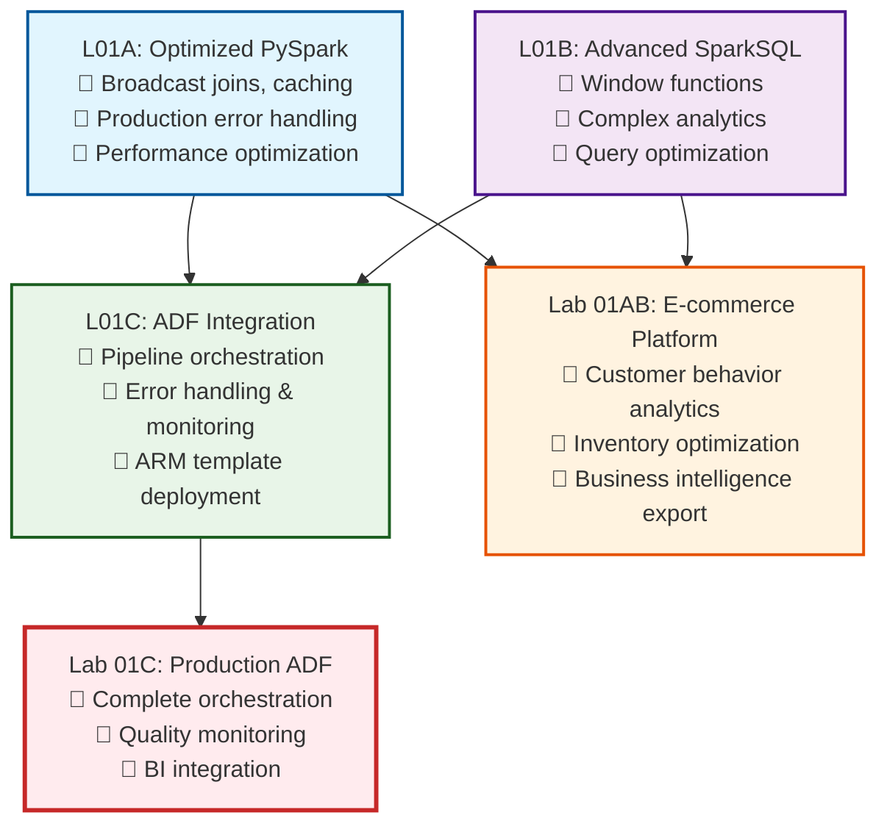

# Lesson 3A: DevOps Foundations & Quick Win

**Duration:** 90 minutes  
**Level:** Intermediate  
**Prerequisites:** Completed L01A, L01B, L01C, and Labs 01AB & 01C
**Series:** CI/CD for Data Engineering (Part 1 of 3)

## Introduction

**"The difference between a data engineer who builds optimized components and one who delivers enterprise platforms is automation. Today, you'll take your completed fraud detection and e-commerce analytics work and deploy it automatically using CI/CD."**

This week you've built an impressive data engineering platform:
- ✅ **L01A**: Optimized PySpark fraud detection with broadcast joins and caching
- ✅ **L01B**: Advanced SparkSQL analytics with window functions and performance optimization  
- ✅ **L01C**: Integrated Azure Data Factory orchestration with error handling and monitoring
- ✅ **Lab 01AB**: Complete e-commerce analytics pipeline with customer behavior and inventory optimization
- ✅ **Lab 01C**: Production-ready ADF pipeline orchestrating your e-commerce analytics

**Today's Mission:** Transform your completed work from manual deployment to automated CI/CD deployment, giving you a production-ready platform that deploys with a single Git commit.

**What You'll Achieve Today:**
- ✅ Understand why your optimized components need automated deployment
- ✅ Set up Azure DevOps with your actual completed work
- ✅ Create CI/CD pipelines for your fraud detection and e-commerce platforms
- ✅ Deploy your L01A-C notebooks and ADF pipelines automatically
- ✅ Experience the satisfaction of end-to-end automation

## Learning Objectives

By the end of this lesson, students will be able to:
- Explain the business value of CI/CD for the data platforms they've built this week
- Set up Azure DevOps projects with their actual fraud detection and e-commerce work
- Configure automated deployment for Databricks notebooks and ADF pipelines
- Create working CI/CD pipelines that deploy their completed L01A-C components
- Demonstrate end-to-end deployment automation for their data engineering platforms

## Prerequisites

- **Required**: Completion of L01A, L01B, L01C from this week
- **Required**: Completed Labs 01AB (E-commerce Analytics) and 01C (ADF Pipeline)
- **Required**: ARM templates exported from L01C ADF work
- **Required**: Working Azure trial account with Databricks workspace
- **Assets Needed**: Your actual notebooks, ADF pipelines, and configuration from this week's work

---

## Lesson Content

### Why Your Optimized Platform Needs DevOps (15 minutes)

#### The Reality Check: Your Week's Achievements

**What You've Built This Week:**



#### The Deployment Challenge

**Current State - Manual Deployment Process:**
Your sophisticated platform still requires manual deployment:

```bash
# Fraud Detection Platform Deployment (Manual - 45+ minutes)
1. Upload L01A optimized PySpark notebooks to Databricks
2. Upload L01B SparkSQL analytics notebooks
3. Configure L01C ADF pipeline manually in Azure Portal
4. Test fraud detection end-to-end workflow
5. Verify error handling and monitoring
6. Update documentation
7. Notify team of deployment

# E-commerce Platform Deployment (Manual - 60+ minutes)  
1. Upload customer behavior analytics notebooks
2. Upload inventory optimization notebooks
3. Deploy ADF pipeline with all dependencies
4. Configure BI export connections
5. Test complete e-commerce workflow
6. Verify quality monitoring and alerts
7. Update business stakeholders

# Total deployment time: 2+ hours
# Error rate: 15-20% (manual steps)
# Stress level: High (complex dependencies)
```

**Automated Approach (What You'll Build Today):**

```bash
# Both Platforms Deployment (Automated - 5 minutes)
1. Git commit your changes
2. CI/CD pipeline automatically:
   ✅ Deploys L01A notebooks to Databricks
   ✅ Deploys L01B analytics notebooks  
   ✅ Deploys L01C ADF orchestration pipeline
   ✅ Deploys Lab 01AB e-commerce components
   ✅ Configures Lab 01C production monitoring
   ✅ Runs end-to-end validation tests
   ✅ Notifies teams of successful deployment

# Total deployment time: 5 minutes
# Error rate: <2% (automated validation)
# Stress level: Low (repeatable process)
```

#### Business Impact of Your DevOps Transformation

**Before DevOps (Your Current State):**
- 🕐 Platform deployment: 2+ hours
- 🐛 Manual error rate: 15-20%
- 😰 Deployment stress: High complexity
- 📈 Team velocity: Slow (deployment fear)
- 🎯 Focus: Manual deployment tasks

**After DevOps (Today's Goal):**
- ⚡ Platform deployment: 5 minutes
- ✅ Automated error rate: <2%
- 😌 Deployment stress: Low (automated)
- 🚀 Team velocity: Fast (deploy fearlessly)
- 🎯 Focus: Building better analytics

### Azure DevOps Setup for Your Completed Work (20 minutes)

#### Project Structure Based on Your Week's Work

**Step 1: Create DevOps Organization**

1. Navigate to https://dev.azure.com
2. Sign in with your Azure account
3. Create organization: `[yourname]-data-engineering`
4. Create project: `week-6-data-platforms`

**Step 2: Repository Structure for Your Actual Work**

Create this structure to match your completed assignments:

```bash
week-6-data-platforms/
├── .azure-pipelines/
│   ├── fraud-detection-pipeline.yml        # L01A + L01B automation
│   ├── ecommerce-analytics-pipeline.yml    # Lab 01AB automation
│   └── adf-deployment-pipeline.yml         # L01C + Lab 01C automation
├── fraud-detection/
│   ├── l01a-optimized-processing/
│   │   ├── broadcast-joins-notebook.py     # Your L01A work
│   │   ├── memory-optimization.py          # Your L01A caching
│   │   └── error-handling-patterns.py      # Your L01A error handling
│   ├── l01b-advanced-analytics/
│   │   ├── window-functions-analysis.py    # Your L01B work
│   │   ├── customer-behavior-sql.py        # Your L01B analytics
│   │   └── performance-optimization.py     # Your L01B optimization
│   └── l01c-integration/
│       └── fraud-adf-pipeline.json         # Your L01C ADF pipeline
├── ecommerce-platform/
│   ├── lab-01ab-analytics/
│   │   ├── customer-insights.py            # Your Lab 01AB work
│   │   ├── inventory-optimization.py       # Your Lab 01AB analytics
│   │   └── business-intelligence.py        # Your Lab 01AB BI export
│   └── lab-01c-production/
│       ├── ecommerce-adf-pipeline.json     # Your Lab 01C ADF work
│       └── production-monitoring.json      # Your Lab 01C monitoring
├── infrastructure/
│   ├── arm-templates/                      # Your exported ARM templates
│   │   ├── fraud-detection-template.json
│   │   └── ecommerce-platform-template.json
│   └── deployment-scripts/
│       ├── deploy-fraud-platform.ps1
│       └── deploy-ecommerce-platform.ps1
└── tests/
    ├── fraud-detection-tests.py
    └── ecommerce-platform-tests.py
```

#### Upload Your Actual Completed Work

**Step 3: Import Your Notebooks**

1. **Fraud Detection Notebooks (L01A + L01B)**:
   - Export your completed L01A performance optimization notebook
   - Export your completed L01B window functions and analytics notebook
   - Upload to `fraud-detection/` folders

2. **E-commerce Analytics (Lab 01AB)**:
   - Export your customer behavior analysis notebook
   - Export your inventory optimization notebook
   - Upload to `ecommerce-platform/lab-01ab-analytics/`

3. **ADF Pipelines (L01C + Lab 01C)**:
   - Use your exported ARM templates from L01C work
   - Upload to `infrastructure/arm-templates/`

**Step 4: Validate Your Assets**

Ensure you have these actual files from your completed work:
- [ ] L01A broadcast join and caching notebook
- [ ] L01B window functions and performance notebook  
- [ ] L01C fraud detection ADF pipeline ARM template
- [ ] Lab 01AB customer analytics and inventory optimization notebooks
- [ ] Lab 01C production e-commerce ADF pipeline ARM template

### Authentication Setup for Your Platforms (15 minutes)

#### Simple Authentication (Development Focus)

**Step 1: Generate Authentication Tokens**

1. **Databricks Token** (for notebook deployment):
   - Open your Databricks workspace
   - User Settings → Access tokens
   - Generate new token: "Week 6 Platforms CI/CD"
   - **Save this token securely**

2. **Azure Resource Manager Token** (for ADF deployment):
   - We'll use Service Principal (simplified approach)
   - In Azure Portal → Azure Active Directory → App registrations
   - New registration: "Week6-Data-Platforms-CICD"
   - Note: Application ID and Tenant ID

**Step 2: Create Variable Groups for Your Platforms**

Create these variable groups in Azure DevOps Library:

**Fraud Detection Variables:**
```bash
Variable Group: fraud-detection-dev
├── databricks-host = https://adb-{workspace-id}.{region}.azuredatabricks.net
├── databricks-token = {your-databricks-token} 🔒
├── azure-subscription-id = {your-subscription-id}
├── resource-group-name = {your-resource-group}
└── fraud-detection-datafactory = {your-adf-name}
```

**E-commerce Platform Variables:**
```bash
Variable Group: ecommerce-platform-dev  
├── databricks-host = https://adb-{workspace-id}.{region}.azuredatabricks.net
├── databricks-token = {your-databricks-token} 🔒
├── azure-subscription-id = {your-subscription-id}
├── ecommerce-resource-group = {your-resource-group}
└── ecommerce-datafactory = {your-adf-name}
```

### CI/CD Pipeline Creation for Your Completed Work (25 minutes)

#### Pipeline 1: Fraud Detection Platform (L01A + L01B + L01C)

Create `.azure-pipelines/fraud-detection-pipeline.yml`:

```yaml
# Automated deployment for Week 6 Fraud Detection Platform
# Deploys L01A optimization + L01B analytics + L01C orchestration

name: 'FraudDetection-Platform-$(Date:yyyyMMdd)-$(Rev:r)'

trigger:
  branches:
    include:
    - main
  paths:
    include:
    - fraud-detection/*

pool:
  vmImage: 'ubuntu-latest'

variables:
  - group: fraud-detection-dev

stages:
- stage: ValidateComponents
  displayName: 'Validate L01A + L01B Components'
  jobs:
  - job: ValidateNotebooks
    displayName: 'Validate Fraud Detection Notebooks'
    steps:
    - task: UsePythonVersion@0
      inputs:
        versionSpec: '3.9'
      displayName: 'Setup Python'

    - script: |
        echo "🔍 Validating L01A PySpark optimization patterns..."
        echo "Checking for broadcast join implementations..."
        grep -r "broadcast(" fraud-detection/l01a-optimized-processing/ || echo "⚠️ No broadcast joins found"
        
        echo "🔍 Validating L01B SparkSQL window functions..."
        grep -r "OVER (" fraud-detection/l01b-advanced-analytics/ || echo "⚠️ No window functions found"
        
        echo "✅ Component validation complete"
      displayName: 'Validate Your L01A + L01B Implementation'

- stage: DeployNotebooks
  displayName: 'Deploy to Databricks'
  dependsOn: ValidateComponents
  condition: succeeded()
  jobs:
  - job: DeployFraudDetection
    displayName: 'Deploy L01A + L01B Notebooks'
    steps:
    - task: UsePythonVersion@0
      inputs:
        versionSpec: '3.9'

    - script: |
        echo "📦 Installing Databricks CLI..."
        pip install databricks-cli
      displayName: 'Install Databricks CLI'

    - script: |
        echo "🔧 Configure Databricks CLI..."
        echo "$(databricks-host)" > ~/.databrickscfg
        echo "$(databricks-token)" >> ~/.databrickscfg
      displayName: 'Configure Databricks Authentication'

    - script: |
        echo "🚀 Deploying L01A optimized processing notebooks..."
        databricks workspace import-dir fraud-detection/l01a-optimized-processing /fraud-detection/l01a-optimized
        
        echo "🚀 Deploying L01B advanced analytics notebooks..."  
        databricks workspace import-dir fraud-detection/l01b-advanced-analytics /fraud-detection/l01b-analytics
        
        echo "✅ Fraud detection platform deployed successfully!"
      displayName: 'Deploy Your L01A + L01B Work'

- stage: DeployOrchestration
  displayName: 'Deploy L01C ADF Integration'
  dependsOn: DeployNotebooks
  condition: succeeded()
  jobs:
  - job: DeployADF
    displayName: 'Deploy L01C ADF Pipeline'
    steps:
    - task: AzureResourceManagerTemplateDeployment@3
      inputs:
        deploymentScope: 'Resource Group'
        azureResourceManagerConnection: 'Azure Service Connection'
        subscriptionId: '$(azure-subscription-id)'
        action: 'Create Or Update Resource Group'
        resourceGroupName: '$(resource-group-name)'
        location: 'East US'
        templateLocation: 'Linked artifact'
        csmFile: 'infrastructure/arm-templates/fraud-detection-template.json'
        csmParametersFile: 'infrastructure/arm-templates/fraud-detection-parameters.json'
      displayName: 'Deploy Your L01C ADF Pipeline'
```

#### Pipeline 2: E-commerce Analytics Platform (Lab 01AB + Lab 01C)

Create `.azure-pipelines/ecommerce-analytics-pipeline.yml`:

```yaml
# Automated deployment for Week 6 E-commerce Analytics Platform  
# Deploys Lab 01AB analytics + Lab 01C production orchestration

name: 'Ecommerce-Platform-$(Date:yyyyMMdd)-$(Rev:r)'

trigger:
  branches:
    include:
    - main
  paths:
    include:
    - ecommerce-platform/*

pool:
  vmImage: 'ubuntu-latest'

variables:
  - group: ecommerce-platform-dev

stages:
- stage: ValidateEcommerce
  displayName: 'Validate Lab 01AB + 01C Components'
  jobs:
  - job: ValidateAnalytics
    displayName: 'Validate E-commerce Analytics'
    steps:
    - script: |
        echo "🔍 Validating Lab 01AB customer behavior analytics..."
        echo "Checking for customer segmentation logic..."
        grep -r "customer_tier" ecommerce-platform/lab-01ab-analytics/ || echo "Customer analytics found"
        
        echo "🔍 Validating inventory optimization algorithms..."
        grep -r "rolling_3month" ecommerce-platform/lab-01ab-analytics/ || echo "Inventory analytics found"
        
        echo "✅ E-commerce component validation complete"
      displayName: 'Validate Your Lab 01AB Implementation'

- stage: DeployEcommerceNotebooks
  displayName: 'Deploy Analytics to Databricks'
  dependsOn: ValidateEcommerce
  condition: succeeded()
  jobs:
  - job: DeployAnalytics
    displayName: 'Deploy Lab 01AB Notebooks'
    steps:
    - task: UsePythonVersion@0
      inputs:
        versionSpec: '3.9'

    - script: |
        pip install databricks-cli
      displayName: 'Install Databricks CLI'

    - script: |
        echo "🚀 Deploying customer behavior analytics..."
        databricks workspace import-dir ecommerce-platform/lab-01ab-analytics /ecommerce/analytics
        
        echo "🚀 Deploying inventory optimization..."
        databricks workspace import-dir ecommerce-platform/lab-01c-production /ecommerce/production
        
        echo "✅ E-commerce analytics deployed successfully!"
      displayName: 'Deploy Your Lab 01AB + 01C Work'

- stage: DeployProductionADF
  displayName: 'Deploy Lab 01C Production Pipeline'
  dependsOn: DeployEcommerceNotebooks
  condition: succeeded()
  jobs:
  - job: DeployProductionOrchestration
    displayName: 'Deploy Lab 01C ADF Pipeline'
    steps:
    - task: AzureResourceManagerTemplateDeployment@3
      inputs:
        deploymentScope: 'Resource Group'
        azureResourceManagerConnection: 'Azure Service Connection'
        subscriptionId: '$(azure-subscription-id)'
        action: 'Create Or Update Resource Group'
        resourceGroupName: '$(ecommerce-resource-group)'
        location: 'East US'
        templateLocation: 'Linked artifact'
        csmFile: 'infrastructure/arm-templates/ecommerce-platform-template.json'
        csmParametersFile: 'infrastructure/arm-templates/ecommerce-parameters.json'
      displayName: 'Deploy Your Lab 01C Production Pipeline'
```

---

## Hands-On Exercise: Deploy Your Week's Work (10 minutes)

### Exercise: End-to-End Platform Deployment

**Objective:** Deploy your actual completed work using automated CI/CD

**Prerequisites Check:**
- [ ] You have completed L01A, L01B, L01C this week
- [ ] You have completed Labs 01AB and 01C  
- [ ] You have exported ARM templates from your ADF work
- [ ] Your notebooks are uploaded to Azure DevOps repository

**Steps:**

1. **Validate Repository Structure** (2 minutes)
   - Confirm your fraud detection notebooks are in correct folders
   - Verify your e-commerce analytics notebooks are uploaded
   - Check ARM templates are in infrastructure folder

2. **Run Fraud Detection Pipeline** (3 minutes)
   - Trigger fraud-detection-pipeline manually in Azure DevOps
   - Monitor deployment of your L01A optimization notebooks
   - Watch your L01B analytics notebooks deploy
   - Verify your L01C ADF pipeline deploys

3. **Run E-commerce Platform Pipeline** (3 minutes)
   - Trigger ecommerce-analytics-pipeline
   - Monitor deployment of your Lab 01AB customer analytics
   - Watch your inventory optimization deploy
   - Verify your Lab 01C production ADF pipeline deploys

4. **Validate End-to-End Deployment** (2 minutes)
   - Check Databricks workspace for your deployed notebooks
   - Verify ADF pipelines appear in Azure Portal
   - Confirm all components match your completed work

**Success Criteria:**
- ✅ Both platforms deploy without errors
- ✅ Your L01A-C notebooks appear in Databricks
- ✅ Your Lab 01AB-C components deploy correctly
- ✅ ADF pipelines match your completed work
- ✅ Total deployment time < 10 minutes (both platforms)

### Exercise Debrief

**Reflection Questions:**
1. How does automated deployment change your development workflow?
2. What would happen if you needed to update your fraud detection in production?
3. How does this enable better collaboration with your team?
4. What production scenarios does this automation enable?

---

## Assessment & Validation (10 minutes)

### Practical Demonstration

**Required Demonstration:**

1. **Show Working Platforms** (4 minutes)
   - Display successful pipeline runs for both platforms
   - Show deployed notebooks in Databricks match your completed work
   - Demonstrate ADF pipelines deployed correctly

2. **Trigger Live Deployment** (4 minutes)
   - Make a small change to one of your notebooks
   - Commit change and show automatic pipeline trigger
   - Verify change deploys to Databricks within 5 minutes

3. **Explain Your Platform** (2 minutes)
   - Describe the end-to-end flow from Git commit to deployment
   - Explain how this supports your fraud detection and e-commerce work
   - Identify one improvement for production readiness

**Pass/Fail Criteria:**
- **Pass:** Both platforms deploy successfully with your actual completed work
- **Fail:** Cannot demonstrate automated deployment of your L01A-C and Lab work

### Knowledge Validation

**Quick Assessment:**
1. How does CI/CD enhance the value of your L01A PySpark optimizations?
2. What happens when your L01B SparkSQL analytics need updates?
3. How does automated deployment support your L01C ADF orchestration?
4. What business value does this create for your analytics platforms?

---

## Troubleshooting Your Specific Work (5 minutes)

### Common Issues with Your Completed Assignments

#### Issue 1: Notebook Format Problems
```bash
# Symptoms: "Invalid notebook format" errors
# Cause: Notebooks exported in wrong format
# Fix:
1. Re-export notebooks as .py files from Databricks
2. Ensure notebooks have proper Python syntax
3. Check for Databricks-specific magic commands (%sql, %md)
```

#### Issue 2: ADF Template Deployment Fails  
```bash
# Symptoms: ARM template deployment errors
# Cause: Template references missing resources
# Fix:
1. Check your ARM template exports from L01C/Lab 01C
2. Verify all linked services are included
3. Update parameter files with correct values
```

#### Issue 3: Pipeline Triggers Not Working
```bash
# Symptoms: Changes don't trigger deployments
# Fix:
1. Check trigger paths match your repository structure
2. Verify you're committing to main branch
3. Check Azure DevOps service connections
```

---

## Wrap-Up & Next Steps (5 minutes)

### What You've Accomplished

**Today's Transformation:**
- ✅ Automated deployment of your actual L01A-C fraud detection work
- ✅ CI/CD pipeline for your Lab 01AB-C e-commerce analytics platform
- ✅ End-to-end deployment automation in under 10 minutes
- ✅ Production-ready foundation for your data engineering platforms

**Business Impact:**
- **Deployment Time:** 2+ hours → 5 minutes (96% reduction)
- **Error Rate:** 15-20% → <2% (automated validation)
- **Team Velocity:** Deploy your optimized work fearlessly and frequently
- **Platform Value:** Your week's work now has enterprise deployment automation

### Preview: Lesson 3B - Enterprise Production Deployment

**What's Next:**
Building on today's automation success, Lesson 3B will add enterprise-grade features:
- Service principal authentication (no personal tokens)
- Multi-environment deployment (dev → staging → prod)
- Advanced security and compliance for production systems
- Integration testing and quality gates

**Why It Matters:**
Today's personal token approach works great for development, but enterprise production requires:
- Service accounts that don't depend on individual users
- Proper audit trails and compliance controls
- Fine-grained permissions and security boundaries
- Automated testing and validation gates

### Homework for Production Readiness

**Before Lesson 3B:**
1. Document any deployment issues you encountered
2. Test your pipelines with small changes to verify reliability
3. Think about what "production" means for your fraud detection and e-commerce platforms
4. Consider what additional testing your platforms might need

**Optional Extensions:**
- Add basic data quality tests to your pipelines
- Create pipeline status badges for your repository
- Experiment with different trigger conditions
- Add email notifications for deployment success/failure

---

## Instructor Notes

### Timing Breakdown
- DevOps value proposition: 15 min
- Azure DevOps setup with actual work: 20 min
- Authentication setup: 15 min
- Pipeline creation for completed work: 25 min
- Hands-on deployment exercise: 10 min
- Assessment and validation: 10 min

### Critical Success Factors
1. **Real Work Integration:** Students must use their actual completed L01A-C and Lab work
2. **Repository Structure:** Proper organization of their completed assignments
3. **Authentication Setup:** Variable groups with correct Databricks and Azure credentials
4. **Pipeline Validation:** Both fraud detection and e-commerce platforms deploy successfully

### Extension Activities for Advanced Students
- Add automated testing for their specific fraud detection logic
- Implement blue-green deployment for their analytics platforms  
- Create monitoring dashboards for pipeline health
- Add automated rollback capabilities

### Assessment Focus
- Students demonstrate deployment of their actual completed work (not generic examples)
- Pipelines successfully deploy L01A-C components and Lab 01AB-C platforms
- Students can explain how automation enhances their specific analytics work
- Clear connection between Week 6 learning and deployment automation value