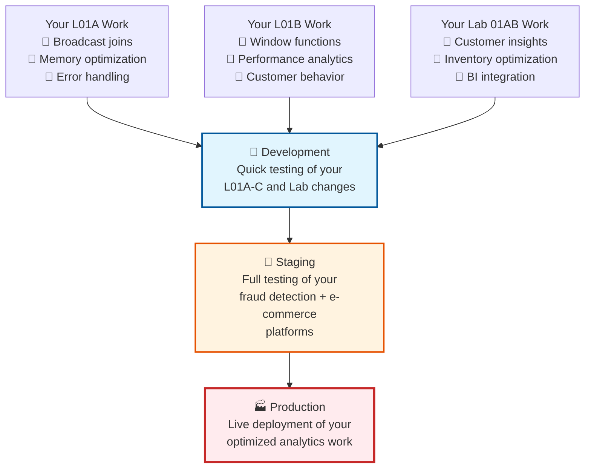

# Lesson 3B: Enterprise Authentication & Multi-Environment Deployment

**Duration:** 90 minutes  
**Level:** Intermediate-Advanced  
**Prerequisites:** Completed Lesson 3A with working CI/CD for your L01A-C and Lab work
**Series:** CI/CD for Data Engineering (Part 2 of 3)

## Introduction

**"Personal Access Tokens deployed your fraud detection and e-commerce platforms successfully in 3A. Now we'll make them production-ready with enterprise authentication that major financial institutions use for their data platforms."**

In Lesson 3A, you experienced the satisfaction of deploying your completed L01A-C fraud detection work and Lab 01AB-C e-commerce analytics automatically. Now we'll upgrade these working pipelines with enterprise-grade authentication and multi-environment deployment patterns.

**Building on Your Automated Success:**
- ✅ Your L01A PySpark optimization work deploys automatically
- ✅ Your L01B SparkSQL analytics deploy reliably  
- ✅ Your L01C ADF orchestration pipelines deploy correctly
- ✅ Your Lab 01AB e-commerce platform deploys end-to-end
- ✅ Your Lab 01C production monitoring deploys successfully
- 🎯 **Today's Goal:** Upgrade your working platforms to enterprise authentication

**What You'll Master Today:**
- 🔐 Service principals for your fraud detection and e-commerce platforms
- 🏢 Multi-environment deployment (dev → staging → prod) for your actual work
- 🛡️ Enterprise secrets management for your completed platforms
- 🔧 Authentication troubleshooting for your specific deployments

## Learning Objectives

By the end of this lesson, students will be able to:
- Create service principals for their completed fraud detection and e-commerce platforms
- Implement multi-environment CI/CD for their actual L01A-C and Lab work
- Secure their real platform deployments using enterprise authentication patterns
- Troubleshoot service principal issues with their specific Azure resources
- Apply production security standards to their completed data engineering platforms

## Prerequisites

- **REQUIRED:** Successful completion of Lesson 3A with working deployment of your L01A-C and Lab work
- Working fraud detection pipeline from your L01A PySpark + L01B SparkSQL + L01C ADF work
- Working e-commerce analytics pipeline from your Lab 01AB + Lab 01C work
- Azure trial account with owner-level permissions
- Basic understanding of Azure portal navigation

---

## Lesson Content

### Why Your Completed Platforms Need Enterprise Authentication (10 minutes)

#### The Personal Token Problem with Your Real Work

**Your Lesson 3A Setup:**
```bash
# What you built for your fraud detection platform (great for learning):
Your Personal Token → Azure DevOps → Deploy L01A + L01B + L01C work

# What you built for your e-commerce platform:
Your Personal Token → Azure DevOps → Deploy Lab 01AB + Lab 01C work

# Problems for production systems:
❌ Fraud detection tied to your user account
❌ E-commerce platform fails when you leave company  
❌ No audit trail of who deployed what optimization
❌ Can't rotate credentials for either platform
❌ Banking compliance issues with personal credentials
```

**Real-World Enterprise Scenario:**
*"Sarah's fraud detection platform (L01A optimization + L01B analytics + L01C orchestration) was deployed using her personal token. When she went on vacation, her token expired and the bank couldn't deploy critical fraud model updates. The e-commerce platform (Lab 01AB customer analytics + Lab 01C production monitoring) also failed. Both platforms were down for 3 days while IT created proper service principals."*

#### Enterprise Authentication Benefits for Your Platforms

**Service Principal Approach:**
```bash
# Enterprise authentication for your platforms:
Service Principal → Azure DevOps → Deploy fraud detection platform
Service Principal → Azure DevOps → Deploy e-commerce analytics platform

# Benefits for your actual work:
✅ Fraud detection deployments independent of individual users
✅ E-commerce platform deployments audit-compliant
✅ Credential rotation doesn't break your L01A-C optimizations
✅ Team members can maintain your Lab 01AB-C work
✅ Production-ready security for banking/retail environments
```

**Your Platform Security Upgrade:**
- **L01A PySpark Work**: Service principal deploys broadcast join optimizations securely
- **L01B SparkSQL Work**: Window functions and analytics deploy with proper audit trails
- **L01C ADF Work**: Orchestration pipelines deploy with enterprise credentials
- **Lab 01AB Work**: Customer analytics and inventory optimization deploy securely
- **Lab 01C Work**: Production monitoring deploys with compliance-ready authentication

### Service Principal Setup for Your Completed Platforms (30 minutes)

#### Create Service Principal for Your Data Platforms

**Step 1: Create Application Registration**

1. **Navigate to Azure Portal** → **Azure Active Directory** → **App registrations**
2. **Click "New registration"**
3. **Configure for your platforms**:
   ```bash
   Name: Week6-DataPlatforms-ServicePrincipal
   Description: Enterprise auth for fraud detection and e-commerce platforms
   Supported account types: Accounts in this organizational directory only
   Redirect URI: (None - this is for service authentication)
   ```
4. **Click "Register"**

**Step 2: Capture Essential Credentials**

After registration, capture these values **immediately**:

```bash
# Required for your fraud detection and e-commerce platforms:
Application (client) ID: [copy from Overview page]
Directory (tenant) ID: [copy from Overview page]
```

**Step 3: Create Client Secret**

1. **Go to "Certificates & secrets"** → **"New client secret"**
2. **Configure**:
   ```bash
   Description: Week6-Platforms-ClientSecret
   Expires: 6 months (sufficient for trial accounts)
   ```
3. **Copy the Value immediately** (you won't see it again!)
   ```bash
   Client Secret Value: [copy this immediately]
   ```

**Step 4: Assign Azure Permissions for Your Platforms**

Your service principal needs access to deploy your specific work:

1. **Navigate to your Resource Group** (where your Databricks workspace lives)
2. **Go to "Access control (IAM)"** → **"Add role assignment"**
3. **Configure permissions for your platforms**:
   ```bash
   Role: Contributor
   Assign access to: User, group, or service principal
   Members: Week6-DataPlatforms-ServicePrincipal
   ```

**Step 5: Add to Databricks Workspace**

Your fraud detection and e-commerce work needs Databricks access:

1. **Open your Databricks workspace**
2. **Admin Console** → **Users** → **Add User**
3. **Add your service principal**:
   ```bash
   Email: YOUR_CLIENT_ID@YOUR_TENANT_ID
   (This is the service principal format)
   ```
4. **Grant permissions**: **Can manage** (for deployment capability)

#### Test Your Service Principal with Real Platforms

**Local Authentication Test:**

```bash
# Test service principal can access your Azure resources
az login --service-principal \
  --username YOUR_CLIENT_ID \
  --password YOUR_CLIENT_SECRET \
  --tenant YOUR_TENANT_ID

# Verify access to your resource group
az group show --name YOUR_RESOURCE_GROUP_NAME

# Test Databricks access
az databricks workspace list
```

### Multi-Environment Setup for Your Platforms (20 minutes)

#### Environment Strategy for Your Completed Work

**Environment Design for Your Platforms:**



#### Variable Groups for Your Specific Platforms

**Fraud Detection Platform Variables:**

Create variable group: `fraud-detection-dev`
```bash
Name: fraud-detection-dev
Description: Development environment for L01A+L01B+L01C fraud platform

Variables:
azure-client-id = your-application-client-id
azure-client-secret = your-client-secret-value  # 🔒 SECURE
azure-tenant-id = your-directory-tenant-id
databricks-host = https://adb-xxx.x.azuredatabricks.net
fraud-detection-workspace-path = /Shared/fraud-detection-dev
l01a-optimization-path = /fraud-detection-dev/l01a-pyspark-optimization
l01b-analytics-path = /fraud-detection-dev/l01b-sparksql-analytics
l01c-orchestration-path = /fraud-detection-dev/l01c-adf-integration
adf-resource-group = your-resource-group-name
fraud-adf-factory-name = your-fraud-detection-adf
```

**E-commerce Platform Variables:**

Create variable group: `ecommerce-platform-dev`
```bash
Name: ecommerce-platform-dev  
Description: Development environment for Lab 01AB+01C e-commerce platform

Variables:
azure-client-id = your-application-client-id  # Same SP
azure-client-secret = your-client-secret-value  # 🔒 SECURE
azure-tenant-id = your-directory-tenant-id
databricks-host = https://adb-xxx.x.azuredatabricks.net
ecommerce-workspace-path = /Shared/ecommerce-analytics-dev
lab01ab-analytics-path = /ecommerce-dev/customer-behavior-analytics
lab01ab-inventory-path = /ecommerce-dev/inventory-optimization
lab01c-production-path = /ecommerce-dev/production-monitoring
ecommerce-adf-resource-group = your-resource-group-name
ecommerce-adf-factory-name = your-ecommerce-analytics-adf
```

**Staging Environment Variables:**

Create `fraud-detection-staging` and `ecommerce-platform-staging` with:
```bash
# Same credentials, different paths:
fraud-detection-workspace-path = /Shared/fraud-detection-staging
ecommerce-workspace-path = /Shared/ecommerce-analytics-staging
```

### Enterprise Pipeline Upgrade for Your Platforms (15 minutes)

#### Enhanced Fraud Detection Pipeline

Create `.azure-pipelines/fraud-detection-enterprise.yml`:

```yaml
# Enterprise deployment for your L01A+L01B+L01C fraud detection platform
# Deploys your actual completed work with service principal authentication

name: 'FraudDetection-Enterprise-$(Date:yyyyMMdd)-$(Rev:r)'

trigger:
  branches:
    include:
    - main
    - develop
  paths:
    include:
    - fraud-detection/*

variables:
  pythonVersion: '3.9'

stages:
# Development deployment (automatic) - Your L01A-C work
- stage: DeployFraudDetectionDev
  displayName: 'Deploy L01A+L01B+L01C to Development'
  condition: always()
  variables:
    - group: fraud-detection-dev
  jobs:
  - job: DeployOptimizedComponents
    displayName: 'Deploy Your Completed Fraud Detection Work'
    steps:
    - template: templates/fraud-detection-deploy.yml
      parameters:
        environment: 'development'
        l01aPath: '$(l01a-optimization-path)'
        l01bPath: '$(l01b-analytics-path)'
        l01cPath: '$(l01c-orchestration-path)'

# Staging deployment (main branch only) - Full platform testing
- stage: DeployFraudDetectionStaging
  displayName: 'Deploy Fraud Platform to Staging'
  dependsOn: DeployFraudDetectionDev
  condition: and(succeeded(), eq(variables['Build.SourceBranch'], 'refs/heads/main'))
  variables:
    - group: fraud-detection-staging
  jobs:
  - job: DeployCompleteplatform
    displayName: 'Deploy Your L01A+L01B+L01C Platform'
    steps:
    - template: templates/fraud-detection-deploy.yml
      parameters:
        environment: 'staging'
        l01aPath: '$(l01a-optimization-path)'
        l01bPath: '$(l01b-analytics-path)'
        l01cPath: '$(l01c-orchestration-path)'

# Production deployment (manual approval required)
- stage: DeployFraudDetectionProd
  displayName: 'Deploy Fraud Platform to Production'
  dependsOn: DeployFraudDetectionStaging
  condition: and(succeeded(), eq(variables['Build.SourceBranch'], 'refs/heads/main'))
  variables:
    - group: fraud-detection-prod
  jobs:
  - deployment: DeployToProduction
    displayName: 'Deploy Your Fraud Detection Platform'
    environment: 'fraud-detection-production'  # Requires manual approval
    strategy:
      runOnce:
        deploy:
          steps:
          - template: templates/fraud-detection-enterprise-deploy.yml
            parameters:
              environment: 'production'
```

#### Enhanced E-commerce Platform Pipeline

Create `.azure-pipelines/ecommerce-enterprise.yml`:

```yaml
# Enterprise deployment for your Lab 01AB+01C e-commerce analytics platform  
# Deploys your actual completed Lab work with service principal authentication

name: 'Ecommerce-Enterprise-$(Date:yyyyMMdd)-$(Rev:r)'

trigger:
  branches:
    include:
    - main
    - develop
  paths:
    include:
    - ecommerce-platform/*

variables:
  pythonVersion: '3.9'

stages:
# Development deployment - Your Lab 01AB+01C work
- stage: DeployEcommerceDev
  displayName: 'Deploy Lab 01AB+01C to Development'
  condition: always()
  variables:
    - group: ecommerce-platform-dev
  jobs:
  - job: DeployEcommerceComponents
    displayName: 'Deploy Your Completed E-commerce Work'
    steps:
    - template: templates/ecommerce-platform-deploy.yml
      parameters:
        environment: 'development'
        lab01abAnalyticsPath: '$(lab01ab-analytics-path)'
        lab01abInventoryPath: '$(lab01ab-inventory-path)'
        lab01cProductionPath: '$(lab01c-production-path)'

# Staging deployment - Full e-commerce platform testing
- stage: DeployEcommerceStaging
  displayName: 'Deploy E-commerce Platform to Staging'
  dependsOn: DeployEcommerceDev
  condition: and(succeeded(), eq(variables['Build.SourceBranch'], 'refs/heads/main'))
  variables:
    - group: ecommerce-platform-staging
  jobs:
  - job: DeployCompletePlatform
    displayName: 'Deploy Your Lab 01AB+01C Platform'
    steps:
    - template: templates/ecommerce-platform-deploy.yml
      parameters:
        environment: 'staging'
        lab01abAnalyticsPath: '$(lab01ab-analytics-path)'
        lab01abInventoryPath: '$(lab01ab-inventory-path)'
        lab01cProductionPath: '$(lab01c-production-path)'
```

#### Deployment Templates for Your Specific Work

Create `templates/fraud-detection-enterprise-deploy.yml`:

```yaml
# Deployment template for your L01A+L01B+L01C fraud detection work
parameters:
- name: environment
  type: string
- name: l01aPath
  type: string
- name: l01bPath  
  type: string
- name: l01cPath
  type: string

steps:
- task: UsePythonVersion@0
  inputs:
    versionSpec: '$(pythonVersion)'
  displayName: 'Use Python $(pythonVersion)'

- script: |
    echo "🔐 Installing Azure CLI and Databricks CLI for your platforms..."
    pip install azure-cli databricks-cli
  displayName: 'Install deployment tools'

- script: |
    echo "🔑 Authenticating with Service Principal for ${{ parameters.environment }}..."
    echo "Deploying your L01A+L01B+L01C fraud detection work..."
    
    # Login to Azure using service principal
    az login --service-principal \
      --username $(azure-client-id) \
      --password $(azure-client-secret) \
      --tenant $(azure-tenant-id)
    
    # Get Databricks access token using Azure CLI
    ACCESS_TOKEN=$(az account get-access-token \
      --resource 2ff814a6-3304-4ab8-85cb-cd0e6f879c1d \
      --query accessToken -o tsv)
    
    # Configure Databricks CLI with service principal token
    databricks configure --token <<EOF
    $(databricks-host)
    $ACCESS_TOKEN
    EOF
    
    echo "✅ Service principal authentication successful for fraud detection platform"
  displayName: 'Authenticate with Service Principal'

- script: |
    echo "🚀 Deploying your L01A PySpark optimization work..."
    databricks workspace import-dir fraud-detection/l01a-optimized-processing ${{ parameters.l01aPath }}
    
    echo "🚀 Deploying your L01B SparkSQL analytics work..."
    databricks workspace import-dir fraud-detection/l01b-advanced-analytics ${{ parameters.l01bPath }}
    
    echo "🚀 Deploying your L01C ADF integration work..."
    databricks workspace import-dir fraud-detection/l01c-integration ${{ parameters.l01cPath }}
    
    echo "✅ Your completed fraud detection platform deployed to ${{ parameters.environment }}!"
  displayName: 'Deploy Your L01A+L01B+L01C Fraud Detection Work'

- script: |
    echo "📋 Validating your deployed work in ${{ parameters.environment }}..."
    echo "Checking L01A broadcast join optimization notebooks..."
    databricks workspace list ${{ parameters.l01aPath }}
    
    echo "Checking L01B window function analytics notebooks..."  
    databricks workspace list ${{ parameters.l01bPath }}
    
    echo "Checking L01C orchestration integration..."
    databricks workspace list ${{ parameters.l01cPath }}
    
    echo "✅ All your fraud detection components deployed successfully!"
  displayName: 'Validate Your Platform Deployment'
```

### Authentication Troubleshooting for Your Platforms (15 minutes)

#### Common Issues with Your Specific Work

**Issue 1: Service Principal Authentication Fails**
```bash
# Symptoms with your platforms:
- "Error 401: Invalid authentication" when deploying L01A work
- "Service principal authentication failed" for Lab 01AB deployment

# Debug steps for your fraud detection platform:
1. Verify service principal credentials in fraud-detection-dev variable group
2. Check client secret hasn't expired (6-month trial limit)
3. Confirm service principal has Contributor access to your resource group
4. Test authentication locally with your specific tenant/client IDs

# Solution for your platforms:
az login --service-principal \
  --username YOUR_CLIENT_ID \
  --password YOUR_CLIENT_SECRET \
  --tenant YOUR_TENANT_ID

# Verify access to your specific resources:
az group show --name YOUR_RESOURCE_GROUP_NAME
```

**Issue 2: Databricks Access Denied for Your Work**
```bash
# Symptoms:
- "Error 403: Access denied" when deploying L01A optimization notebooks
- "Service principal not found" when deploying Lab 01AB analytics

# Solutions for your platforms:
1. Add service principal to your Databricks workspace users
2. Grant "Can manage" permissions for deployment capability
3. Verify service principal email format: CLIENT_ID@TENANT_ID
4. Check your Databricks workspace URL in variable groups
```

**Issue 3: Variable Group Access for Your Platforms**
```bash
# Symptoms:
- "Variable not found" when accessing fraud-detection-dev group
- Pipeline can't access ecommerce-platform-dev secrets

# Solutions:
1. Check variable group security settings for your platforms
2. Verify pipeline has access to both fraud-detection and ecommerce variable groups
3. Confirm secure variables are marked with 🔒 lock icon
4. Validate variable names match your pipeline YAML references
```

#### Troubleshooting Exercise for Your Work

**Scenario:** Your fraud detection platform deployment fails with "Authentication failed"

**Debug Process for Your L01A-C Work:**
1. **Check Logs:** What specific error appears when deploying your optimization work?
2. **Verify Credentials:** Are client ID, secret, and tenant correct for your platforms?
3. **Test Locally:** Can you authenticate and access your specific Azure resources?
4. **Check Permissions:** Does service principal have access to your Databricks workspace?
5. **Validate Variables:** Are fraud-detection-dev and ecommerce-platform-dev groups configured correctly?

---

## Hands-On Exercise: Enterprise Platform Conversion (20 minutes)

### Exercise: Convert Your Completed Work to Enterprise Authentication

**Objective:** Upgrade your working Lesson 3A fraud detection and e-commerce pipelines to use service principal authentication

**Prerequisites Check:**
- [ ] Your L01A PySpark optimization work deploys successfully from Lesson 3A
- [ ] Your L01B SparkSQL analytics work deploys correctly from Lesson 3A
- [ ] Your L01C ADF integration deploys from Lesson 3A
- [ ] Your Lab 01AB e-commerce analytics deploys from Lesson 3A
- [ ] Your Lab 01C production monitoring deploys from Lesson 3A

**Steps:**

1. **Backup Your Working State** (2 minutes)
   - Ensure your Lesson 3A fraud detection pipeline still works
   - Verify your Lesson 3A e-commerce platform pipeline works
   - Note current deployment locations in Databricks for both platforms
   - Take screenshots of working pipeline runs

2. **Create Service Principal for Your Platforms** (8 minutes)
   - Follow the service principal creation steps above
   - Capture client ID, client secret, and tenant ID
   - Test authentication using Azure CLI with your specific resources
   - Add service principal to your Databricks workspace

3. **Create Variable Groups for Your Work** (5 minutes)
   - Create `fraud-detection-dev` variable group with your platform paths
   - Create `ecommerce-platform-dev` variable group with your analytics paths
   - Create staging versions: `fraud-detection-staging` and `ecommerce-platform-staging`
   - Mark all client secrets as secure (🔒)

4. **Deploy Enterprise Pipelines** (3 minutes)
   - Upload `fraud-detection-enterprise.yml` with your L01A-C deployment logic
   - Upload `ecommerce-enterprise.yml` with your Lab 01AB-C deployment logic  
   - Upload deployment templates referencing your actual completed work
   - Create new pipelines pointing to enterprise YAML files

5. **Test Multi-Environment Deployment** (2 minutes)
   - Trigger fraud detection enterprise pipeline 
   - Watch your L01A+L01B+L01C work deploy to dev then staging
   - Trigger e-commerce enterprise pipeline
   - Watch your Lab 01AB+01C work deploy to dev then staging
   - Verify all your completed work deploys using service principal authentication

**Success Criteria:**
- ✅ Service principal authenticates successfully for both platforms
- ✅ Your L01A PySpark optimization work deploys to multiple environments
- ✅ Your L01B SparkSQL analytics deploy using enterprise authentication
- ✅ Your L01C ADF integration deploys with service principal
- ✅ Your Lab 01AB customer analytics and inventory optimization deploy securely
- ✅ Your Lab 01C production monitoring deploys with enterprise credentials
- ✅ No personal tokens used in any production deployments

### Troubleshooting Time for Your Specific Work

**If Issues Arise with Your Platforms:**
- **L01A deployment fails:** Check service principal has access to your specific Databricks workspace
- **L01B analytics fail:** Verify variable group paths match your actual notebook structure
- **L01C integration fails:** Confirm service principal has Contributor access to your ADF resource group
- **Lab 01AB fails:** Check ecommerce-platform-dev variable group configuration
- **Lab 01C fails:** Verify service principal can access your specific Azure resources

**Instructor Support:**
- Live debugging of authentication issues with your specific platforms
- Shared screen troubleshooting for your fraud detection and e-commerce work
- Backup service principal if your setup encounters trial account limitations

---

## Assessment Criteria (15 minutes)

### Practical Assessment

**Demonstration Required for Your Completed Work:**

1. **Service Principal Setup for Your Platforms** (5 minutes)
   - Show service principal in Azure Portal configured for your work
   - Demonstrate proper role assignments for your fraud detection and e-commerce resources
   - Explain security benefits vs. personal tokens for your specific platforms

2. **Multi-Environment Deployment of Your Work** (7 minutes)
   - Trigger fraud detection pipeline showing dev → staging deployment of your L01A-C work
   - Trigger e-commerce pipeline showing dev → staging deployment of your Lab 01AB-C work
   - Show your completed notebooks deployed to different workspace paths
   - Demonstrate variable group configuration for both platforms

3. **Troubleshooting Skills for Your Platforms** (3 minutes)
   - Debug a provided authentication failure scenario with your specific work
   - Explain your diagnostic process for fraud detection platform issues
   - Identify solution approach for e-commerce platform authentication problems

**Pass/Fail Criteria:**
- **Pass:** Service principal successfully authenticates and deploys both your fraud detection and e-commerce platforms to multiple environments
- **Fail:** Cannot demonstrate working service principal authentication for your completed L01A-C and Lab work

### Knowledge Assessment for Your Platforms

**Key Questions:**
1. Why are service principals more secure than personal tokens for your fraud detection platform?
2. How do you rotate credentials for your e-commerce analytics platform without downtime?
3. What happens if the service principal loses permissions to your Databricks workspace?
4. How would you add a QA environment for your L01A-C and Lab 01AB-C work?

**Scenario Questions for Your Work:**
- *"Your fraud detection platform worked yesterday but fails today with authentication errors. Walk me through your troubleshooting process for L01A-C components."*
- *"A new team member needs to modify your e-commerce analytics platform. What access do they need for your Lab 01AB-C work and how do you grant it?"*
- *"Your L01B window function analytics need to be deployed to a new environment. How do you configure authentication for this specific component?"*

---

## Wrap-Up & Next Steps (5 minutes)

### What You've Accomplished with Your Platforms

**Today's Achievements:**
- ✅ Mastered enterprise authentication for your completed fraud detection platform
- ✅ Implemented multi-environment deployment for your L01A-C and Lab 01AB-C work
- ✅ Secured your fraud detection and e-commerce analytics using service principals
- ✅ Built production-ready CI/CD foundation for your specific data engineering platforms

**Business Impact for Your Work:**
- **Security:** Your fraud detection platform now has proper access controls and audit trails
- **Reliability:** Your e-commerce analytics platform is independent of individual users
- **Scalability:** Both platforms support multi-environment deployment for team growth
- **Compliance:** Enterprise-grade authentication for banking and retail environments

### Preview: Lesson 3C - Testing & Production Practices

**What's Next for Your Platforms:**
In Lesson 3C, we'll add the final production touches to your fraud detection and e-commerce work:
- Automated testing strategies for your L01A PySpark optimizations and Lab 01AB analytics
- Monitoring and alerting for your L01B SparkSQL performance and Lab 01C production systems
- Cost optimization for your L01C ADF orchestration and overall platform operations
- Documentation and maintenance practices for your completed platforms

**Why It Matters for Your Work:**
Enterprise authentication deploys your platforms securely, but testing and monitoring keep them reliable:
- Catch data quality issues in your fraud detection before they impact business
- Monitor performance of your L01A broadcast joins and L01B window functions
- Optimize costs for your L01C ADF orchestration and Lab 01C production monitoring
- Create maintainable systems for team collaboration on your completed work

### Enterprise Readiness Checklist for Your Platforms

**Your Fraud Detection Platform Is Now Ready For:**
- ✅ Production deployments with proper authentication for L01A-C components
- ✅ Multi-environment promotion of your PySpark optimizations and SparkSQL analytics
- ✅ Team-based credential management for your ADF orchestration work
- ✅ Banking compliance requirements for fraud detection systems

**Your E-commerce Analytics Platform Is Now Ready For:**
- ✅ Production deployments with enterprise authentication for Lab 01AB-C work
- ✅ Multi-environment customer behavior analytics and inventory optimization
- ✅ Team-based management of your production monitoring systems
- ✅ Retail industry compliance for customer analytics platforms

### Homework for Lesson 3C

**Optional Preparation for Your Platforms:**
1. Research data quality testing frameworks that could validate your L01A-C work
2. Think about monitoring requirements for your fraud detection and e-commerce platforms
3. Consider cost optimization opportunities for your L01C ADF and Lab 01C production systems
4. Document your current platform authentication setup for team knowledge sharing

---

## Instructor Notes

### Timing Breakdown
- Why upgrade authentication for completed work: 10 min
- Service principal creation for student platforms: 30 min
- Variable groups setup for their specific work: 20 min
- Pipeline upgrade for L01A-C and Lab work: 15 min
- Troubleshooting workshop for their platforms: 15 min

### Critical Success Factors
1. **Service Principal Permissions:** Students must have proper access to their specific Azure resources
2. **Variable Group Security:** Students often forget to mark secrets secure for their platforms
3. **Credential Capture:** Ensure students save all values for their fraud detection and e-commerce work
4. **Platform-Specific Testing:** Azure CLI authentication test must work with their actual resources

### Backup Plans for Trial Account Limitations
- **If service principal creation fails:** Provide instructor's working service principal with student resource access
- **If Azure permissions are complex:** Use simplified permission model for trial accounts
- **If authentication debugging takes too long:** Provide working variable groups for student platforms
- **If students finish early:** Advanced security patterns for their specific fraud detection and e-commerce work

### Key Teaching Moments
1. **Security Mindset:** Emphasize why personal tokens are problematic for their production platforms
2. **Enterprise Thinking:** Connect to real-world scenarios for fraud detection and e-commerce systems
3. **Systematic Debugging:** Model good troubleshooting practices for their specific work
4. **Production Readiness:** Discuss what makes their completed platforms enterprise-grade

### Extension Activities for Advanced Students
- Configure automated credential rotation for their platforms
- Add conditional approvals for production deployments of their fraud detection work
- Implement pipeline failure notifications specific to their L01A-C and Lab components
- Create pipeline templates for deploying their work to additional environments