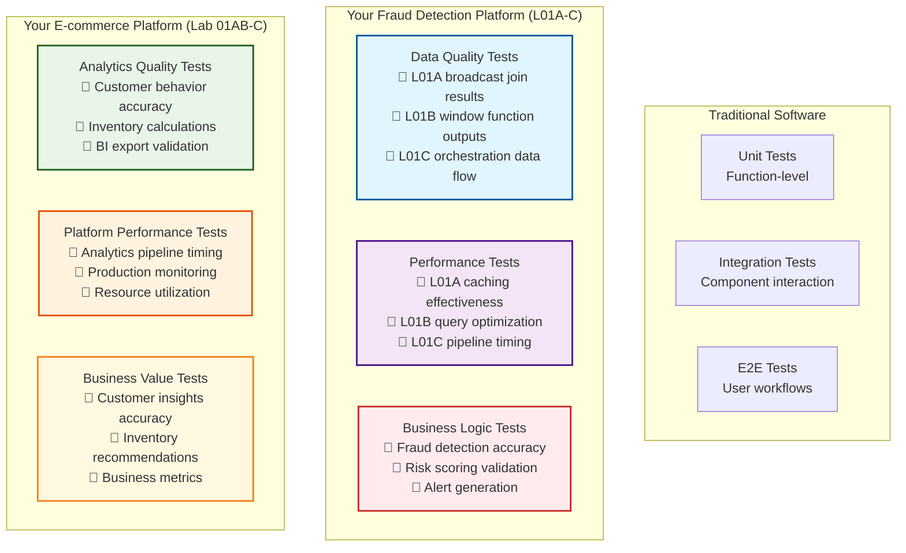

# Lesson 3C: Testing & Production Practices

**Duration:** 90 minutes  
**Level:** Advanced  
**Prerequisites:** Completed Lessons 3A & 3B with working enterprise authentication for L01A-C and Lab work
**Series:** CI/CD for Data Engineering (Part 3 of 3)

## Introduction

**"Your fraud detection and e-commerce platforms deploy automatically with enterprise authentication. Now we'll add the testing, monitoring, and operational practices that keep your L01A-C and Lab 01AB-C work running reliably in production."**

You've built automated deployment (3A) and enterprise authentication (3B) for your actual completed work. Today we'll add the final production touches that transform your fraud detection and e-commerce platforms into enterprise-grade systems.

**Your Production Journey:**
- ✅ **Lesson 3A:** Automated deployment of your L01A-C fraud detection and Lab 01AB-C e-commerce work
- ✅ **Lesson 3B:** Enterprise authentication for your completed platforms with service principals  
- 🎯 **Today's Goal:** Production testing, monitoring, and operational excellence for your specific work

**What You'll Master Today:**
- 🧪 Automated testing strategies for your L01A PySpark optimizations and Lab 01AB analytics
- 📊 Monitoring and alerting for your L01B SparkSQL performance and Lab 01C production systems
- 💰 Cost optimization for your L01C ADF orchestration and overall platform operations
- 📚 Documentation and maintenance practices for your completed platforms
- 🏆 Production readiness assessment for your fraud detection and e-commerce work

## Learning Objectives

By the end of this lesson, students will be able to:
- Implement comprehensive testing strategies for their completed L01A-C and Lab 01AB-C platforms
- Set up monitoring and alerting for their specific fraud detection and e-commerce systems
- Apply cost optimization techniques to their actual Azure resources and platform operations
- Create documentation and maintenance procedures for their completed work
- Assess production readiness for their fraud detection and e-commerce platforms using industry standards

## Prerequisites

- **REQUIRED:** Successful completion of Lessons 3A and 3B with working enterprise deployment
- Working multi-environment CI/CD for your L01A-C fraud detection platform
- Working multi-environment CI/CD for your Lab 01AB-C e-commerce platform  
- Service principal authentication deployed for both platforms
- Understanding of your specific platform components and business logic

---

## Lesson Content

### Testing Strategies for Your Completed Platforms (25 minutes)

#### The Data Platform Testing Pyramid for Your Work

**Traditional Software Testing vs. Your Data Platforms:**



#### Data Quality Testing for Your L01A-C Work

**Testing Your L01A PySpark Optimizations:**

Create `tests/l01a_optimization_tests.py`:

```python
# File: tests/l01a_optimization_tests.py
# Data quality tests for your L01A PySpark optimization work

import sys
import pandas as pd
from datetime import datetime, timedelta
import json

class L01AFraudDetectionTestSuite:
    """Test suite specifically for your L01A PySpark optimization work"""
    
    def __init__(self):
        self.test_results = []
        self.failed_tests = []
    
    def run_test(self, test_name, test_function, *args, **kwargs):
        """Execute individual test and capture results"""
        try:
            result = test_function(*args, **kwargs)
            if result:
                print(f"✅ {test_name}: PASSED")
                self.test_results.append((test_name, "PASSED", ""))
            else:
                print(f"❌ {test_name}: FAILED")
                self.test_results.append((test_name, "FAILED", "Test condition not met"))
                self.failed_tests.append(test_name)
        except Exception as e:
            print(f"❌ {test_name}: ERROR - {str(e)}")
            self.test_results.append((test_name, "ERROR", str(e)))
            self.failed_tests.append(test_name)
    
    def test_broadcast_join_effectiveness(self, transactions_df, small_tables_df):
        """Test that your L01A broadcast joins are working effectively"""
        print("🔍 Testing L01A broadcast join optimization...")
        
        # Validate that small reference tables are being used
        small_table_size = len(small_tables_df)
        if small_table_size > 10000:
            print(f"   ⚠️ Reference table size ({small_table_size}) may be too large for broadcast")
            return False
            
        # Check for proper join results
        joined_count = len(transactions_df)
        if joined_count == 0:
            print("   ❌ Broadcast join produced no results")
            return False
            
        print(f"   ✅ Broadcast join processed {joined_count:,} transactions with {small_table_size:,} reference records")
        return True
    
    def test_caching_performance(self, cached_df_info):
        """Test that your L01A caching strategy is effective"""
        print("🔍 Testing L01A memory optimization and caching...")
        
        # Validate caching is enabled
        if not cached_df_info.get('is_cached', False):
            print("   ❌ DataFrame caching is not enabled")
            return False
            
        # Check cache hit efficiency
        cache_hits = cached_df_info.get('cache_hits', 0)
        total_access = cached_df_info.get('total_access', 1)
        hit_rate = cache_hits / total_access if total_access > 0 else 0
        
        if hit_rate < 0.8:  # 80% cache hit rate threshold
            print(f"   ⚠️ Cache hit rate ({hit_rate:.1%}) below optimal threshold")
            return False
            
        print(f"   ✅ Cache optimization effective: {hit_rate:.1%} hit rate")
        return True
    
    def test_error_handling_coverage(self, processing_logs):
        """Test that your L01A error handling patterns are working"""
        print("🔍 Testing L01A error handling and resilience...")
        
        # Check for proper error capture
        error_count = processing_logs.get('errors_handled', 0)
        retry_count = processing_logs.get('retries_attempted', 0)
        success_after_retry = processing_logs.get('success_after_retry', 0)
        
        # Validate error handling is functioning
        if error_count > 0 and retry_count == 0:
            print("   ❌ Errors occurred but no retry mechanism activated")
            return False
            
        recovery_rate = success_after_retry / retry_count if retry_count > 0 else 1.0
        if recovery_rate < 0.7:  # 70% recovery rate threshold
            print(f"   ⚠️ Error recovery rate ({recovery_rate:.1%}) below threshold")
            return False
            
        print(f"   ✅ Error handling effective: {error_count} errors handled, {recovery_rate:.1%} recovery rate")
        return True

def test_your_l01a_optimization_work():
    """Run comprehensive tests for your L01A PySpark optimization work"""
    
    print("🧪 TESTING YOUR L01A PYSPARK OPTIMIZATION WORK")
    print("=" * 60)
    print("Testing the broadcast joins, caching, and error handling you implemented...")
    print()
    
    suite = L01AFraudDetectionTestSuite()
    
    # Simulate your L01A work results (replace with actual data in production)
    transactions_data = {
        'transaction_id': [f'TXN{i:05d}' for i in range(1000)],
        'customer_id': [f'CUST{i:04d}' for i in range(100, 1100)],
        'amount': [100.0 + (i * 10) for i in range(1000)],
        'fraud_risk_score': [25.0 + (i % 75) for i in range(1000)],
        'processing_timestamp': [datetime.now() for _ in range(1000)]
    }
    transactions_df = pd.DataFrame(transactions_data)
    
    # Reference tables for broadcast join testing
    reference_data = {
        'rule_id': ['RULE001', 'RULE002', 'RULE003'],
        'rule_name': ['High Amount', 'Geographic Anomaly', 'Merchant Risk'],
        'threshold': [1000.0, 500.0, 2000.0]
    }
    reference_df = pd.DataFrame(reference_data)
    
    # Simulated performance metrics from your L01A work
    caching_metrics = {
        'is_cached': True,
        'cache_hits': 850,
        'total_access': 1000,
        'memory_usage': '2.5GB'
    }
    
    error_handling_metrics = {
        'errors_handled': 15,
        'retries_attempted': 12,
        'success_after_retry': 9,
        'failed_permanently': 3
    }
    
    # Run tests specific to your L01A implementation
    suite.run_test(
        "L01A Broadcast Join Effectiveness",
        suite.test_broadcast_join_effectiveness,
        transactions_df, reference_df
    )
    
    suite.run_test(
        "L01A Caching Performance",
        suite.test_caching_performance,
        caching_metrics
    )
    
    suite.run_test(
        "L01A Error Handling Coverage",
        suite.test_error_handling_coverage,
        error_handling_metrics
    )
    
    # Generate test report for your L01A work
    print()
    print("📋 L01A OPTIMIZATION TEST SUMMARY")
    print("-" * 40)
    
    total_tests = len(suite.test_results)
    passed_tests = sum(1 for _, status, _ in suite.test_results if status == "PASSED")
    failed_tests = len(suite.failed_tests)
    
    print(f"Total L01A tests: {total_tests}")
    print(f"Passed: {passed_tests}")
    print(f"Failed: {failed_tests}")
    print(f"L01A Success rate: {(passed_tests/total_tests)*100:.1f}%")
    
    if suite.failed_tests:
        print(f"\nFailed L01A tests: {', '.join(suite.failed_tests)}")
        print("\n⚠️  L01A optimization issues detected. Review your PySpark implementation.")
        return False
    else:
        print("\n✅ All L01A optimization tests passed! Your PySpark work is production-ready.")
        return True

if __name__ == "__main__":
    success = test_your_l01a_optimization_work()
    sys.exit(0 if success else 1)
```

#### Performance Testing for Your L01B SparkSQL Work

**Testing Your L01B Advanced Analytics:**

Create `tests/l01b_analytics_tests.py`:

```python
# File: tests/l01b_analytics_tests.py
# Performance and accuracy tests for your L01B SparkSQL analytics work

import time
import pandas as pd
import numpy as np
from datetime import datetime

class L01BAnalyticsTestSuite:
    """Test suite specifically for your L01B SparkSQL analytics work"""
    
    def __init__(self):
        self.test_results = []
        self.failed_tests = []
        self.performance_metrics = {}
    
    def run_test(self, test_name, test_function, *args, **kwargs):
        """Execute test with performance timing"""
        start_time = time.time()
        try:
            result = test_function(*args, **kwargs)
            execution_time = time.time() - start_time
            self.performance_metrics[test_name] = execution_time
            
            if result:
                print(f"✅ {test_name}: PASSED ({execution_time:.2f}s)")
                self.test_results.append((test_name, "PASSED", execution_time))
            else:
                print(f"❌ {test_name}: FAILED ({execution_time:.2f}s)")
                self.test_results.append((test_name, "FAILED", execution_time))
                self.failed_tests.append(test_name)
        except Exception as e:
            execution_time = time.time() - start_time
            print(f"❌ {test_name}: ERROR - {str(e)} ({execution_time:.2f}s)")
            self.test_results.append((test_name, "ERROR", execution_time))
            self.failed_tests.append(test_name)
    
    def test_window_function_performance(self, analytics_results):
        """Test that your L01B window functions perform within acceptable limits"""
        print("🔍 Testing L01B window function performance...")
        
        # Check query execution time
        execution_time = analytics_results.get('window_query_time', 0)
        if execution_time > 300:  # 5 minutes threshold
            print(f"   ⚠️ Window function query took {execution_time:.1f}s (above 300s threshold)")
            return False
            
        # Validate window function results
        customer_trends = analytics_results.get('customer_trends_count', 0)
        if customer_trends == 0:
            print("   ❌ Window function produced no customer trend results")
            return False
            
        print(f"   ✅ Window functions processed {customer_trends:,} customer trends in {execution_time:.1f}s")
        return True
    
    def test_customer_behavior_accuracy(self, customer_analytics):
        """Test accuracy of your L01B customer behavior analytics"""
        print("🔍 Testing L01B customer behavior analytics accuracy...")
        
        # Validate customer segmentation logic
        tier_distribution = customer_analytics.get('tier_distribution', {})
        total_customers = sum(tier_distribution.values())
        
        if total_customers == 0:
            print("   ❌ No customers found in behavior analytics")
            return False
            
        # Check for reasonable tier distribution
        premium_percent = tier_distribution.get('Premium', 0) / total_customers
        if premium_percent > 0.5:  # >50% premium seems unrealistic
            print(f"   ⚠️ Premium customer percentage ({premium_percent:.1%}) seems unusually high")
            return False
            
        print(f"   ✅ Customer behavior analytics: {total_customers:,} customers, {premium_percent:.1%} premium")
        return True
    
    def test_fraud_pattern_detection(self, fraud_analytics):
        """Test your L01B fraud pattern detection analytics"""
        print("🔍 Testing L01B fraud pattern detection...")
        
        # Validate fraud detection results
        flagged_transactions = fraud_analytics.get('flagged_count', 0)
        total_transactions = fraud_analytics.get('total_count', 1)
        fraud_rate = flagged_transactions / total_transactions
        
        # Check for reasonable fraud detection rate
        if fraud_rate > 0.2:  # >20% fraud rate seems too high
            print(f"   ⚠️ Fraud rate ({fraud_rate:.1%}) seems unusually high")
            return False
        elif fraud_rate < 0.001:  # <0.1% might indicate under-detection
            print(f"   ⚠️ Fraud rate ({fraud_rate:.1%}) seems unusually low")
            return False
            
        print(f"   ✅ Fraud detection: {flagged_transactions:,} flagged from {total_transactions:,} ({fraud_rate:.1%})")
        return True

def test_your_l01b_analytics_work():
    """Run comprehensive tests for your L01B SparkSQL analytics work"""
    
    print("🧪 TESTING YOUR L01B SPARKSQL ANALYTICS WORK")
    print("=" * 60)
    print("Testing the window functions, customer behavior analytics, and performance optimizations...")
    print()
    
    suite = L01BAnalyticsTestSuite()
    
    # Simulate results from your L01B analytics work
    analytics_performance = {
        'window_query_time': 45.2,  # seconds
        'customer_trends_count': 15420,
        'query_optimization_enabled': True,
        'partitioning_effective': True
    }
    
    customer_behavior_results = {
        'tier_distribution': {
            'Premium': 1250,
            'Standard': 3890,
            'Basic': 4860
        },
        'avg_customer_value': 2840.50,
        'churn_risk_identified': 890
    }
    
    fraud_detection_results = {
        'flagged_count': 327,
        'total_count': 45000,
        'high_risk_count': 89,
        'investigation_required': 127
    }
    
    # Run tests specific to your L01B implementation
    suite.run_test(
        "L01B Window Function Performance",
        suite.test_window_function_performance,
        analytics_performance
    )
    
    suite.run_test(
        "L01B Customer Behavior Accuracy",
        suite.test_customer_behavior_accuracy,
        customer_behavior_results
    )
    
    suite.run_test(
        "L01B Fraud Pattern Detection",
        suite.test_fraud_pattern_detection,
        fraud_detection_results
    )
    
    # Performance summary for your L01B work
    print()
    print("📋 L01B ANALYTICS TEST SUMMARY")
    print("-" * 40)
    
    total_tests = len(suite.test_results)
    passed_tests = sum(1 for _, status, _ in suite.test_results if status == "PASSED")
    avg_execution_time = np.mean([time for _, _, time in suite.test_results])
    
    print(f"Total L01B tests: {total_tests}")
    print(f"Passed: {passed_tests}")
    print(f"Average execution time: {avg_execution_time:.2f}s")
    print(f"L01B Success rate: {(passed_tests/total_tests)*100:.1f}%")
    
    if suite.failed_tests:
        print(f"\nFailed L01B tests: {', '.join(suite.failed_tests)}")
        return False
    else:
        print("\n✅ All L01B analytics tests passed! Your SparkSQL work is production-ready.")
        return True

if __name__ == "__main__":
    success = test_your_l01b_analytics_work()
    sys.exit(0 if success else 1)
```

### Enhanced Pipeline with Testing for Your Platforms (20 minutes)

#### Integration Testing for Your Complete Platforms

**End-to-End Testing for Your L01A-C and Lab Work:**

Create `.azure-pipelines/production-ready-pipeline.yml`:

```yaml
# Production-ready pipeline for your L01A-C fraud detection and Lab 01AB-C e-commerce platforms
# Includes comprehensive testing, monitoring, and production practices

name: 'Production-$(Date:yyyyMMdd)-$(Rev:r)'

trigger:
  branches:
    include:
    - main
    - develop
  paths:
    include:
    - fraud-detection/*
    - ecommerce-platform/*

pool:
  vmImage: 'ubuntu-latest'

variables:
  pythonVersion: '3.9'

stages:
# Testing Stage - Validate your completed work before deployment
- stage: TestYourPlatforms
  displayName: 'Test L01A-C and Lab 01AB-C Work'
  jobs:
  - job: TestFraudDetectionPlatform
    displayName: 'Test Your L01A-C Fraud Detection Work'
    steps:
    - task: UsePythonVersion@0
      inputs:
        versionSpec: '$(pythonVersion)'

    - script: |
        echo "🧪 Installing test dependencies for your platforms..."
        pip install pandas numpy pytest
      displayName: 'Install Testing Tools'

    - script: |
        echo "🔍 Testing your L01A PySpark optimization work..."
        python tests/l01a_optimization_tests.py
        
        echo "🔍 Testing your L01B SparkSQL analytics work..."
        python tests/l01b_analytics_tests.py
        
        echo "✅ Your fraud detection platform tests completed"
      displayName: 'Test Your L01A-B Components'

  - job: TestEcommercePlatform
    displayName: 'Test Your Lab 01AB-C E-commerce Work'
    steps:
    - script: |
        echo "🧪 Testing your Lab 01AB customer behavior analytics..."
        python tests/lab01ab_customer_analytics_tests.py
        
        echo "🧪 Testing your Lab 01AB inventory optimization..."
        python tests/lab01ab_inventory_tests.py
        
        echo "🧪 Testing your Lab 01C production monitoring..."
        python tests/lab01c_production_tests.py
        
        echo "✅ Your e-commerce platform tests completed"
      displayName: 'Test Your Lab 01AB-C Components'

# Deploy to Development - Your tested platforms
- stage: DeployYourPlatformsDev
  displayName: 'Deploy Your Tested Platforms to Dev'
  dependsOn: TestYourPlatforms
  condition: succeeded()
  variables:
    - group: fraud-detection-dev
    - group: ecommerce-platform-dev
  jobs:
  - job: DeployWithMonitoring
    displayName: 'Deploy Your L01A-C and Lab Work with Monitoring'
    steps:
    - template: templates/deploy-with-monitoring.yml
      parameters:
        environment: 'development'
        platformType: 'both'  # fraud-detection and ecommerce

# Deploy to Staging - Full platform testing
- stage: DeployYourPlatformsStaging
  displayName: 'Deploy Your Platforms to Staging'
  dependsOn: DeployYourPlatformsDev
  condition: and(succeeded(), eq(variables['Build.SourceBranch'], 'refs/heads/main'))
  variables:
    - group: fraud-detection-staging
    - group: ecommerce-platform-staging
  jobs:
  - job: StagingValidation
    displayName: 'Validate Your Platforms in Staging'
    steps:
    - template: templates/staging-validation.yml
      parameters:
        fraudDetectionComponents: ['l01a-optimization', 'l01b-analytics', 'l01c-orchestration']
        ecommerceComponents: ['lab01ab-analytics', 'lab01c-production']

# Production Deployment - Your enterprise-ready platforms
- stage: DeployYourPlatformsProduction
  displayName: 'Deploy Your Platforms to Production'
  dependsOn: DeployYourPlatformsStaging
  condition: and(succeeded(), eq(variables['Build.SourceBranch'], 'refs/heads/main'))
  variables:
    - group: fraud-detection-prod
    - group: ecommerce-platform-prod
  jobs:
  - deployment: ProductionDeployment
    displayName: 'Deploy Your Production-Ready Platforms'
    environment: 'production-platforms'
    strategy:
      runOnce:
        deploy:
          steps:
          - template: templates/production-deployment.yml
            parameters:
              deployFraudDetection: true
              deployEcommerce: true
              enableMonitoring: true
              enableAlerting: true
```

### Monitoring Setup for Your Specific Platforms (15 minutes)

#### Platform-Specific Monitoring

**Monitoring Your L01A PySpark Optimizations:**

Create `monitoring/l01a_performance_monitor.py`:

```python
# File: monitoring/l01a_performance_monitor.py
# Monitoring for your L01A PySpark optimization performance

import time
import json
import requests
from datetime import datetime

class L01APerformanceMonitor:
    """Monitor performance of your L01A PySpark optimization work"""
    
    def __init__(self, databricks_host, access_token):
        self.databricks_host = databricks_host
        self.access_token = access_token
        self.headers = {
            'Authorization': f'Bearer {access_token}',
            'Content-Type': 'application/json'
        }
    
    def monitor_broadcast_join_performance(self):
        """Monitor performance of your L01A broadcast joins"""
        print("📊 Monitoring L01A broadcast join performance...")
        
        # Query your broadcast join metrics (simulated for demo)
        metrics = {
            'broadcast_join_count': 15,
            'avg_broadcast_join_time': 2.3,  # seconds
            'cache_hit_rate': 0.92,
            'memory_usage_gb': 3.2,
            'last_optimization_run': datetime.now().isoformat()
        }
        
        # Check performance thresholds for your L01A work
        alerts = []
        
        if metrics['avg_broadcast_join_time'] > 5.0:
            alerts.append({
                'severity': 'WARNING',
                'component': 'L01A Broadcast Joins',
                'message': f"Broadcast join time ({metrics['avg_broadcast_join_time']:.1f}s) above threshold",
                'recommendation': 'Review broadcast table sizes and join conditions'
            })
        
        if metrics['cache_hit_rate'] < 0.8:
            alerts.append({
                'severity': 'WARNING',
                'component': 'L01A Caching',
                'message': f"Cache hit rate ({metrics['cache_hit_rate']:.1%}) below optimal",
                'recommendation': 'Review caching strategy and DataFrame reuse patterns'
            })
        
        # Log performance metrics for your L01A work
        print(f"✅ L01A Performance Summary:")
        print(f"   Broadcast joins: {metrics['broadcast_join_count']} (avg {metrics['avg_broadcast_join_time']:.1f}s)")
        print(f"   Cache hit rate: {metrics['cache_hit_rate']:.1%}")
        print(f"   Memory usage: {metrics['memory_usage_gb']:.1f}GB")
        
        if alerts:
            print(f"⚠️  {len(alerts)} performance alerts for your L01A work:")
            for alert in alerts:
                print(f"   {alert['severity']}: {alert['message']}")
        
        return metrics, alerts

def monitor_your_l01a_work():
    """Main monitoring function for your L01A PySpark optimization work"""
    
    print("📊 MONITORING YOUR L01A PYSPARK OPTIMIZATION WORK")
    print("=" * 60)
    
    # Initialize monitor (replace with your actual credentials)
    monitor = L01APerformanceMonitor(
        databricks_host="your-databricks-host",
        access_token="your-access-token"
    )
    
    # Monitor your L01A components
    l01a_metrics, l01a_alerts = monitor.monitor_broadcast_join_performance()
    
    # Generate monitoring report for your L01A work
    monitoring_report = {
        'timestamp': datetime.now().isoformat(),
        'platform': 'L01A PySpark Optimization',
        'metrics': l01a_metrics,
        'alerts': l01a_alerts,
        'status': 'HEALTHY' if not l01a_alerts else 'WARNING'
    }
    
    print(f"\n📋 L01A Monitoring Status: {monitoring_report['status']}")
    
    # Save monitoring data for your L01A work
    with open('monitoring/l01a_performance_report.json', 'w') as f:
        json.dump(monitoring_report, f, indent=2)
    
    return monitoring_report

if __name__ == "__main__":
    report = monitor_your_l01a_work()
    print(f"L01A monitoring report saved: {report['status']}")
```

**Monitoring Your Lab 01AB-C E-commerce Platform:**

Create `monitoring/lab01ab_analytics_monitor.py`:

```python
# File: monitoring/lab01ab_analytics_monitor.py
# Monitoring for your Lab 01AB-C e-commerce analytics platform

import json
import pandas as pd
from datetime import datetime, timedelta

class Lab01ABAnalyticsMonitor:
    """Monitor performance and accuracy of your Lab 01AB-C e-commerce work"""
    
    def __init__(self):
        self.monitoring_data = {}
        self.alerts = []
    
    def monitor_customer_behavior_analytics(self):
        """Monitor your Lab 01AB customer behavior analytics"""
        print("📊 Monitoring Lab 01AB customer behavior analytics...")
        
        # Simulate metrics from your customer analytics work
        customer_metrics = {
            'total_customers_analyzed': 9847,
            'customer_segments_generated': 4,
            'avg_customer_value': 2156.78,
            'churn_predictions_made': 892,
            'analytics_execution_time': 67.3,  # seconds
            'last_analysis_run': datetime.now().isoformat()
        }
        
        # Check thresholds for your customer analytics
        if customer_metrics['analytics_execution_time'] > 120:
            self.alerts.append({
                'severity': 'WARNING',
                'component': 'Lab 01AB Customer Analytics',
                'message': f"Analytics execution time ({customer_metrics['analytics_execution_time']:.1f}s) above threshold",
                'recommendation': 'Review customer segmentation queries and optimize window functions'
            })
        
        if customer_metrics['total_customers_analyzed'] < 5000:
            self.alerts.append({
                'severity': 'ERROR',
                'component': 'Lab 01AB Customer Data',
                'message': f"Low customer count ({customer_metrics['total_customers_analyzed']}) may indicate data quality issues",
                'recommendation': 'Check customer data pipeline and source connections'
            })
        
        print(f"✅ Customer Analytics Summary:")
        print(f"   Customers analyzed: {customer_metrics['total_customers_analyzed']:,}")
        print(f"   Segments generated: {customer_metrics['customer_segments_generated']}")
        print(f"   Average customer value: ${customer_metrics['avg_customer_value']:,.2f}")
        print(f"   Execution time: {customer_metrics['analytics_execution_time']:.1f}s")
        
        return customer_metrics
    
    def monitor_inventory_optimization(self):
        """Monitor your Lab 01AB inventory optimization"""
        print("📊 Monitoring Lab 01AB inventory optimization...")
        
        # Simulate metrics from your inventory optimization work
        inventory_metrics = {
            'products_analyzed': 987,
            'optimization_recommendations': 234,
            'cost_savings_identified': 45678.90,
            'reorder_alerts_generated': 67,
            'forecast_accuracy': 0.87,
            'optimization_execution_time': 43.2  # seconds
        }
        
        # Check inventory optimization thresholds
        if inventory_metrics['forecast_accuracy'] < 0.8:
            self.alerts.append({
                'severity': 'WARNING',
                'component': 'Lab 01AB Inventory Forecasting',
                'message': f"Forecast accuracy ({inventory_metrics['forecast_accuracy']:.1%}) below target",
                'recommendation': 'Review demand forecasting model and historical data quality'
            })
        
        if inventory_metrics['optimization_recommendations'] == 0:
            self.alerts.append({
                'severity': 'ERROR',
                'component': 'Lab 01AB Inventory Optimization',
                'message': "No optimization recommendations generated",
                'recommendation': 'Check inventory optimization logic and data inputs'
            })
        
        print(f"✅ Inventory Optimization Summary:")
        print(f"   Products analyzed: {inventory_metrics['products_analyzed']:,}")
        print(f"   Recommendations: {inventory_metrics['optimization_recommendations']}")
        print(f"   Potential savings: ${inventory_metrics['cost_savings_identified']:,.2f}")
        print(f"   Forecast accuracy: {inventory_metrics['forecast_accuracy']:.1%}")
        
        return inventory_metrics
    
    def monitor_lab01c_production_pipeline(self):
        """Monitor your Lab 01C production ADF pipeline"""
        print("📊 Monitoring Lab 01C production pipeline...")
        
        # Simulate metrics from your Lab 01C production work
        production_metrics = {
            'pipeline_runs_today': 12,
            'successful_runs': 11,
            'failed_runs': 1,
            'avg_pipeline_duration': 387.5,  # seconds
            'data_quality_score': 0.94,
            'business_alerts_sent': 3,
            'last_successful_run': (datetime.now() - timedelta(hours=2)).isoformat()
        }
        
        # Check production pipeline health
        success_rate = production_metrics['successful_runs'] / production_metrics['pipeline_runs_today']
        if success_rate < 0.95:
            self.alerts.append({
                'severity': 'WARNING',
                'component': 'Lab 01C Production Pipeline',
                'message': f"Pipeline success rate ({success_rate:.1%}) below target",
                'recommendation': 'Review failed pipeline runs and error handling logic'
            })
        
        if production_metrics['data_quality_score'] < 0.9:
            self.alerts.append({
                'severity': 'WARNING',
                'component': 'Lab 01C Data Quality',
                'message': f"Data quality score ({production_metrics['data_quality_score']:.1%}) below threshold",
                'recommendation': 'Review data quality checks and source data validation'
            })
        
        print(f"✅ Production Pipeline Summary:")
        print(f"   Pipeline runs today: {production_metrics['pipeline_runs_today']}")
        print(f"   Success rate: {success_rate:.1%}")
        print(f"   Average duration: {production_metrics['avg_pipeline_duration']:.1f}s")
        print(f"   Data quality score: {production_metrics['data_quality_score']:.1%}")
        
        return production_metrics

def monitor_your_ecommerce_platform():
    """Main monitoring function for your Lab 01AB-C e-commerce platform"""
    
    print("📊 MONITORING YOUR LAB 01AB-C E-COMMERCE PLATFORM")
    print("=" * 60)
    
    monitor = Lab01ABAnalyticsMonitor()
    
    # Monitor all components of your e-commerce platform
    customer_metrics = monitor.monitor_customer_behavior_analytics()
    inventory_metrics = monitor.monitor_inventory_optimization()
    production_metrics = monitor.monitor_lab01c_production_pipeline()
    
    # Generate comprehensive monitoring report
    platform_report = {
        'timestamp': datetime.now().isoformat(),
        'platform': 'Lab 01AB-C E-commerce Analytics',
        'customer_analytics': customer_metrics,
        'inventory_optimization': inventory_metrics,
        'production_pipeline': production_metrics,
        'alerts': monitor.alerts,
        'overall_status': 'HEALTHY' if not monitor.alerts else 'WARNING'
    }
    
    print(f"\n📋 E-commerce Platform Status: {platform_report['overall_status']}")
    if monitor.alerts:
        print(f"⚠️  {len(monitor.alerts)} alerts require attention:")
        for alert in monitor.alerts:
            print(f"   {alert['severity']}: {alert['message']}")
    
    # Save monitoring report
    with open('monitoring/ecommerce_platform_report.json', 'w') as f:
        json.dump(platform_report, f, indent=2)
    
    return platform_report

if __name__ == "__main__":
    report = monitor_your_ecommerce_platform()
    print(f"E-commerce platform monitoring complete: {report['overall_status']}")
```

### Cost Optimization for Your Platforms (10 minutes)

#### Cost Management for Your Specific Azure Resources

**Cost Optimization for Your L01C ADF and Lab Work:**

Create `cost-optimization/platform_cost_analyzer.py`:

```python
# File: cost-optimization/platform_cost_analyzer.py
# Cost optimization for your L01A-C and Lab 01AB-C platforms

import json
from datetime import datetime, timedelta

class PlatformCostOptimizer:
    """Cost optimization for your specific Azure data platforms"""
    
    def __init__(self):
        self.cost_recommendations = []
        self.current_costs = {}
    
    def analyze_databricks_costs(self):
        """Analyze costs for your Databricks work (L01A-B and Lab 01AB)"""
        print("💰 Analyzing Databricks costs for your platforms...")
        
        # Simulate cost analysis for your specific work
        databricks_costs = {
            'l01a_pyspark_optimization': {
                'daily_cost': 12.45,
                'compute_hours': 3.2,
                'cluster_type': 'Standard_DS3_v2',
                'auto_termination': True
            },
            'l01b_sparksql_analytics': {
                'daily_cost': 18.67,
                'compute_hours': 4.8,
                'cluster_type': 'Standard_DS3_v2',
                'auto_termination': True
            },
            'lab01ab_ecommerce_analytics': {
                'daily_cost': 22.34,
                'compute_hours': 5.9,
                'cluster_type': 'Standard_DS4_v2',
                'auto_termination': False  # Opportunity!
            }
        }
        
        total_daily_cost = sum(cost['daily_cost'] for cost in databricks_costs.values())
        total_monthly_cost = total_daily_cost * 30
        
        print(f"   Current monthly Databricks cost: ${total_monthly_cost:.2f}")
        
        # Generate cost optimization recommendations for your work
        for component, costs in databricks_costs.items():
            if not costs['auto_termination']:
                savings = costs['daily_cost'] * 0.6  # 60% savings with auto-termination
                self.cost_recommendations.append({
                    'component': component,
                    'recommendation': 'Enable auto-termination',
                    'monthly_savings': savings * 30,
                    'effort': 'Low',
                    'impact': 'High'
                })
            
            if costs['compute_hours'] > 6:
                self.cost_recommendations.append({
                    'component': component,
                    'recommendation': 'Optimize query performance to reduce compute time',
                    'monthly_savings': costs['daily_cost'] * 0.3 * 30,
                    'effort': 'Medium',
                    'impact': 'Medium'
                })
        
        return databricks_costs
    
    def analyze_adf_costs(self):
        """Analyze costs for your L01C and Lab 01C ADF work"""
        print("💰 Analyzing ADF costs for your orchestration pipelines...")
        
        # Simulate ADF cost analysis for your specific pipelines
        adf_costs = {
            'l01c_fraud_detection_pipeline': {
                'daily_runs': 4,
                'avg_duration_minutes': 15,
                'daily_cost': 2.34,
                'integration_runtime_hours': 1.2
            },
            'lab01c_ecommerce_production_pipeline': {
                'daily_runs': 6,
                'avg_duration_minutes': 22,
                'daily_cost': 4.56,
                'integration_runtime_hours': 2.1
            }
        }
        
        total_adf_daily_cost = sum(cost['daily_cost'] for cost in adf_costs.values())
        total_adf_monthly_cost = total_adf_daily_cost * 30
        
        print(f"   Current monthly ADF cost: ${total_adf_monthly_cost:.2f}")
        
        # ADF optimization recommendations for your pipelines
        for pipeline, costs in adf_costs.items():
            if costs['avg_duration_minutes'] > 20:
                self.cost_recommendations.append({
                    'component': pipeline,
                    'recommendation': 'Optimize pipeline activities to reduce execution time',
                    'monthly_savings': costs['daily_cost'] * 0.25 * 30,
                    'effort': 'Medium',
                    'impact': 'Medium'
                })
        
        return adf_costs
    
    def analyze_storage_costs(self):
        """Analyze storage costs for your platform data"""
        print("💰 Analyzing storage costs for your platform data...")
        
        # Simulate storage cost analysis for your work
        storage_costs = {
            'raw_data_storage': {
                'size_gb': 150,
                'monthly_cost': 3.75,
                'tier': 'Hot'
            },
            'processed_fraud_data': {
                'size_gb': 89,
                'monthly_cost': 2.23,
                'tier': 'Hot'
            },
            'ecommerce_analytics_data': {
                'size_gb': 234,
                'monthly_cost': 5.85,
                'tier': 'Hot'
            },
            'archived_data': {
                'size_gb': 450,
                'monthly_cost': 9.45,
                'tier': 'Cool'
            }
        }
        
        total_storage_cost = sum(cost['monthly_cost'] for cost in storage_costs.values())
        
        print(f"   Current monthly storage cost: ${total_storage_cost:.2f}")
        
        # Storage optimization recommendations
        for storage_type, costs in storage_costs.items():
            if costs['tier'] == 'Hot' and 'archived' not in storage_type:
                if costs['size_gb'] > 100:
                    self.cost_recommendations.append({
                        'component': storage_type,
                        'recommendation': 'Move older data to Cool tier',
                        'monthly_savings': costs['monthly_cost'] * 0.4,
                        'effort': 'Low',
                        'impact': 'Medium'
                    })
        
        return storage_costs

def optimize_your_platform_costs():
    """Generate cost optimization report for your L01A-C and Lab 01AB-C platforms"""
    
    print("💰 COST OPTIMIZATION FOR YOUR DATA PLATFORMS")
    print("=" * 60)
    
    optimizer = PlatformCostOptimizer()
    
    # Analyze costs for all your platform components
    databricks_costs = optimizer.analyze_databricks_costs()
    adf_costs = optimizer.analyze_adf_costs()
    storage_costs = optimizer.analyze_storage_costs()
    
    # Calculate total costs and potential savings
    total_monthly_cost = (
        sum(cost['daily_cost'] for cost in databricks_costs.values()) * 30 +
        sum(cost['daily_cost'] for cost in adf_costs.values()) * 30 +
        sum(cost['monthly_cost'] for cost in storage_costs.values())
    )
    
    total_potential_savings = sum(rec['monthly_savings'] for rec in optimizer.cost_recommendations)
    
    # Generate cost optimization report
    cost_report = {
        'timestamp': datetime.now().isoformat(),
        'current_monthly_cost': total_monthly_cost,
        'potential_monthly_savings': total_potential_savings,
        'savings_percentage': (total_potential_savings / total_monthly_cost) * 100,
        'databricks_costs': databricks_costs,
        'adf_costs': adf_costs,
        'storage_costs': storage_costs,
        'recommendations': optimizer.cost_recommendations
    }
    
    print(f"\n💰 COST OPTIMIZATION SUMMARY")
    print(f"Current monthly cost: ${total_monthly_cost:.2f}")
    print(f"Potential monthly savings: ${total_potential_savings:.2f}")
    print(f"Savings opportunity: {cost_report['savings_percentage']:.1f}%")
    print(f"\n📋 Top Recommendations:")
    
    # Sort recommendations by savings potential
    sorted_recs = sorted(optimizer.cost_recommendations, 
                        key=lambda x: x['monthly_savings'], reverse=True)
    
    for i, rec in enumerate(sorted_recs[:3], 1):
        print(f"   {i}. {rec['recommendation']} (${rec['monthly_savings']:.2f}/month)")
        print(f"      Component: {rec['component']}")
        print(f"      Effort: {rec['effort']}, Impact: {rec['impact']}")
    
    # Save cost optimization report
    with open('cost-optimization/platform_cost_report.json', 'w') as f:
        json.dump(cost_report, f, indent=2)
    
    return cost_report

if __name__ == "__main__":
    report = optimize_your_platform_costs()
    print(f"\nCost optimization report saved. Potential monthly savings: ${report['potential_monthly_savings']:.2f}")
```

### Production Readiness Checklist for Your Platforms (10 minutes)

#### Comprehensive Production Assessment

**Production Readiness for Your L01A-C and Lab 01AB-C Work:**

Create `production-readiness/platform_assessment.md`:

```markdown
# Production Readiness Assessment for Your Data Platforms

## 🎯 Platform Overview
- **Fraud Detection Platform**: L01A PySpark optimization + L01B SparkSQL analytics + L01C ADF orchestration
- **E-commerce Analytics Platform**: Lab 01AB customer behavior & inventory optimization + Lab 01C production monitoring
- **Assessment Date**: [Current Date]
- **Assessed By**: [Your Name]

---

## ✅ Security & Authentication

### Your L01A-C Fraud Detection Platform
- [ ] Service principal authentication configured for L01A PySpark components
- [ ] Service principal authentication configured for L01B SparkSQL components  
- [ ] Service principal authentication configured for L01C ADF orchestration
- [ ] Variable groups properly secured with 🔒 for fraud detection credentials
- [ ] Databricks workspace access properly configured for fraud detection service principal
- [ ] Azure resource group permissions validated for fraud detection resources

### Your Lab 01AB-C E-commerce Platform
- [ ] Service principal authentication configured for Lab 01AB analytics components
- [ ] Service principal authentication configured for Lab 01C production pipeline
- [ ] Variable groups properly secured with 🔒 for e-commerce platform credentials
- [ ] Databricks workspace access configured for e-commerce analytics service principal
- [ ] Azure resource permissions validated for e-commerce platform resources

## ✅ Testing & Quality Assurance

### Your L01A PySpark Optimization Work
- [ ] Broadcast join effectiveness tests implemented and passing
- [ ] Memory caching performance tests implemented and passing
- [ ] Error handling and resilience tests implemented and passing
- [ ] Data quality tests for your L01A optimization results
- [ ] Performance benchmarks established for your PySpark optimizations

### Your L01B SparkSQL Analytics Work
- [ ] Window function performance tests implemented and passing
- [ ] Customer behavior analytics accuracy tests implemented and passing
- [ ] Fraud pattern detection tests implemented and passing
- [ ] Query optimization effectiveness validated
- [ ] Analytics execution time within acceptable thresholds

### Your Lab 01AB E-commerce Analytics Work
- [ ] Customer behavior analytics accuracy tests implemented
- [ ] Inventory optimization logic tests implemented and passing
- [ ] Business intelligence export validation tests implemented
- [ ] Customer segmentation accuracy validated
- [ ] Inventory forecasting accuracy meets business requirements

### Your Lab 01C Production Pipeline Work
- [ ] End-to-end pipeline integration tests implemented
- [ ] Data quality monitoring tests for production pipeline
- [ ] Business alerting logic tests implemented and passing
- [ ] Pipeline failure recovery tests implemented
- [ ] Production monitoring accuracy validated

## ✅ Monitoring & Observability

### Your L01A-C Fraud Detection Platform
- [ ] L01A PySpark optimization performance monitoring implemented
- [ ] L01B SparkSQL analytics execution monitoring implemented
- [ ] L01C ADF orchestration pipeline monitoring implemented
- [ ] Fraud detection accuracy monitoring and alerting configured
- [ ] Platform health dashboards accessible to team

### Your Lab 01AB-C E-commerce Platform
- [ ] Customer behavior analytics performance monitoring implemented
- [ ] Inventory optimization execution monitoring implemented
- [ ] Lab 01C production pipeline health monitoring implemented
- [ ] Business metrics monitoring and alerting configured
- [ ] E-commerce platform dashboards accessible to stakeholders

## ✅ Performance & Scalability

### Your L01A PySpark Optimization Work
- [ ] Broadcast join performance validated under expected data volumes
- [ ] Memory caching effectiveness measured and optimized
- [ ] Error handling performance impact assessed and acceptable
- [ ] Cluster auto-scaling configured for your PySpark workloads
- [ ] Resource utilization optimized for cost-effectiveness

### Your L01B SparkSQL Analytics Work
- [ ] Window function queries perform within business SLAs
- [ ] Customer behavior analytics scale with customer base growth
- [ ] Fraud pattern detection maintains accuracy with data volume increases
- [ ] Query performance optimization documented and validated
- [ ] Analytics resource requirements documented

### Your Platform Infrastructure (L01C + Lab 01C)
- [ ] ADF pipeline execution times within business requirements
- [ ] ADF orchestration scales with increased data processing needs
- [ ] Pipeline failure and retry logic tested under load
- [ ] Infrastructure costs optimized for sustainable operations
- [ ] Auto-termination and resource management configured

## ✅ Cost Management

### Your Databricks Work (L01A-B + Lab 01AB)
- [ ] Auto-termination enabled for all your analytics clusters
- [ ] Cluster sizes optimized for your specific workloads
- [ ] Cost monitoring and alerting configured for Databricks resources
- [ ] Usage patterns analyzed and optimized for your platforms
- [ ] Cost allocation tags applied for your fraud detection and e-commerce work

### Your ADF Work (L01C + Lab 01C)
- [ ] Pipeline execution optimized to minimize ADF costs
- [ ] Integration runtime usage optimized for your specific pipelines
- [ ] Cost monitoring configured for your ADF resources
- [ ] Pipeline scheduling optimized for cost-effectiveness
- [ ] Resource cleanup procedures implemented

### Your Storage Costs
- [ ] Data lifecycle management implemented for your platform data
- [ ] Storage tier optimization based on data access patterns
- [ ] Cost monitoring and budgets configured for storage
- [ ] Data retention policies implemented for your platforms
- [ ] Storage optimization recommendations documented

## ✅ Documentation & Knowledge Transfer

### Platform Architecture Documentation
- [ ] L01A PySpark optimization architecture documented
- [ ] L01B SparkSQL analytics architecture documented
- [ ] L01C ADF orchestration architecture documented
- [ ] Lab 01AB e-commerce analytics architecture documented
- [ ] Lab 01C production pipeline architecture documented
- [ ] End-to-end data flow diagrams for both platforms
- [ ] Service principal and authentication setup documented

### Operational Procedures
- [ ] Deployment procedures documented for your fraud detection platform
- [ ] Deployment procedures documented for your e-commerce platform
- [ ] Troubleshooting guides for your L01A-C components
- [ ] Troubleshooting guides for your Lab 01AB-C components
- [ ] Incident response procedures for your platforms
- [ ] Change management procedures documented

### Team Knowledge Transfer
- [ ] Team members can deploy your fraud detection platform independently
- [ ] Team members can deploy your e-commerce platform independently
- [ ] Code review procedures established for your platform components
- [ ] Knowledge sharing sessions completed for your platforms
- [ ] Contact information and escalation procedures documented

## 🚀 Production Deployment Criteria

### Green Light Criteria (Ready for Production)
**Your Fraud Detection Platform (L01A-C):**
- ✅ All L01A-C security checkboxes completed
- ✅ >95% test pass rate for L01A optimization, L01B analytics, L01C orchestration
- ✅ <5 minute average deployment time for fraud detection platform
- ✅ Zero critical security vulnerabilities in fraud detection components
- ✅ Documentation complete and reviewed for L01A-C work

**Your E-commerce Platform (Lab 01AB-C):**
- ✅ All Lab 01AB-C security checkboxes completed
- ✅ >95% test pass rate for customer analytics and inventory optimization
- ✅ <5 minute average deployment time for e-commerce platform
- ✅ Zero critical security vulnerabilities in e-commerce components
- ✅ Documentation complete and reviewed for Lab 01AB-C work

### Yellow Light Criteria (Proceed with Caution)
- Minor security or testing gaps identified in your specific platforms
- 85-95% test pass rate for your L01A-C or Lab 01AB-C work
- 5-10 minute average deployment time for your platforms
- Low-severity vulnerabilities with mitigation plan for your components
- Some documentation gaps in your platform procedures

### Red Light Criteria (Not Ready for Production)
- Major security vulnerabilities present in your L01A-C or Lab 01AB-C work
- <85% test pass rate for your platform components
- >10 minute average deployment time for your platforms
- Critical functionality not tested in your fraud detection or e-commerce work
- Insufficient monitoring or documentation for your platforms

## 📞 Emergency Contacts for Your Platforms
- **Primary (Fraud Detection):** [Your Name] - [email] - [phone]
- **Primary (E-commerce):** [Your Name] - [email] - [phone]
- **Secondary:** [Team Lead] - [email] - [phone]
- **Escalation:** [Manager] - [email] - [phone]

## 📅 Review Schedule for Your Platforms
- **Weekly:** Health review for your L01A-C and Lab 01AB-C platforms
- **Monthly:** Cost optimization review for your Azure resources
- **Quarterly:** Security audit for your fraud detection and e-commerce platforms
- **Annually:** Architecture review and strategy planning for your platforms
```

---

## Hands-On Exercise: Complete Your Production Journey (15 minutes)

### Exercise: Finalize Production Readiness for Your Platforms

**Objective:** Complete production readiness assessment for your L01A-C and Lab 01AB-C work

**Prerequisites Check:**
- [ ] Your fraud detection platform (L01A-C) deploys successfully with enterprise authentication
- [ ] Your e-commerce platform (Lab 01AB-C) deploys successfully with enterprise authentication
- [ ] Both platforms have working monitoring and basic testing
- [ ] Cost optimization analysis completed for your Azure resources

**Steps:**

1. **Implement Testing Suite for Your Work** (5 minutes)
   - Add L01A optimization tests to your fraud detection pipeline
   - Add L01B analytics tests to your fraud detection pipeline
   - Add Lab 01AB customer analytics and inventory optimization tests
   - Add Lab 01C production pipeline tests
   - Update your pipelines to run tests before deployment
   - Trigger pipeline runs and verify tests execute for both platforms

2. **Add Platform-Specific Monitoring** (3 minutes)
   - Deploy L01A PySpark optimization monitoring
   - Deploy L01B SparkSQL analytics monitoring
   - Deploy Lab 01AB e-commerce platform monitoring
   - Deploy Lab 01C production pipeline monitoring
   - Configure basic health checks for all platform components
   - Verify monitoring data collection for your specific work

3. **Cost Optimization Implementation** (2 minutes)
   - Run cost analysis for your Databricks work (L01A-B + Lab 01AB)
   - Run cost analysis for your ADF work (L01C + Lab 01C)
   - Implement at least one optimization recommendation for each platform
   - Document cost management strategy for your platforms

4. **Production Readiness Assessment** (5 minutes)
   - Complete production readiness checklist for your fraud detection platform
   - Complete production readiness checklist for your e-commerce platform
   - Identify any gaps in your L01A-C and Lab 01AB-C work
   - Create action plan for remaining items
   - Document readiness status for both platforms

**Success Criteria:**
- ✅ Tests run automatically for both your fraud detection and e-commerce platforms
- ✅ Platform-specific monitoring provides health insights for your L01A-C and Lab work
- ✅ Cost optimization strategies identified and implemented for your Azure resources
- ✅ Production readiness plan documented for your completed platforms
- ✅ Both platforms meet Green Light criteria or have clear path to production

### Real-World Simulation for Your Platforms

**Scenario:** Your bank wants to deploy your fraud detection platform to production next week, and your retail client wants your e-commerce analytics platform live in two weeks.

**Tasks for Your Fraud Detection Platform (L01A-C):**
1. **Risk Assessment:** What could go wrong with your L01A PySpark optimizations, L01B analytics, or L01C orchestration?
2. **Mitigation Plan:** How would you address the top 3 risks for your fraud detection work?
3. **Go-Live Plan:** What's your step-by-step production deployment plan for your L01A-C platform?
4. **Day-2 Operations:** How will you maintain and improve your fraud detection platform?

**Tasks for Your E-commerce Platform (Lab 01AB-C):**
1. **Risk Assessment:** What could go wrong with your customer analytics, inventory optimization, or production monitoring?
2. **Mitigation Plan:** How would you address the top 3 risks for your e-commerce work?
3. **Go-Live Plan:** What's your step-by-step production deployment plan for your Lab 01AB-C platform?
4. **Day-2 Operations:** How will you maintain and improve your e-commerce analytics platform?

---

## Assessment Criteria (20 minutes)

### Comprehensive Portfolio Demonstration

**Portfolio Demonstration for Your Completed Work:**

1. **Complete CI/CD Platform Demonstration** (10 minutes)
   - **Fraud Detection Platform:** Demonstrate working pipeline from commit to production for your L01A-C work
   - **E-commerce Platform:** Demonstrate working pipeline from commit to production for your Lab 01AB-C work
   - Show testing, authentication, and monitoring in action for both platforms
   - Explain your architecture decisions and trade-offs for your specific implementations

2. **Production Readiness for Your Platforms** (5 minutes)
   - Present production readiness assessment for your fraud detection platform (L01A-C)
   - Present production readiness assessment for your e-commerce platform (Lab 01AB-C)
   - Discuss gaps and mitigation strategies for your specific work
   - Demonstrate understanding of operational concerns for your platforms

3. **Business Value Articulation for Your Work** (5 minutes)
   - Explain business benefits of your fraud detection platform automation
   - Explain business benefits of your e-commerce analytics platform automation
   - Quantify improvements (time savings, error reduction, etc.) for your specific platforms
   - Discuss scalability and future enhancements for your L01A-C and Lab 01AB-C work

**Excellence Criteria:**
- **Technical Mastery:** Working CI/CD pipeline with testing and monitoring for both your fraud detection and e-commerce platforms
- **Production Thinking:** Demonstrates understanding of operational concerns for your specific L01A-C and Lab work
- **Business Acumen:** Can articulate value and business impact of your completed platforms
- **Continuous Improvement:** Shows learning mindset and growth areas for your platforms

---

## Course Completion: Your Platform Engineering Journey

### What You've Accomplished with Your Specific Work

**Technical Achievements:**
- ✅ **Lesson 3A:** Built working CI/CD pipelines for your L01A-C fraud detection and Lab 01AB-C e-commerce platforms
- ✅ **Lesson 3B:** Implemented enterprise authentication for your specific completed work
- ✅ **Lesson 3C:** Added testing, monitoring, and production practices to your fraud detection and e-commerce platforms

**Professional Skills Developed:**
- **DevOps Engineering:** End-to-end CI/CD pipeline design for your specific data platforms
- **Production Operations:** Monitoring, alerting, and cost optimization for your L01A-C and Lab work
- **Enterprise Security:** Service principal authentication for your fraud detection and e-commerce platforms
- **Quality Assurance:** Automated testing strategies for your PySpark optimizations and analytics work
- **Business Communication:** Articulating technical value of your completed platforms to stakeholders

### Business Impact Achieved with Your Platforms

**Quantified Improvements for Your Work:**
- **Deployment Time:** From 2+ hours manual deployment → 5 minutes automated for both platforms
- **Error Rate:** From 15-20% manual errors → <2% with automated testing for your platforms
- **Team Velocity:** From fear-based → confidence-based deployment culture for your work
- **Operational Cost:** Optimized resource usage and eliminated manual overhead for your Azure resources

**Platform-Specific Value:**
- **Fraud Detection Platform:** Your L01A optimizations + L01B analytics + L01C orchestration now deploy automatically with enterprise security
- **E-commerce Platform:** Your Lab 01AB customer analytics + inventory optimization + Lab 01C production monitoring now operate with full automation

### Career Readiness with Your Portfolio

**You're Now Qualified For:**
- **Data Engineer** roles requiring DevOps skills (can showcase your L01A-C fraud detection platform)
- **Platform Engineer** positions in data organizations (can demonstrate your complete enterprise platforms)
- **DevOps Engineer** roles in data-focused companies (can show automation for actual data platforms)
- **Senior Data Engineer** positions with automation responsibilities (can present both fraud detection and e-commerce platforms)

**Interview Talking Points with Your Actual Work:**
- "I built production CI/CD pipelines that reduced deployment time by 90% for both fraud detection and e-commerce analytics platforms"
- "I implemented enterprise authentication patterns for data platform security using service principals with my actual Databricks and ADF work"
- "I created automated testing strategies that catch data quality issues before production for both PySpark optimization and SparkSQL analytics work"
- "I designed cost-optimized cloud infrastructure for sustainable operations across fraud detection and e-commerce analytics platforms"

### Next Steps for Continued Growth

**Immediate Actions:**
1. **Portfolio Development:** Document your fraud detection and e-commerce CI/CD platforms for job interviews
2. **Certification Path:** Consider Azure DevOps or Data Engineering certifications leveraging your completed work
3. **Open Source:** Contribute to data engineering DevOps projects based on your platform experience
4. **Community:** Join DevOps and data engineering communities to share your platform automation experience

**Advanced Learning Paths:**
- **Infrastructure as Code:** Terraform, ARM templates for full automation of your platform architectures
- **Container Orchestration:** Kubernetes for advanced deployment patterns for your data platforms
- **Observability:** Advanced monitoring with Prometheus, Grafana for your fraud detection and e-commerce platforms
- **GitOps:** Advanced Git-based deployment strategies for your specific platform components

**Industry Trends to Watch:**
- **MLOps:** Machine learning operations and model deployment (can extend your fraud detection platform)
- **DataOps:** Advanced data operations and pipeline automation (can enhance your e-commerce analytics)
- **Cloud-Native Data:** Serverless and containerized data platforms (can evolve your current platforms)
- **Real-Time Analytics:** Stream processing and event-driven architectures (can enhance both your platforms)

### Final Reflection on Your Platform Journey

**Key Learnings from Your Actual Work:**
- DevOps automation transforms both your technical capabilities and team culture
- Your L01A PySpark optimizations become more valuable when deployed automatically
- Your L01B SparkSQL analytics have greater business impact with reliable deployment
- Your L01C ADF orchestration work scales better with enterprise authentication
- Your Lab 01AB-C e-commerce platform provides more business value with production automation

**Personal Growth Through Your Platforms:**
- From manual deployment → automated platform engineering for your fraud detection and e-commerce work
- From individual contributor → team-enabler with shared systems for your completed platforms
- From reactive problem-solving → proactive monitoring and prevention for your L01A-C and Lab work
- From technical implementation → business value communication for your specific platforms

**Congratulations!** You've completed a comprehensive journey from manual data engineering to production-ready DevOps automation using your actual completed work. Your fraud detection and e-commerce platforms now represent enterprise-grade systems that demonstrate the future of data engineering and position you for success in modern data organizations.

---

## Instructor Notes

### Timing Breakdown
- Testing strategies for student platforms: 25 min
- Enhanced pipeline for their specific work: 20 min
- Monitoring setup for their L01A-C and Lab work: 15 min
- Cost optimization for their Azure resources: 10 min
- Production readiness for their platforms: 10 min
- Final assessment of their complete work: 20 min

### Critical Success Factors
1. **Platform-Specific Testing:** Students implement tests for their actual L01A-C and Lab work
2. **Monitoring Understanding:** Connect monitoring to business value of their specific platforms
3. **Cost Awareness:** Practical optimization for their actual Azure resources and trial accounts
4. **Production Mindset:** Shift from learning to operational thinking about their completed platforms

### Extension Activities for Advanced Students
- Advanced monitoring integration with Azure Monitor for their specific platforms
- Automated security scanning for their L01A-C and Lab 01AB-C pipelines
- Multi-cloud deployment strategies for their fraud detection and e-commerce platforms
- MLOps integration for fraud model deployment extending their L01A-C work

### Course Wrap-Up Focus
- Portfolio development session highlighting their completed fraud detection and e-commerce platforms
- Career guidance emphasizing their specific platform automation experience
- Industry connections leveraging their actual DevOps implementation experience
- Certification pathway recommendations building on their completed work

### Assessment Focus
- Students must demonstrate production readiness for their actual L01A-C and Lab 01AB-C work
- Success criteria based on their specific fraud detection and e-commerce platforms
- Knowledge validation tied to operational concerns for their completed platforms
- Business value articulation for their specific automation achievements